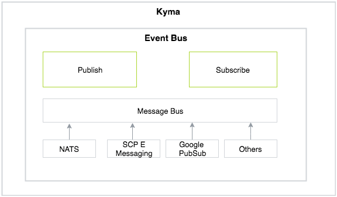

## Scope

The Eventing capability aims to enable asynchronous processing via Event Driven architecture. It serves two main aims:

* Integrate external solutions with Kyma using an event-driven architecture.

* Enable loose coupling of applications deployed on Kyma.

> **NOTE**: The Kyma eventing does not support streaming at present.

## Vision

### Pluggability

**Value Addition**

* Decouple workload from the management plane
* Flexiblity
  * Enable customers to choose the solution when it comes to volume, latency, scalability needs
  * Allows a customer to use the solution already existing in her ecosystem.

**Dependencies**

* Kyma on Knative
* Kyma eventing based on Knative eventing

**Challenges**

* Knative eventing abstraction is evolving
* Lack of stability

### User Interface Event Trigger Services

We already support creating event triggers for a service deployed in Kyma.  This can be acheived by creating a subscription custom resource.

To improve the developer experience, there should be a User Interface where the developers can create a trigger for one or more event types for a service in Kyma.

**Value Addition**

* Improved developer experience.

### Model for internal events

As a developer, I should be able to define and generate internal events to trigger business workflows.

**Value Addition**

* Enable asynchronous processing and workflows for:
  * Exposed APIs
  * Scheduled activities

**Dependencies**

It is possible to generate events inside a Kyma cluster and use them to trigger business workflows. 

The eventing in Kyma is tightly coupled with the aspect of events being sent by an external solution. e.g. `source-id` which identifies the external solution is used as a part of publishing an event in Kyma.

For events generated inside Kyma, the following open questions or desing details needs to be answered:

* How the orign of the internal event is identified? (events originated from the Kyma environments)
* How the event schema will be published?
* How the event schema will be made available to the developers?
* Do we need concepts such as event activation for internal events?

### System metrics

**Health metrics**

* Availability of event bus components
* Connectivity to the messaging solution
* Active / Inactive subscriptions

**Performance metrics**

* Request Latency
* Request Rate
* Failure Rate
* Delivery failure rate
* Throughput
* End-to-end latency

**Value Addition**

* Improved operations.

### Configurable durability

Different business events might have different durability needs. For some events, it is critical that the event is not lost sacrificing some performance. For others, this might be other way around. 

The event producer should have possiblity to decide about the durability while sending an event to Kyma.

When sending an event to Kyma event-bus, a developer can specify the durability level.

**Value Addition**

* Improved flexibility.
* Enable customers to choose performance vs durability based on the business requirements.

### Batching

Enable support to send multiple events in a single request.

**Value Addition**

* Performance optimization.

### Retry back-off

The present behavior for the event delivery is to continuously retry delivering the event. It has following unwanted effects:

* This results in unncessary network and other resources consumption in case a service is recovering and might take a while to become ready.
* False error rate which could lead to actions such as circuit breaking which might not reflect the true state of the service.

A better option would be enable the subscriber to configure the back-off that should be applied when retrying delivery of events. The backoff strategies could evolve from a constant pause to a exponential backoff.

**Value Addition**
* Efficient resource usage.
* Improved stability.

### Dead letter
There could be scenarios where a service or lambda is not able to process an event. This could be due to multiple reasons such as incompatible event schemas, backend connectivity issues and other. In such sceanrios, the messages are moved to a dead letter queue. An automated or automated + manual operation can fix the events and redeliver them to the subscriber.

The decision parameters to move an event to a dead letter are configurable. e.g. After x number of event delivery attempts.

**Value Addition**
* Ensure business processing recovery in case of mismatches.
* Unblock delivery of events in case of processing errors. 

### Event attributes

It should be possible to assign attributes to a event published to Kyma event-bus. Event attributes are `key:value` pairs of metatdata that the event publisher can set while publishing the events. 
Besides many custom use-cases of attributes, one could be  **selective filtering** while delivering the events to the subscribers.

**Example Scenario**

I want to run a campaign to provide discount on certain items that is only targeted for orders exceeding a certain value. This can be implemented by writing a lambda or a microservice that:

* acts upon an order
* filters it based on criteria
* performs the campaign related computation.

This could result in wastage of computing and network resources as there are might be  many high value orders. 

To make such use cases efficient, we can assign an attribute `orderCost:high` to the `order.created` event.

While creating a subscription, we can specify this as a filter criteria for the events delivery.

**Value Addition**

* Increased flexbility for event consumption.
* Enable intelligent filtering.
* Enable efficient resource usage.
