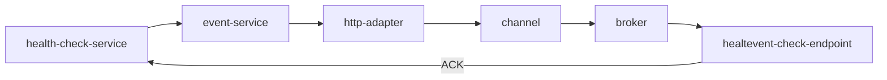

# Proposal for Event-Mesh Health

The aim of this porposal is to find a way how errors in the event-mesh can be easily detected. Currently there is no
consolidated status of the event-mesh resources.
This proposal only includes cluster local resources. It will not try to find solutions for errors in the event-flow caused by external applications.


## Error scenarios

Errors for the event-mesh can occur on the control-plane and on the data-plane. In both cases, the user might not be
able to send and retrieve events in a subscriber.

Control-Plane errors:

- Eventing related CRs are not created
- Eventing related CRs are not healthy
  - e.g errors during reconciliation
  - controller not running
  - controller in error state
- Knative Webhook is not running or returns errors, Knative CRs cannot be created
- Azure EventHubs quota reached

Data Plane errors:
- events do not flow from source to sink
  - service mesh / network might be broken between any two data-plane components
  - kafka consumer / producer is not working because of connection problems with Azure EventHubs


### How can the event-flow be verified?

Idea: create a sidecar, that exposes its own endpoint. Events sent to this endpoint could be sent back to the
event-service.

event-service acts as health-event source:

1. event-service generates health-event.
1. payload of this event needs to contain the name of the application (as a source)
1. event-flows to health-check-endpoint in every subscriber pod
1. event-health-checkpoint responds with cloudevent directly to event-service to `ACK` the event (bypassing the
event-mesh)

Benefits:
* event-service knows the subscribers and is able to check event-flow to every subscriber
* traces are generated even if no events are sent from the actual `application`

Drawbacks:
* sidecar with every subscriber increases resource consumption
* more events sent to channel implementation 

Flow: 



Idea: create a deployment in every event-enabled namespace (instead of the sidecar from the previous idea).

The idea is basically the same as the previous. Create a deployment per namespace. This acts as a healthcheck
subscriber.  Requirements for subscriber:
* incoming healthcheck-events need to be enriched with the namespace-name
* after enrichment events get sent to the healthcheck service

The health-check will be initiated by sending one health-check event per activated application. As this event flows
through the mesh it might end up in multiple namespaces. This requires the subscriber to add information to the event
about the namespace it was received in. As the health-checking service is able to determine which namespaces should be
able to act on events from this application it can verify that all involved components in all namespaces work as expected.


Requirements for the healthcheck-service:
* act as an event source
* generate events at a configurable rate
* send events per application
* events get sent to the event-service
* act as a receiver for incoming healtcheck-events (ACK)
* keep track of sent events
* maintain a list of namespaces that should be able to receive events per application

## When is the event-mesh healthy (control-plane)

All involved parties are healthy:
* event-service
* http-adapter
* channels
* brokers
* triggers
* subscriptions (questionable if this should be part of this check)

## Bring it together:

Create a event-mesh-health CRD (ClusterScoped)

```yaml 
apiVersion: event-mesh.kyma-project.io/v1alpha1 
kind: flow 
metadata: 
  name: <application-name> 
spec: 
  application: <application-name> 
  healthcheck: <bool>
status: 
  conditions: 
    controlplane: 
      compatibility-layer: 
      http-source-adapter: 
      application-channel: 
      broker-channel: 
      trigger: 
    dataplane: 
```

Write controller to reconcile this CRD. All controlplane conditions can be collected directly from the involved parties for the application specified in the spec. This CRD should be deployed by default with installation of the application. The healthcheck functionality can be disabled if resource consumption is of concern.  For the dataplane status the custom health-check send and receive logic needs to be implemented. This health-check logic should be implemented in the controller directly as the controller already has all required information and is able to update the crd.

## Known issues

* controlplane conditions might paint a different picture than the dataplane does. 
  This means that even if the control plane is healthy the dataplane might be broken. Due to the implementation of the health-check it is not possible to verify which component breaks the dataplane flow. In order to debug such errrors as fast as possible tracing is critical.

## Additional Metrics

* delivery delay
  as the health-check performs the full flow using the entire event-mesh it is easy to use the health-check events to
determine the current event delivery delay. Throughput should not be measured using those events.
