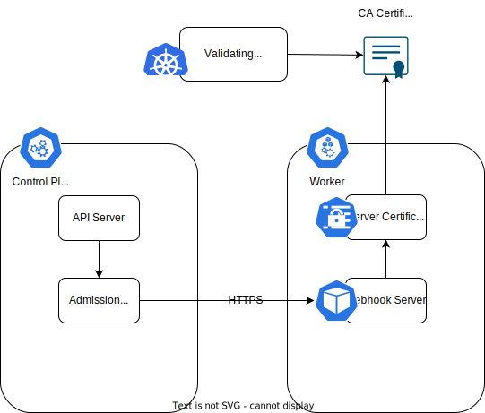
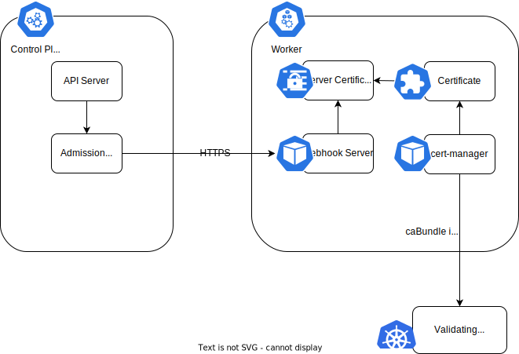

# Admission webhook certificate management

This document proposes several ways to manage TLS certificates for custom admission webhooks. 

## Problem

Kubernetes admission controllers act as gatekeepers intercepting API requests and can change the request object or deny its entry to the cluster.
It is possible to extend the compiled-in admission controllers with custom webhooks using the [dynamic admission control mechanism](https://kubernetes.io/docs/reference/access-authn-authz/extensible-admission-controllers/).



## How Kyma webhooks manage certificates

A handful of Kyma operators are deployed with custom validating admission webhooks (api-gateway, pod-preset, serverless, telemetry, etc.). They use different approaches to manage certificates, which can be categorized into 2 groups.

### <a name="helm"></a>Use Helm built-in crypto functions to generate certificates

This approach is used by pod-preset, telemetry:
  ```yaml
{{- $ca := genCA "telemetry-validating-webhook-ca" 3650 }}
{{- $cn := printf "%s-webhook" (include "fullname" .) }}
{{- $altName1 := printf "%s.%s" $cn .Release.Namespace }}
{{- $altName2 := printf "%s.%s.svc" $cn .Release.Namespace }}
{{- $cert := genSignedCert $cn nil (list $altName1 $altName2) 3650 $ca }}
apiVersion: admissionregistration.k8s.io/v1
kind: ValidatingWebhookConfiguration
metadata:
  name: validation.webhook.telemetry.kyma-project.io
webhooks:
- clientConfig:
    caBundle: {{ b64enc $ca.Cert }}
...
---
apiVersion: v1
kind: Secret
metadata:
  name: telemetry-webhook-cert
  labels:
    {{- include "operator.labels" . | nindent 4 }}
    {{- toYaml .Values.extraLabels | nindent 4 }}
type: Opaque
data:
  tls.crt: {{ b64enc $cert.Cert }}
  tls.key: {{ b64enc $cert.Key }}
```

This is a very simple solution, but it has a lot of disadvantages.
The certs are updated every time the Helm chart is rendered (every reconciliation). This update is not atomic. For example, when the server cert is updated, but the caBundle of the webhook configuration is not yet updated, the webhook is in a non-working state, and all the corresponding API requests fail. This situation is rather common and is documented in [bug #15142](https://github.com/kyma-project/kyma/issues/15142). 

You can come up with some workarounds: make reconciler deploy resources in a strict predefined order or make sure the webhook chart does not contain the corresponding CRs. However, it does not fix the underlying problem and the bug may pop up again. 


### <a name="server-code"></a>Generate the CA cert and the server cert, and update the webhook configuration in the webhook server code itself

This approach is used by serverless and api-gateway. In this case, the certificates are generated upon the server startup. Here's an [example of this solution](https://github.com/kyma-project/api-gateway/blob/main/internal/webhook/certificates.go).

Issuing a certificate in the webhook server code doesn't have the aforementioned problem. However, in this case it must be implemented by every operator. In addition to that, the webhook server must be provided with extended permissions to change the corresponding `validatingwebhookconfiguration` (or the `mutatingwebhookconfiguration`). Furthermore, both the CA and the server certificate are recreated upon each Pod restart and are never rotated if the Pod is not restarted.


## How other organizations manage webhook certificates

The most prominent operator frameworks advertise `cert-manager` as a possible solution to manage webhook certificates:

- Kubebuilder: https://kubebuilder.io/cronjob-tutorial/cert-manager.html
- Operator SDK: https://developer.ibm.com/tutorials/create-a-conversion-webhook-with-the-operator-sdk/

Let's discribe a few possible solutions.

### <a name="gardener-cert-manager"></a>Gardener cert-manager

https://github.com/gardener/cert-management

Because Kyma-on-Gardener is a very common setup, and Gardener has a pre-installed cert-manager, it seems to be a natural choice. However, Gardener `cert-manager` is actually a separate open source project and is very different from the upstream `cert-manager`. It comes with a different feature set (it even has its own CRDs). From the Github project description:

>In a multi-cluster environment like Gardener, using existing open source projects for certificate management like cert-manager becomes cumbersome. With this project the separation of concerns between multiple clusters is realized more easily. The cert-controller-manager runs in a secured cluster where the issuer secrets are stored. At the same time it watches an untrusted source cluster and can provide certificates for it.

However, according to the project maintainers, the Gardener `cert-manager` is built for mainly for the “Let’s Encrypt” use-cases (publicly resolvable domain names). It supports neither self-signed issuers nor caBundle injection. The project maintainers suggest using the upstream `cert-manager` from the community for self-signed/webhook certs.

Moreover, there are other supported non-Gardener Kyma environments (k3d), where the Gardener `cert-manager` is not pre-installed. 
### <a name="upstream-cert-manager"></a>Upstream cert-manager

https://github.com/cert-manager/cert-manager



The `cert-manager` is an operator running inside a Kyma cluster. It is a Kyma component itself and is used by other Kyma components that have custom webhook servers. A shared self-signed `Issuer` is also deployed.
  ```yaml
apiVersion: cert-manager.io/v1
kind: Issuer
metadata:
  name: selfsigned-issuer
  namespace: sandbox
spec:
  selfSigned: {}
```

Each component that needs a TLS certificate would just deploy a `Certificate` resource and mount the generated secret as files to be used by the server container. Since all Kyma operators are implemented using Kubebuilder, secret rotation will work out of the box: whenever the `cert-manager` rotates a secret, the server will notice the files change and reload the http handler. 
  ```yaml
apiVersion: cert-manager.io/v1
kind: Certificate
metadata:
  name: serving-cert
  namespace: kyma-system
spec:
  # $(SERVICE_NAME) and $(SERVICE_NAMESPACE) must be substituted by the webhook service/namespace
  dnsNames:
  - $(SERVICE_NAME).$(SERVICE_NAMESPACE).svc
  - $(SERVICE_NAME).$(SERVICE_NAMESPACE).svc.cluster.local
  issuerRef:
    kind: Issuer
    name: selfsigned-issuer
  secretName: webhook-server-cert
```

In addition to that, it would mark its webhook configuration with a special annotation to let the `ca injector` automatically populate the `caBundle`. See [CA Injector](https://cert-manager.io/docs/concepts/ca-injector/).

  ```yaml
apiVersion: admissionregistration.k8s.io/v1
kind: ValidatingWebhookConfiguration
metadata:
  name: validation.webhook.telemetry.kyma-project.io
  annotations:
    cert-manager.io/inject-ca-from: kyma-system/serving-cert
...  
```

This approach has a few downsides:
* `cert-manager` is deployed using Helm, so the chart must be maintained (upgrades, security patches, etc.).
* Deploying the `cert-manager` as a standalone Kyma component means opening its API to Kyma customers. It also means that we should build expertise within Kyma; some team should take ownership of this new component, etc.
* We only need support of self-signed certificates and certificate rotation, which is a very small subset of `cert-manager`'s features.

### <a name="init-container"></a>Init container

https://www.velotio.com/engineering-blog/managing-tls-certificate-for-kubernetes-admission-webhook

Instead of implementing the logic in the webhook server code, it's packaged as a Docker image and run as an init container.

### <a name="component-operator"></a>Component operator

With [the new modularization strategy](https://github.com/kyma-project/community/tree/main/concepts/modularization) we could implement certificate management as a part of component operators. The component operators can also watch and rotate certificates.
The certificate management functionality can be also packaged as a Go module and shared between the operators.

## Conclusion

After some discussions, we came to the conclusion that even though `cert-manager` is a recommended solution, it would be an overkill for our use case. Self-signed certificate generation and rotation is a tiny subset of all `cert-manager` capabilities and can be implemented in future component operators as a part of the modularization strategy.
