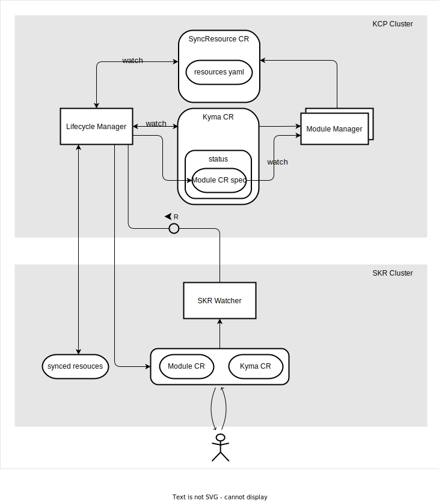

# Software Design Description - Synchronization of Module Resources

**Table of Contents**

- [Software Design Description - Synchronization of Module Resources](#software-design-description---synchronization-of-module-resources)
  - [Project Information and Document Status](#project-information-and-document-status)
    - [Document Revision History](#document-revision-history)
  - [General Information](#general-information)
    - [Stakeholders and Roles](#stakeholders-and-roles)
  - [Design](#design)
    - [Key Requirements and Design Goals](#key-requirements-and-design-goals)
    - [Context](#context)
    - [Major Building Blocks](#major-building-blocks)
      - [Lifecycle Manager](#lifecycle-manager)
      - [Module Manager](#module-manager)
      - [SKR Watcher](#skr-watcher)
    - [Interfaces and Communication Handling](#interfaces-and-communication-handling)
      - [Kyma CR](#kyma-cr)
      - [SyncResource CR](#syncresource-cr)
    - [Upgrade, Migration, Compatibility](#upgrade-migration-compatibility)
    - [Compliance to Standards and Guidelines](#compliance-to-standards-and-guidelines)
      - [Applied Architecture and Design Guidelines](#applied-architecture-and-design-guidelines)
  - [Design Details Documentation](#design-details-documentation)
    - [Guide to the Implementation](#guide-to-the-implementation)
  - [Appendix](#appendix)
    - [Glossary](#glossary)

## Project Information and Document Status

| .       | .                   |
|---------|---------------------|
| Authors | Xin Ruan (@ruanxin) |

### Document Revision History

| Version | Date       | Author              | Remarks     |
|---------|------------|---------------------|-------------|
| draft   | 03.11.2023 | Xin Ruan (@ruanxin) | First draft |

## General Information

### Stakeholders and Roles

| Role                   | Name                                                   |
|------------------------|--------------------------------------------------------|
| Author(s)              | Xin Ruan (@ruanxin)                                    |
| Architect              | Xin Ruan (@ruanxin)                                    |
| Product Owner          | Jan Medrek (@janmedrek), Piotr Bochyński (@pbochynski) |
| Lifecycle Manager Team | @kyma-project/jellyfish                                |

## Design

### Key Requirements and Design Goals

The Module Synchronization design aims to meet the following key requirements and design goals:

- Efficient Synchronization: A primary objective is to ensure the efficient synchronization of module resources between the KCP cluster and the SKR cluster. This involves timely and accurate updates to maintain the desired state of module resources across clusters.
- Responsibility Separation: LM takes charge of managing the synchronization of module resources, while Module Manager, owned by individual module teams, is responsible for providing the necessary resources.
- Minimized access of central components  to SKR cluster: To optimize efficiency and security, this design avoids introducing additional central components with direct connections to remote clusters. By reducing the number of connections and limiting components with cluster-admin access to the SKR cluster, the system mitigates security risks associated with privileged access.
- Real-time Reflection of Changes: A critical aspect of the design is to ensure that any changes to client resources, including Module CR and Kyma CR, are reflected in module resources instantaneously. Real-time synchronization is essential to maintain system integrity and responsiveness.

### Context

This architecture design offers a unified solution for synchronization of module resources between the KCP cluster and the SKR cluster.

### Major Building Blocks

#### Lifecycle Manager 
The existing Lifecycle Manager plays a central role in managing the synchronization of module resources. It orchestrates the deployment and synchronization of module resources into the remote SKR Cluster, acting as the sole gateway to access this cluster within the specified setup.

#### Module Manager 
Module Managers are components created and maintained by individual module teams. Their purpose is to offer SyncResource CRs based on configuration data received from the SKR Cluster.

#### SKR Watcher
SKR Watcher is an existing admission webhook service deployed by LM in the SKR Cluster. Its main role is to receive validation admission requests from Module CRs and Kyma CRs and send the requests to LM. This enables LM to enqueue and reconcile related Kyma CRs immediately without waiting for scheduled time intervals.

### Interfaces and Communication Handling

#### Kyma CR
Kyma CR serves as a shared resource between LM and MM. It acts as a representative entity describing Kyma module configuration. In this design, Kyma CR extends its functionality to persist Module CR specs. This expansion serves two essential purposes: it allows LM to fetch and persist module configuration data in Kyma CR as input source by MM to generate related resource content, and it enables MM to fetch configuration without direct contact with the remote SKR cluster.

#### SyncResource CR
Module Manager generates SyncResource CRs based on configuration data from Module CR spec. These CRs contain all the necessary resources to be deployed in the SKR cluster as YAML content. LM watches SyncResource CRs, ensuring that any new SyncResources or updates to existing ones trigger immediate enqueuing and synchronization to the relevant SKR cluster.

LM accesses the SKR cluster based on scheduled time intervals or in response to SKR Watcher requests. During the reconciliation process, LM retrieves the required configuration data stored in the SKR Cluster's Module CR and copies it to the related Kyma CR status field in the KCP.

Each individual Module Manager treat Kyma CR as read-only data. As Kubernetes operators, they execute the standard reconciliation loop to fetch related configuration data copied to the Kyma CR status field. Additionally, MM must implement a customized Predicate to track changes in the relevant Kyma CR status field, enabling them to trigger immediate requeue operations when LM updates the status field.

### Upgrade, Migration, Compatibility

- LM should extend the Kyma CR API to support the persistence of module spec information.
- LM should add a new controller for reconciling SyncResource CR.
- The current LM API must be designed as a dedicated Go module to be easily imported by Module Manager with minimum dependencies.
- SKR Watcher needs to extend validating webhook configurations for Module CR.
- Each module fitting this concept needs to develop Module Manager based on Kubebuilder SDK.

### Compliance to Standards and Guidelines

The Module Manager should be developed as a Kubernetes operator based on Kubebuilder SDK, taking advantage of Kubernetes watch features to monitor and react to specific Custom Resource changes instantly.

#### Applied Architecture and Design Guidelines

| Guideline Name               | Version / Date                                                                        | Link                                                                      |
|------------------------------|---------------------------------------------------------------------------------------|---------------------------------------------------------------------------|
| Kubebuilder SDK              | [v3.13.0](https://github.com/kubernetes-sigs/kubebuilder/releases/tag/v3.13.0)        | https://github.com/kubernetes-sigs/kubebuilder                            |
| Kubebuilder Book             | v2                                                                                    | https://book-v2.book.kubebuilder.io                                       |
| controller runtime Predicate | [v0.16.3](https://github.com/kubernetes-sigs/controller-runtime/releases/tag/v0.16.3) | https://pkg.go.dev/sigs.k8s.io/controller-runtime/pkg/predicate#Predicate |

## Design Details Documentation

For each individual Module Manager designed by module teams, the controller of Kyma CR should not only rely on normal reconciliation time intervals. A customized Predicate must be implemented to watch only the Kyma CR status field related to the managed module CR spec changes. This approach ensures that when LM detect changes and updates Kyma CR, Module Manager is able to generate or update related SyncResource CR instantly.

### Guide to the Implementation

- [Kyma CR API document](https://github.com/kyma-project/lifecycle-manager/blob/main/docs/technical-reference/api/kyma-cr.md)
- [SyncResource ARD](https://github.com/kyma-project/lifecycle-manager/issues/991)
- [Lifecycle Manager Repo](https://github.com/kyma-project/lifecycle-manager)
- [SKR Watcher Repo](https://github.com/kyma-project/runtime-watcher)

## Appendix

### Glossary

| Term              | Abbreviation | Definition                                                                                                                                                                                  |
|-------------------|--------------|---------------------------------------------------------------------------------------------------------------------------------------------------------------------------------------------|
| KCP Cluster       | KCP          | Kyma Control Plane cluster                                                                                                                                                                  |
| SKR Cluster       | SKR          | SAP Kyma Runtime                                                                                                                                                                            |
| Lifecycle Manager | LM           | An existing tool which manages the lifecycle of Kyma modules in k8s cluster, in this context, it extended to be the central component which manage the synchronization of module resources. |
| Module Manager    | MM           | A tool based on k8s operator pattern which should be developed by individual module team, which take care delivery the resources to be synced to the SKR cluster as SyncResource CR in KCP. |
| SKR Watcher       | Watcher      | A validation webhook service deployed by LM in SKR Cluster, which react on the user interactive changes on Module CR and Kyma CR in SKR Cluster.                                            |
| SyncResource CR   | SyncResource | A Custom Resource (CR) to persist the content of resources which to be synced as Kubernetes manifest YAML.                                                                                  |
| Module CR         | ModuleCR     | A Custom Resource (CR) which holds the configuration of related modules, can be configured by user.                                                                                         |
| Kyma CR           | KymaCR       | A Custom Resource (CR) declare the desired state of a cluster.                                                                                                                              |