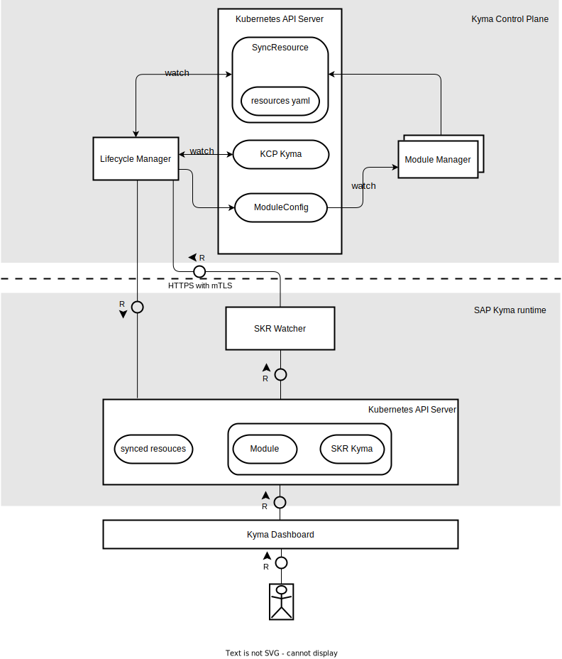

# Software Design Description - Synchronization of Module Resources

**Table of Contents**

- [Software Design Description - Synchronization of Module Resources](#software-design-description---synchronization-of-module-resources)
  - [Project Information and Document Status](#project-information-and-document-status)
    - [Document Revision History](#document-revision-history)
  - [General Information](#general-information)
    - [Stakeholders and Roles](#stakeholders-and-roles)
  - [Design](#design)
    - [Key Requirements and Design Goals](#key-requirements-and-design-goals)
    - [Context](#context)
    - [Major Building Blocks](#major-building-blocks)
      - [Lifecycle Manager](#lifecycle-manager)
      - [Module Manager](#module-manager)
      - [SKR Watcher](#skr-watcher)
    - [Interfaces and Communication Handling](#interfaces-and-communication-handling)
      - [ModuleConfig CR](#moduleconfig-cr)
      - [SyncResource CR](#syncresource-cr)
      - [Communication Flow](#communication-flow)
    - [Upgrade, Migration, Compatibility](#upgrade-migration-compatibility)
    - [Compliance to Standards and Guidelines](#compliance-to-standards-and-guidelines)
      - [Applied Architecture and Design Guidelines](#applied-architecture-and-design-guidelines)
  - [Design Details Documentation](#design-details-documentation)
    - [Guide to the Implementation](#guide-to-the-implementation)
  - [Appendix](#appendix)
    - [Glossary](#glossary)

## Project Information and Document Status

| .       | .                   |
|---------|---------------------|
| Authors | Xin Ruan (@ruanxin) |

### Document Revision History

| Version | Date       | Author              | Remarks          |
|---------|------------|---------------------|------------------|
| draft   | 03.11.2023 | Xin Ruan (@ruanxin) | First draft      |
| draft   | 06.12.2023 | Xin Ruan (@ruanxin) | Add ModuleConfig |

## General Information

### Stakeholders and Roles

| Role                   | Name                                                   |
|------------------------|--------------------------------------------------------|
| Author(s)              | Xin Ruan (@ruanxin)                                    |
| Architect              | Xin Ruan (@ruanxin)                                    |
| Product Owner          | Jan Medrek (@janmedrek), Piotr Bochyński (@pbochynski) |
| Lifecycle Manager Team | @kyma-project/jellyfish                                |

## Design

### Key Requirements and Design Goals

The Module Synchronization design aims to meet the following key requirements and design goals:

- Efficient Synchronization: A primary objective is to ensure the efficient synchronization of module resources between the KCP cluster and the SKR cluster. This involves timely and accurate updates to maintain the desired state of module resources across clusters.
- Responsibility Separation: LM takes charge of managing the synchronization of module resources, while Module Manager, owned by individual module teams, is responsible for providing the necessary resources.
- Minimized access of central components to SKR cluster: To optimize efficiency and security, this design avoids introducing additional central components with direct connections to remote clusters. By reducing the number of connections and limiting components with cluster-admin access to the SKR cluster, the system mitigates security risks associated with privileged access.
- Real-time Reflection of Changes: A critical aspect of the design is to ensure that any changes to client resources, including Module CR and Kyma CR, are reflected in module resources instantaneously. Real-time synchronization is essential to maintain system integrity and responsiveness.

### Context

This architecture design offers a unified solution for synchronization of module resources between the KCP cluster and the SKR cluster.

### Major Building Blocks

#### Lifecycle Manager

The existing Lifecycle Manager plays a central role in managing the synchronization of module resources. It orchestrates the deployment and synchronization of module resources into the remote SKR Cluster, acting as the sole gateway to access this cluster within the specified setup.

#### Module Manager

Module Managers are components created and maintained by individual module teams. Their purpose is to offer SyncResource CRs based on configuration data received from the SKR Cluster.

#### SKR Watcher

SKR Watcher serves as an established admission webhook service deployed by LM in the SKR Cluster. Its primary function is to receive [AdmissionReview](https://kubernetes.io/docs/reference/access-authn-authz/extensible-admission-controllers/#webhook-request-and-response) requests originating from the API Server. These requests are based on the rules defined in the [ValidatingWebhookConfiguration](https://github.com/kyma-project/lifecycle-manager/blob/23262218a84bc27515b427ccaec43da7f3c90e56/pkg/watcher/skr_webhook_resources.go#L71). SKR Watcher is designed to monitor any modifications made to Module CRs and Kyma CRs within the SKR Cluster.

Upon detecting modifications, SKR Watcher generates corresponding requests and forwards them to the LM. This mechanism allows LM to promptly enqueue and reconcile related Kyma CRs, ensuring immediate responsiveness without waiting for scheduled time intervals. This real-time interaction between SKR Watcher and LM enhances the agility of the synchronization process for Kyma CRs in the SKR Cluster.

### Interfaces and Communication Handling

#### ModuleConfig CR

ModuleConfig CR serves as a shared resource between LM and MM, functioning as a representative entity to persist Module CR specs. It fulfills two essential purposes: first, it enables LM to retrieve and store module configuration data in ModuleConfig CR, serving as an input source for MM to generate related resource content. Second, it allows MM to fetch configuration information without direct contact with the remote SKR cluster.

#### SyncResource CR

Module Manager generates SyncResource CRs based on configuration data derived from Module CR specs. These CRs encompass all the necessary resources to be deployed in the SKR cluster as YAML content. LM actively watches SyncResource CRs, ensuring that any emergence of new SyncResources or updates to existing ones triggers immediate enqueuing and synchronization to the relevant SKR cluster.

#### Communication Flow

LM gains access to the SKR cluster based on scheduled time intervals or in response to SKR Watcher requests. During the reconciliation process, LM acquires the required configuration data stored in the SKR Cluster's Module CR and duplicates it to the related ModuleConfig CR in the KCP.

Individual Module Managers treat ModuleConfig CR as read-only data. Operating as Kubernetes operators, they execute the standard reconciliation loop to retrieve related configuration data from ModuleConfig CR. Additionally, 

### Upgrade, Migration, Compatibility

- LM should add a new controller for reconciling SyncResource CR.
- LM should introduce a new process to generate and synchronize ModuleConfig CR.
- The current LM API must be designed as a dedicated Go module to be easily imported by Module Manager with minimum dependencies.
- SKR Watcher needs to extend validating webhook configurations for Module CR.
- Each module conforming to this concept must develop Module Manager based on the Kubebuilder SDK.

### Compliance to Standards and Guidelines

The Module Manager should be developed as a Kubernetes operator using the Kubebuilder SDK. Leveraging Kubernetes watch features, it can monitor and promptly respond to changes in ModuleConfig, ensuring real-time synchronization.

#### Applied Architecture and Design Guidelines

| Guideline Name                        | Version / Date                                                                        | Link                                                                      |
|---------------------------------------|---------------------------------------------------------------------------------------|---------------------------------------------------------------------------|
| Kubebuilder SDK                       | [v3.13.0](https://github.com/kubernetes-sigs/kubebuilder/releases/tag/v3.13.0)        | https://github.com/kubernetes-sigs/kubebuilder                            |
| Kubebuilder Book                      | v2                                                                                    | https://book-v2.book.kubebuilder.io                                       |
| Watching Externally Managed Resources |                                                                                       | https://kubebuilder.io/reference/watching-resources/externally-managed    |
| controller runtime Predicate          | [v0.16.3](https://github.com/kubernetes-sigs/controller-runtime/releases/tag/v0.16.3) | https://pkg.go.dev/sigs.k8s.io/controller-runtime/pkg/predicate#Predicate |

## Design Details Documentation

For each Module Manager designed by module teams, the reconciliation of ModuleConfig CR should not solely rely on normal reconciliation time intervals. It must implement a [watching mechanism](https://kubebuilder.io/reference/watching-resources/externally-managed) supported by Kubebuilder to monitor changes occurring in the relevant ModuleConfig CR status field. This implementation ensures the capability to trigger immediate requeue operations when LM updates the ModuleConfig CR.

### Guide to the Implementation

- [Kyma CR API document](https://github.com/kyma-project/lifecycle-manager/blob/main/docs/technical-reference/api/kyma-cr.md)
- [SyncResource ARD](https://github.com/kyma-project/lifecycle-manager/issues/991)
- [ModuleConfig ARD](https://github.com/kyma-project/lifecycle-manager/issues/1104)
- [Lifecycle Manager Repo](https://github.com/kyma-project/lifecycle-manager)
- [SKR Watcher Repo](https://github.com/kyma-project/runtime-watcher)

## Appendix

### Glossary

| Term              | Abbreviation | Definition                                                                                                                                                                                                  |
|-------------------|--------------|-------------------------------------------------------------------------------------------------------------------------------------------------------------------------------------------------------------|
| KCP Cluster       | KCP          | Kyma Control Plane cluster                                                                                                                                                                                  |
| SKR Cluster       | SKR          | SAP Kyma Runtime                                                                                                                                                                                            |
| Lifecycle Manager | LM           | An existing tool deployed in KCP which manages the lifecycle of Kyma modules in SKR cluster, in this context, it extended to be the central component which manage the synchronization of module resources. |
| Module Manager    | MM           | A tool based on k8s operator pattern which should be developed by individual module team, which take care delivery the resources to be synced to the SKR cluster as SyncResource CR in KCP.                 |
| SKR Watcher       | Watcher      | A admission webhook service deployed by LM in SKR Cluster, which react on the user interactive changes on Module CR and Kyma CR in SKR Cluster.                                                             |
| SyncResource CR   | SyncResource | A Custom Resource (CR) to persist the content of resources which to be synced as Kubernetes manifest YAML. Check the ARD [here](https://github.com/kyma-project/lifecycle-manager/issues/991).              |
| Module CR         | ModuleCR     | A Custom Resource (CR) which holds the configuration of related modules, can be configured by user.                                                                                                         |
| ModuleConfig CR   | SyncResource | A Custom Resource (CR) to persist the content of Module CR in KCP which consumed by Module Manager. Check the ARD [here](https://github.com/kyma-project/lifecycle-manager/issues/1104).                    |
| Kyma CR           | KymaCR       | A Custom Resource (CR) declare the desired state of a SKR cluster.                                                                                                                                          |
