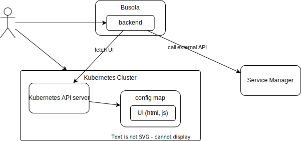

# Concept of extending Busola with Custom UI Modules

## Why

The main goal of custom UI modules is to provide a way to extend Busola with custom UI components, views, and features that go beyond the standard CRUD operations on Kubernetes custom resources. Examples include:

- **Serverless function testing**: Sending HTTP requests to function pods via the Kubernetes API server proxy, retrieving responses, and viewing logs.  
- **Service catalog integration**: Fetching service catalog entries from a remote Service Manager API using credentials stored in a Kubernetes secret.

---

## **Requirements**

1. **External API Access**: Modules should be able to interact with APIs outside the Kubernetes cluster.  
2. **Respect User Privileges**: Extensions should operate using the user’s privileges and must not escalate permissions by relying on service accounts.  
3. **Independence**: Module code must remain independent of Busola, allowing for separate release cycles and loose coupling.  
4. **Consistent Authentication and Authorization**: Modules should leverage the same OIDC and RBAC mechanisms as Busola.  
5. **Cluster-Specific Modules**: Module lists and versions should be specific to the cluster being accessed. When the user switches clusters:
   - Modules can be loaded or unloaded.
   - Modules may be updated to a cluster-specific version.

## **Module UI Hosting**

Two approaches are available for hosting module UIs: **centralized hosting** and **in-cluster hosting**.

### **Centralized Hosting**
- **Advantages**:
  - ✅ UI can be served from a single source (e.g., a CDN) and cached by the browser for better performance.
  - ✅ UI can be updated independently of the module, enabling quick bug fixes without needing to update the module operator.  
- **Disadvantages**:
  - ❌ Browser Content Security Policy (CSP) restrictions may block the UI.
  - ❌ Centralized sources (e.g., CDNs) may be blocked in restricted markets.

### **In-Cluster Hosting**
There are two options for in-cluster hosting:

1. **Module Operator Hosting**: The module operator or controller hosts the UI.  
   
   - **Problems**:
     - Requires exposing the operator to the internet or accessing it via the Kubernetes API server proxy.
     - Adds complexity, as it requires additional user privileges and does not guarantee the use of Busola’s authentication/authorization mechanisms.
   
2. **ConfigMap-Based Hosting**: Store the UI in a Kubernetes ConfigMap and dynamically load it via the Kubernetes API.  
   
   - **Advantages**:
     - ✅ UI is tied to the module release and is deployed with the module operator.
     - ✅ Users can deploy custom modules without external hosting.
     - ✅ Uses the same authentication/authorization mechanisms as Busola.  
   - **Disadvantages**:
     - ❌ The UI is not cached by the browser and must be loaded each time the module is accessed.

### **Preferred Hosting Solution**
In-cluster hosting via **ConfigMaps** is the preferred solution, as it aligns with Busola’s existing mechanisms, enhances security, and ensures tight integration with the module lifecycle.

## **Dynamic Module Loading Workflow**

1. **Discovery**:
   - When a user accesses a cluster, Busola queries for ConfigMaps labeled as module extensions.
2. **Verification**:
   - Module code signatures are verified.
   - Users are prompted to approve loading new or untrusted modules.
3. **Loading**:
   - Approved module code is dynamically fetched and loaded into Busola.
4. **Execution**:
   - Modules execute within the user's browser, using their cluster privileges, and access external APIs through the backend CORS proxy.

---

## **Security Considerations**

Loading and executing custom code inherently introduces security risks. To mitigate these risks:  

1. **Explicit User Consent**:
   - Users must explicitly approve loading modules.
   - Warning prompts should highlight the permissions granted to the module.

2. **Signature Verification**:
   - Module ConfigMaps must include a digital signature.
   - Busola will verify the signature before loading the module.

3. **Privilege Isolation**:
   - Modules operate within the user’s privilege scope, preventing privilege escalation.
   - Backend proxies are secured to whitelist allowed external APIs, minimizing misuse risks.

4. **Code Execution Scope**:
   - Module code runs in the user’s browser, ensuring that any action aligns with the user’s privileges.

## **Summary**

The **ConfigMap-Hosted Dynamic Extensions** combined with a **CORS Proxy in the Busola Backend** provides a secure, flexible, and user-friendly solution for extending Busola’s functionality. This approach ensures tight integration with existing Kubernetes mechanisms while addressing security, scalability, and ease of use.  

Key benefits include:
- Decoupled module lifecycle from Busola updates.
- Secure handling of external API communication.
- Dynamic, cluster-specific module loading.
- Strong alignment with Kubernetes’ RBAC and OIDC models.
