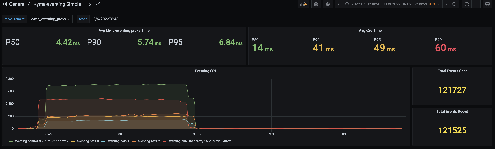
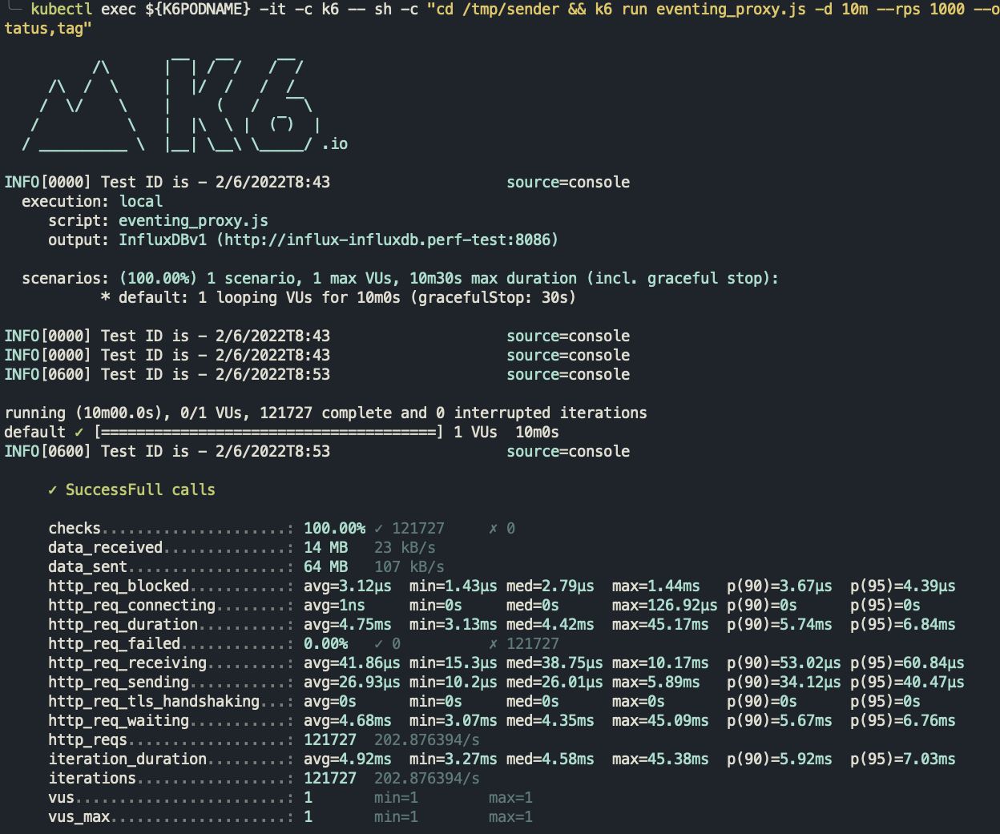
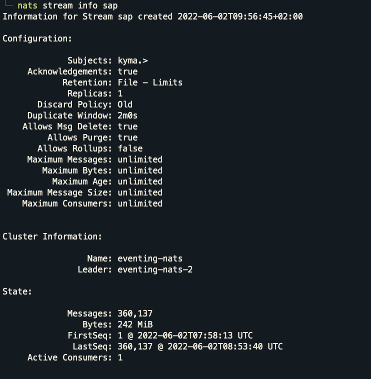
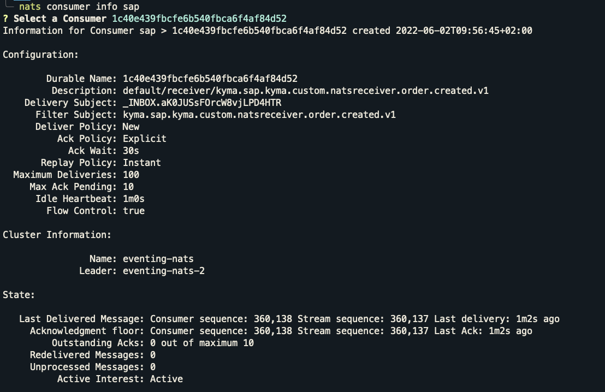

# Investigation of the discrepancy between sent and received events

## Purpose

There were some test runs where the "Events Sent" didn't match "Events Received". This document investigates one such suspicious test run. The test setup was the same as in [production tests](./results_prod.md).

## Test Scenario: Without any server restarts/crash

### Run ID: 2/6/2022T8:43 (Duration: 10m, Event Rate: 1000rps)

**State before test run:**
- Stream: 
  - LastSeq# 238,410
- Consumer: 
  - Ack Floor: Stream sequence# 238,410

**State after test run:**
- Stream: 
  - LastSeq# 360,137
- Consumer: 
  - Ack Floor: Stream sequence# 360,137
  - Redelivered Messages: 0
  - Unprocessed Messages: 0

```
-> Total Events Sent       by **Test Sender**  : 121,727
-> Total Events Received   by **Stream**       : 121,727 (i.e. 360,137 - 238,410)
-> Total Events Processed  by **Consumer**     : 121,727 (i.e. 360,137 - 238,410)
-> Total Events Received   by **Sink**         : 121,525
---------------------------------------------------------------------------------
-> Possible Missing Events                     : 202
```






## Conclusion: 

The comparison of `Total Events Sent by Test Sender` and `Total Events Received by Sink` shows that there might be a loss of 202 events. But further investigation into the consumer and stream stats from NATS server showed that all the events were received by the consumer and delivered (as the `Unprocessed Messages` and `Redelivered Messages`) are zero. One possible reason behind this discrepancy would be that the sink Pods were auto-scaling due to high load and maybe during the scaling, the new Pods were not ready to write results to the database when they received the events.

Once the minReplicas for the receiver (that is, the sink) was changed to six (so that it won't be scaling up during the tests), we haven't seen any job whose "Events Sent" didn't match "Events Received". Therefore, maybe the scaling up of the receiver caused the issue.

