# Performance Evalation of JetStream (Kyma: Production Profile)

## Table of Contents
- Test Setup
- Test Scenario 1: Without any server restarts/crash
- Test Scenario 2: NATS Servers deleted during test
- Test Scenario 3: NATS Servers scaled down to 0 and back to 3 during test
- Test Scenario 4: Eventing-controller Pod deleted during test

## Test Setup
* Kyma CLI version: `2.2.0`
* Kyma: 
  * Version: main [[commit](https://github.com/kyma-project/kyma/commit/6eb300b0a159fa968763382fbfe918b8cb52f057) and [commit (includes bug fix)](https://github.com/kyma-project/kyma/commit/f8a0c28a43e9eebf192514acc61614300f9909a1)] 
  * Production Profile
  * JetStream with File Storage
* K8s cluster:
  * Kubernetes v1.21.10
  * Gardener cluster [Nodes: 3(min) to 6(max)]
  * GCP machine type: `n1-standard-4`

* Kyma deploy command:
  ```
  kyma deploy --source=main -p production --value global.jetstream.enabled=true --value global.jetstream.storage=file
  ```
* Testing tool: [K6](https://k6.io/) (deployed in the same Kyma cluster)
  * Grafana Dashboard:
    * **Avg k6-to-eventing proxy time:** Shows the average time taken by the event to be sent from the sender till its received by the event-publisher-proxy.
    * **Avg e2e time:** Shows the average end-to-end time taken by the event to be sent from the sender till its received by the final sink (i.e. the receiver).

## Test Scenario 1: Without any server restarts/crash

In this test scenario, the normal behaviour of NATS was tested without any server restarts or crash. The goal of was to check that there is no event loss in case of high event throughput.

### Run ID: 7/6/2022T13:23 [Simple NATS with JetStream Disabled] (Duration: 10m, Event Rate: 150rps)

> **NOTE:** This is the only test run with JetStream disabled. All the other tests were done with JetStream enabled.

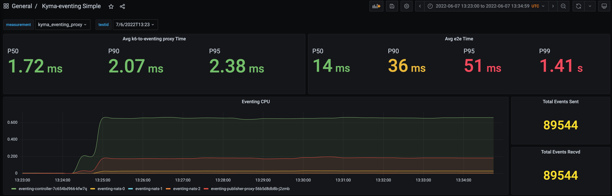

### Run ID: 1/6/2022T11:58 (Duration: 10m, Event Rate: 150rps)
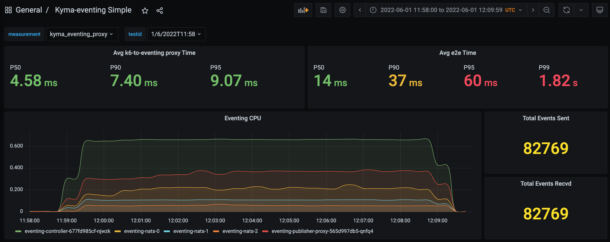

### Run ID: 1/6/2022T12:17 (Duration: 10m, Event Rate: 150rps)
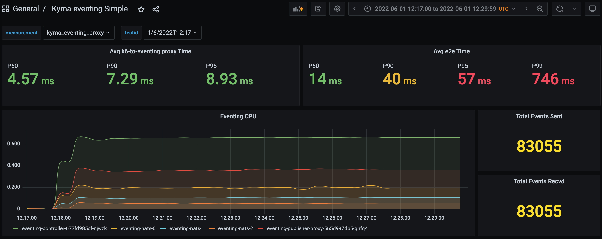

### Run ID: 1/6/2022T12:31 (Duration: 10m, Event Rate: 150rps)
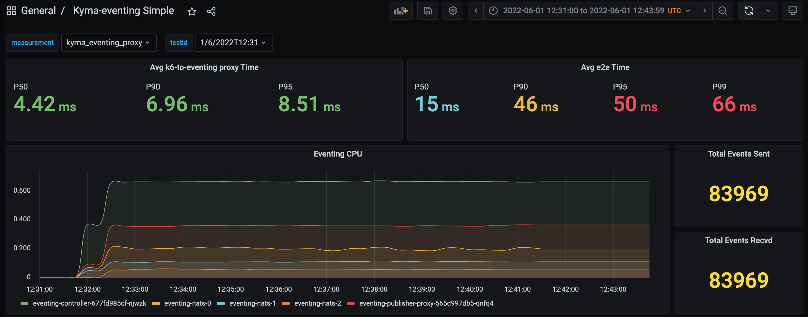

### Run ID: 1/6/2022T12:45 (Duration: 10m, Event Rate: 200rps)
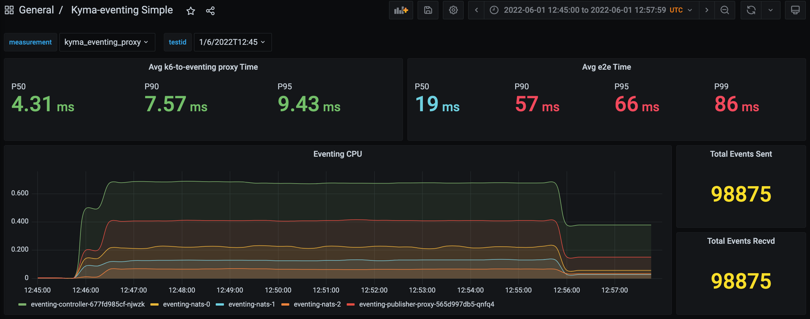

### Run ID: 1/6/2022T13:2 (Duration: 10m, Event Rate: 200rps)
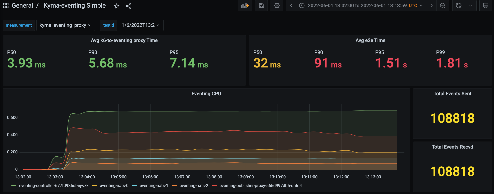

### Run ID: 2/6/2022T7:58 (Duration: 10m, Event Rate: 250rps)
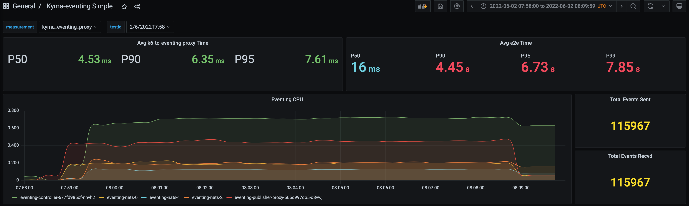

### Run ID: 2/6/2022T8:28 (Duration: 10m, Event Rate: 250rps)
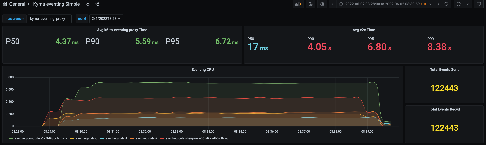

### Run ID: 2/6/2022T10:56 (Duration: 10m, Event Rate: 1000rps)
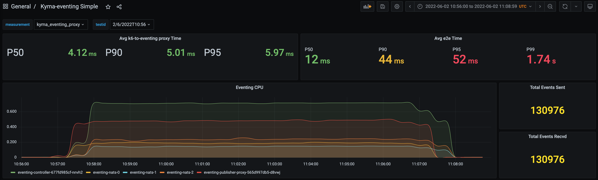

---

## Test Scenario 2: NATS Servers deleted during test

In this test scenario, the behaviour of NATS was tested when there is a server crash. The goal of was to check that there is not event loss when a server crash.

### Run ID: 2/6/2022T13:20 (Duration: 10m, Event Rate: 150rps)

> **NOTE:** Deleted (using `kubectl delete`) all thres Pods of NATS at once after 4 minutes.

```
kubectl delete po -n kyma-system eventing-nats-0
kubectl delete po -n kyma-system eventing-nats-1
kubectl delete po -n kyma-system eventing-nats-2
```

**Test Results:**
```
-> Total Events Sent      by **Test Sender** : 77,625 (+ 5514 Failed = 83,139)
-> Total Events Received  by **Stream**      : 77,625
-> Total Events Processed by **Consumer**    : 77,625
-> Total Events Received  by **Sink**        : 77,629 (Means that 4 events were duplicates)
```

**Test Results Dashboard:**

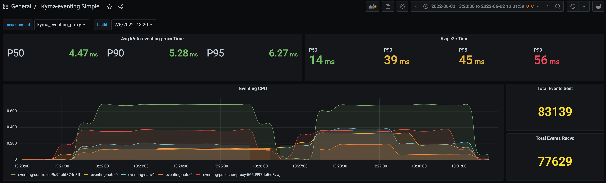

**Test Sender Stats:**

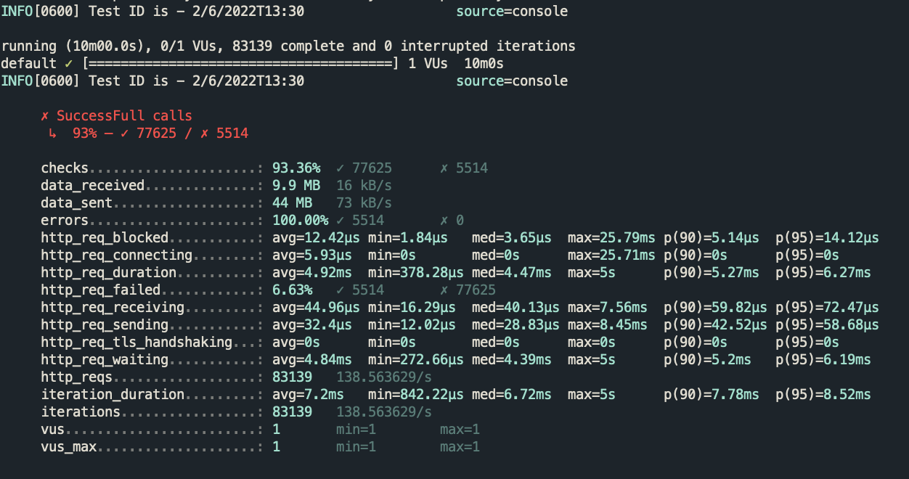

**NATS Stream Info:**

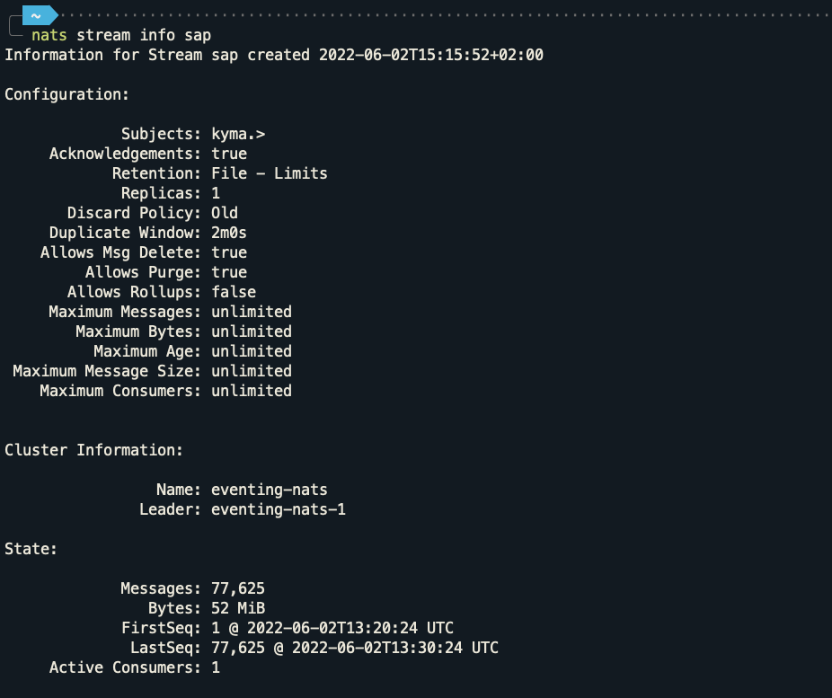

**NATS Consumer Info:**

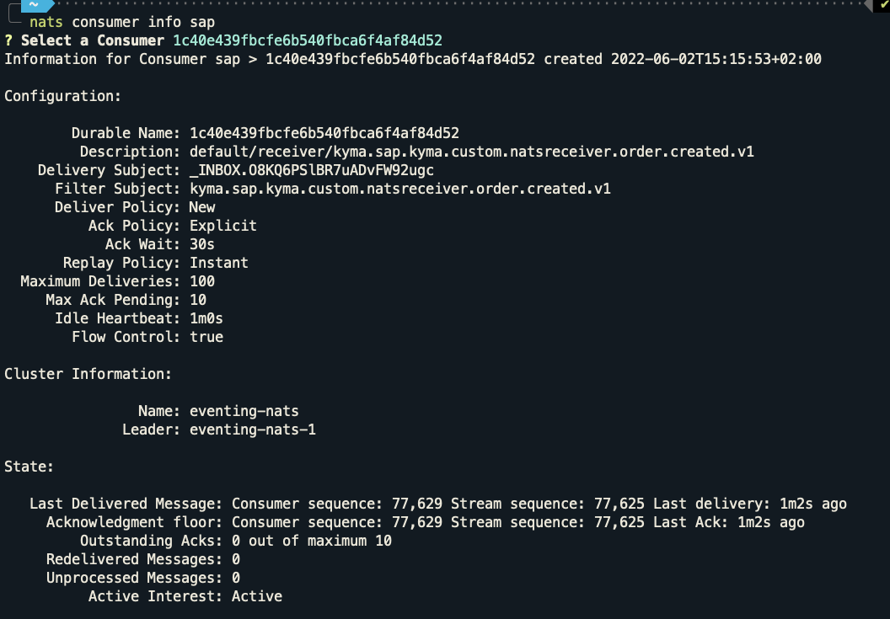

---

## Test Scenario 3: NATS Servers scaled down to 0 and back to 3 during test

In this test scenario, the behaviour of NATS was tested when all the NATS servers are shuted down and restarted. The goal of was to check that there is no event loss in this case.

### Run ID: 2/6/2022T13:54 (Duration: 10m, Event Rate: 150rps)

> **NOTE:** Scaled down NATS statefulset to 0 after 4 minutes.

```
kubectl scale statefulset eventing-nats -n kyma-system --replicas 0
kubectl scale statefulset eventing-nats -n kyma-system --replicas 3
```

**State before test run:**
- Stream:  
  - LastSeq# 77,625
- Consumer:  
  - Ack Floor: Stream sequence# 77,625

**State after test run:**
- Stream: 
  - LastSeq# 149,259
- Consumer:  
  - Ack Floor: Stream sequence# 149,259
  - Redelivered Messages: 0
  - Unprocessed Messages: 0

**Test Results:**
```
-> Total Events Sent      by **Test Sender** : 71,634 (+ 11,113 Failed = 82,747)
-> Total Events Received  by **Stream**      : 71,634 (i.e. 149,259 - 77,625)
-> Total Events Processed by **Consumer**    : 71,634 (i.e. 149,259 - 77,625)
-> Total Events Received  by **Sink**        : 71,637 (Means that 3 events were duplicates)
```

**Test Results Dashboard:**

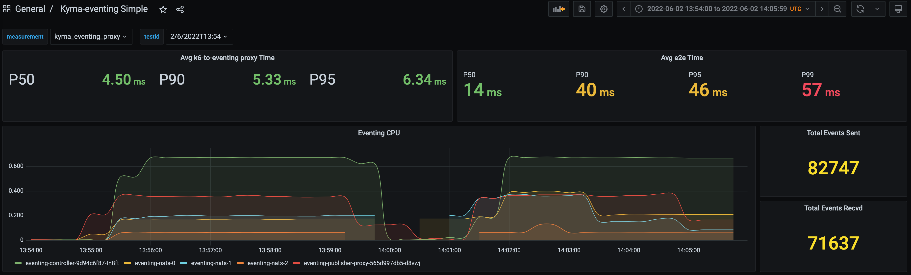

**Test Sender Stats:**

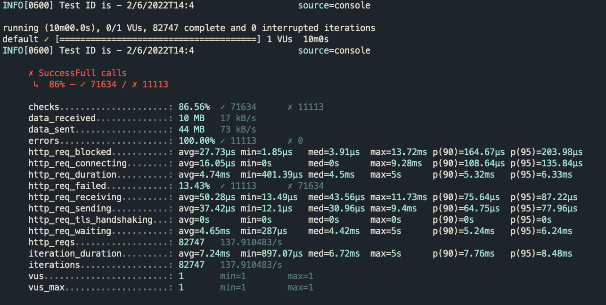

**NATS Stream Info:**

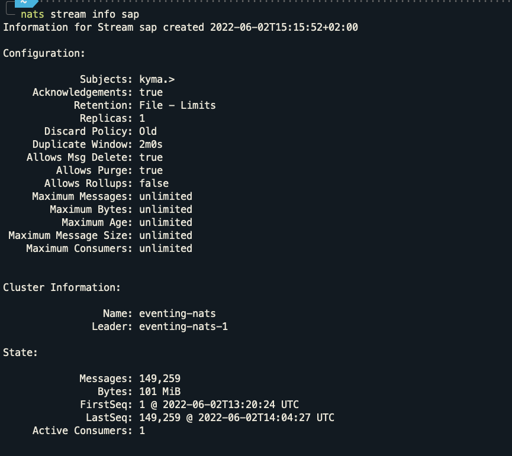

**NATS Consumer Info:**

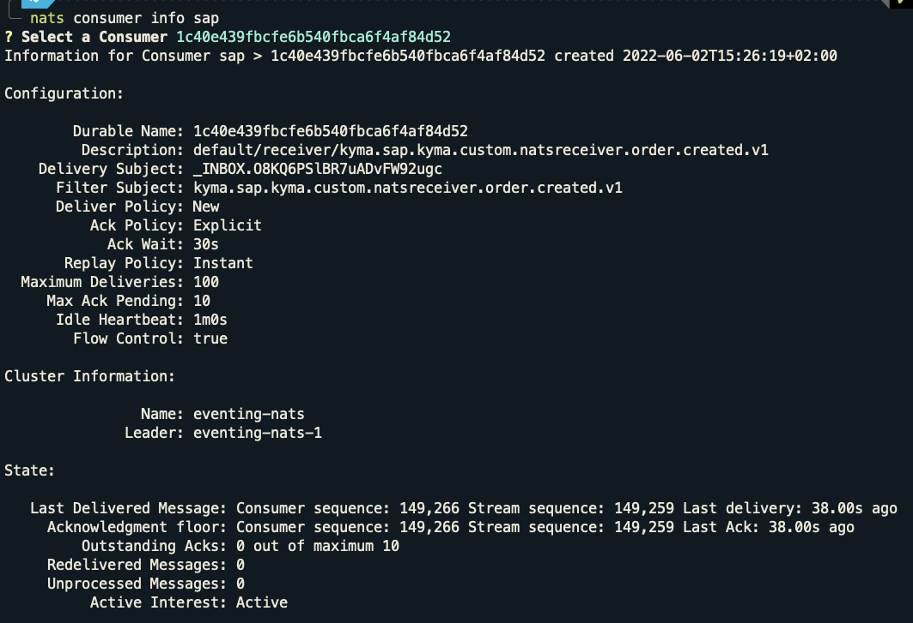

---

## Test Scenario 4: Eventing-controller Pod deleted during test

In this test scenario, the behaviour of eventing-controller was tested when it is crashed. The goal of was to check that there is not event loss when the eventing-controller crash.

### Run ID: 2/6/2022T14:17 (Duration: 10m, Event Rate: 150rps)

> **NOTE:** Deleted (using `kubectl delete`) the Pod of eventing-controller after 4 minutes.

**State before test run:**
- Stream:  
  - LastSeq# 149,259
- Consumer:  
  - Ack Floor: Stream sequence# 149,259

**State after test run:**
- Stream:  
  - LastSeq# 237,514
- Consumer:  
  - Ack Floor: Stream sequence# 237,514
  - Redelivered Messages: 0
  - Unprocessed Messages: 0

**Test Results:**
```
-> Total Events Sent      by **Test Sender** : 88,255
-> Total Events Received  by **Stream**      : 88,255 (i.e. 237,514 - 149,259) 
-> Total Events Processed by **Consumer**    : 88,255 (i.e. 237,514 - 149,259)
-> Total Events Received  by **Sink**        : 88,255
```

**Test Results Dashboard:**

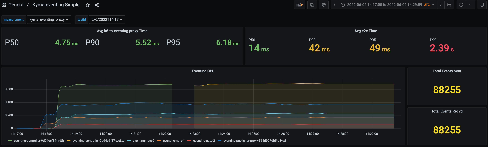

**Test Sender Stats:**

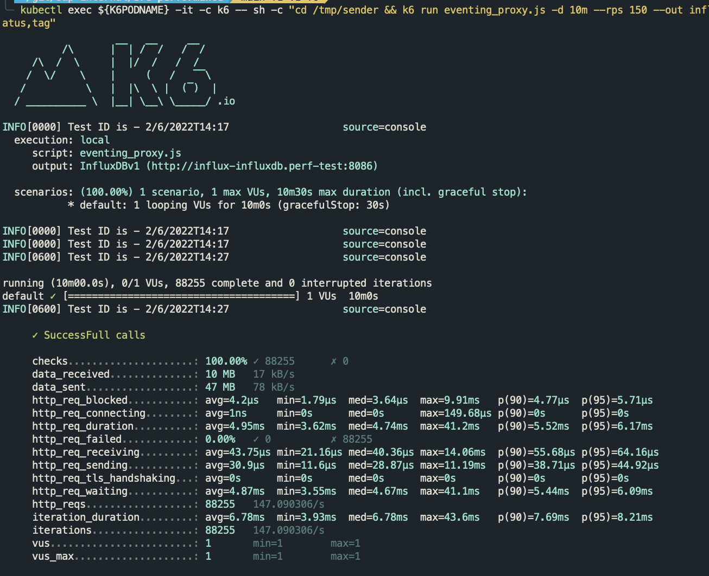

**NATS Stream Info:**

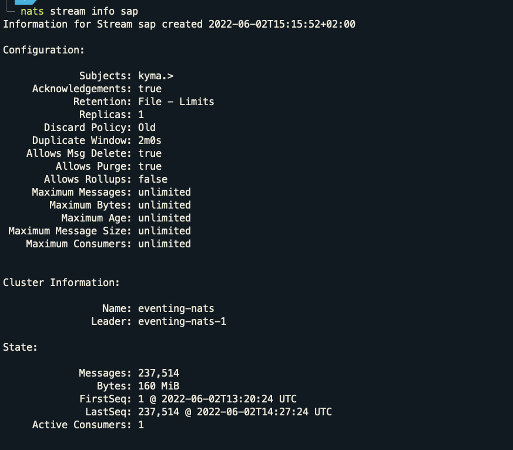

**NATS Consumer Info:**

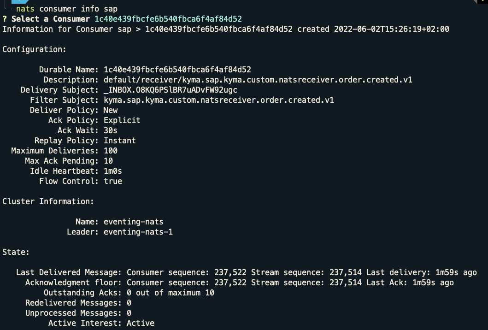

---

## Finding

Eventing controller reaches the CPU limit (500m) on 100 events/sec. Same result for NATS with JetStream disabled.
