# High Availibiltiy (HA) Evaluation of JetStream (Kyma: Production Profile)

## Table of Contents
- Purpose
- Test Setup
- NATS Pods Anti-Affinity
- Test Scenario 1: K8s Cluster Node deleted during test where stream leader NATS pod was NOT deployed
- Test Scenario 2: K8s Cluster Node deleted during test where stream leader NATS pod was deployed
- Test Scenario 3: NATS Pod (JetStream Stream Leader) deleted during test
- Test Scenario 4: K8s Node deleted during test where stream leader NATS Pod was deployed (with Stream Replicas: 3)
- Conclusion

## Purpose

The purpose of the tests is to evaluate the high availibilty of NATS JetStream to ensure that a node/pod failure must not disrupt event publishing or dispatching workflow.

## Test Setup
* Kyma CLI version: `2.2.0`
* Kyma: 
  * Version: main [[commit](https://github.com/kyma-project/kyma/commit/f8a0c28a43e9eebf192514acc61614300f9909a1)] 
  * Production Profile
  * JetStream with File Storage
* NATS Image: `eu.gcr.io/kyma-project/external/nats:2.8.2-alpine`
* K8s cluster:
  * Kubernetes v1.21.10
  * Gardener cluster [Nodes: 3(min) to 6(max)]
  * GCP machine type: `n1-standard-4`
  * Cluster region: `gcp / europe-west1 / europe-west1-c`

* Kyma deploy command:
  ```
  kyma deploy --source=main -p production --value global.jetstream.enabled=true --value global.jetstream.storage=file
  ```
* Testing tool: [K6](https://k6.io/) (deployed in the same Kyma cluster)
  * Grafana Dashboard:
    * **Avg k6-to-eventing proxy time:** Shows the average time taken by the event to be sent from the sender till its received by the event-publisher-proxy.
    * **Avg e2e time:** Shows the average end-to-end time taken by the event to be sent from the sender till its received by the final sink (i.e. the receiver).

## NATS Pods Anti-Affinity

The NATS pods have the AntiAffinity ([here](https://github.com/kyma-project/kyma/blob/6eba6d3b62c15c69645f8577d5c8ca46beeb2c93/resources/eventing/charts/nats/values.yaml#L144)) :
```
affinity:
  podAntiAffinity:
    preferredDuringSchedulingIgnoredDuringExecution:
    - podAffinityTerm:
        labelSelector:
          matchLabels:
            nats_cluster: eventing-nats
        topologyKey: kubernetes.io/hostname
      weight: 100
```

> **NOTE:** Note that the Pod anti-affinity policy is `preferredDuringSchedulingIgnoredDuringExecution` as compared to `requiredDuringSchedulingIgnoredDuringExecution` ([see difference here](https://kubernetes.io/docs/concepts/scheduling-eviction/assign-pod-node/#node-affinity)). Therefore, in some cases a single node could have multiple NATS Pods deployed on it.


## Test Cases
JetStream uses a NATS optimized RAFT algorithm for clustering and high availibilty. Each stream in JetStream has a assigned stream leader NATS server. For failure scenarios, there would be two main cases:

1. The k8s Node crashes where stream leader NATS Pod is deployed.
2. The k8s Node crashes where stream leader NATS Pod is not deployed.

In following sections we will run some test scenarios covering these two cases in order to check the behaviour of our system.

---

## Test Scenario 1: K8s Cluster Node deleted during test where stream leader NATS pod was NOT deployed

### Run ID: 8/6/2022T15:26 (Duration: 5m, Event Rate: 150rps)

> **NOTE:** Deleted k8s Node where `eventing-nats-2` Pod was deployed after 2 minutes of test execution.

**State before test run:**
- Stream:
  - LastSeq# 699,293
  - Leader: eventing-nats-1
  - Replicas: 1
- Consumer:
  - Ack Floor: Stream sequence# 699,293

**State after test run:**
- Stream:
  - LastSeq# 741,787
  - Leader: eventing-nats-1
  - Replicas: 1
- Consumer:
  - Ack Floor: Stream sequence# 741,787
  - Redelivered Messages: 0
  - Unprocessed Messages: 0

**Test Results:**
```
-> Total Events Sent      by **Test Sender** : 42,494
-> Total Events Received  by **Stream**      : 42,494 (i.e. 741,787 - 699,293) 
-> Total Events Processed by **Consumer**    : 42,494 (i.e. 741,787 - 699,293)
-> Total Events Received  by **Sink**        : 42,386 (There were some errors in sink for storing the data to database)
```

**Test Results Dashboard:**

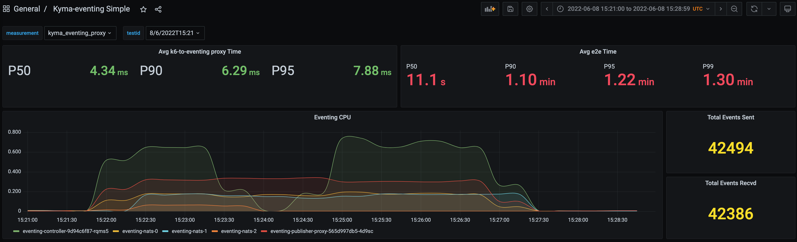

**Test Sender Stats:**

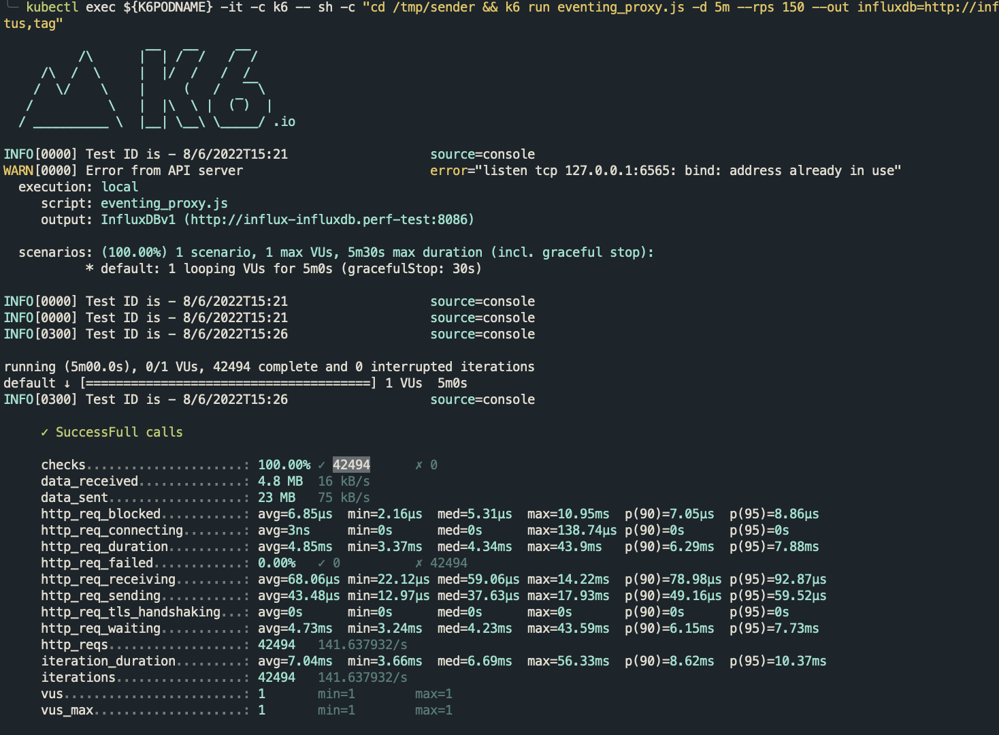


**Finding:**

The downtime of the NATS Pod (non-stream leader) did not cause any disruption in event publishing or dispatching workflow. However, it took some time for the crashed pod to come back because it takes some time for the PVC to be detached and mounted with a new K8s Node.

```
Events:
  Type     Reason                  Age    From                     Message
  ----     ------                  ----   ----                     -------
  Normal   Scheduled               8m12s  default-scheduler        Successfully assigned kyma-system/eventing-nats-2 to shoot--kymatunas--fzn-p2-worker-k59z0-z1-5f68f-tnw8q
  Warning  FailedAttachVolume      8m12s  attachdetach-controller  Multi-Attach error for volume "pv--f20986b4-a4a0-455b-ace2-6b91bdd4f11c" Volume is already exclusively attached to one node and can't be attached to another
  Warning  FailedMount             6m9s   kubelet                  Unable to attach or mount volumes: unmounted volumes=[eventing-nats-js-pvc], unattached volumes=[eventing-nats-js-pvc config-volume pid kube-api-access-gn9xs]: timed out waiting for the condition
  Warning  FailedMount             3m52s  kubelet                  Unable to attach or mount volumes: unmounted volumes=[eventing-nats-js-pvc], unattached volumes=[kube-api-access-gn9xs eventing-nats-js-pvc config-volume pid]: timed out waiting for the condition
  Normal   SuccessfulAttachVolume  113s   attachdetach-controller  AttachVolume.Attach succeeded for volume "pv--f20986b4-a4a0-455b-ace2-6b91bdd4f11c"
  Warning  FailedMount             97s    kubelet                  Unable to attach or mount volumes: unmounted volumes=[eventing-nats-js-pvc], unattached volumes=[config-volume pid kube-api-access-gn9xs eventing-nats-js-pvc]: timed out waiting for the condition
```

---

## Test Scenario 2: K8s Cluster Node deleted during test where stream leader NATS pod was deployed

### Run ID: 8/6/2022T14:24 (Duration: 5m, Event Rate: 150rps)

> **NOTE:** Deleted k8s Node where `eventing-nats-2` Pod was deployed after 2 minutes of test execution.

**State before test run:**
- Stream:
  - Leader: eventing-nats-2
  - Replicas: 1

**State after test run:**
- Stream:
  - Leader: NA (Stream Unavailable)
  - Replicas: NA


**Test Results:**
```
-> Total Events Sent      by **Test Sender** : 10,672 (+ 45 (Failed) = 10,717)
-> Total Events Received  by **Sink**        : 10,672
```

**Test Results Dashboard:**

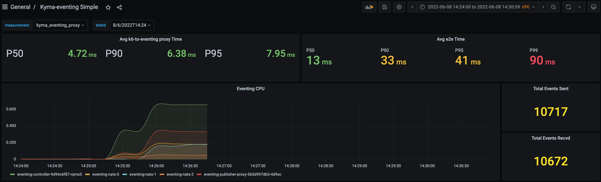

**Test Sender Stats:**

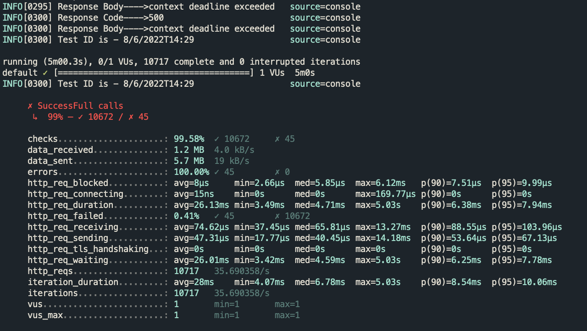

**Finding:** 

Deleting the K8s Node where stream leader NATS Pod was deployed resulted in the JetStream stream to be unavailable as there was only one replica of the stream. NATS stopped accepting any new events for that steam and event-publisher-proxy was failing to publish any event to NATS. The system started to work again as soon as the crashed NATS Pod was deployed on another Node and stream became available again. Therefore, a single stream replica is not enough to cater a situation of single-node failure.

---

## Test Scenario 3: NATS Pod (JetStream Stream Leader) deleted during test

> **NOTE:** Deleted the pod `eventing-nats-1` (Stream Leader) after 3 minutes. Notice that this time only the pod was deleted, not the k8s Node itself.
```
kubectl delete po -n kyma-system eventing-nats-1
```

### Run ID: 8/6/2022T11:28 (Duration: 10m, Event Rate: 150rps)

**State before test run:**
- Stream:
  - Leader: eventing-nats-1
  - Replicas: 1

**State after test run:**
- Stream:
  - Leader: eventing-nats-0
  - Replicas: 1

**Test Results:**
```
-> Total Events Sent      by **Test Sender** : 85,876 (+ 19 (Failed) = 85,895)
-> Total Events Received  by **Sink**        : 85,878 (means 2 events were duplicates)
```

**Test Results Dashboard:**

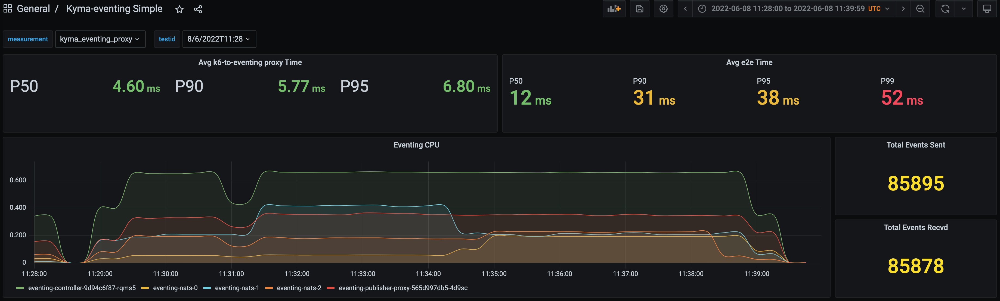

**Test Sender Stats:**

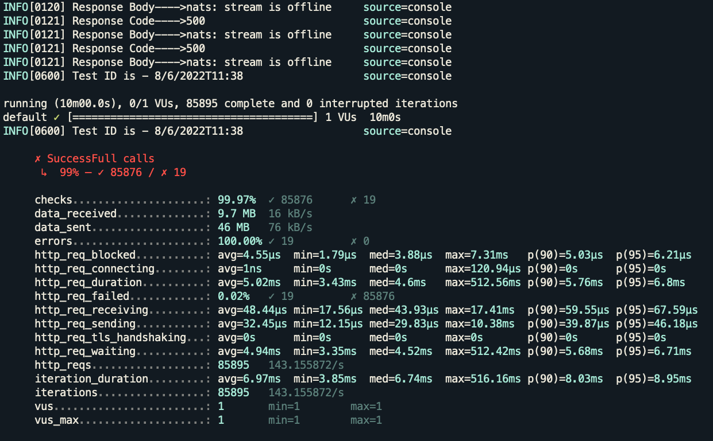

**Finding:** 

If the stream leader NATS pod is deleted then NATS stops accepting messages for that stream until a new leader is elected. Therefore, event-publisher-proxy fails to publish messages until the leader came back.

---

## Test Scenario 4: K8s Node deleted during test where stream leader NATS Pod was deployed (with Stream Replicas: 3)

The number of stream replicas was changed to 3 replicas in order to check the behaviour of single-node failure with multiple stream replicas.

```
nats stream update sap --replicas 3 -f
```

### Run ID: 9/6/2022T8:31 (Duration: 5m, Event Rate: 150rps)

> **NOTE:** Deleted k8s Node where `eventing-nats-1` Pod was deployed after 2 minutes of test execution. Eventing-controller pod was also deployed on the deleted node and it was re-scheduled after the crashed Node came back online.

**State before test run:**
- Stream:
  - Leader: eventing-nats-1
  - Replicas: 3

**State after test run:**
- Stream:
  - Leader: eventing-nats-2
  - Replicas: 3

- Stream info after deleting the K8s Node:
  ```
  ╰─ nats stream info sap
  Information for Stream sap created 2022-06-09T10:01:02+02:00
  
  Configuration:
  
               Subjects: kyma.>
       Acknowledgements: true
              Retention: File - Limits
               Replicas: 3
         Discard Policy: Old
       Duplicate Window: 2m0s
      Allows Msg Delete: true
           Allows Purge: true
         Allows Rollups: false
       Maximum Messages: unlimited
          Maximum Bytes: unlimited
            Maximum Age: unlimited
   Maximum Message Size: unlimited
      Maximum Consumers: unlimited
  
  
  Cluster Information:
  
                   Name: eventing-nats
                 Leader: eventing-nats-2
                Replica: eventing-nats-1, outdated, seen 29.48s ago, 18,466 operations behind
                Replica: eventing-nats-0, current, seen 0.00s ago
  
  State:
  
               Messages: 18,463
                  Bytes: 12 MiB
               FirstSeq: 1 @ 2022-06-09T08:31:02 UTC
                LastSeq: 18,463 @ 2022-06-09T08:33:15 UTC
       Active Consumers: 1
  ```

**Test Results:**
```
-> Total Events Sent      by **Test Sender** : 43,083 (+ 1 Failed = 43,084)
-> Total Events Received  by **Sink**        : 43,012 (There were some errors in sink for storing the data to database)
```

**Test Results Dashboard:**

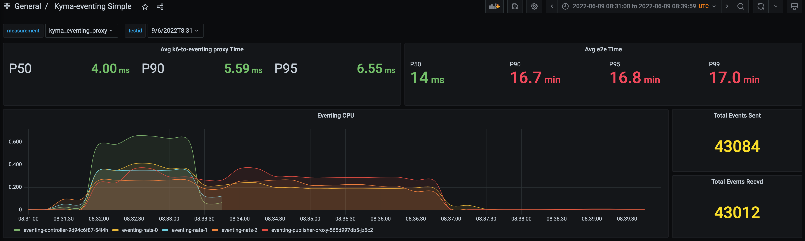

**Test Sender Stats:**

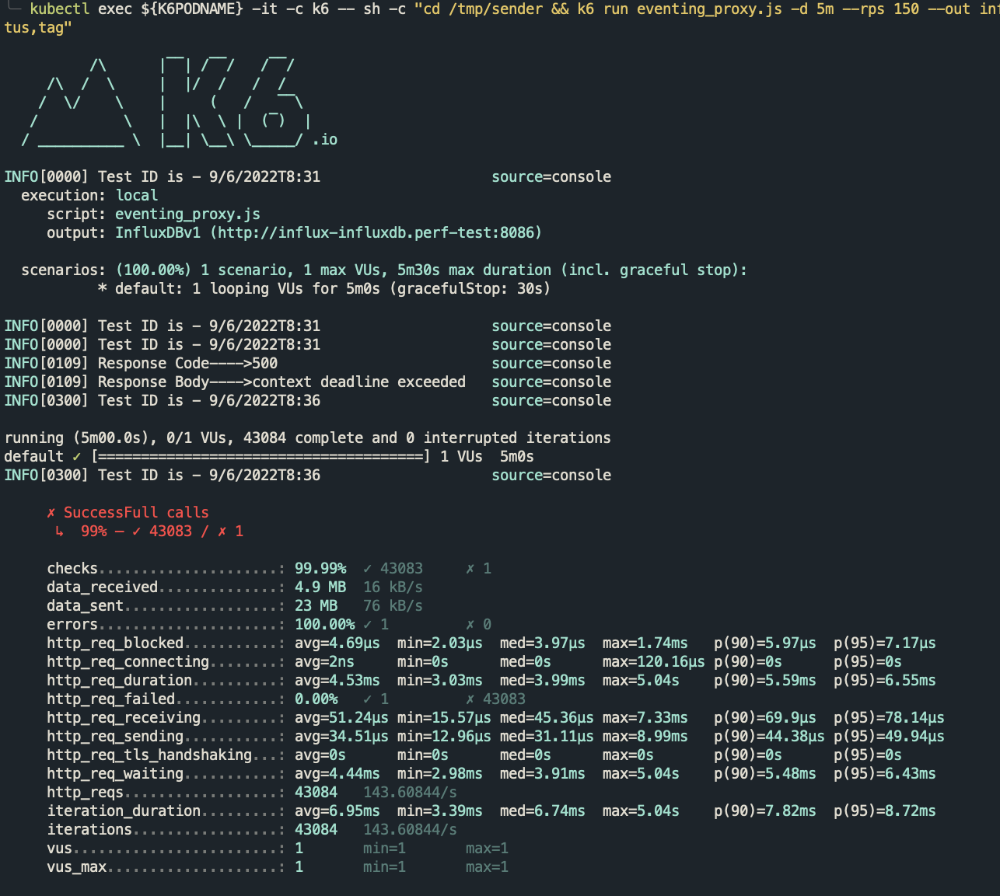

**Finding:** 

As now there were 3 stream replicas, deleting the K8s Node where stream leader NATS Pod was deployed triggered a leader election for the stream. During the election time, event-publisher-proxy failed to publish some events to NATS. But this downtime is much less than the `Test Scenario 2` where there was only one stream replica and it had to wait for the same NATS Pod to come up in order to resume receiving events. Instead, in this scenario a new NATS Pod was elected as the leader for the stream.

### Run ID: 9/6/2022T9:22 (Duration: 5m, Event Rate: 150rps)

> **NOTE:** Deleted k8s Node where `eventing-nats-2` Pod was deployed after 2 minutes of test execution. Eventing-controller pod was not deployed on the deleted node.

**State before test run:**
- Stream:
  - Leader: eventing-nats-2
  - Replicas: 3

**State after test run:**
- Stream:
  - Leader: eventing-nats-1
  - Replicas: 3
- Consumer:
  - Redelivered Messages: 0
  - Unprocessed Messages: 29,386

**Test Results:**
```
-> Total Events Sent      by **Test Sender** : 41,956 (+ 1 Failed = 41,957)
-> Total Events Received  by **Sink**        : 41,960 (means 4 events were duplicates)
```

**Test Results Dashboard:**

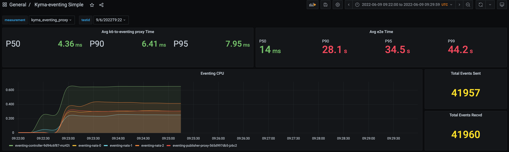

**Test Sender Stats:**

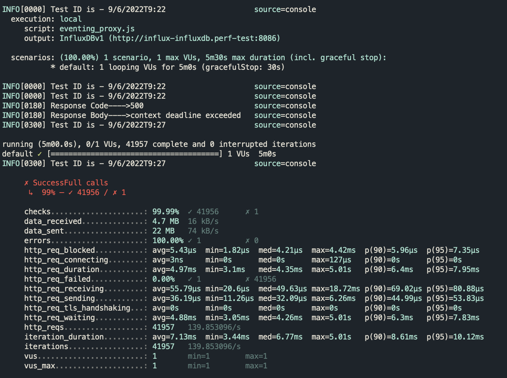

**NATS JetStream Dashboard:**

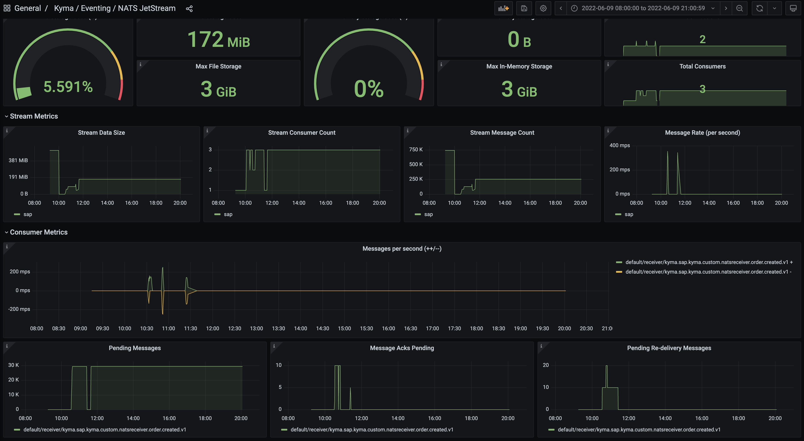

**NATS Consumer Info:**

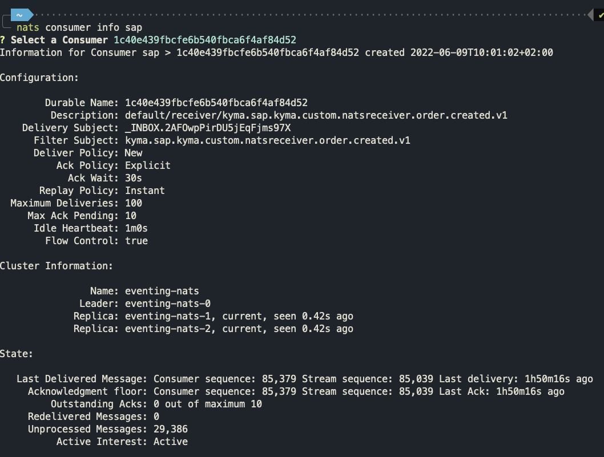

**NATS Stream Info:**


**Finding:** 

After the test run, the consumer info showed `Unprocessed Messages: 29,386` but the `Redelivered Messages` and `Outstanding Acks` were zero. The eventing-controller was healthy so the unprocessed messages should have being delivered by NATS but they were not. Further investigation unveiled that there were some accounting bugs in NATS v2.8.2 and is fixed in new NATS v2.8.4 by [PR](https://github.com/nats-io/nats-server/pull/3148).

## Conclusion
Based on the findings of the test scenarios, it was seen that having a single stream replica does not ensure high availability as clustering in JetStream uses RAFT ([more info](https://docs.nats.io/running-a-nats-service/configuration/clustering/jetstream_clustering)). It is recommended to have at least 3 stream replicas to provide high availability of a stream in case of single-node failure. Therefore, now the production profile will use 3 replicas of stream and evaluation profile will still be set to use 1 stream replica ([related PR](https://github.com/kyma-project/kyma/pull/14539)).