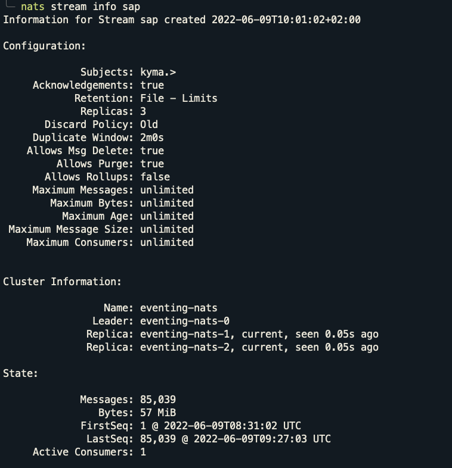

# High Availibiltiy (HA) Evaluation of JetStream (Kyma: Production Profile)

## Table of Contents
- Test Setup
- Anti-Affinity
- Test Scenario 1: Eventing-nats-1 (Stream Leader) pod deleted during test
- Test Scenario 2: K8s Cluster Node deleted during test where stream leader NATS pod is deployed
- Test Scenario 3: K8s Cluster Node deleted during test where stream leader NATS pod is NOT deployed
- Test Scenario 4: Eventing-nats-1 (Stream Leader) pod deleted during test but with Stream Replicas set to 3
- Conclusion

## Test Setup
* Testing tool: [K6](https://k6.io/)
* Kyma CLI version: `2.2.0`
* Kyma: 
  * Version: main [[commit](https://github.com/kyma-project/kyma/commit/f8a0c28a43e9eebf192514acc61614300f9909a1)] 
  * Production Profile
  * JetStream with File Storage
* NATS Image: `eu.gcr.io/kyma-project/external/nats:2.8.2-alpine`
* K8s cluster:
  * Kubernetes v1.21.10
  * Gardener cluster [Nodes: 3(min) to 6(max)]
  * GCP machine type: `n1-standard-4`
  * Cluster region: `gcp / europe-west1 / europe-west1-c`

* Kyma deploy command:
  ```
  kyma deploy --source=main -p production --value global.jetstream.enabled=true --value global.jetstream.storage=file
  ```


## Anti-Affinity

The NATS pods have the AntiAffinity ([here](https://github.com/kyma-project/kyma/blob/6eba6d3b62c15c69645f8577d5c8ca46beeb2c93/resources/eventing/charts/nats/values.yaml#L144)) :
```
affinity:
  podAntiAffinity:
    preferredDuringSchedulingIgnoredDuringExecution:
    - podAffinityTerm:
        labelSelector:
          matchLabels:
            nats_cluster: eventing-nats
        topologyKey: kubernetes.io/hostname
      weight: 100
```

> **NOTE:** Note that the Pod anti-affinity policy is `preferredDuringSchedulingIgnoredDuringExecution` as compared to `requiredDuringSchedulingIgnoredDuringExecution` ([see difference here](https://kubernetes.io/docs/concepts/scheduling-eviction/assign-pod-node/#node-affinity)). Therefore, in some cases a single node could have multiple NATS Pods deployed on it.


## Test Scenario 1: Eventing-nats-1 (Stream Leader) pod deleted during test
**NOTE:** Deleted (using kubectl delete) the pod of eventing-nats-1 after 3 minutes.

### Run ID: 8/6/2022T11:28 (Duration: 10m, Event Rate: 150rps)

> **NOTE:** If the stream leader NATS pod is deleted then NATS stops accepting messages for that stream until a new leader is elected. Therefore, event-publisher-proxy fails to publish messages until the leader comes back.


## Test Scenario 2: K8s Cluster Node deleted during test where stream leader NATS pod is deployed

### Run ID: 8/6/2022T14:24 (Duration: 5m, Event Rate: 150rps)


> **NOTE:** It takes some time for the new NATS Pod to come up because PVC takes some time to be detached and mounted with a new K8s Node.

```
Events:
  Type     Reason              Age   From                     Message
  ----     ------              ----  ----                     -------
  Normal   Scheduled           49s   default-scheduler        Successfully assigned kyma-system/eventing-nats-1 to shoot--kymatunas--fzn-p2-worker-k59z0-z1-5f68f-q5944
  Warning  FailedAttachVolume  50s   attachdetach-controller  Multi-Attach error for volume "pv--4fdf1474-93af-4f5b-92b1-ad4df0258e00" Volume is already exclusively attached to one node and can't be attached to another
```

## Test Scenario 3: K8s Cluster Node deleted during test where stream leader NATS pod is NOT deployed

### Run ID: 8/6/2022T15:26 (Duration: 5m, Event Rate: 150rps)

**State before test run:**
- Stream:
  - LastSeq# 699,293
- Consumer:
  - Ack Floor: Stream sequence# 699,293

**State after test run:**
- Stream:
  - LastSeq# 741,787
- Consumer:
  - Ack Floor: Stream sequence# 237,514
  - Redelivered Messages: 0
  - Unprocessed Messages: 0

```
-> Total Events Sent      by **Test Sender** : 42,494
-> Total Events Received  by **Stream**      : 42,494 (i.e. 741,787 - 699,293) 
-> Total Events Processed by **Consumer**    : 42,494 (i.e. 741,787 - 699,293)
-> Total Events Received  by **Sink**        : 42,386 (There were some errors in sink for storing the data to database)
```


```
Events:
  Type     Reason                  Age    From                     Message
  ----     ------                  ----   ----                     -------
  Normal   Scheduled               8m12s  default-scheduler        Successfully assigned kyma-system/eventing-nats-2 to shoot--kymatunas--fzn-p2-worker-k59z0-z1-5f68f-tnw8q
  Warning  FailedAttachVolume      8m12s  attachdetach-controller  Multi-Attach error for volume "pv--f20986b4-a4a0-455b-ace2-6b91bdd4f11c" Volume is already exclusively attached to one node and can't be attached to another
  Warning  FailedMount             6m9s   kubelet                  Unable to attach or mount volumes: unmounted volumes=[eventing-nats-js-pvc], unattached volumes=[eventing-nats-js-pvc config-volume pid kube-api-access-gn9xs]: timed out waiting for the condition
  Warning  FailedMount             3m52s  kubelet                  Unable to attach or mount volumes: unmounted volumes=[eventing-nats-js-pvc], unattached volumes=[kube-api-access-gn9xs eventing-nats-js-pvc config-volume pid]: timed out waiting for the condition
  Normal   SuccessfulAttachVolume  113s   attachdetach-controller  AttachVolume.Attach succeeded for volume "pv--f20986b4-a4a0-455b-ace2-6b91bdd4f11c"
  Warning  FailedMount             97s    kubelet                  Unable to attach or mount volumes: unmounted volumes=[eventing-nats-js-pvc], unattached volumes=[config-volume pid kube-api-access-gn9xs eventing-nats-js-pvc]: timed out waiting for the condition
```

## Test Scenario 4: Eventing-nats-1 (Stream Leader) pod deleted during test but with Stream Replicas set to 3

- Change stream replica count using:
  ```
  nats stream update sap --replicas 3 -f
  ```

### Run ID: 9/6/2022T8:31 (Duration: 5m, Event Rate: 150rps)

> **Note:** Eventing-controller pod was also on the deleted node and it was stuck in provision a new pod due to insufficient cluster resources.

- Stream info after deleting the K8s Node:
  ```
  ╰─ nats stream info sap
  Information for Stream sap created 2022-06-09T10:01:02+02:00
  
  Configuration:
  
               Subjects: kyma.>
       Acknowledgements: true
              Retention: File - Limits
               Replicas: 3
         Discard Policy: Old
       Duplicate Window: 2m0s
      Allows Msg Delete: true
           Allows Purge: true
         Allows Rollups: false
       Maximum Messages: unlimited
          Maximum Bytes: unlimited
            Maximum Age: unlimited
   Maximum Message Size: unlimited
      Maximum Consumers: unlimited
  
  
  Cluster Information:
  
                   Name: eventing-nats
                 Leader: eventing-nats-2
                Replica: eventing-nats-1, outdated, seen 29.48s ago, 18,466 operations behind
                Replica: eventing-nats-0, current, seen 0.00s ago
  
  State:
  
               Messages: 18,463
                  Bytes: 12 MiB
               FirstSeq: 1 @ 2022-06-09T08:31:02 UTC
                LastSeq: 18,463 @ 2022-06-09T08:33:15 UTC
       Active Consumers: 1
  ```

```
-> Old Stream Leader                         : `eventing-nats-1`
-> New Stream Leader                         : `eventing-nats-2`
-> Total Events Sent      by **Test Sender** : 43,083
-> Total Events Received  by **Stream**      : 43,083 (i.e. 43,083 - 0) 
-> Total Events Processed by **Consumer**    : 43,083 (i.e. 43,083 - 0)
-> Total Events Received  by **Sink**        : 43,012 (There were some errors in sink for storing the data to database)
```


### Run ID: 13/6/2022T10:45 (Duration: 5m, Event Rate: 150rps)

> **Note:** Eventing-controller pod was not deployed on the deleted node.

**State before test run:**
- Stream:
  - LastSeq# 129,137
  - Leader: eventing-nats-1
- Consumer:
  - Ack Floor: Stream sequence# 129,137

**State after test run:**
- Stream:
  - LastSeq# 161,358
  - Leader: eventing-nats-0
- Consumer:
  - Ack Floor: Stream sequence# 161,358
  - Redelivered Messages: 0
  - Unprocessed Messages: 0

```
-> Old Stream Leader                         : `eventing-nats-1`
-> New Stream Leader                         : `eventing-nats-0`
-> Total Events Sent      by **Test Sender** : 32,221 (+ 16 Failed = 32,237)
-> Total Events Received  by **Stream**      : 32,221 (i.e. 161,358 - 129,137) 
-> Total Events Processed by **Consumer**    : 32,221 (i.e. 161,358 - 129,137)
-> Total Events Received  by **Sink**        : 32,132 (There were some errors in sink for storing the data to database)
```


> **Note:** There were some subscription reconciliation errors logs in eventing-controller pod, but after sometime it was able to reconnect to NATS server and reconcile the subscription successfully.

### Run ID: 9/6/2022T9:22 (Duration: 5m, Event Rate: 150rps)

> **Note:** Eventing-controller pod was not deployed on the deleted node.

**State after test run:**
- Consumer:
  - Redelivered Messages: 0
  - Unprocessed Messages: 29,386

```
-> Old Stream Leader                         : `eventing-nats-2`
-> New Stream Leader                         : `eventing-nats-1`
-> Total Events Sent      by **Test Sender** : 41,956 (+ 1 Failed = 41,957)
-> Total Events Received  by **Sink**        : 41,960
```

> **NOTE:** After the test run, the consumer info showed `Unprocessed Messages: 29,386` but the `Redelivered Messages` and `Outstanding Acks` were zero. This was because of a bug in NATS v2.8.2 and is fixed in new version v2.8.4 by [PR](https://github.com/nats-io/nats-server/pull/3148).




## Conclusion
Based on the findings, its recommended to use atleast 3 stream replicas to provide high availibilty of stream in case of single-node failure. Therefore, now the production profile will use 3 replicas of stream and evaluation profile will still be set to use 1 stream replica ([related PR](https://github.com/kyma-project/kyma/pull/14539)).