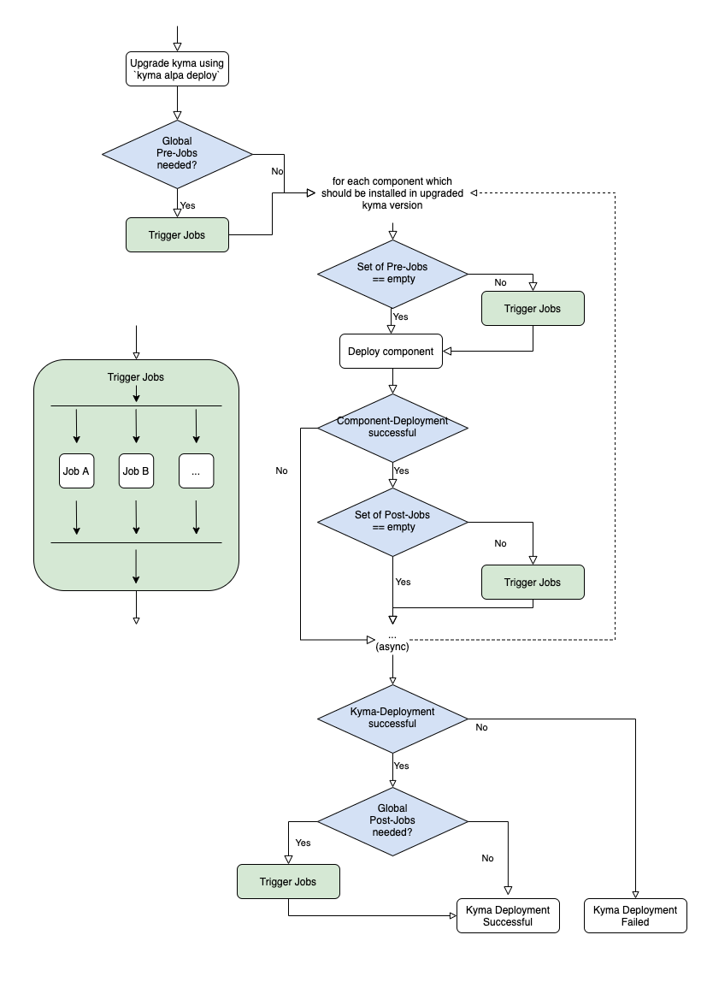

# Installer Migration Hooks aka jobManager (Migration Logic)

This PoC investigates a valid design for the new __JobManager__, which is needed to enable a clean automated `kyma deploy` command. It will be used to configure the cluster and the components during the deployment of Kyma. The terms "Deployment" and "Deploy" are used in the context of installing Kyma on an empty cluster, or to upgrade Kyma from an older to a newer version.

To achieve a valid solution for the PoC we need to come up with a design for the following:

- [WorkFlow / General mechanism](#workflow--general-mechanism)
  - [Requirements](#requirements)
  - [Possible Solution](#possible-solution)
- [Draft for Golang Implementation](#draft-for-golang-implementation)
- [Placement of logic and actual jobs](#placement-of-logic-and-actual-jobs)
- [Additions](#additions)

## Workflow / General mechanism

### Requirements

- Only support single linear upgrade: A &#8594; B && B &#8594; C; NOT A &#8594; C. This is due to the fact that Kyma only supports single linear upgrades.
- Inside the job we need "smart checks" to determine whether the job should run its main logic, because implementing an interface that covers all possible scenarios would be overengineering. &#8594; The cluster state, not the target Kyma version is decisive whether logic of jobs should run.
- It should be easy to tag a job at which certain point it should be deprecated. Written "by hand" or using some techonology to let pipelines fail, if some jobs exist which should be deprecated.
- JobManager only supports Kyma `deploy` and not `uninstall`, to prevent that developers misuse jobs to clean up dirty left-overs from `kyma uninstall`.
- When the deploy of Kyma fails, the global post-jobs should not run.
- When the deploy of a component fails, the component-based post-jobs should not run.
- Jobs should run async to each other.
- CancelContext should be propagated to give developers the opportunity to cancel deploy.


- This mechanism supports jobs for two different use cases: The __component-based__ jobs and the __global/component-independent__ jobs
  - __Component-based__:
    - Check whether the component is installed in the cluster or must be newly installed; and only trigger if it must be installed.
    - It should be possible to trigger jobs before and after a deployment of a component.
  - __Global / Component-independent__:
    - Always trigger the job when installing or upgrading Kyma.
    - It should be possible to trigger jobs before and after the deployment of Kyma.
    - Call component-independent jobs `global` jobs to stick to the naming convention of our helm charts.

### Possible Solution

To fulfill the requirements, a new package, called `jobManager`, is introduced, which registers, manages, and triggers certain jobs to have a fully-automated installation or migration. This package has two (hash)maps to manage the workload: One for `pre`-jobs and one for `post`-jobs. In the (hash)maps, the key is the name of the component the jobs belong to, and the value is a slice of the jobs.

Furthermore, the `jobManager` package has a `duration` variable for benchmarking.

Jobs are implemented within the `jobManager` package in `go`-files, one for each component, using the specific `job` interface. Then, the implemented interface is registered using `register(job)` in the same file.
To implement the `job` interface, the newly created jobs must implement the `execute(*config.Config, kubernetes.Interface)` function, which takes the installation config and a kubernetes interface as input, so that the jobs can interact with the cluster. The return value must be an error. Additionally, the `when()` function must be implemented, which returns the component the job is bound to and whether it should run pre or post the deployment. The `identify()` function also needs to be implemented to have a unique identifier for each job. If the active solution for tagging jobs as deprecated is chosen, then the `deprecate` function also must be implemented - more in the next section.

The jobManager is used by the `deployment` package and in the `engine` package . At the hooks, during the deployment phase, each hook only has to check if the key for the wanted component is present in the pre- or post-map. If it's present, the jobs in the map are trigged, if not, nothing must be done.

To benchmark the jobs, a timer is used in the pre- and post-job triggers.

Retries for the jobs are not handled by the jobManager. Retries should be implemented by the jobs themselves, because it's more flexible and the interface is easy to manage. Also, the check if the logic of the job should be executed stays inside of the job, and is not implemented by the jobManager.

### Deprecation of Jobs

Passive:
- Tag (as a comment above the register call) at which defined Kyma version the jobs should be deprecated.

Active:
- Go-Build-Tags cannot be used for this use case.
- Add `deprecation` function to job-interface, which returns at which Kyma version the job should be deprecated. Before the job is executed, the deprecation function is called to check whether it is already deprecated. If deprecated, an Error should be thrown to block the CI.



## Draft for Golang Implementation

### core.go with main logic 

```go
package jobManager

import (
	"sync"
	"time"

	"github.com/kyma-incubator/hydroform/parallel-install/pkg/config"
)

type component string
type executionTime int
type jobName string

type jobStatus struct {
	job    jobName
	status bool
}

const (
	Pre executionTime = iota
	Post
)

var duration time.Duration

var preJobMap = make(map[component][]job)
var postJobMap = make(map[component][]job)

var kubeClient kubernetes.Interface
var cfg *config.Config

var Log logger.Interface

// Define type for jobs
type job interface {
	execute(*config.Config, kubernetes.Interface, context.Context) error
	when() (component, executionTime)
	identify() jobName
}

// Register job
func register(j job) {
	// TODO: Add job to corresponding map
}

// Function should be called before component is being deployed/upgraded
func ExecutePre(component string) {
	start := time.Now()
	// TODO: Executes the registered functions for given component; using maps
	//       If map for given key(aka component) is empty, nothing will be done
	//       Check installationType, to know which map should be used
	t := time.Now()
	duration += t.Sub(start)
}

// Function should be called after compoent is being deployed/upgraded
func ExecutePost(component string) {
	start := time.Now()
	// TODO: Executes the registered functions for given component; using maps
	//       If map for given key(aka component) is empty, nothing will be done
	//       Check installationType, to know which map should be used
	t := time.Now()
	duration += t.Sub(start)
}

// Returns duration of all jobs for benchmarking
func GetDuration() time.Duration {
	return duration
}

```

### component1.go - Exmaple component file draft

```go
package jobManager

// Register job using implemented interface
type job1 struct{}
var _ = register(job1)

func (j job1) execute(cfg *config.Config, kubeClient kubernetes.Interface, ctx context.Context) error {

	// Do something
  ...
  return nil
}

func (j job1) when() {
	return ("kiali", Pre)
}

func (j job1) identify() jobName {
	return jobName("exampleJob")
}

```

### Hook for global jobs in `hydroform/parallel-install/deployment.go`; Pre/Post global Jobs - Deploy

Pre- and post-jobs will be executed before and after Kyma deploy.

```go
import "hydroform/parallel-install/jobs"
func (i *Deployment) deployComponents(ctx context.Context, cancelFunc context.CancelFunc, phase InstallationPhase, eng *engine.Engine, cancelTimeout time.Duration, quitTimeout time.Duration) error {
  ...
  if phase == InstallPreRequisites {
		jobmanager.ExecutePre(ctx, "global")
	}
  statusChan, err := eng.Deploy(ctx)
  ...
  // for-Loop for component install
  ...
  if phase == InstallComponents {
		jobmanager.ExecutePost(ctx, "global")
	}
}
```

### Hook for component jobs in `hydroform/parallel-install/engine.go`; Pre/Post Component Jobs - Deploy 

Pre- and post-jobs will be executed before and after each Kyma component. In this way, only the components that will be installed or upgraded are considered by the JobManager &#8594; others are not executed. Furthermore, since the prerequisites of components are deployed using the `worker` function of an `engine` as well, the JobManager handles them automatically.

```go
import "hydroform/parallel-install/jobs"
...
  ... // async workers
  func (e *Engine) worker(ctx context.Context, wg *sync.WaitGroup, jobChan <-chan components.KymaComponent, statusChan chan<- components.KymaComponent, installType installationType) {
    ...
    if installType == deploy {
      case component, ok := <-jobChan:
    ...
    jobManager.ExecutePre(component.Name)
    if err := component.Deploy(ctx); err != nil {
      component.Status = components.StatusError
      component.Error = err
    } else {
      component.Status = components.StatusInstalled
      jobmanager.ExecutePost(ctx, component.Name)
    }
  ...
}
```

## Placement of logic and actual jobs

After a short discussion with the included Teams (Goats, Huskies), we decided to implement the logic and jobs for the jobManager in the installer library (hydroform repository) as a package, to keep it simple, clean, and easy to access.

The jobManager will be placed as a package inside of the `parallel-install` module.
```
hydroform
│   ...
└───parallel-install 
│     │   ...
│     └───jobManager
│     │     │   core.go 				// jobManager 
│     │     │   component1.go  	// Implement jobs and register
│     │     │   component2.go
│     │     │   ...
│    ...   ...
...
```

## Additions

- To have a consistent output, we will use the Unified Logging library. The logs should be sent back to the caller (aka CLI).

## Results after implementing Draft-PoC
The pre-described PoC was implemented on [this branch](https://github.com/JeremyHarisch/hydroform/tree/jobManager), and tested using [this](https://github.com/kyma-project/kyma/pull/11132) as an example pre-job for the `logging` component.
In the draft implementation, the Unified Logging Library was not used, but can be used in the final implementation.

In general, it works in the way we want to, but with some tradeoffs. The mechanism was tested using a local k3d cluster, as well as on an Azure cluster provisioned by Gardener.

#### Trade-Offs

The jobs cannot handle every situation that may come up in the cluster, because we do not know what the setup/usage of the customer's cluster looks like - for example, which provisioner is used, and especially regarding the access rights of the user  who is deploying Kyma. Thus, an additional migration guide will be needed in the future, as before. Let us demonstrate this on the [example job](https://github.com/JeremyHarisch/hydroform/blob/jobManager/parallel-install/pkg/jobmanager/loggingJobs.go):
- The option `allowVolumeExpansion` must be set to `true`. If it's not, it must be changed. To do this, the provided kubeconfig must have admin rights, and the hypervisor must allow it:
   - __k3d:__ Using a local cluster to deploy Kyma on the sample job fails, since k3d is missing a plugin to expand existing volumes. 

      ```
      Ignoring the PVC: didn't find a plugin capable of expanding the volume; waiting for an external controller to process this PVC.
      ```

   - __Azure:__  When Kyma wants to be deployed on an Azure cluster, the disk expand is only allowed on an unattached disk. Due to some GitHub Issues, this feature will be added in the future.

      ```console
      error expanding volume "kyma-system/storage-logging-loki-0" of plugin "kubernetes.io/azure-disk": azureDisk - disk resize is only supported on Unattached disk, current disk state: Attached, already attached to /subscriptions/68266e60-bb03-40e0-935d-531fac39f8c1/resourceGroups/shoot--berlin--jh-02/providers/Microsoft.Compute/virtualMachines/shoot--berlin--jh-02-worker-jz1n6-z1-6d9c5-cvn2b
      ```

As before, during the deploy upgrading the cluster, the user gets the necessary information to make sure the deploy of Kyma works for them. In other cases, the jobManager works as a Go-based solution instead of using certain Helm features or shell scripts.
