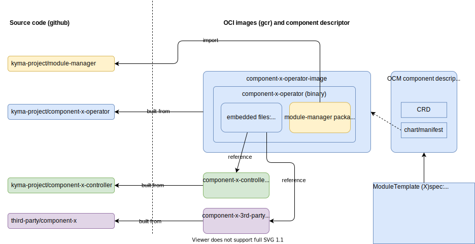

- [Motivation](#motivation)
- [Dependencies between components](#dependencies-between-components)
- [Release channels](#release-channels)
- [Release flow](#release-flow)
- [Component packaging and versioning](#component-packaging-and-versioning)
  - [Example module structure](#example-module-structure)
- [Component descriptor](#component-descriptor)
  - [OCM](#ocm)
  - [Operator bundle from Operator Lifecycle Manager (OLM)](#operator-bundle-from-operator-lifecycle-manager-olm)
  - [Own solution](#own-solution)
- [Operator-based module management](#operator-based-module-management)
- [Central components](#central-components)
  - [Example module operators](#example-module-operators)
- [FAQ](#faq)
  - [Do we still release Kyma? What is a Kyma release?](#do-we-still-release-kyma-what-is-a-kyma-release)
  - [Can I still use the `kyma deploy` command to install Kyma in my cluster?](#can-i-still-use-the-kyma-deploy-command-to-install-kyma-in-my-cluster)
  - [I have a simple component with a Helm chart. Why do I need an operator?](#i-have-a-simple-component-with-a-helm-chart-why-do-i-need-an-operator)
  - [I don't know how to write the operator. Can I use some generic operator for installing my chart?](#i-dont-know-how-to-write-the-operator-can-i-use-some-generic-operator-for-installing-my-chart)
  - [How to roll out a new module version in phases?](#how-to-roll-out-a-new-module-version-in-phases)
  - [How do we migrate all the modules to the new concept?](#how-do-we-migrate-all-the-modules-to-the-new-concept)

# Motivation
Kyma provides Kubernetes building blocks. It should be easy to pick only those that are needed for the job, and it should be easy to add new blocks to extend Kyma features. 

With the growing number of components, it is hard to deliver features and fixes quickly and efficiently due to the long and resource-intensive installation process. Changes in manifests require a new release of Kyma. Operators (reconcilers) are tightly coupled and must be released together. In most cases, new component releases don't involve any API changes and could be delivered in a few minutes. 

# Dependencies between components
Components can depend only on core Kubernetes API or on API extensions introduced by other components. Component operators must check whether the required APIs are available and react properly to the missing dependencies by reducing functionality or even reporting errors. Component owners are responsible for integration tests with their dependencies (the test matrix with all versions supported in official release channels is recommended approach). Module providers should not test dependent modules (those that have a dependency on the provider). The API contract should be tested instead, and all the cases where contract violations were discovered by the dependent module should result in extending contract tests (regression test).

**Example:**

If the API you need (like a core Kubernetes API or Istio virtual service) is not available, you should fail. If your component can work without the API, but some features are not available (for example, service monitor from monitoring), you should just skip it and continue to deploy other component resources. 

**Principles:**
- module operator should know its dependencies
- keep dependencies minimal and try to depend on API only (check if API exists in the required version)
- report missing dependencies in the status of the module operator resource
- remember that dependency can be installed in parallel to your module - give it some time and report error after reasonable timeout
- error or success is not a final state (your dependencies can come and go) - reconcile, update status, bring it to the desired state eventually

# Release channels
Release channels let customers try new features early and discover potential issues related to upgrades, before they affect their critical components. For that reason, we introduce the __fast__ channel that gets updated with new module versions, as soon the version passes all quality gates (automated tests). The __regular__ channel gets that version usually a few days later unless some serious issue was discovered in the meantime. 

Release channels are relevant only to the Kyma Control Plane use case. Kyma Control Plane is a central component that can manage many (thousands) Kyma clusters. For that purpose, the [lifecycle-manager](https://github.com/kyma-project/lifecycle-manager) can apply selected versions of components to all clusters connected to the release channels automatically. To run a module in your standalone cluster (not managed by Kyma Control Plane) you should just directly apply the module operator manifest. See more details here: [New installation procedure for open source Kyma](https://github.com/kyma-project/community/issues/792)

Only released versions of modules can be submitted to the release channel. The submission is realized as a pull request to the internal git repository. The PR contains a module template or all the information required to build the module template (Kubernetes manifest to deploy module operator, default custom resource with module configuration, and required metadata). Moving module versions between channels can be done with a simple pull request (bump version). Later on, it can be automated using a promotion strategy suitable for the particular version change (major/minor/patch defined by [semver.org](https://semver.org/)) or priority (regular/hot-fix), but it is not the highest priority for the first iteration.

# Release flow

Introducing operators and release channels can look complex from Kyma Module Provider's perspective, but the module releases can be fully automated. This is the flow describing actions that are executed starting with the initial PR with a new feature until it is available in production in all Kyma clusters:

- PR to module repository (new feature, bug fix, etc)
- Team pipeline (this is a guideline, but Kyma Module Provider is fully responsible and accountable for it)
  - build images for controllers (have to be certified pipeline - remember about SLC-29, prow is recommended)
  - execute tests - check functional correctness, test your dependencies
  - build image for operator/manager (have to be certified pipeline - remember about SLC-29, prow is recommended)
  - test your operator (installation, upgrade)
  - optional:
    - create module template - and deploy it in the integration environment 
    - test with lifecycle-manager (integration flow: `kyma deploy` installs lifecycle-manager) - optional it is also tested in the second
  - merge the PR
- PR to kyma-modules internal repository with module template (one file per channel) - this is a new file or changed version in the existing module template. This step can be the last one in the pipeline before (continuous delivery option or explicit for manual releases)
- Submission pipeline executed on PR to kyma-modules - checking mainly syntax correctness no functional correctness, it is common for all modules
  - smoke tests for module template (we don't run any module specific tests here)
  - smoke upgrade test (upgrade from version currently available in the channel)
  - merge
- After merge automation (argo CD) that pushes new channel versions to KCP dev/stage/prod environment
  
# Component packaging and versioning
Kyma ecosystem produces several artifacts that can be deployed in the central control plane (KEB + operators) and in the target Kubernetes cluster. Versioning strategy should address pushing changes for all these artifacts in an unambiguous way with full traceability. 

For each component, we identified the following artifacts:
- Operator CRD (contains mainly overrides that can be set by customer or SRE for component installation)
- Operator deployment (YAML to deploy component operator)
- Operator image (Docker image in GCR)
- Component CRDs
- Component deployment
- Component images (docker images in GCR)

Versioning of component resources could be achieved by packaging component CRDs and charts into the component operator binary (or container image). This way, the released operator would contain the CRDs and charts of its components in the local filesystem. 
The image could be signed and we can ensure the integrity of component deployment easily. 

## Example module structure

If we migrate the Eventing component to the proposed structure, it would look like this:
- `github.com/kyma-project/eventing-operator` repository
    - charts (copied from `kyma/resources/eventing`)
    - CRDs (copied from `kyma/installation/resources`)
    - operator source code (inspired by `kyma-incubator/reconciler/pkg/reconciler/instances/eventing` importing `kyma-project/module-manager-lib` to do the common tasks like rendering and deploying charts)
- `github.com/kyma-project/eventing-controller` repository (moved from `kyma/components/eventing-controller`)
- `github.com/kyma-project/event-publisher-proxy` repository (moved from `kyma/components/event-publisher-proxy`)

New images of our own components (`eventing-controller`, `event-publisher-proxy`) would require changes in charts inside Eventing operator. Also, changes in `nats/jetstream` would require chart updates.

# Component descriptor

## OCM
[OCM](https://ocm.software) stands for Open Component Model and is used by Gardener. OCM intends to solve the problem of addressing, identifying, and accessing artifacts for software components, relative to an arbitrary component repository. By that, it also enables the transport of software components between component repositories. 

## Operator bundle from Operator Lifecycle Manager (OLM)
[Operator bundle](https://olm.operatorframework.io/docs/tasks/creating-operator-bundle/#operator-bundle) is a container image that stores Kubernetes manifests and metadata associated with an operator. A bundle is meant to represent a specific version of an operator on cluster.
Operator bundle contains the ClusterServiceVersion resource that describes the operator version and installation descriptor:
`https://olm.operatorframework.io/docs/tasks/creating-operator-manifests/#writing-your-operator-manifests`

OLM also provides abstraction for the operator catalog with release channels, which can solve the problem how users discover modules.

## Own solution
OCM is a simple descriptor and requires additional structures to apply it for installing, configuring, and updating Kyma modules (operators). OLM addresses release channels and operator catalogs, but we must adjust it to the model with operators running centrally and remote subscriptions. We must decide if we build our own solution or reuse existing software. 
We need the representation of the component in the control plane cluster. The idea is to create our own custom resource that can have an OCM component descriptor embedded. The ModuleTemplate custom resource would contain the following:
- release channel
- CRD for the module (the one managed by module operator)
- deployment of the operator (Kubernetes manifests or Helm chart)

# Operator-based module management

With Kyma 2.0, we moved the component installation (`kyma-installer`) from the cluster to a central place (reconciler). Each component was installed by the dedicated reconciler from the Kyma control plane. With the new approach, we get rid of some problems like managing helm releases (reconciler uses helm only for templating) and better control of the module lifecycle (smooth upgrades). But having one central operator introduced scalability and maintainability problems (e.g. noticeable latency to reconcile components).

The modular Kyma takes the learnings from the past and introduces a scalable solution based on the operator pattern. We split the module components reconciliation from the lifecycle management:
- Module providers can now focus on their domain and provide the operator (manager) that can be configured by a dedicated custom resource. The operator and its custom resource can be applied in any Kubernetes cluster (locally) and can work independently of Kyma Control Plane. This way modules are easier to test and develop.
- The central lifecycle management is done by another operator (meta operator) -  [lifecycle-manager](https://github.com/kyma-project/lifecycle-manager). Lifecycle-manager runs in the Kyma Control Plane, monitors managed runtimes configurations (list of enabled modules and selected release channels) and takes care of installing and updating desired versions of module operators. As the deployment of the operator is not a complex task (operator deployments are simple and stateless: custom resource definition, deployment, service account, role, role binding) the probability of failure is low.

This way module providers can avoid the complexity of managing installation in many clusters and supporting multiple versions of components. But they have to produce for each new version of their module a new version of the operator. That new version must handle resources (configuration) created with the previous version properly. 

# Central components

Some modules can require additional actions executed in the central control plane to configure or connect modules to the central systems. In that case, additional operators (controllers) can be installed in the Kyma control plane. These controllers can watch Kyma resources in the control plane or even remote cluster resources (providing Watcher custom resource). `lifecycle-manager` does not install central controllers and does not watch their resources and such central components are not considered as modules. 

## Example module operators
In the following example, three modules are defined:
- application-connector
- eventing
- btp-service-operator

# FAQ

## Do we still release Kyma? What is a Kyma release?
 
We will have Kyma releases only until the last component is modularized. After that we will stop Kyma releases and Kyma becomes just the umbrella project that contains an index of modules. Each module will have its list of versions (github releases) with release artifacts (Kubernetes manifest for deploying the module operator, and default configuration custom resource). Users can install directly selected module versions (or latest) in their own clusters. Users of managed Kyma will get new module versions from release channels (module version is visible for the end user).

## Can I still use the `kyma deploy` command to install Kyma in my cluster?

Kyma deploy command in its current shape will be deprecated as installing all the modules won't make sense. Similar command to install individual modules can be provided. See the proposal: https://github.com/kyma-project/community/issues/792

## I have a simple component with a Helm chart. Why do I need an operator?

With the operator, you can fully control your component lifecycle and ensure that your component is reconciled to the desired state (watch component config and actual state). Each operator comes with a custom resource that describes the module configuration and represents the module installation status. It is a way to enable users with providing chart overrides in a controlled way.

## I don't know how to write the operator. Can I use some generic operator for installing my chart?

Yes. You can use [Operator SDK - Helm](https://sdk.operatorframework.io/docs/building-operators/helm/) to generate it from your charts. You can create a Helm-based operator in a few minutes. If you want more control over the operator logic, use [Operator SDK - Go](https://sdk.operatorframework.io/docs/building-operators/golang/) or [Kubebuilder](https://book.kubebuilder.io/)

## How to roll out a new module version in phases?

You can develop and test your module operator independently of Kyma ecosystem. You don't even need a Kyma runtime cluster (use k3s for Kubernetes compliance tests). Ensure that the new version of your module operator can work with the configuration and components installed by the previous version. Consider applying the new version of the operator on real Kyma Runtime created from BTP cockpit. You can do it before you submit the new version to the release channel. Lifecycle-manager supports installation of module templates created directly in the managed cluster.
When you are ready you can submit a new version to the fast channel and all the customers that use this channel will get it automatically. 

## How do we migrate all the modules to the new concept?

Read about the initial plan in the [transition document](transition.md).
