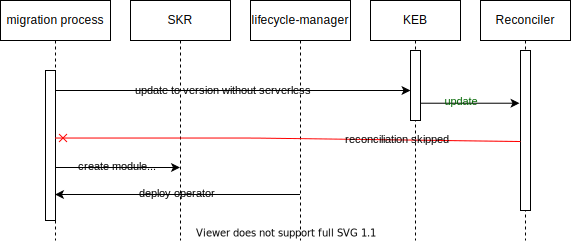

# Migration plan

Migration plan will be executed several times until all modules are moved from reconciler to lifecycle-manager. Is it possible to migrate several modules at once but it is not recommended. The migration plan uses `serverless` module as an example.

The prerequisite for migration is that lifecycle-manager is already activated in KCP for all the clusters (Kyma CRs are created in the KCP and SKR). Migration is split into 2 phases: enabling module for the new clusters and update existing clusters.

## Enable module for new clusters (first)

First step is to enable module installation with lifecycle manager for new clusters. Existing clusters are still managed by reconciler.
- Disable module template replication for existing clusters (moduleCatalog=false). This prevents users to add serverless module before it is disabled in the reconciler.
- New Kyma version is enabled in KEB (without serverless module). New clusters do not have serverless until customer enabled it in Kyma resource.
- Serverless operator(manager) is ready and module template is available in the fast/regular channel. 

## Update existing clusters

Migration can be stopped at any moment if any problem occurs. Not migrated clusters will still use serverless reconciler (old Kyma version with serverless)

1. Upgrade the clusters to the new Kyma version (without serverless) - from this point reconciler doesn't touch serverless resources.
2. Add module to Kyma CR in SKR with option to not copy default CR. Lifecycle manager will install serverless manager without starting module installation. Default CR creation is omitted for the case when we need different setting for different clusters (eg. trial / production). If default CR can be applied for all the clusters then module copy can stay enabled and the next step is not required.
3. Create CRD  and default CR for serverless manager in the SKR. CRD creation is optional - it can be skipped, but then migration script has to wait until liefecycle-manager installs it. Entire step can be skipped if the default module CR can be applied for all the clusters.

# Validation scenarios

The migration process should be resilient and validated against possible user actions that could cause problems. It is mainly about turning on and off the module that is being migrated:
- in the new cluster - OK (reconciler is already disabled for serverless)
- in the old (not migrated) cluster before migration script is executed - almost OK (if user adds serverless module manually it will work in parallel with reconciler)
- in the old cluster during migration - OK (reconciler is already disabled for serverless)
- in the old cluster after migration - OK (reconciler is already disabled for serverless)

Migration validation discovers only one challenge: it can become unstable if the user will add and remove module using Kyma CR in SKR before reconciler is disabled for that cluster. It is mitigated by disabling module template propagation for old clusters until migration is over.
