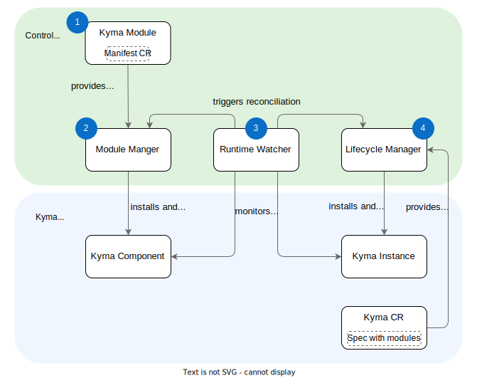

## Overview

The out-of-the-box Kyma offered a fixed set of mandatory preconfigured components whose development rhythm was synchronized and determined by the release schedule. With the modular approach, Kyma components become modules, each providing one functionality developed independently of the other ones. This approach also boosts Kyma’s extensibility and scalability. You can install and configure exactly the modules you want, making the installation very lightweight and adjusted to your business needs.  
Kyma uses three system components to support the modular approach: Module Manager, Lifecycle Manager, and Runtime Watcher.

## Kyma’s Modular Approach

## 1. Kyma Module

A Kyma module contains all information required to install and run the associated components in a Kyma runtime. One Kyma module can consist of one or more components.
Typically, a module operator manages the lifecycle of a module and reconciles the associated CRs.

In a Kyma module, the following assets are bundled into a single container image using the [OCI image specification](https://github.com/opencontainers/image-spec):

* One or more renderable Kubernetes manifests of the module, based on Kustomize and/or Helm
* A default configuration for module chart resource installation
* Optionally, further layers that can enhance, or be required by, the module operator.

> **TIP:** Learn how to [build a module](https://github.com/kyma-project/template-operator).

## 2. Module Manager

Module Manager installs, uninstalls, and manages the Kyma modules in a local (single cluster mode) or remote setup (in which one cluster acts as control plane). For example, it remotely manages and synchronizes Kyma module resources in the SAP Kyma Runtime, while the manifest is located in the control plane.

Module Manager retrieves the image layers from the specified image registry and processes the manifest resources by calling a rendering framework like Helm or Kustomize.

Finally, it deploys this resource along with a custom resource to track state changes. It ensures consistency both with a time-based reconciliation and by watching state changes of the deployed custom resource in Kyma runtime.

## 3. Runtime Watcher

> **NOTE:** For local (single-cluster) setups, the Runtime Watcher is not needed. You need Runtime Watcher only if you use a control plane that manages one or more other runtimes.

Runtime Watcher monitors the relevant module resources of the user’s Kyma runtime for configured changes, specified by the operator in the control plane, such as:

* Expected changes, like a Kyma user providing a configuration update to the module, which must lead to an update of related resources in the Kyma runtime.
* Unexpected changes, like an accidental creation, deletion, or modification, which must be reverted to recover the Kyma runtime to a healthy state.

For all such detected changes, Runtime Watcher triggers a reconciliation of the user’s Kyma runtime by propagating the desired changes to Module Manager and Lifecycle Manager.

## 4. Lifecycle Manager

Lifecycle Manager orchestrates the Kyma module operators to process their respective resources on the Kyma runtime. It also aggregates all module states into one easy-to-monitor resource, the `Kyma CR`, with the following strategies:

1. Generating the required Kyma module custom resources through a manifest, which starts the Kyma module processing in Module Manager.

2. Reconciling a Kyma custom resource for each Kyma runtime, indicating the consolidated status of all modules configured for that Kyma cluster.

Lifecycle Manager is also responsible for propagating updates from a module into the respective manifest through the ModuleTemplate. Whenever modules are updated and a new release is triggered, Lifecycle Manager propagates the correct upgrade information to the manifest, which in turn leads to updates in the runtime cluster.

The ModuleTemplate is a custom resource that is used by Lifecycle Manager as a scaffolding when initializing new modules. It is also used as a base output of the module bundling process inside the CLI.

Whenever a new module must be installable or registered in the ecosystem, you only have to apply a new ModuleTemplate with the necessary information to generate the module. Then, it is available for consumption in every runtime instance registered in the control plane.

For every new module, Lifecycle Manager tracks the available ModuleTemplates in different release configurations and makes them available in a catalog, which you can browse to see all available modules. This catalog is also synchronized into all runtime clusters, so you can enable modules as runtime administrators without needing access to the control plane.
