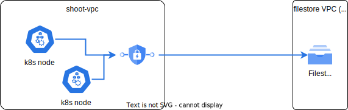
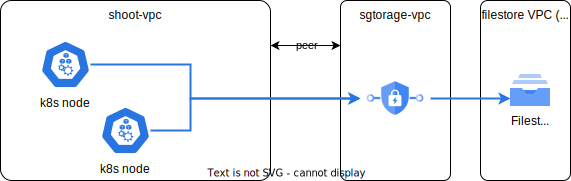

# Requirements

In Kubernetes, the need for ReadWriteMany (RWX) storage solutions arises from a variety of requirements that demand robust, scalable, and highly available shared storage. 

Some requirements collected from our customers:

1. High-Performance of writing small files: Rapidly write numerous small files (e.g., 3,000 files, 20KB each) within 30 seconds.
1. High-Availability: maintain file access during full availability zone outages.
1. Scalability: Scale storage capacity to accommodate over 1TB of data. Storage should expand automatically if needed.
1. Backup and restore: automatic backup and possibility to restore entire volume (disaster recovery) or certain folder
1. Encryption at rest.
1. Secure connection to the cluster

Development and operations related requirements:
1. Easy maintenance and should not require manual intervention for entire lifecycle. 
1. Mature and stable as it involves customer data durability.
1. Easy to protect from accidental (or intentional) damages caused by customer

# Implementation and commercialization options for NFS storage

We evaluated different possibilities how to shape the storage feature in Kyma Runtime. 
This is a list of evaluated options:
1. In-cluster component vs external service 
1. Own storage service vs using services offered by cloud providers
1. Dynamic provisioning vs static provisioning of volumes
1. Use shoot cluster VPC vs service VPC peered with cluster VPC
1. Manage the VPC for Kyma clusters explicitly instead of letting Gardener manage the IP ranges
1. Storage as separate product (BTP service) vs Kyma module

You can find a short summary of each option in the following sections. With the current knowledge **the recommended option is to use cloud provider NFS service with static provisioning in dedicated PVC (2b)**

## In-cluster component vs external service

There are few open source filesystem that we could operate ourselves. We were looking into [GlusterFS](https://github.com/gluster/glusterfs), [CephFS](https://github.com/ceph/ceph) with [Rook operator](https://github.com/rook/rook), [Longhorn](https://github.com/longhorn/longhorn), [OpenEBS](https://github.com/openebs/openebs) and few others from the [CNCF Cloud Native Storage category](https://landscape.cncf.io/card-mode?category=cloud-native-storage&grouping=category). We selected Rook operator for the PoC as it is the most stable project from the list (Graduated Project in CNCF landscape). 
The first impressions were very positive. Installation in the HA mode was smooth and automatic, and [performance tests](https://github.com/pbochynski/cloud-benchmark#sample-results-for-ceph-fs-and-efs-storage) showed good results especially for large number of small files. Unfortunately, we faced some issues running more extensive tests (like crashes, or going into read only mode). Probably we could overcome these problems, but without deep understanding of the underlying technology it is not a trivial task. Here is a short summary of the PoC:

**Pros:**
- one implementation suitable for all cloud providers
- best performance
- security - not exposed outside of the cluster

**Cons:**
- filesystem service runs in the cluster and can be affected by customer actions (also unintentional)
- complexity much higher than other solutions
- custom backup and restore solution has to be implemented
- lifecycle management can become a burden (upgrades, security patches, etc)
- requires up-skilling the team to effectively maintain the solution
- some instability reported for writing larger files
- failure to recover from Gardener cluster hybernation

**Decision: NO for in-cluster storage component due too many risks related to operations and possible data loss**

## Own storage service vs using services offered by cloud providers

With the decision that we want to keep storage service outside of the cluster we still have the options to build our own or use those from cloud providers. But building the own multitenant solution is even more complicated than running it in the cluster, so most of the cons from the previous sections are still applicable. Having that in mind we estimated that the cost and time of building such solution will be huge and not comparable to solution based on existing cloud storage services.

**Pros:**
- one implementation for all cloud providers
- consistent with already supported azure files
- not affected by issues on the customer cluster

**Cons:**
- time and cost to build a complete solution
- operating multitenant HA service is a challenge
- almost all cons reported for in-cluster component are valid (complexity, custom backup, lifecycle management, required skills and lack of experience)

**Decision: NO for building and running own storage service due to the fact such services already exist (each cloud provider offers one) and are offered at really low price**

## Dynamic provisioning vs static provisioning of volumes

Dynamic provisioning allows users to create persistent volume (PV) automatically when the new claim (PVC) is created. CSI driver for Google Filestore supports dynamic provisioning, but CSI driver for EFS doesn't. Dynamic provisioning looks more convenient for end-users and would be the good choice when the volume provisioning is handled by the Gardener control plane (like for Azure file storage). If the cloud storage is not natively supported by Gardener the code responsible for volume provisioning runs in the customer's cluster (CSI driver), and requires suitable credentials that allow to manage storage service instances. Kyma security model does not allow to share those credentials with customer as it introduces too many vulnerabilities we cannot mitigate. 

**Pros:**
- simple implementation: just install and configure CSI driver
- automatic storage instance provisioning (usable only with dynamic provisioning)

**Cons:**
- creating storage instances requires cloud provider credentials present in the cluster. Customers can get access to those credentials (they are cluster admins) and misuse them or even share them without any control. 
- different implementation for AWS and GCP
- [issues](https://cloud.google.com/filestore/docs/create-instance-issues#system_limit_for_internal_resources_has_been_reached_error_when_creating_an_instance) with private network quota for Filestore
- cleanup of backing NFS stores not guaranteed when in-cluster provisioning is used (CSI driver)
- more difficult to create clear backup and restore objects, as the provisioning is dynamic and it is not as clear on how to deal with backups and how to "target" them, e.g. based on name or UUID?

**Decision: NO for dynamic provisioning due to security issues with sharing cloud subscription credentials with customers**

## Create storage service in shoot VPC vs use dedicated VPC and peer it with shoot VPC

**Using shoot VPC**

**Pros:**
- simpler implementation (provisioning)

**Cons:**
- if clusters are deleted and created with different shoot name we can face [issues](https://cloud.google.com/filestore/docs/create-instance-issues#system_limit_for_internal_resources_has_been_reached_error_when_creating_an_instance) with private network quota for Filestore (it is not a common usage pattern)
- storage instances and private endpoints in the shoot subnet can block cluster de-provisioning (not a big deal as storage controller in the KCP should clean them up anyway)

**Using dedicated VPC**

**Pros:**
- we can keep stable VPC name to avoid [issues](https://cloud.google.com/filestore/docs/create-instance-issues#system_limit_for_internal_resources_has_been_reached_error_when_creating_an_instance) with private network quota for Filestore

**Cons:**
- dependency to VPC peering feature
- impossible in GCP, as transitive peering is not available. IPs from Google Filestore will be exposed to the target VPC, but not to any VPC peered to that target VPC.

**Decision: NO for using separate VPC for storage**

## Manage the VPC for Kyma clusters explicitly instead of letting Gardener manage the IP ranges

**Using single or persistent VPC for Kyma clusters**

**Pros:**
- Full control over the IP landscape
- Multiple clusters in a single VPC with full overview and associated control over addresses & firewall configurations
- Peering to Google managed service is easier and less likely to run into limitations, like Filestore peering limits
- Same VPC across regions. May have use-cases for inter-cluster communications.

**Cons:**
- Requires Kyma to take ownership of the VPC and manage things like CIDR allocations and firewall rules
- Requires Kyma to manage subnets
- Less isolation when multiple clusters are in the same VPC

**Decision: PENDING**

## Storage as separate product (BTP service) vs Kyma module

Going with static provisioning we discussed options to implement it a separate BTP service. Separating storage lifecycle from the runtime lifecycle brings some benefits but overall it introduces more problems than benefits.

**Pros:**
- easier pricing model (prices per plan)
- separated storage lifecycle from cluster lifecycle (reuse storage in the new cluster)

**Cons:**
- inconsistent with Azure implementation (storage class enabled natively in Gardener)
- not really independent service - can be used only with Kym (cross consumption not feasible without complex network management)
- complexity for the end user (we would need service instance and service binding that don't match abstractions for storage)
  
**Decision: NO for separate storage service in BTP**

# Summary

As of now (17.10.2023) the recommended solution would work as follows:
- user has to enable a Kyma module for NFS storage
- user configures storage type/size in the module CR
- in-cluster module operator installs proper CSI driver (native or generic NFS driver) and creates storage class
- central controller in the Kyma Control Plane watches storage CRs in SKRs and does the provisioning of storage instances in the cloud project using shoot cluster VPC and creates persistent volume in the cluster
