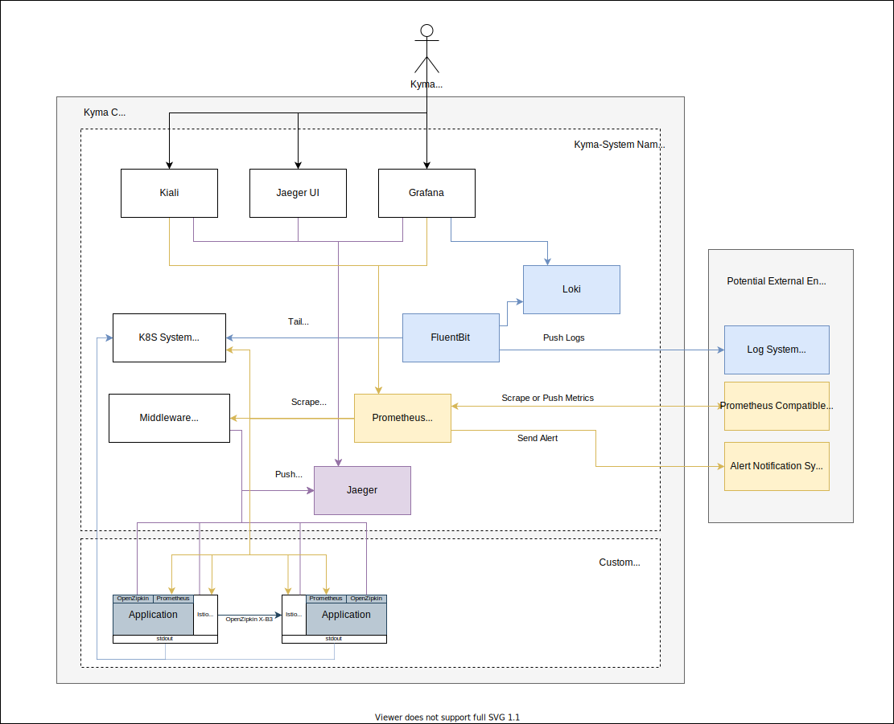

# Current Situation and Motivation

In the current shape of Kyma in 2021, the observability stack is focussing on providing opinionated solutions, working out of the box, to solve basic requirements for application operators. Consequently, it is not focussing on integration aspects in order to cover a broader and richer usage scenario.

In the diagram, you see that all three observability aspects (log, trace, metric) provide a preconfigured backend with visualisations. However, they don't provide a neutral and unified way to integrate backends outside of the cluster. The tracing stack provides no way to centrally push trace data to the outside. Logging can be configured much more flexibly and neutrally, however, the configuration must be done during installation so it isn't lost at the next Kyma upgrade process. Furthermore, it is not easy to use to mix and match different integrations, because you need to deal with one centralized configuration (the fluent-bit config).

Integration (and with that, changing the focus away from in-cluster backends) is the key to open up the stack for a broad range of use cases. Users can simply bring their own backends if they already use a commercial offering or run their own infrastructure. The data can be stored outside the cluster in a managed offering, shared with the data of multiple clusters, away from any tampering or deletion attempt of a hacker, to name just a few.

This concept proposes how to open up to those new scenarios by making integration possible at runtime in a convenient way. For that, it focuses on the logging scenario. The other data types will be included at a later time.

# Requirements

### Basic backend configuration
- Have a vendor-neutral agent layer that collects and ships the telemetry data, but does not permanently store it (as a backend)
- Support configuration of the selected agent at runtime (no need to run a Kyma upgrade process) in a scenario-focused approach
- Support multiple configurations at the same time in individual resources to enable easy activation of dedicated scenarios
- As a minimum, support one vendor-neutral input and output. It should be possible to chain your custom agent for specific conversions. For example, for traces, supporting the OLTP protocol will support most of the vendors already. Chaining a custom OpenTelemetry  Collector can do custom conversion to a specific protocol.
- Support all typical settings for the supported outputs of the used agent, do not hide or abstract them
- The agent must run stable at any time. Bad configuration must be prevalidated and rejected. Fast feedback is welcome.
- Secrets must be kept secret.

### Template definitions
- Have a mechanism to provide templates and best practices for typical scenarios, which can be instantiated at runtime
- Such template provides the same feature-richness as a configuration scenario
- If specific templates are bundled with Kyma, updates of a template in use must propagate to the actual agent configuration
  - Support placeholder definitions with default values and descriptions

### Template instantiation
- A template is instantiated by binding it to a secret that provides input for placeholders like URL and credentials. Alternatively, placeholders can be filled out with configMaps and static values.
  - The template validates whether all placeholders will be replaced with values.
- A template can be instantiated for a specific workload and/or namespaces only.

# Proposed Solution

The idea of the proposal is to introduce a preconfigured agent layer that's responsible for collecting all telemetry data. Those agents can be configured dynamically at runtime with different configuration scenarios, so that the agents start shipping the data to the configured backends. The dynamic configuration and management of the agent is handled by a new operator, which is configured using Kubernetes resources. The agents and the new operator are bundled in a new core package called `telemetry`. The existing Kyma backends and UIs will be just one possible solution that can be installed optionally and will stay in the existing modules like `logging`.

# Focus on Logging

While the section above was more general, the following proposal focuses on the logging aspect only. This is mainly to have an emerging approach and solve the most urgent topics first. Because logs have the longest tradition, everyone is used and expects to have solutions for logging in place.
The following documents outline which agent technology and which operator are used, and how the general API will look like.
