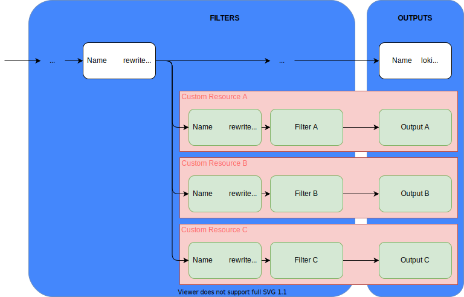
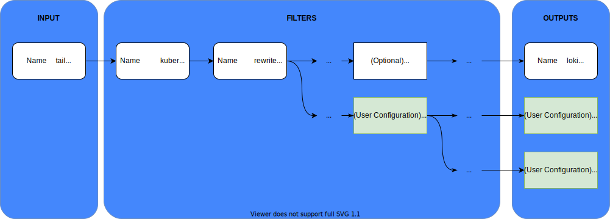

# Dynamic Fluent Bit Configuration

This document proposes and evaluates a valid design for a custom operator. It is needed to enable a dynamic in-cluster logging configuration with `Fluent Bit`, as outlined in [Spike: Dynamic configuration of logging backend #11105](https://github.com/kyma-project/kyma/issues/11105).

## Table of contents

- [Criteria](#criteria)
- [Proposal](#proposal)
  - [Architecture](#architecture)
  - [Workflow for the User](#workflow-for-the-user)
- [Overview log routing scenarios and input configuration](#overview-log-routing-scenarios-and-input-configuration)
- [Fluent Bit log routing](#fluent-bit-log-routing)
  - [Scenario 1: Tags managed by the telemetry operator](#scenario-1-tags-managed-by-the-telemetry-operator)
  - [Scenario 2: Managed tag per pipeline](#scenario-2-managed-tag-per-pipeline)
  - [Scenario 3: All Log Pipelines use the same base-tag](#scenario-3-all-log-pipelines-use-the-same-base-tag)
- [Fluent Bit input configuration](#fluent-bit-input-configuration)
  - [Setup 1: Managed Fluent Bit Daemon Set per Log Pipeline](#setup-1-managed-fluent-bit-daemon-set-per-log-pipeline)
  - [Setup 2: Dedicated input plugin per Log Pipeline](#setup-2-dedicated-input-plugin-per-log-pipeline)
  - [Setup 3: Single input plugin with buffered `rewrite_tag` filter per Log Pipeline](#setup-3-single-input-plugin-with-buffered-rewrite_tag-filter-per-log-pipeline)
  - [Setup 4: Shared input plugin](#setup-4-shared-input-plugin)

## Criteria
- Customers can place fluent-bit config snippets as k8s resource in any namespace.
- The customers' configuration must not be reset during reconciliation, even though the central configuration might be overwritten at any time.
- A new configuration is picked up dynamically without any user interaction (for example, no need that users restart pods).
- Have basic validation to give early feedback on errors, which supports debugging a startup problem.
- The proposal should be extensible to solve the same issue for OpenTelemetry collector.
- There's a way to provide the auth details for a backend config in a secure way.

## Proposal

### Architecture

To build the operator, we use an SDK for a quick and easy start-up, among other reasons. We decided to use [`kubebuilder`](https://github.com/kubernetes-sigs/kubebuilder), an upstream project of `Kubernetes`. `kubebuilder` provides the required features for our operator with the smallest overhead. In addition, this `kubebuilder` is also used in other parts of Kyma, ensuring consistent design.

An alternative for `kubebuilder` is the [`Operator-SDK`](https://github.com/operator-framework/operator-sdk) from `Red Hat`. `Operator-SDK` has similar features to the `kubebuilder`, with some additions like the integration of [`operatorhub`](https://operatorhub.io/). We decided against it because such features aren't needed for our purpose, and because it isn't an upstream project of Kubernetes.

To have a simple API, one `CRD` for Fluent Bit configuration is created. This CRD has a field that holds the status of the CR, called `Status`, as well as a struct of the type `LoggingConfigurationSpec`, called `Spec`, holding a list of configuration sections, called `Sections`. Each `Section` has a `content` attribute that holds a raw Fluent Bit configuration section. A `Section` can have optional `Files` and an `Environment`. `Files` are mounted into the Fluent Bit pods and can be referenced in configurations, for example, in Lua filters. The environment is a list of Kubernetes secret references.

Using this structure supports the full Fluent Bit syntax without needing to maintain new features of various plugins. Furthermore, the users get a clear overview of their sequence of applied filters and outputs. Using the Kyma documentation, we could also lead the users to think more in a way of pipelines, in such that they create one CR for each Fluent Bit pipeline.

<details>
<summary><b>Pipeline Overview</b> for User - Click to expand</summary>


</details>

We're proposing the following constraints for the custom operator:
- It doesn't support dynamic plugins that must be loaded into the Fluent Bit image.



1. The logs are fetched using a Fluent Bit, which is created by this custom operator. This INPUT tags all logs with the following tag scheme: `kube.<namespace_name>.<pod_name>.<container_name>`.
2. The logs are enriched with Kubernetes information using the `kubernetes` filter of Fluent Bit.
3. The filter `rewrite_tag` is used to split the pipeline:
   - The original logs are forwarded to the Kyma Loki backend.
   - Users can use the new copy with another tag and configure new filters and outputs with the provided CRD.

Using this approach, we avoid having an unused INPUT or other overhead.
If users want to use more than one pipeline for the log processing, they can use the 'rewrite_tag' filter on their pipeline to create more pipelines. Alternatively, they can configure an output plugin to process them with another log processor, as mentioned before.

Additionally, when creating a `CR`, a [webhook](https://book.kubebuilder.io/cronjob-tutorial/webhook-implementation.html) validates the correctness of the Fluent Bit configuration based on the Fluent Bit `dry-run` feature.

To actually apply the changes of the users, the operator creates or adapts the Config Map for Fluent Bit and restarts Fluent Bit by deleting the pods of the Fluent Bit deployment.

To make sure that the configuration by the users won't be overwritten by reconciliation, the basic configuration (`kubernetes` filter, `rewrite_tag`, etc.) is written into a Config Map. This Config Map is embedded by an `@INCLUDE` statement in the chart of this operator.

The following example demonstrates the CRD that will be used by the telemetry operator:

```YAML
kind: LogPipeline
apiVersion: telemetry.kyma-project.io/v1alpha1
metadata:
  name: ElasticService-instanceXYZ
spec:
  parsers: {}
  multilineParsers:
    - content: |
        # Example from https://docs.fluentbit.io/manual/pipeline/filters/multiline-stacktrace
        name          multiline-custom-regex
        type          regex
        flush_timeout 1000
        rule      "start_state"   "/(Dec \d+ \d+\:\d+\:\d+)(.*)/"  "cont"
        rule      "cont"          "/^\s+at.*/"                     "cont" 
  filters:
    - content: |
        name                  multiline
        match                 *
        multiline.key_content log
        multiline.parser      go, multiline-custom-regex
    - content: |
        # Generated from selector in LogPresetBinding
        Name    grep
        Match   *
        Regex   $kubernetes['labels']['app'] my-deployment 
    - content: |
        Name    record_modifier
        Match   *
        Record  cluster_identifier ${KUBERNETES_SERVICE_HOST}
  outputs:
    - content: |
        Name               es
        Alias              es-output
        Match              *
        Host               ${ES_ENDPOINT} # Defined in Secret
        HTTP_User          ${ES_USER} # Defined in Secret
        HTTP_Password      ${ES_PASSWORD} # Defined in Secret
        LabelMapPath       /files/labelmap.json
  files:
    - name: labelmap.json
      content: |
      {
          "kubernetes": {
            "namespace_name": "namespace",
            "pod_name": "pod"
          },
          "stream": "stream"
      }
  secretRefs:
    - name: my-elastic-credentials
      namespace: default
    - name: ElasticService-static # Created by the Telemetry Operator to store static values from the LogPresetBinding
      namespace: default
```

The CRD contains a separate section for the different parts for the Fluent Bit configuration. The operator validates the configuration and merges static parts like predefined inputs, parsers or filters.

### Workflow for the User

To configure Fluent Bit, the user must create a new CR regarding to the CRD of this operator. Then, this operator will notice the new or changed CR, and will create or update a Config Map for Fluent Bit. Before the Config Map is applied, the operator uses the `dry-run` feature of Fluent Bit to validate the new configuration. If the check was successful, the new Config Map is applied and Fluent Bit is restarted.

## Overview Log routing scenarios and input configuration

The possible log routing scenarios offer the following combinations with the Fluent Bit input configurations:

|                 | Scenario 1 | Scenario 2 | Scenario 3 |
|-----------------|------------|------------|------------|
| Setup 1         | x          | x          | x          |
| Setup 2         | x          | x          |            |
| Setup 3         | x          | x          |            |
| Setup 4         |            |            | x          |

The following sections describe the details of the log routing scenarios and input configurations.
For details, see the [comparison with different scenarios of log pipeline routing](./07-multiple-logpipeline-investigation.md).

After trying out various possibilities of log pipeline, we decided to choose go with [Setup 3c ](./07-multiple-logpipeline-investigation.md/#setup-3c) for following reasons:
1. In the event of failure of one output, fluent-bit would still push logs to other output.
2. The rewrite tag with filesystem buffer enables the logs to buffered as chunks in case of failure of one outputs.

however, in case of failure of output for prolonged period of time and the filesystem buffer being full, there is loss of logs seen.

We still have to decide how the rewrite tag should be configured. There are following proposals:
-  The users configure it themselves if needed. The users need documentation how to use rewrite tags when logs must be sent to multiple logging backends, along with an example how to do it.

- The rewrite tag, along with name, is configured dynamically when the user creates a new pipeline.

## Fluent-Bit Log Routing

The Log Pipeline CRD enables the user to define filter and output elements of a Fluent Bit pipeline. Therefore, a tag that can be consumed by user-defined pipeline elements must be provided by Kyma (either the static Fluent Bit configuration or the telemetry operator). The following section describes the different options to provide a log stream under a specific tag.

Log pipelines must be isolated in a way that a dysfunctional pipeline doesn't affect the availability of other pipelines; for example, when a pipeline becomes unavailable by an unavailable backend or faulty configuration.

The following requirements for the telemetry operator should be considered when choosing a sufficient Fluent Bit configuration:
* Fluent Bit pods and the used image should be managed by Kyma.
* User-provided configuration parts should be as close as possible to the Fluent Bit configuration format.
* Filters can be used for the following purposes:
  * Parse workload-specific log formats (for example, multi-line exceptions)
  * Include or exclude parts of the logs (ship only a specific namespace to a backend)
  * Prepare the log metadata to comply with the backend's requirements (de-dotting for Elastic)

### Scenario 1: Tags managed by the telemetry operator

Properties:
* The user-defined Log Pipeline elements must not contain any "match" attributes.
* Pipeline elements that emit new tags (for example, `rewrite_tag` filters) must not be used.
* The telemetry operator adds a "match" attribute to all filters and outputs.

Advantages:
* Full control over resource consumption because no additional buffers can be created.

Disadvantages:
* Design goal to allow pasting existing Fluent Bit config samples is partially lost.

### Scenario 2: Managed tag per pipeline

Properties:
* The telemetry operator provides a specific tag for each Log Pipeline that must be consumed by the pipeline sections.
* There is a defined way to consume the operator-provided log stream (for example, a tag placeholder or documented naming pattern).
* The Log Pipeline can emit new tags using the `rewrite_tag` filter.

Advantages:
* There's full flexibility to use all Fluent Bit concepts for the user.
* The "contract" gives flexibility to change the implementation afterwards (for example, switch to an own input per pipeline or even an own Daemon Set).
* We can describe complex pipelines and thus reduce the overall resource consumption.
 
Disadvantages:
* Potential overhead because complex pipelines must be split into multiple simple pipelines, each having its own buffer.
* Users can increase the resource consumption by adding `rewrite_tag` filters with a buffer.

### Scenario 3: All Log Pipelines use the same base-tag

Properties
* Current state of telemetry chart (2022-04-12).
* All Log Pipelines subscribe the `kube.*` tag using the `match` property.

Advantages:
* Additional filters can be injected to any pipeline; for example, to modify the default Loki output.
* Low resource consumption, but user has the control to add additional buffers.

## Fluent Bit input configuration

The described scenarios allow different Fluent Bit setups. This section describes different options and their compatibility with Scenario 1-3.

### Setup 1: Managed Fluent Bit Daemon Set per Log Pipeline

Properties:
* The telemetry operator creates a dedicated Fluent Bit Daemon Set per Log Pipeline.
* All Daemon Sets have configured the same input and Kubernetes filter sections.

Advantages:
* Best possible isolation between different pipelines.
* Support for custom output plugins might be added by specifying a dedicated Fluent Bit image.
 
Disadvantages:
* Highest resource consumption.
* Telemetry operator must manage the Daemon Sets and not only Config Maps.
* Impossible to inject filters to existing pipelines.
 
### Setup 2: Dedicated input plugin per Log Pipeline

Properties:
* The telemetry operator creates a new tail input with Kubernetes filter for every Log Pipeline.

Advantages:
* Expected good isolation between different pipelines. Details have to be evaluated.

Disadvantages:
* Potential resource overhead through additional buffer requirement.
* It is not possible to inject filters to existing pipelines.

### Setup 3: Single input plugin with buffered rewrite-tag filter per Log Pipeline

Properties:
* The Fluent Bit setup has a single tail input plugin with Kubernetes filter.
* Each Log Pipeline gets its own log stream, provided by a `reqrite_tag` filter.

Advantages / Disadvantages:
* Isolation and resource consumption behaviour under different buffer settings has to be evaluated.

### Setup 4: Shared input plugin

Properties:
* The static part of the Fluent Bit configuration contains a shared tail input plugin and Kubernetes filter.
* All Log Pipelines can access the given input by consuming a predefined tag.

Advantages:
* No additional implementation effort required.
* Single buffer for the input plugin.
* Users can add additional filters or parsers to the default Loki pipeline.

Disadvantages:
* A dysfunctional output stalls all pipelines (no isolation).
