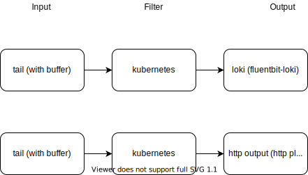
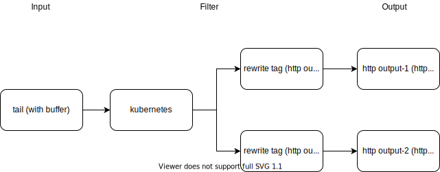
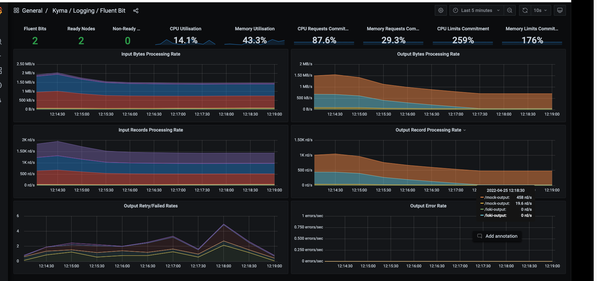
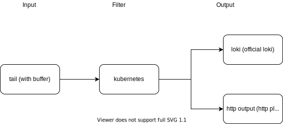
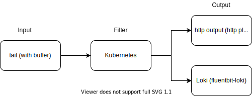

# Objective

The telemetry operator comes with a pipeline configured to push logs to Loki. Additionally, Kyma users can define their own pipeline and push the logs to their own logging backend.

This document investigates the side effects that may come up when, for example, the logging backend defined by users stops working.

## Basic Setup

The investigated configuration uses the `filesystem buffering`. When one of the log pipeline outputs fails, the logs are buffered on the filesystem. In contrast, the `in-memory` buffer has the disadvantage that if the Fluent Bit Pod is restarted, logs can be lost. During the test, we referred to the Fluent Bit knowledge article about [Buffering & Storage](https://docs.fluentbit.io/manual/administration/buffering-and-storage).

The setup consisted of the following items:
1. Kyma with telemetry operator
2. Two outputs, deployed in the Kyma cluster:
    - Loki, which comes with Kyma
    - [Http output](./assets/logpipeline-investigation/mock-server.yaml)
3. [Log generator daemon set](./assets/logpipeline-investigation/log-generator.yaml) to generate a huge amount of logs to fill the filesystem buffer faster
4. A [Function](./assets/logpipeline-investigation/func.js) to check if the logs are being delivered when one of the outputs is having an outage
5. To simulate outage, the port of the service of the output was changed so that the DNS resolution keeps working but logs won't be delivered.

Fluent Bit behaves differently for `in-memory` buffer and `filesystem` buffer: With `in-memory` buffer, the input is paused if an output is having an outage. With `filesystem` buffer, the logs are still read by the tail plugin and stored in the filesystem buffer until the output is available again. However, logs are dropped if the fileystem buffer is full.

## Test Cases

### Setup 1
This was not tested because of high resource overhead and increased complexity of the implementation of the telemetry operator.


### Setup 2



Setup:
- Two inputs and two outputs (Loki (grafana-loki plugin) and http output (http plugin)) without rewrite tags
- Two log pipelines: 
  - [Loki](./assets/logpipeline-investigation/setup-2/loki.yml)
  - [Http output](./assets/logpipeline-investigation/setup-2/mock-server.yml)
- [telemetry config](./assets/logpipeline-investigation/setup-2/telemetry-config)


Result
- Each pipeline has its own fileystem buffer.
- When both outputs are having outage, both tail plugins are losing logs. The buffer in the tail plugin stores the latest logs, but the amount of logs is different.
### Setup 3a


Setup:
1. One input with two outputs (Loki (grafana-loki plugin) and Http output (http plugin)) with rewrite tags (with filesystem buffer)
2. Two log pipelines:
   - [Loki](./assets/logpipeline-investigation/setup-3a/loki.yml)
   - [Http output](./assets/logpipeline-investigation/setup-3a/mockserver.yml)


Result:
- Output chunking keeps 150M of newest data.
- The tail plugin sends the data to the next phase of the pipeline (filter plugin). If the output is not working, only the filesystem buffer at the rewrite tag is filled and the tail plugin buffer isn't filled.
- When the filesystem buffer is full, error logs state this fact, and that the old logs are discarded.
    ```unix
    [2022/04/21 14:38:23] [error] [input:emitter:log_emitter] error registering chunk with tag: log_rewritten
    [2022/04/21 14:38:24] [error] [input chunk] chunk 1-1650551903.999375896.flb would exceed total limit size in plugin http.1
    ```
- When the Grafana-Loki plugin is stopped, it stops all the pipelines including http output, even though that was working fine.
- When http output was having an outage, the logs were still shipped to Loki.


### Setup 3b

Setup:
1. One input with two outputs (http output-1 and http output-2) with rewrite tags
2. Two log pipelines:
   - [Http output-1](./assets/logpipeline-investigation/setup-3b/mockserver-1.yml)
   - [Http output-2](./assets/logpipeline-investigation/setup-3b/mockserver-2.yml)


Result:
- When both outputs are having an outage, the filesystem buffer was filled and eventually the Fluent Bit Pod was crashing with error code `500` (most probably because of CPU throttling).
- Tail plugin kept pushing logs to the rewrite filesystem buffer, and they were eventually lost.

### Setup 3c

Setup:
1. One input with two outputs (Loki (Loki plugin), and http output (http plugin)) with rewrite tags
2. Two log pipelines:
   - [Loki](./assets/logpipeline-investigation/setup-3c/loki.yml)
   - [Http output](./assets/logpipeline-investigation/setup-3c/mock-server.yml)


Result:
- Http output was having an outage. The Loki output kept working.
- The chunks in the `filesystem buffer` are rolled: Old chunks are discarded; new ones created.
- When Loki output was having an outage, the http output kept working.




### Setup 3d
Setup:
1. One input with two outputs (Loki (Loki plugin), and http output (http plugin)) without rewrite tags
2. Two log pipelines:
   - [Loki](./assets/logpipeline-investigation/setup-3d/loki.yml)
   - [Http output](./assets/logpipeline-investigation/setup-3d/mock-server.yml)



Result:
- Http output was having an outage. This led to the filling of the tail filesystem buffer.
- After the tail plugin filesystem buffer was full, it kept reading.
- The chunks in the tail plugin filesystem buffer are rolled: Old chunks are discarded; new ones created.
- Loki output stopped working as well.
- The logs are stored in filesystem buffer before applying the Kubernetes filter. If the Pod has been terminated before the logs have been read from the filesystem again for next stage of pipeline processing, there is a risk that the Kubernetes metadata of the logs can't be fetched.


A known [Fluent Bit GitHub issue](https://github.com/fluent/fluent-bit/issues/4373) describes the same problem.

### Setup 4


Setup:
1. One input with two outputs (limiting the maximum number of chunks in the `filesystem` buffer) without rewrite tags
2. Two log pipelines:
   - [Loki](./assets/logpipeline-investigation/setup-4/loki.yaml)
   - [Http output](./assets/logpipeline-investigation/setup-4/mockserver.yml)

Result:
- When one of the outputs is having an outage, the filesystem buffer is filled up and only keeps 150M of latest data (old data is discarded first). Eventually, when the filesystem buffer at tail plugin is full, the output plugin for Loki stops as well.
- When both outputs are having an outage, the tail plugin is stopped after filling the filesystem buffer, even though the buffer was not completely full (104M/150M).

## Summary
We performed various tests and found that with filesystem, buffering (through rewrite_tag filter) is necessary to prevent loss of logs when fluent-bit pod is restarted. Additionally, when one of the outputs is having an outage, the logs are still streamed to the other output. However, loss of logs cannot be prevented completely: If the buffer is filled up, Fluent Bit keeps only the latest logs.

Additionally, we tried the following scenarios:
1. With two inputs and two outputs and having `storage.max_chunks_pause on`. This option, as mentioned in [documentation](https://docs.fluentbit.io/manual/administration/buffering-and-storage#input-section-configuration), did not apply to input filters. The Fluent Bit did not recognize this option and the Pod did not start. However, applying the setup to the service section did not have any affect.

