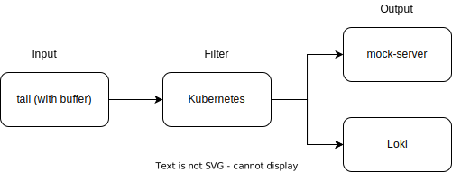
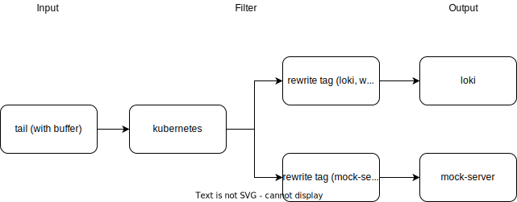

# Objective

The telemetry operator comes with a pipeline configured to push logs to Loki. Additionally, Kyma users can define their own pipeline and push the logs to their own logging backend.

This document investigates the side effects that may come up when, for example, the logging backend defined by  user stops working.

## Setup

The investigated configuration uses the `filesystem` buffer. When one of the log pipeline outputs fails, the logs are buffered on the file system. In contrast, the `in-memory` buffer has the disadvantage that if the Fluent Bit Pod is restarted, logs can be lost. During the test, we referred to the Fluent Bit knowledge article about [Buffering & Storage](https://docs.fluentbit.io/manual/administration/buffering-and-storage).

Setup consisted of following items
1. Kyma with telemetry operator
2. Two outputs were deployed in the kyma cluster
    - Loki, which comes with Kyma
    -[Mock server](./assets/logpipeline-invstigation/mock-server.yaml)
3. [Log generator daemon set](./assets/logpipeline-invstigation/log-generator.yaml) to generate a huge amount of logs to fill the buffer faster
4. A [Function](./assets/logpipeline-invstigation/func.js) to check if the logs are being delivered when one of the outputs is down
5. To simulate failures the port of the service was changed so that dns resolution would still work but logs wont be deliverd.

## Test Cases

### Case 1


Setup:
1. One input with two outputs (limiting the maximum number of chunks in the `filesystem` buffer) without rewrite tags
2. Two log pipelines:
   - [Loki](./assets/logpipeline-invstigation/case-1/loki.yaml)
   - [Mock server](./assets/logpipeline-invstigation/case-1/mockserver.yml)

Result:
- When one of the outputs is down, the filesystem buffer is filled up and only keeps 150M of latest data (old data is discarded first). Eventually, when the buffer at tail plugin is full, the output plugin for Loki stops as well.
- When both outputs are down, the tail plugin is stopped after filling the buffer, even though the buffer was not completely full (104M/150M).

### Case 2


Setup:
1. One input with two outputs (Loki (fluentbit-loki plugin) and mock server) with rewrite tags
2. Two log pipelines:
   - [Loki](./assets/logpipeline-invstigation/case-2/loki.yaml)
   - [Mock server](./assets/logpipeline-invstigation/case-2/mockserver.yml)


Result:
- Output chunking keeps with 150M of newest data.
- The tail plugin sends the data to the next phase of the pipeline (filter plugin). If the output is not working, only the buffer at the rewrite tag is filled and the tail plugin buffer isn't filled.
- When the buffer is full, error logs state this fact, and that the old logs are discarded.
    ```unix
    [2022/04/21 14:38:23] [error] [input:emitter:log_emitter] error registering chunk with tag: log_rewritten
    [2022/04/21 14:38:24] [error] [input chunk] chunk 1-1650551903.999375896.flb would exceed total limit size in plugin http.1
    ```
- When the Grafana-Loki plugin is stopped, it stops all the pipelines including mock server, even though that was working fine.
- When mock server was down, the logs were still shipped to Loki.


### Case 3

Setup:
1. One input with two outputs (mock server and mock server) with rewrite tags
2. logpipelines: [mockserver-1](./assets/logpipeline-invstigation/case-3/mockserver-1.yml), [mockserver-2](./assets/logpipeline-invstigation/case-3/mockserver-2.yml)


Result:
- When both outputs are down, the buffer was filled and eventually the Fluent Bit Pod went down with error code `500` (most probably because of CPU throttling).
- Tail plugin kept pushing logs to the rewrite buffer, and they were eventually lost.

### Case 4
Setup:
1. One input with two outputs (Loki with the official Loki plugin, and mock server) with rewrite tags
2. Two log pipelines:
   - [Loki](./assets/logpipeline-invstigation/case-4/loki.yml)
   - [Mock server](./assets/logpipeline-invstigation/case-4/mock-server.yml)


Result:
- Mock server was down. The Loki output kept working.
- The chunks in the `filesystem` buffer are rolled: Old chunks are discarded; new ones created.
- When Loki output was down, the mock server output kept working.


### Case 5
Setup:
1. One input with two outputs (Loki with the official Loki plugin, and mock server) without rewrite tags
2. Two log pipelines:
   - [Loki](./assets/logpipeline-invstigation/case-5/loki.yml)
   - [Mock server](./assets/logpipeline-invstigation/case-5/mock-server.yml)


Result:
- Mock server was down. This led to the filling of the tail buffer.
- After the tail plugin buffer was full, it kept reading.
- The chunks in the tail plugin buffer are rolled: Old chunks are discarded; new ones created.
- Loki output stopped working as well.

A known [Fluent Bit GitHub issue](https://github.com/fluent/fluent-bit/issues/4373) describes the same problem.


### Case 6
Setup:
- Two Inputs and two outputs (Loki (Fluent Bit-Loki plugin) and mock server) without rewrite tags

Result
- Each pipeline has its own buffer.
- When both outputs are stopped, both tail plugins are losing logs. They keep the latest logs, but the amount of logs is different.


## Summary
We performed various tests and found that a buffer with filesystem (through rewrite_tag filter) is necessary to prevent loss of logs when one of the output is down. However loss of logs cannot be prevented completely, if the buffer is filled up then fluentbit keeps only the latest logs.


