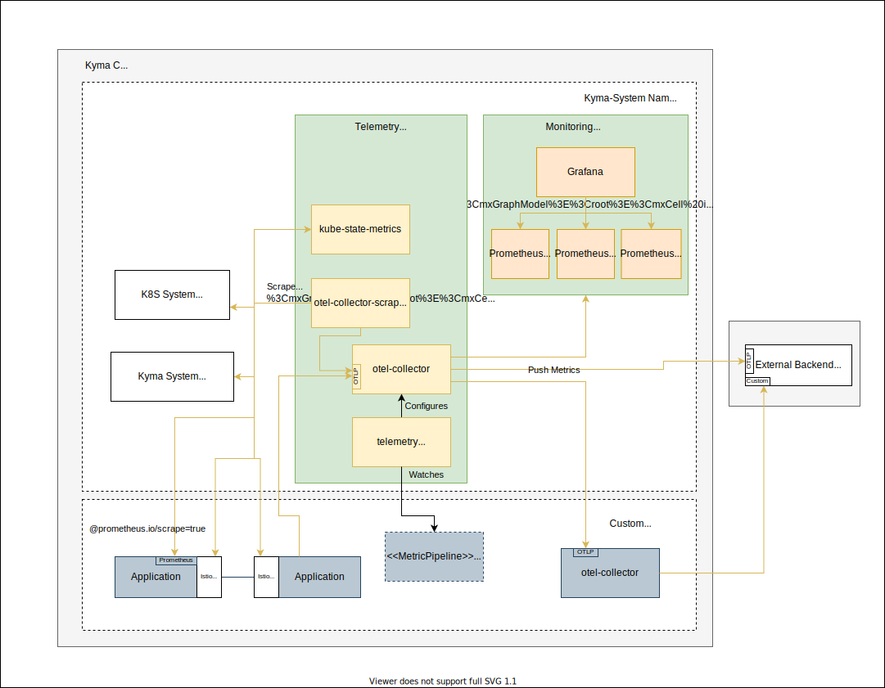

# Groundwork

## Current Situation and Motivation

In the current shape of Kyma in 2022, the monitoring stack is focussing on providing a lightweight and opinionated monitoring solution, working out of the box, to solve basic requirements for application operators like instant troubleshooting. Consequently, it is not focussing on integration aspects in order to cover a broader and richer usage scenario.

The diagram shows that the current solution is based on a preconfigured Prometheus operator providing exporter components, and a Prometheus instance acting as collector and backend. On top, Grafana visualizes the data. However, the current setup does not support a neutral and unified way to integrate backends outside of the cluster.

Integration (and with that, changing the focus away from in-cluster backends) is the key to open up the stack for a broad range of use cases. Users can simply bring their own backends, if they already use a commercial offering or run their own infrastructure. The data can be stored outside the cluster in a managed offering, shared with the data of multiple clusters, away from any tampering or deletion attempt of a hacker, to name just a few advantages.

This concept proposes how to open up to those new scenarios by making integration possible conveniently at runtime, leveraging vendor-neutral protocols.

## Requirements

### General
- Users need a way to outstream metrics into multiple external systems. There will be no production-ready solution provided by Kyma, so user need to integrate with something.
- Users need a way to add custom metrics from users' workload to that outstreams. Support for custom metrics is a major requirement for a monitoring solution.
- Users need a way to influence what metrics are outstreamed. External systems will have a price dependent on load. Not relevant metrics must be droppable.

### Basic backend configuration
- Have a vendor-neutral agent layer that collects and ships metrics, but does not permanently store it (as a backend).
- The agent must run stable at any time when using the typical settings. Bad configuration must be prevalidated and rejected. Fast feedback is welcome.
- Outputs
  - Support configuration of backends and outputs at runtime (no need to run a Kyma upgrade process) in a scenario-focused approach.
  - Support multiple configurations at the same time (in individual Kubernetes resources) to support easy activation of dedicated scenarios.
  - As a minimum, support one vendor-neutral output. It should be possible to chain your custom agent for specific conversions. For example, supporting the OLTP protocol will support most of the vendors already. Chaining a custom OpenTelemetry  Collector can do custom conversion to a specific protocol.
  - Support typical settings for the supported outputs in a convenient way.
  - Non-typical settings should be possible as well, leaving the agent in an unsupported mode.
  - Secrets must be kept secret.
  - Secret bindings for the SAP BTP Operator must be supported, including secret rotations.
  - Scenarios and Pipelines must be isolated and have their own buffer management. If one backend is in a bad shape and cannot process any data anymore, data should still continue to be pushed to other backends.
  - Typical auth mechanisms for the integration must be supported, especially client-certificate-based solutions.
- Inputs
  - Inputs are predefined and should be based on the pull- and push-based approach. In best case, the users do not need to differentiate between the two types as they bring no semantical difference.
  - The input should be filterable on Namespace or workload level; ideally, metrics of uninteresting components should not create a resource footprint in the pipeline.
- Filter
  - Filtering of data (like dropping metrics of kyma-system components) must be possible.

### Pre-integration
- Kyma system components are pre-integrated, so the predefined input in the agent serves them by default.
- Typical Kubernetes metrics are pre-integrated, including basic node and kube-state-metrics. Users might need this data for their own troubleshooting.
- Istio metrics are pre-integrated and can be easily filtered and de-selected.

### Ease of integration
- It should be easy to integrate metrics of a workload - either with a push approach to a well-known internal URL in a vendor-neutral protocol, or with a pull approach by annotating the workload.
- Envoy metrics should be collected instantly (without user action).

### Local backend
- Installing the monitoring component ships managed Prometheus instances.
- The setup is not meant to be HA and scalable.
- The setup should handle overload properly, so that it is always in a functional state.
- Multiple instances might be used for the different scenarios like system, istio, and custom. That will assure reliability of one scenario if the other is in trouble.

## General Idea

The idea of the proposal is to introduce a preconfigured agent layer that's responsible for collecting metric data only. Those agents can be configured dynamically at runtime with different configuration scenarios, so that the agents start shipping the data to the configured backends. The dynamic configuration and management of the agent is handled by a new operator, which is configured using Kubernetes APIs. The agent and the new operator are bundled in a new core package called `telemetry`. The existing Kyma backends and UIs will be just one possible solution that can be installed optionally and will stay in the existing modules like `monitoring`.

