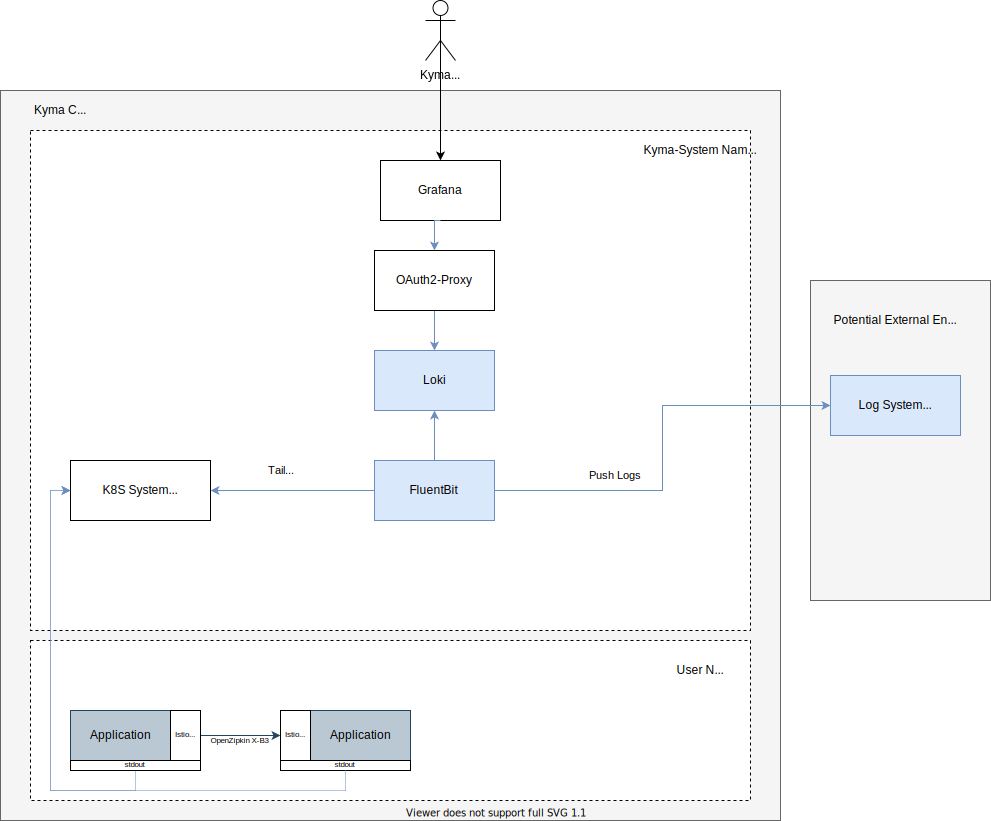

# Groundwork

## Current Situation and Motivation

In the current setup, all three observability aspects (log, trace, metric) provide a preconfigured backend with visualisations. However, they don't provide a neutral and unified way to integrate backends outside of the cluster.

The tracing stack does not support centrally pushing trace data to the outside.  Logging can be configured much more flexibly and neutrally. However, users must apply the configuration during installation; otherwise it's lost at the next Kyma upgrade process. Furthermore, it is hard to mix and match different integrations, because you must deal with one centralized configuration (the Fluent Bit config).

As outlined in the [general strategy](../strategy.md), integration (and with that, changing the focus away from in-cluster backends) is the key to open up the stack for a broad range of use cases. Users can simply bring their own backends if they already use a commercial offering or run their own infrastructure. The data can be stored outside the cluster in a managed offering, shared with the data of multiple clusters, away from any tampering or deletion attempt of a hacker, to name just a few.

This concept proposes how to open up to those new scenarios by supporting convenient integration at runtime.

## Requirements

### Basic backend configuration
- Have a vendor-neutral agent layer that collects and ships the telemetry data, but does not permanently store it (as a backend)
- Support configuration of the selected agent at runtime (no need to run a Kyma upgrade process) in a scenario-focused approach
- Support multiple configurations at the same time in individual resources to enable easy activation of dedicated scenarios
- As a minimum, support one vendor-neutral input and output. It should be possible to chain your custom agent for specific conversions. For example, for traces, supporting the OLTP protocol will support most of the vendors already. Chaining a custom OpenTelemetry  Collector can do custom conversion to a specific protocol.
- Support all typical settings for the supported outputs of the used agent, do not hide or abstract them
- The agent must run stable at any time. Bad configuration must be prevalidated and rejected. Fast feedback is welcome.
- Secrets must be kept secret.
- Scenarios/Pipelines need to be isolated and have it's own buffer management. If a backend is in a bad shape and cannot process any data anymore, data should still continue to be pushed to other backends
- Typical auth mechanisms for the integration must be support, especially also client certificate based solutions
- For logging: de-dotting for elasticsearch must be possible
- Filtering of unrelevant data (like dropping logs of kyma-system namespace) must be possible

### Template definitions
- Have a mechanism to provide templates and best practices for typical scenarios, which can be instantiated at runtime
- Such template provides the same feature-richness as a configuration scenario
- If specific templates are bundled with Kyma, updates of a template in use must propagate to the actual agent configuration
  - Support placeholder definitions with default values and descriptions

### Template instantiation
- A template is instantiated by binding it to a secret that provides input for placeholders like URL and credentials. Alternatively, placeholders can be filled out with configMaps and static values.
  - The template validates whether all placeholders will be replaced with values.
- A template can be instantiated for a specific workload and/or Namespaces only.

### Local backend
- Kyma will provide a blueprint based on Helm for installing the typical Loki stack as example.
- The setup is not meant to be HA and scalable.

## Proposed Solution

The proposal introduces a new preconfigured agent layer that's responsible for collecting all telemetry data. Users can configure those agents dynamically at runtime with different configuration scenarios, so that the agents start shipping the data to the configured backends. The dynamic configuration and management of the agent is handled by a new operator, which is configured with Kubernetes resources. The agents and the new operator are bundled in a new core package called `telemetry`. The existing Kyma backends and UIs will be just one possible solution to integrate with. The user can install them manually following a blueprint.

