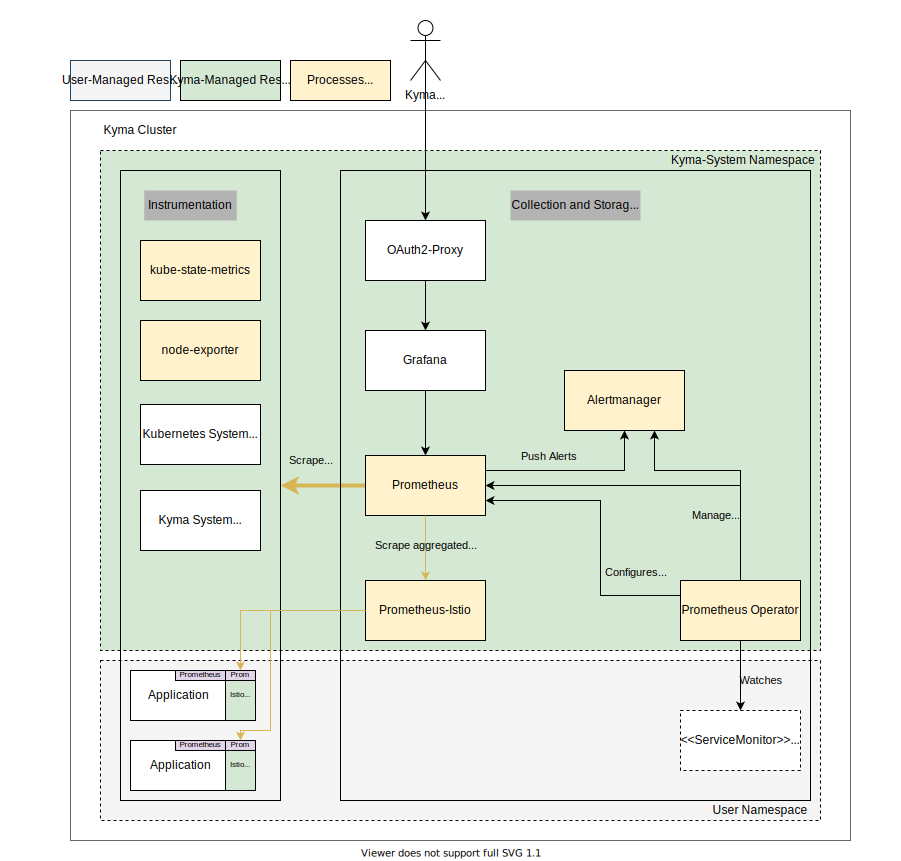

# Configurable Monitoring: Groundwork

## Current Situation and Motivation

The diagram shows that the current solution is based on a preconfigured Prometheus operator providing exporter components, and a Prometheus instance acting as collector and backend. On top, Grafana visualizes the data. However, the current setup does not support a neutral and unified way to integrate backends outside of the cluster at runtime.

As outlined in the [general strategy](../strategy.md), integration (and with that, changing the focus away from in-cluster backends) is the key to open up the stack for a broad range of use cases. Users can simply bring their own backends, if they already use a commercial offering or run their own infrastructure. To name just a few advantages, the data can be stored outside the cluster in a managed offering, shared with the data of multiple clusters, and kept away from any tampering or deletion attempts by hackers.

This concept proposes how to open up to those new scenarios by supporting convenient integration at runtime, leveraging vendor-neutral protocols.

## Requirements

### General
- Users need a way to outstream metrics into multiple external systems. There will be no production-ready backend provided by Kyma, so users must integrate with something.
- Users need a way to add custom metrics from users' workload to that outstreams. Support for custom metrics is a major requirement for a monitoring solution.
- Users need a way to influence what metrics are outstreamed. External systems will have a price dependent on load. Not relevant metrics must be droppable.
- Users can opt out of the topic at any time by bringing there own agent technology.

### Basic backend configuration
- Have a vendor-neutral layer of agents/gateways that collects and ships metrics, but does not permanently store them.
- The agents/gateways must run stably at any time when using the typical settings. Bad configuration must be prevalidated and rejected. Fast feedback is welcome.
- Outputs
  - Support configuration of backends and outputs at runtime (no need to run a Kyma upgrade process) in a scenario-focused approach.
  - Support multiple configurations at the same time (in individual Kubernetes resources) to support easy activation of dedicated scenarios.
  - As a minimum, support one vendor-neutral output. It should be possible to chain your custom collector for specific conversions. For example, supporting the OLTP protocol will support most of the vendors already. Chaining a custom OpenTelemetry Collector can do custom conversion to a specific protocol.
  - Support typical settings for the supported outputs in a convenient way.
  - Non-typical settings should be possible as well, leaving the collector in an unsupported mode.
  - Secrets must be kept secret.
  - Secret bindings for the SAP BTP Operator must be supported, including secret rotations.
  - Scenarios must be isolated and have their own buffer management. If one backend is in a bad shape and cannot process any data anymore, data should still continue to be pushed to other backends.
  - Typical auth mechanisms for the integration must be supported, especially client-certificate-based solutions.
- Inputs
  - Inputs are predefined and should be based on the pull- and push-based approach. In best case, the users do not need to differentiate between the two types as they bring no semantical difference.
  - The input should be filterable on Namespace or workload level; ideally, metrics of uninteresting components should not create a resource footprint in the pipeline.
- Filter
  - Filtering of data (like dropping metrics of kyma-system components) must be possible.

### Pre-integration
- Kyma system components are pre-integrated, so the predefined input to the gateway serves them by default.
- Typical Kubernetes metrics are pre-integrated, including basic node and kube-state-metrics. Users might need this data for their own troubleshooting.
- Istio metrics are pre-integrated and can be easily filtered and de-selected.

### Ease of integration
- It should be easy to integrate metrics of a workload - either with a push approach to a well-known internal URL in a vendor-neutral protocol, or with a pull approach by annotating the workload.
- Envoy metrics should be collected instantly (without user action).

### Local backend
- Kyma will provide a blueprint based on Helm for installing the kube-prometheus-stack.
- The setup is not meant to be HA and scalable.

## Proposed Solution

The proposal introduces a new preconfigured agents/gateway layer that's responsible for collecting and dispatching metric data only. Users can configure those agents/gateways dynamically at runtime with different configuration scenarios, so that the agents/gateways start shipping the data to the configured backends. The dynamic configuration and management of the new components is handled by a new operator, which is configured using Kubernetes APIs. The new operator is bundled in a new core package called `telemetry`. The existing Kyma backends and UIs will be just one possible solution to integrate with. They can be installed manually by the user following a blueprint.

