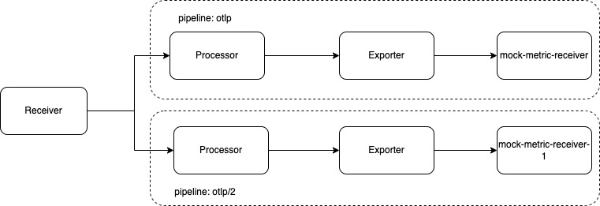

# Multiple pipeline tests
We want to test and understand the behavior of the metrics gateway with multiple pipelines.

## Setup
The setup was performed as described for [single pipeline performance test](../performance-test-single-pipeline/performance-test-single-pipeline.md#setup). Because the Telemetry operator does not support multiple pipelines out of the box, the config map `telemetry-metric-gateway` was updated manually. Additionally, to prevent the operator from reverting the changes, the reconciliations were paused. For the setup, we had the following:
- [Metric receiver](../assets/mock-metrics-receiver.yaml) was defined in two Namespaces: `metric-receiver` and `metric-receiver-1`
- [Metric gen ](../assets/metric-gen.yaml) was used to generate the metrics.
- [Pipeline](../assets/metric-pipeline.yaml) was deployed.
- Telemetry metric gateway used the following config:
  ```yaml
  apiVersion: v1
  data:
    relay.conf: |
      receivers:
          otlp:
              protocols:
                  http:
                      endpoint: ${MY_POD_IP}:4318
                  grpc:
                      endpoint: ${MY_POD_IP}:4317
      exporters:
          otlp:
              endpoint: http://mock-metric-receiver-1.metric-receiver:4317
              tls:
                  insecure: true
              sending_queue:
                  enabled: true
                  queue_size: 512
              retry_on_failure:
                  enabled: true
                  initial_interval: 5s
                  max_interval: 30s
                  max_elapsed_time: 300s
          otlp/2:
              endpoint: ${OTLP_ENDPOINT}
              tls:
                  insecure: true
              sending_queue:
                  enabled: true
                  queue_size: 512
              retry_on_failure:
                  enabled: true
                  initial_interval: 5s
                  max_interval: 30s
                  max_elapsed_time: 300s
          logging:
              verbosity: basic
      processors:
          batch:
              send_batch_size: 1024
              timeout: 10s
              send_batch_max_size: 1024
          memory_limiter:
              check_interval: 1s
              limit_percentage: 75
              spike_limit_percentage: 10
          k8sattributes:
              auth_type: serviceAccount
              passthrough: false
              extract:
                  metadata:
                      - k8s.pod.name
                      - k8s.node.name
                      - k8s.namespace.name
                      - k8s.deployment.name
                      - k8s.statefulset.name
                      - k8s.daemonset.name
                      - k8s.cronjob.name
                      - k8s.job.name
              pod_association:
                  - sources:
                      - from: resource_attribute
                        name: k8s.pod.ip
                  - sources:
                      - from: resource_attribute
                        name: k8s.pod.uid
                  - sources:
                      - from: connection
          resource:
              attributes:
                  - action: insert
                    key: k8s.cluster.name
                    value: ${KUBERNETES_SERVICE_HOST}
      extensions:
          health_check:
              endpoint: ${MY_POD_IP}:13133
      service:
          pipelines:
              metrics/2:
                  receivers:
                      - otlp
                  processors:
                      - memory_limiter
                      - k8sattributes
                      - resource
                      - batch
                  exporters:
                     - otlp/2
                     - logging
              metrics:
                  receivers:
                      - otlp
                  processors:
                      - memory_limiter
                      - k8sattributes
                      - resource
                      - batch
                  exporters:
                      - otlp
                      - logging
          telemetry:
              metrics:
                  address: ${MY_POD_IP}:8888
              logs:
                  level: info
          extensions:
              - health_check
  kind: ConfigMap
  labels:
    app.kubernetes.io/name: telemetry-metric-gateway
  name: telemetry-metric-gateway
  namespace: kyma-system
  ```

This config sets up two pipelines as exporters, `otlp` and `otlp/2`:



## Multipipeline setup
With multiple pipelines, there is an issue with `data ownership` in processors. Data can be owned in `exclusive` or `shared` mode. The mode is defined during startup based on data modification intent reported by the processors. For more info, see [data ownership](https://github.com/open-telemetry/opentelemetry-collector/blob/main/processor/README.md#data-ownership).

In this test setup, the data ownership is exclusive, which means the incoming data from the receiver is fanned out (duplicated) to each pipeline.


## Tests

We have the following assumptions for the tests:
 - Input rate 5.3k
 - Number of labels in each metric: 7

Several tests were performed with multiple pipeline setups to understand the following:
- Effect on data/memory consumption with multiple healthy pipelines 
- Effect on a healthy pipeline when the second pipeline is unhealthy
- Current memory/cpu settings: do they support multiple pipelines or do they need adjustment?

## Test results

### When both pipelines are healthy
When both pipelines are healthy, the current memory/cpu limit is fine. The incoming data is duplicated within the processors, and then it is sent to exporters. With incoming metrics at a rate of 5000 metrics/s, we see the gateway can handle it.

### When one pipeline is unhealthy
When one pipeline is unhealthy, the `exporter queue` of the unhealthy pipeline is filled up and this builds up back pressure, which results in rejections by the memory processor. Also, we see that the receiver starts rejecting the metrics. As a result, the throughput of the healthy pipeline is decreased.

To improve the throughput, the following two cases were tested:
 - **Vertical scaling** (by increasing the memory limit of metrics gateway to 2Gi): 
   The throughput of the metrics for the healthy pipeline is fine at 5000 metrics/s and is not affected by the unhealthy pipeline
 - **Horizontal scaling** (by increasing the replica count of metrics gateway to 2 but keeping the memory limit at 1 Gi):
 The throughput of the metrics of the healthy pipeline is affected by the unhealthy pipeline. That's because with multiple replicas, each replica has its `exporter queue`. When one of the pipelines is unhealthy, the backpressure builds up, causing rejections by the memory process and in turn rejections at the receiver. Thus, the throughput is decreased.


However, as another test, the memory of each of the replicas was increased to 2Gi and this resulted in a throughput of ~2500 metrics/s per replica.


## Summary
Horizontal Pod scaling does not support a stable throughput in the case of a multi-pipeline setup. 
Horizontal Pod scaling can be used to have a HA setup. 

For multiple pipelines, it is important to increase the memory of the metrics gateway, because memory plays a crucial role for high throughput of the metrics. It is recommended to have a metric gateway memory limit at `number of pipelines * 1Gi` to have some free memory to handle additional high load.