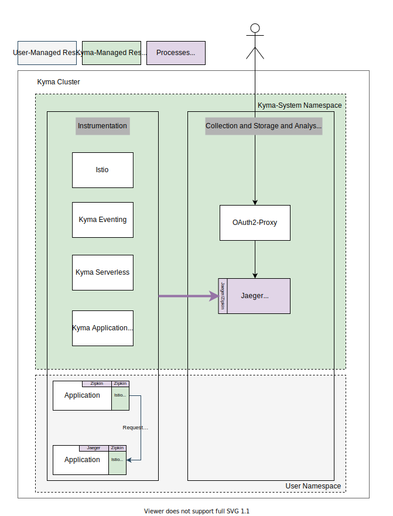

# Configurable Tracing: Groundwork

## Current Situation and Motivation

The diagram shows that the current solution is based on a preconfigured Jaeger deployment which is serving as collector, in-memory storage and UI. The system components and the user workload are pushing the trace data directly to that Jaeger deployment using the Zipkin or Jaeger protocol. The setup does not support a neutral and unified way to integrate backends outside of the cluster at runtime. The storage is not durable and will not scale dependent on the load.

As outlined in the [general strategy](../strategy.md), integration (and with that, changing the focus away from in-cluster backends) is the key to open up the stack for a broad range of use cases. Users can simply bring their own backends, if they already use a commercial offering or run their own infrastructure. To name just a few advantages, the data can be stored outside the cluster in a managed offering, shared with the data of multiple clusters, and kept away from any tampering or deletion attempts by hackers.

This concept proposes how to open up to those new scenarios by supporting convenient integration at runtime, leveraging vendor-neutral protocols and technologies.

## Requirements

### General
- Users need a way to outstream trace data into multiple external systems. There will be no production-ready solution provided by Kyma, so user need to integrate with something.
- Users need a way to add custom trace data from users' workload to that outstreams. Support for custom trace data is a major requirement for a distributed tracing solution.
- Users need a way to influence the amount of traces being outstreamed. External systems will have a price dependent on load and traffic. Not relevant traces must be droppable.

### Basic backend configuration
- Have a vendor-neutral layer of collectors that collects and ships trace data, but does not permanently store it (as a backend).
- The collector must run stably at any time when using the typical settings. Bad configuration must be prevalidated and rejected. Fast feedback is welcome.
- Outputs
  - Support configuration of backends and outputs at runtime (no need to run a Kyma upgrade process) in a scenario-focused approach.
  - As a minimum, support a single configuration with the potential to support multiple configuration at the same time in the future (in individual Kubernetes resources).
  - As a minimum, support one vendor-neutral output (OTLP). It should be possible to chain your custom collector for specific conversions. For example, supporting the OLTP protocol will support most of the vendors already. Chaining a custom OpenTelemetry Collector can do custom conversion to a specific protocol.
  - Support typical settings for the supported outputs in a convenient way.
  - Non-typical settings might be possible as well (not mandatory), leaving the collector in an unsupported mode.
  - Secrets must be kept secret.
  - Secret bindings for the SAP BTP Operator must be supported, including secret rotations.
  - When multiple scenarios are active at the same time (not part of minimal setup), the scenarios must be isolated and have their own buffer management. If one backend is in a bad shape and cannot process data anymore, data should still continue to be pushed to other backends.
  - Typical auth mechanisms for the integration must be supportable, minimum is basic auth but preferable are client-certificate-based solutions.
- Inputs
  - Inputs are predefined. In best case, users do not need to differentiate between inputs.
- Filter
  - Filtering of data (like dropping attributes or whole traces) is needed. However, minimal settings influence the tail-based sampling in a static way (percentage).

### Pre-integration
- Kyma system components are pre-integrated, so the predefined input in the collector serves them by default (Eventing and Serverless mainly).
- Trace data from the Istio and Serverless components is pre-integrated and can be easily filtered and de-selected.

### Ease of integration
- It should be easy to integrate trace data of a workload - with a push approach to a well-known internal URL in a vendor-neutral protocol
- Istio trace data should be collected instantly (without user action).
- Serverless data should be collected instantly (without user action).

### Local backend
- Kyma will provide a blueprint based on Helm for installing a Jaeger-based Deployment.
- The setup is not meant to be HA and scalable.

## Proposed Solution

The proposal introduces a new preconfigured collector layer that's responsible for collecting trace data only. OTLP will be supported as the only data protocol. Users can configure those collectors dynamically at runtime with different configuration scenarios, so that the collectors start shipping the data to the configured backends. The dynamic configuration and management of the collector is handled by a new operator, which is configured using Kubernetes APIs. The collector and the new operator are bundled in a new core package called `telemetry`. The existing Kyma backends and UIs will be just one possible solution to integrate with. They can be installed manually by the user following a blueprint. The trace propagation protocol will be switched to w3c-tracecontext to have a vendor-neutral approach in place.

