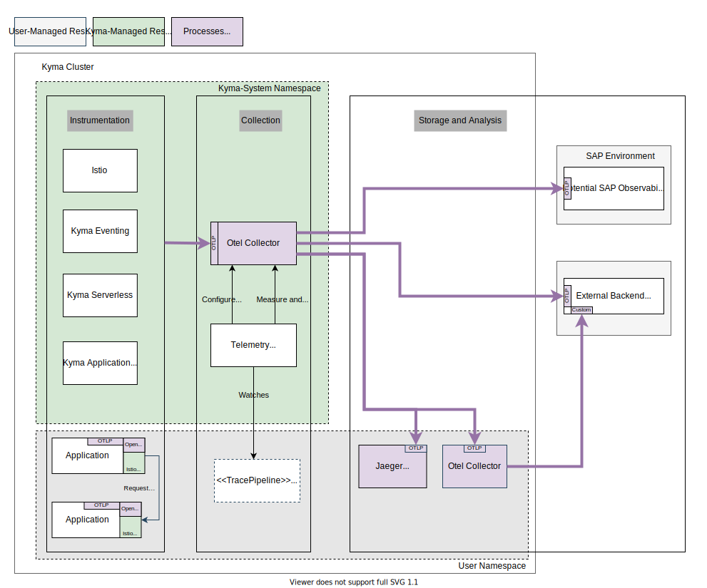

# Concept

## Architecture Overview

## Simple Auto-Scaling - Tail-based sampling

Auto-scaling should be possible from the beginning. A simple Deployment of the Otel Collector is the best option to achieve scaling. We only have to evaluate the relevant scaling criteria based on incoming traffic to scale the ReplicaSet up and down. A single Deployment of the Otel Collector requires that sampling decisions are made on the data that is constant and available across all spans of a trace, mainly the traceID.
Any other sampling would require to batch trace data, and to do that batching sticky on dedicated instances. That would require an advanced architecture, which we can adopt later.
A simple sampling approach is acceptable for now.

## Temporary OpenCensus support

When introducing the configurable tracing, w3c-tracecontext should be used from the beginning. That requires to use the OpenCensus tracer in the Istio configuration. Till OTLP support is available, that protocol must be supported as a receiver.

## Custom base image

Unused plugins for the Otel Collector should not be installed in the used image to reduce the attack vector. With that, a custom bundling of the Otel Collector image will be used

## Operator manages the Otel Collector Deployment
There should be no resource consumption if there is no pipeline defined. To achieve this, the Telemetry Operator will fully manage the Otel Collector; meaning the operator will deploy, configure, and potentially also delete the Deployment.

## Action Items

The following work packages are identified and will be transformed into stories:
- Build a custom Otel Collector image with a receiver for Istio traces and tail-based sampling processor.
- If a pipeline is defined, the Telemetry Operator deploys Otel Collector.
- operator removes deployment if last pipeline gets deleted
- Define basic settings for the Otel Collector Deployment.
- Configure Otel Collector with tracePipeline settings.
- Limit the setup to a singular pipeline only. To keep it simple, there can be only 0 or 1 pipeline.
- Define auto-scaling vs vertical scaling options.
- Expose relevant Otel Collector metrics for troubleshooting.
- Support Secret rotation.
