# OpenTelemetry Collector Performance

The measured numbers that generated using version 0.60.0 of the OpenTelemetry Collector, are primarily applicable to the OpenTelemetry Collector and measured only for traces. In the future, more configurations should be tested.

It is important to know, that the performance of the OpenTelemetry Collector depends on a set of factors including:

- CPU / Memory allocation
- The type of sampling: Tail based or head based sampling
- The receiving format: OpenTelemetry, Jaeger thrift or Zipkin
- The size of spans

Please note, with OpenTelemetry agent expected better performance with lower resource utilization, since the OpenTelemetry Agent does not support features such as batching or retries and no tail based sampling supported yet.

# Testing

Test was performed on Kyma version 2.6 deployed on Kubernetes version 1.23.9 using the [Synthetic Load Generator utility](https://github.com/Omnition/synthetic-load-generator) running for a minumum of one hour.
Test results are reproducible by using the parameters described in this document. It is important to know that this utility has a few configurable parameters, which can impact the result of the tests.
The parameters used in this test are:

- flushIntervalMillis: 1000
- MaxQueueSize: 100
- Submission rate: 100000 span/sec

OpenTelemetry Collector:
- 1 CPU
- 2 GiB Memory
- Processor memory limiter: 1000 Mib with a spike limit 256 Mib, and an interval check of one second.

Test goal is, find a maximum sustained rate with given default configuration and allocated resources (CPU and Memory).

Test setup in total reach 3248176 (900 traces/sec.) traces with total 162408800 (45K span/sec.) spans.

| 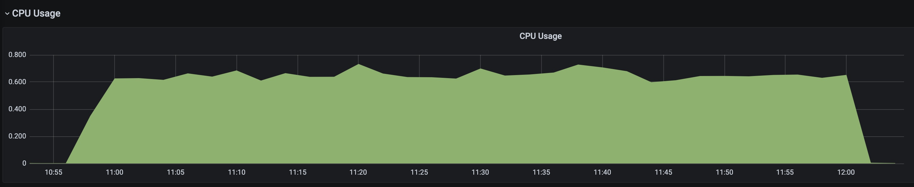 |
| :--: |
| Fig. 1 CPU utilization |

| 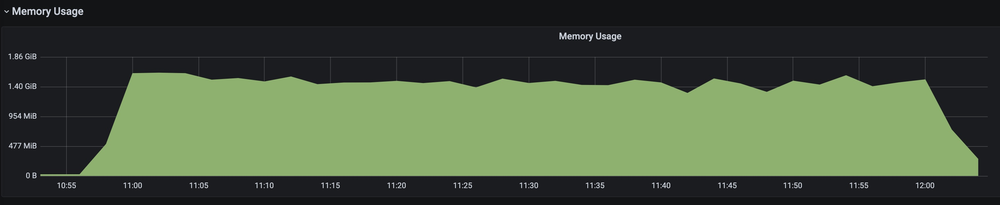 |
| :--: |
| Fig. 2 Memory utilization |

| 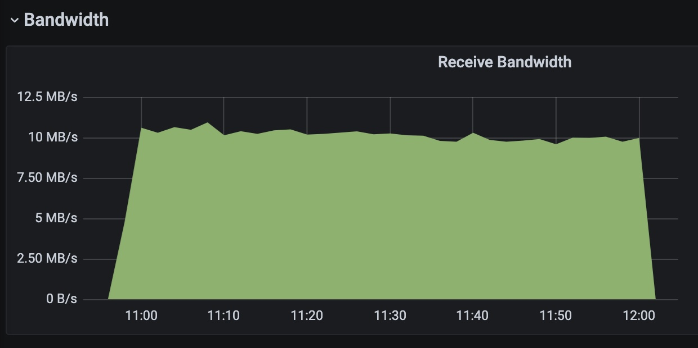 |
| :--: |
| Fig. 3 Receive Bandwidth |

| 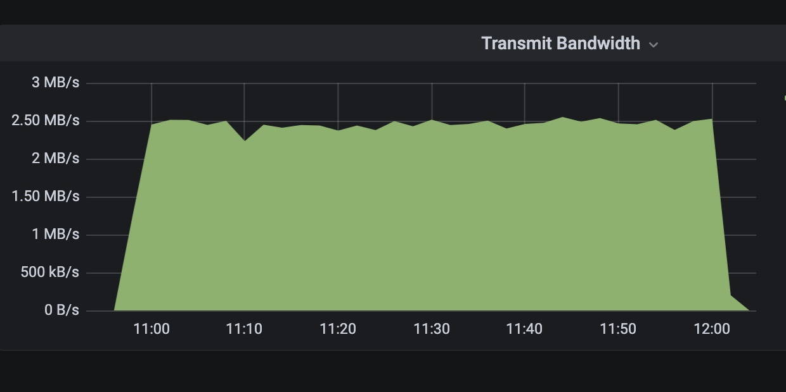 |
| :--: |
| Fig. 4 Transmit Bandwidth |

| 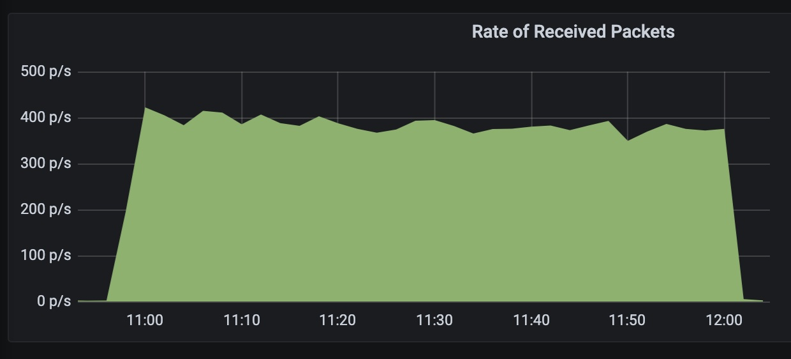 |
| :--: |
| Fig. 5 Rate of Received Packets |

| 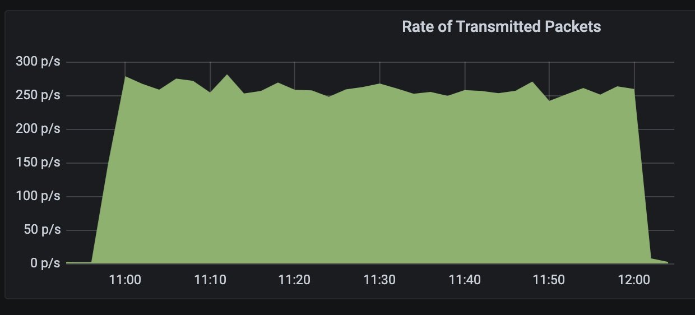 |
| :--: |
| Fig. 6 Rate of Transmitted Packets |

With using head based sampling, when higher rates needed, either:

- Divide traffic to different collector
- Scale-up by adding more CPU/Memory resources (doubling CPU and Memory will result two time more rate).
- Scale-out by adding one or more collector behind a load balancer or a Kubernetes service.

With tail based sampling either:
- Scale-up by adding more CPU/Memory resources (doubling CPU and Memory will result two time more rate).
- Scale-out by adding one or more collector behind a load balancer or a Kubernetes service, but the load balancer have to support **traceID-based** routing because all span of a given traceID need to be received by the dame collector instance.

## Queue Test

The OpenTelemetry pipelines offers a queue and retry mechanism in case of backend outages. 
The queue mechanism consist on two stages, first one is on the processor level in this case **Batch Processor**, 
the batch processor queue is pretty simple and will queue **spans** received from any receiver before processed. This processor support both size and time based batching.
The batch processor queue is an only in-memory queue and offers the following configuration possibilities:

- **send_batch_size**: Number of spans, which a batch will be sent regardless of the timeout.
- **timeout**: Time duration after which a batch will be sent regardless of size.
- **send_batch_max_size**: The upper limit of the batch size. This setting ensures that large batches are split into smaller units and it must be greater or equal to **send_batch_size**.

Batching helps better compress the data and reduce the number of outgoing connections required to transmit the data.

The second kind of queue is on the exporter level and primarily offers queued retries. This queue support also persistent queue mechanism but this is not part of the test.
This queue, queues batches which received from batch processor and will push batches to the backed after a configured timeout.

In case of backend outages, there is a retry mechanism to retry export to the backend before batches dropped from queue. 
That retry mechanism offers following configuration possibilities:
- **initial_interval**: Time to wait after the first failure before retrying (default 5 seconds).
- **max_interval**: The upper bound of backoff (default 30 seconds).
- **max_elapsed_time**: The maximum amount of time spent trying to send a batch (default 300 seconds).

The test goals is, simulate a backend outages and find out a configuration at least can 10 minutes long tolerate outages before drop traces from queue.

Test was performed on Kyma version 2.6 deployed on Kubernetes version 1.23.9 using the [Synthetic Load Generator utility](https://github.com/Omnition/synthetic-load-generator) running for a minimum of one hour.

The parameters used in this test are:

- flushIntervalMillis: 1000
- MaxQueueSize: 100
- Submission rate: 5000 span/sec

OpenTelemetry Collector:
- 1 CPU
- 2 GiB Memory
- The Processor memory limiter disabled to avoid any data dropping before processed.
- The Batch processor queue size configured to 10000 spans and 10 second timeout.
- The exporter queue size configured to 600 batches and max elapsed time to 600 seconds.

Test executed approximately 15 minutes, during test execution 61285 (in average 100 traces/second) traces generated and sent to the collector, in total 3064250 spans (in average 5000 spans/second). 
All the traces and spans arrived to the collector pipelines and processed without successfully pushed to the backend.

The collector deployment memory arrive his peak after approximately after 10 minutes (see Figure 8) and start with dropping data from the queue.
The CPU utilization stay moderate during entire test execution (see Figure 7).

| 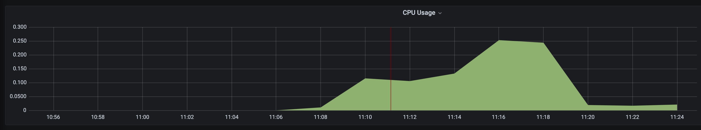 |
| :--: |
| Fig. 7 CPU utilization |

| 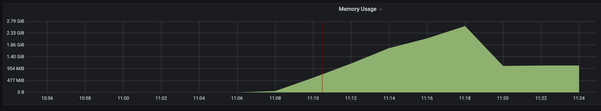 |
| :--: |
| Fig. 8 Memory utilization |

| 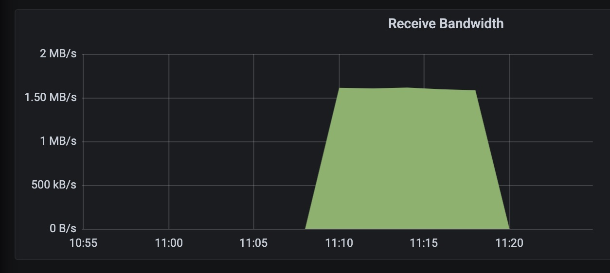 |
| :--: |
| Fig. 9 Receive Bandwidth |

| 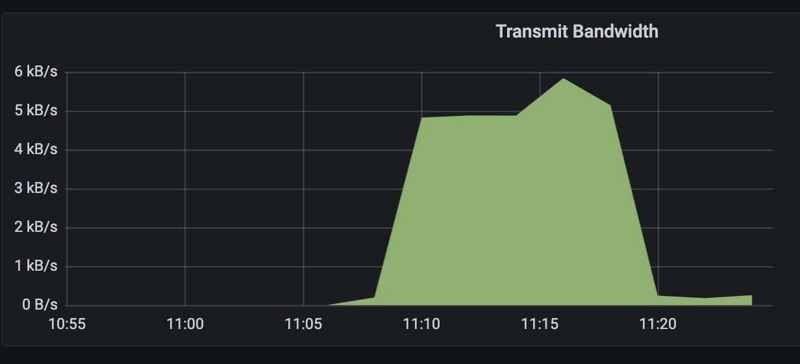 |
| :--: |
| Fig. 10 Transmit Bandwidth |

| 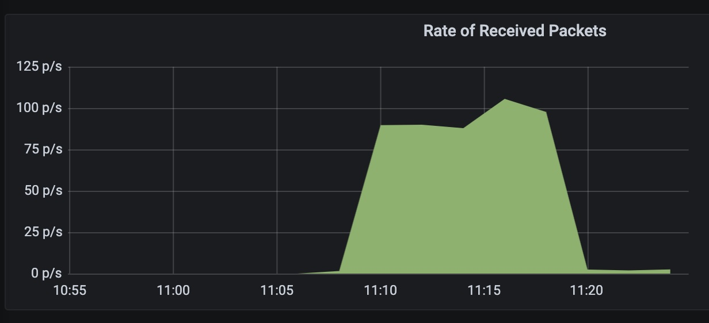 |
| :--: |
| Fig. 11 Rate of Received Packets |

|  |
| :--: |
| Fig. 12 Rate of Transmitted Packets |