# Trace Performance Test

The test covers 3 aspect of default base installation and configuration.

- Test average throughput of current installation end-to-end.
- Test queuing and retry capabilities of installation with simulated backend outages.
- Test survivability of the current installation under high load. The collector should not run out of memory in any case. Instead, it should refuse incoming data until memory available again.

> **NOTE:**
> The Opentelemetry Collector test environment is configured with OTLP format over the gRPC protocol. All KPIs found in this test will vary with other formats and protocols.

## Test Application

The [Opentelemetry load generator](https://github.tools.sap/huskies/otel-load-generator) is developed by Huskies. The application written is in go and use the Opentelemetry SDK version v1.11.1.
The load generator produces for each generated trace `11 spans` (one root and 10 child spans) and each spans has `40` attributes each `64 Byte` (except root span) long random data, this will simulate maximum size of expected span data,
generated data send in batches over `gRPC` and each batch will contain `512` spans, the test data can be generated concurrently to increase load on targeted collector, this can can be configured with start parameter `-c`.

## Test Environment

- A Kyma cluster deployed with Kyma version 2.9.x
- Opentelemetry Collector version 0.60.0 deployed by the Kyma Telemetry Controller with following configuration:
  - 1GiB Memory
  - 1 CPU
  - Memory hard limit configured 75% of total memory, memory spike limit configured to the 10% of total available memory.
  - Retry backoff limit 30 seconds and maximum retry time to 300 seconds.
  - Bath size 512 spans per batch, maximum batch queue size 512 batches.

## Observations

### Resource Usage

Purpose of this test is observing collector behaviour under high load, resource consumption, and out of memory situation. Test was running over 12 hours with constant load generation.

| 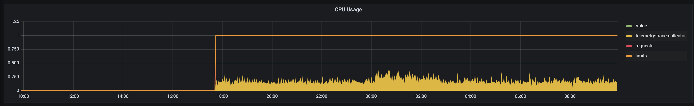 |
| :--: |
| Fig. 1 CPU utilization |

| 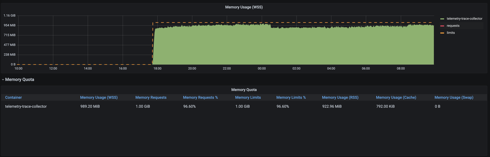 |
| :--: |
| Fig. 2 Memory utilization |

- As `Fig. 1` shown, CPU utilization stay moderate during whole test execution time.
- `Fig. 2` shown memory consumption over 12 hours, the collector never run OOM situation.

| 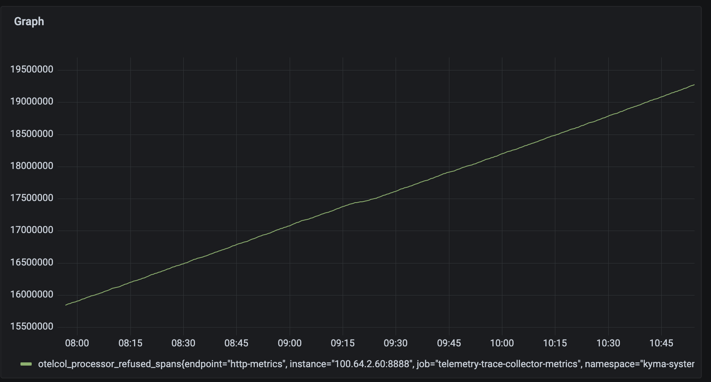 |
| :--: |
| Fig. 3 Refused spans |

- `Fig. 3` show the behaviour of memory limiter in case of high load and high memory utilization. Memory limiter kick in when the memory utilization get above defined `hard limit` and start refuse incoming data to avoid OOM situation.

### Retry and Queuing Test

This scenario tests an outage of the backend. In case of a backend outage data should be queued for max `300 seconds` and retried to export before data is dropped from queue.

| 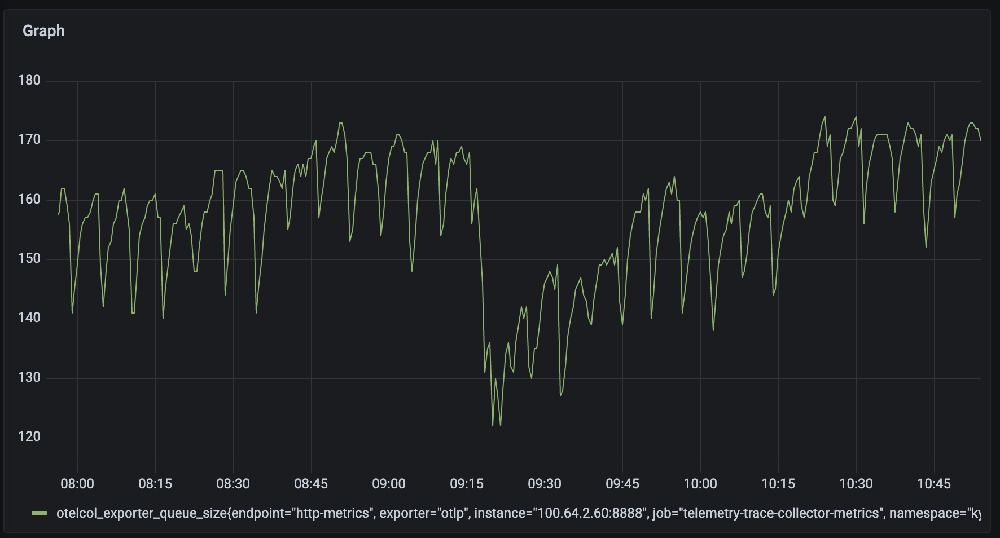 |
| :--: |
| Fig. 4 Batch queue |

The `Fig. 4` shows the queue size is going up in time and going down approximately every 5 minutes. This is because queued data will be dropped when could not be exported successfully after 300 second (5 Minutes).

| 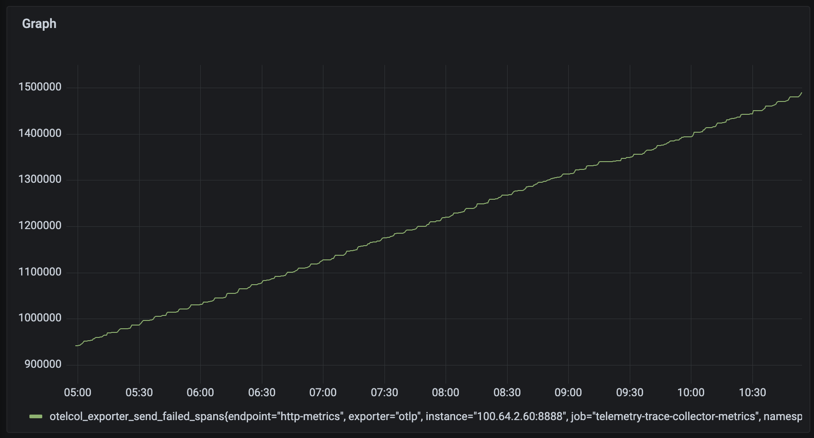 |
| :--: |
| Fig. 5 Failed exports |

The `Fig. 5` show unsuccessful export attempts during test execution.

### Test with CLS Backend

The throughput test runs over one hour to measure average throughput of span ingestion. In the peak times, no span should be dropped or refused by the pipeline and overall resource consumption should stay moderate.
The test uses a CLS instance without any configuration changes as backend. The test load generator is started with 2 concurrent producers, which produce on average `1550 spans/sec`.

| 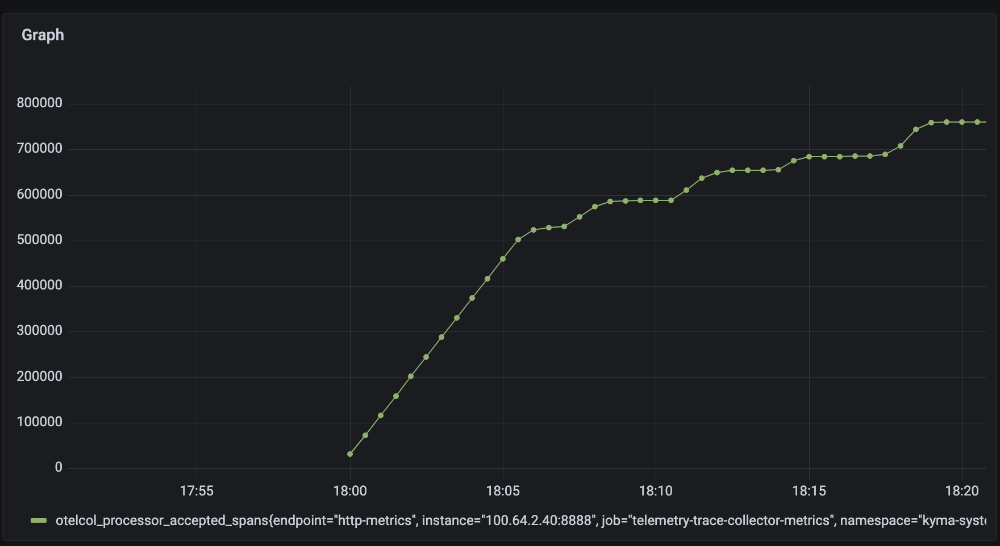 |
| :--: |
| Fig. 6 Accepted spans |

| 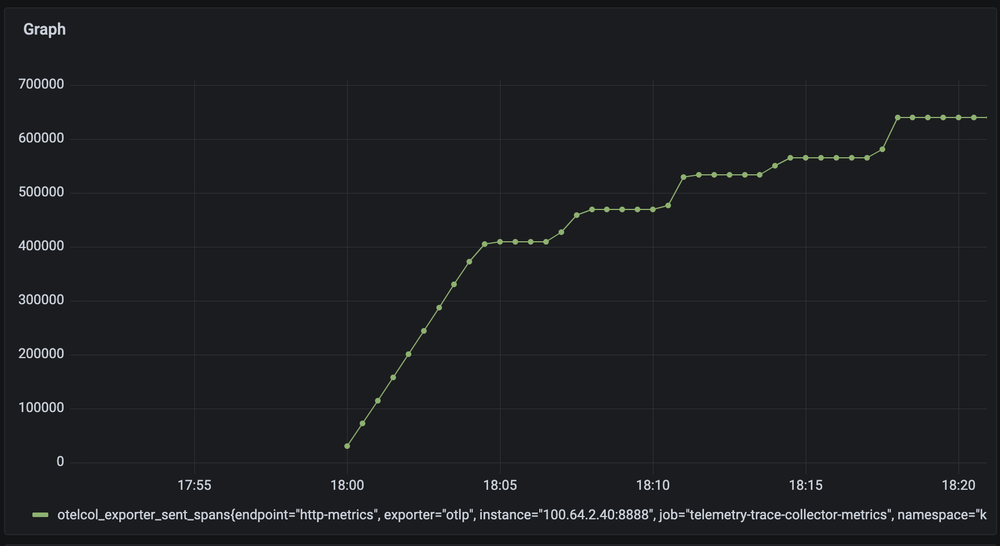 |
| :--: |
| Fig. 7 Send exports |

| 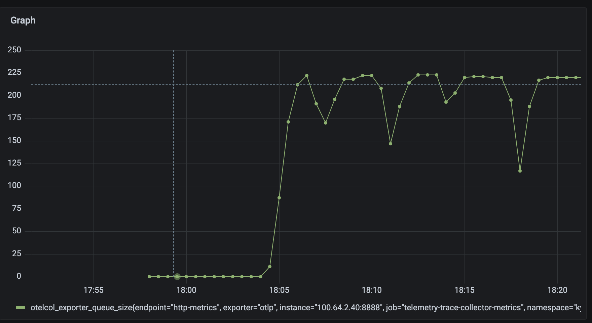 |
| :--: |
| Fig. 8 Queue size |

| 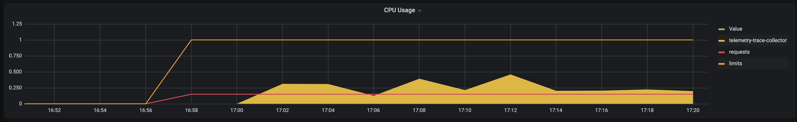 |
| :--: |
| Fig. 9 CPU Utilization |

| 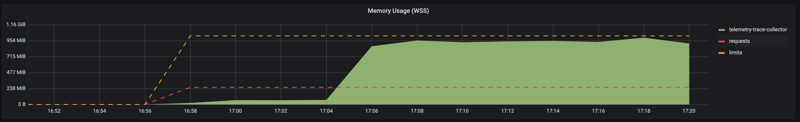 |
| :--: |
| Fig. 10 Memory Utilization |

The CLS instance became approximately after 4 minutes unavailable, which can be observed from `Fig. 8`. After 4 minutes of load test, the queue size starts to grow because spans can't be successfully exported.
In the `Fig. 6` we can observe `~375000` spans without any problem being ingested and exported to the CLS instance, which results in a peak value of `~1550 spans/sec`. From this time, spans will be queued and dropped after few unsuccessfully retries.

```bash
2022-11-28T17:36:27.969Z info exporterhelper/queued_retry.go:427 Exporting failed. Will retry the request after interval. {"kind": "exporter", "data_type": "traces", "name": "otlp", "error": "rpc error: code = Unavailable desc = unexpected HTTP status code received from server: 503 (Service Unavailable); transport: received unexpected content-type \"text/html\"", "interval": "8.412634113s"}
2022-11-28T17:36:33.657Z error exporterhelper/queued_retry.go:176 Exporting failed. No more retries left. Dropping data. {"kind": "exporter", "data_type": "traces", "name": "otlp", "error": "max elapsed time expired rpc error: code = Unavailable desc = unexpected HTTP status code received from server: 503 (Service Unavailable); transport: received unexpected content-type \"text/html\"", "dropped_items": 512}
go.opentelemetry.io/collector/exporter/exporterhelper.(*queuedRetrySender).onTemporaryFailure
 go.opentelemetry.io/collector@v0.60.0/exporter/exporterhelper/queued_retry.go:176
go.opentelemetry.io/collector/exporter/exporterhelper.(*retrySender).send
 go.opentelemetry.io/collector@v0.60.0/exporter/exporterhelper/queued_retry.go:411
go.opentelemetry.io/collector/exporter/exporterhelper.(*tracesExporterWithObservability).send
 go.opentelemetry.io/collector@v0.60.0/exporter/exporterhelper/traces.go:134
go.opentelemetry.io/collector/exporter/exporterhelper.(*queuedRetrySender).start.func1
 go.opentelemetry.io/collector@v0.60.0/exporter/exporterhelper/queued_retry.go:206
go.opentelemetry.io/collector/exporter/exporterhelper/internal.(*boundedMemoryQueue).StartConsumers.func1
 go.opentelemetry.io/collector@v0.60.0/exporter/exporterhelper/internal/bounded_memory_queue.go:61
```

### Throughput Test

The throughput test ran over one hour to measure average throughput of span ingestion, in the peak times no span should be dropped or refused by the pipeline and overall resource consumption should stay moderate.
As a backend, Kyma's integrated Jaeger instance is used. To avoid Jaeger getting a bottleneck in the end-to-end pipeline, the Jaeger instance is configured to use `1.5GiB` memory. The in-memory trace storage of Jaeger instance is reduced to the maximum of `500` traces.

To disclose the impact of the backend on the KPIs, a second OpenTelemetry Collector is deployed and used as OTLP gRPC backend. The same test is repeated on this setup.
The KPIs are the same as the setup with Jaeger backend.

| 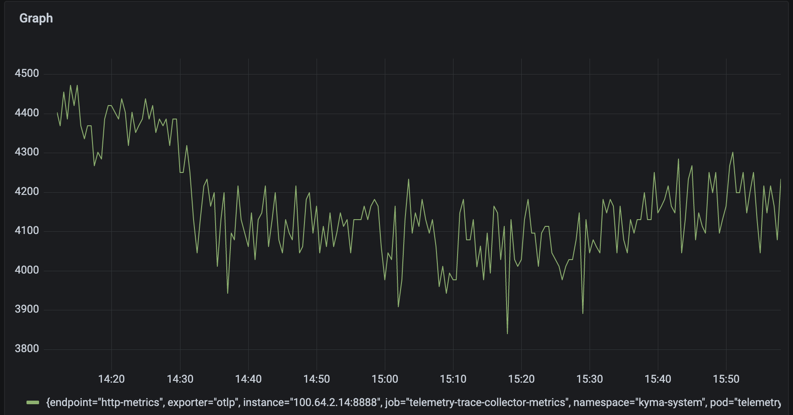 |
| :--: |
| Fig. 11 Send exports |

| 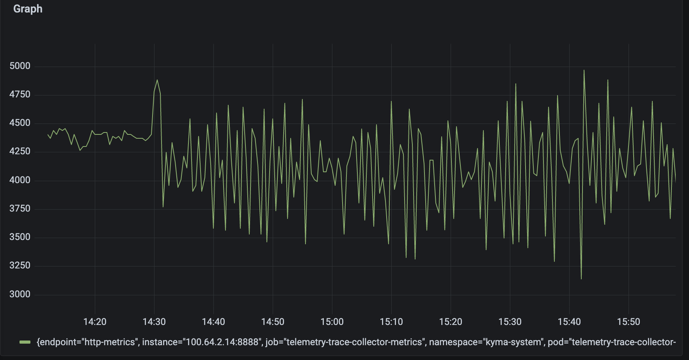 |
| :--: |
| Fig. 12 Accepted spans |

| 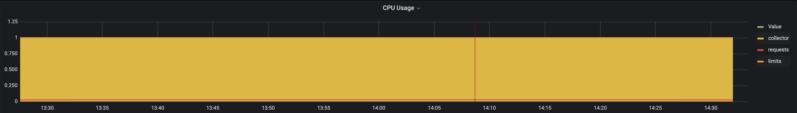 |
| :--: |
| Fig. 13 CPU Utilization |

| 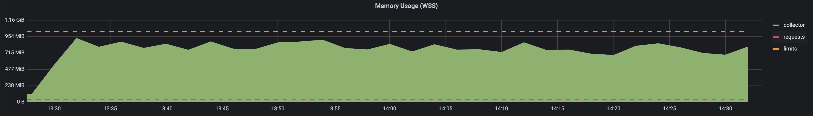 |
| :--: |
| Fig. 14 Memory Utilization |

The `Fig. 12` shows the amount of spans successfully ingested and the `Fig. 11` shown the amount of spans successfully exported to the configured backend. Both charts `Fig. 12` and `Fig. 11` show the same value of `~16000000` spans, which indicate that all ingested data successfully exported.
This measurement result in an average of `4300` span per seconds.

The `Fig. 14` show the memory utilization of the OpenTelemetry Collector instance. The measured value stay around 90% of total available memory.
`Fig. 13` shows the CPU utilization of OpenTelemetry Collector instance. The measurement shows that the available CPU shares are fully utilized.

The OpenTelemetry Collector version used in this test has some limitations with the gRPC client. The used gRPC client has a default message size of 4194304 bytes, which prevents exporting bigger batch sizes to the backend. 

> **NOTE:** Repeat this test with bigger batch sizes when the size limit is fixed. See the open issue [Max Export Size for Metrics/Logs/Traces #2772](https://github.com/open-telemetry/opentelemetry-specification/issues/2772).


## Multi Pipeline Test

The purpose of this test is to understand the behavior of the trace pipeline gateway with multiple pipelines.

### Test Environment
- Same configuration as described as single pipeline test above
- A Kyma cluster deployed with Kyma version 2.11.x
- Custom Kyma OpenTelemetry Collector image based on version 0.74.0 
- Backend [mock-trace-backend](https://github.tools.sap/huskies/knowledge-hub/tree/master/docs/observability/mock-trace-backend-poc), and two instances deployed for each configured pipeline on different Namespaces
- Same load generator as single pipeline test above 


## Pipeline setup
The Opentelemetry Collector is configured to use a single `OTLP grpc` receiver to receiver traces. For each configured pipeline, the same processors and exporters are used with own instances. 
The pipelines are configured to use [exclusive data ownership](https://github.com/open-telemetry/opentelemetry-collector/blob/main/processor/README.md#data-ownership), with exclusice data owership mode receiver cloning the trace data for each pipeline connected to the receiver.


## Tests

A set of tests are performed to understand the following:

- Effect on memory consumption with two pipelines
- Effect on a healthy pipeline when the second pipeline is unhealthy
- Current memory/cpu settings: do they support multiple pipelines or do they need adjustment?```

### When both pipelines are healthy

When both pipelines are healthy, the current memory/cpu limits are fine. The successfully exported data rate is around 1.5K spans/sec for each pipeline.

### When one pipelines is unhealthy

When one pipeline is unhealthy, the exporter queue of the unhealthy pipeline is filled up and this builds up back pressure, which results in rejection by the memory limiter.
This also causes bad throughput on the healthy pipeline because incoming traffic decreases.
Furthermore, the collector instance runs out of memory because incoming data is duplicated in the pipelines, which occupies more memory than for a single pipeline. With the original setting of a 1 second interval to check the memory hard limit threshold, the memory limiter didn't have enough time to react. After setting the threshold to the 0.5 seconds the collector returns to stable state.

To improve the throughput, the following cases were tested:

- Vertical scaling: After doubling the memory to 2GiB, the throughput of the exported traces for the healthy pipeline returned to `1.5k/sec`, and was no longer affected by the unhealthy pipeline.
- Horizontal scaling: After increasing replica counts to 2 instances but keeping the memory limit at 1GiB, the throughput of the healthy pipeline is affected by the unhealthy pipeline. That's because the exporter queue filled up and built up back pressure on the receiver side, which caused rejection of incoming trace data.

## Summary

Horizontal Pod scaling does not support a stable throughput in a multi-pipeline setup. Horizontal Pod scaling can be used to have a HA setup.

For multiple pipelines, it is important to increase the memory of the trace gateway, because available memory is a key performance indicator for trace pipelines.
Furthermore, we can improve performance and stability by decreasing the memory limiter check intervals, either decreasing the exporter queue size for each pipeline, or decreasing backoff limits export retries to free memory faster.