# OpenTelemetry/Istio Sampling Rate Analysis

This analysis aims to find out the impact of different sampling rate configuration on the Istio proxy and overall call chain.

At the end of the analysis, different scenarios are compared, like Istio resource consumption, throughput, and impact of other Kubernetes components. 

## Setup
### OpenTelemetry
OpenTelemetry version 0.22.1 deployed on a Kyma cluster (version 2.6.0) with the following minimal setup:
- Standard deployment of OpenTelemetry Helm Chart version 0.22.1
- As receivers, standard Jaeger, Zipkin, and OTLP configured
- As processor, only a memory limiter processor with standard configuration
- As exporter, only log/info and/or NOP exporter to keep impact of OpenTelemetry as low as possible
- No additional extensions

### Sampling App Deployment

As sampling app, three serverless Functions are deployed with Istio sidecar injected. To simulate a trace fully sampled with an external call, the Functions call each other in the following chain:
**Extern Call -> FunctionA -> FunctionB -> FunctionC**

All Functions are deployed with NodeJs version 16.

### Call Simulator
As call simulator Gatling version 3.8.3 used.

## Scenario
### Common Setup

The following setup is identical across all scenarios:

* OpenTelemetry deployment and configuration (see [Setup](#setup))

* Sampling app

* Call simulator "Gatling" calls **FunctionA** from external, with 5-10 simultaneous users.
  The call is a simple URL call of FunctionA with no additional data or http headers to keep any influence of those on the trace itself.
  The call simulation runs for 100 minutes to put enough load on the call chain and generate enough metrics to get precise results.
### Scenario 1
Kyma standard deployment (version 2.6.0) with Istio sampling rate configured to **1%** sampling, to observe Istio behavior like resource consumption and throughput.

### Scenario 2 
Kyma standard deployment from main branch with Istio sampling rate configuration changed to **100%** sampling, to observe Istio behavior like resource consumption and throughput.

### Scenario 3
Like **Scenario 2** with additional configuration on **Jaeger** and **Zipkin** receiver services without valid endpoint. This scenario should investigates additional impact on Kubernetes components.

### Scenario 4

Like Scenario 2, runs without collectors **Jaeger** and **Zipkin** to analyse Istio behaviour and impact on Kubernetes components like **CoreDNS**.

## Result

The overall analysis focuses on Istio behavior and resource consumption under different setups. In **Scenario 3** and **Scenario 4**, there's additional focus on Kubernetes components.
### Scenario 1

Fig. 1 shown call execution summary (from client perspective) of test cluster with istio sampling rate 1% setup. 
Success rate of call execution is 100% and average response time is around **400ms.**

|  |
| :--: |
| Fig. 1 Call execution summary |

Fig. 2 below show overview istio mesh network, as call execution summary cluster metrics also show 100% of success rate inclusive local call chain.
Latency on average stay around 400ms with a 6.5 operation per second per service.

| 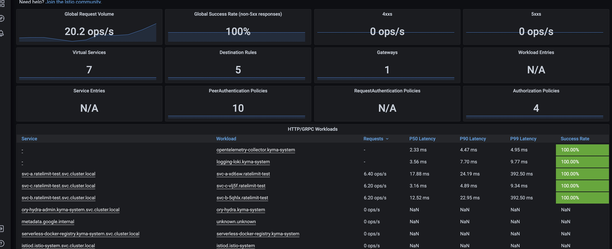 |
| :--: |
| Fig. 2 Istio Mesh Overview |

| 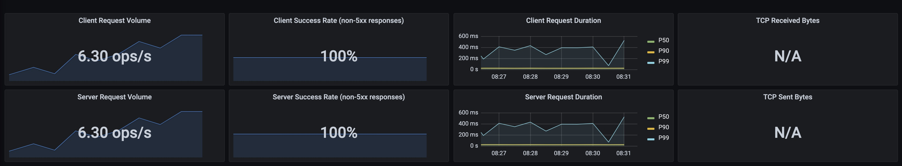 |
| :--: |
| Fig. 3 Istio Service Overview |

| 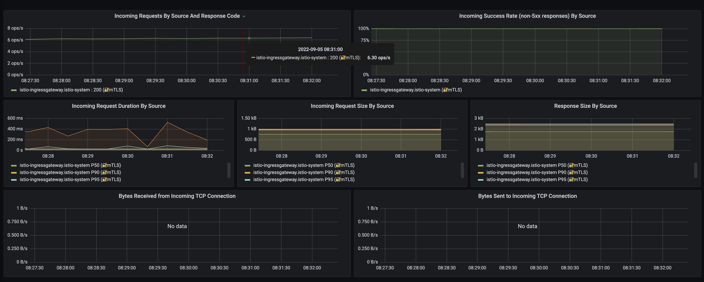 |
| :--: |
| Fig. 4 Service Network Details |

| 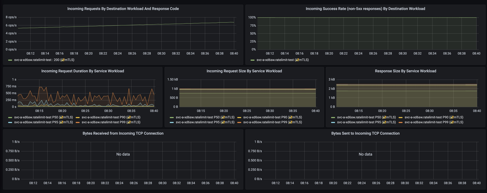 |
| :--: |
| Fig. 5 Service Network Details |

Fig. 6 below show istio proxy resource consumption during test, bytes transfered during test phase increased from around 10KB/s to 60KB/s in peak time.

Memory consumtion of istio proxy increased from 61MB to 68.7 MB in peak time, on CPU consumption side, before test started was 0.100 in peak time the value increased to around 0.150.

Although resource consumtion during test execution increased, there are no considarable resource consumption observed.

| 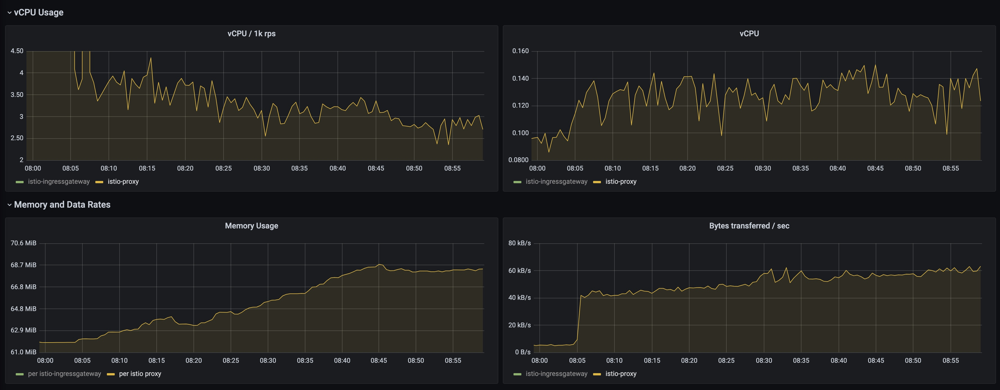 |
| :--: |
| Fig. 6 Istio Proxy Resource Consumption |

Fig. 7 show an overview on Kubernetes CoreDNS service, nothing noticeable observed.

DNS request per second increase during the test execution time from 2 packet/sec. to 3.5 packet/sec. and DNS lookups increased as well. 

Fig. 8 show an overview on the cache, cache hits are increased which indicate DNS records request results are mostly coming from cache.

| 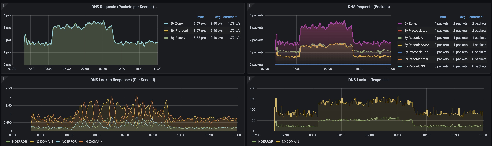 |
| :--: |
| Fig. 7 Kubernetes CoreDNS Overview |

|  |
| :--: |
| Fig. 8 Kubernetes CoreDNS Cache |

#### Summary
Test results shown there is a small impacts on the istio proxy, but none of those are overall considerably.
By the Kubernetes CoreDNS, no suspicion behavior observed, DNS request are increased from 2 to 3 request per second, DNS lookups increased from 1 to 2 per second, and 
DNS cache hits increased parallel to the DNS lookup responses, which proof lookups request hit mostly cache.

### Scenario 2

Fig. 1 shown call execution summary (from client perspective) of the test cluster with istio sampling rate 100% setup.
The success rate of call execution is 99% and the average response time is around **950ms.** 

Unsuccessfully calls mostly result HTTP 503, main cause of not successfully calls are, either istio proxy can't access upstream service (serverless function self) or jaeger tracing collector service.

| 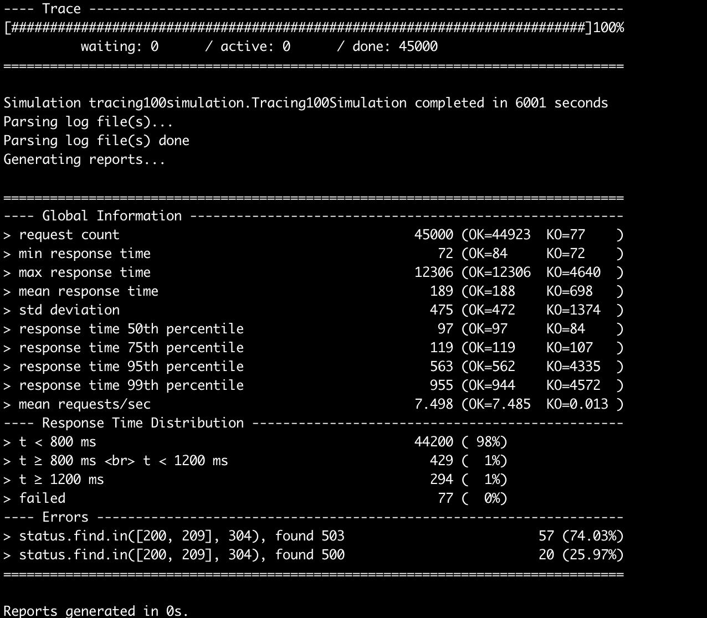 |
| :--: |
| Fig. 1 Call execution summary |

Fig. 2 below, show overview istio mesh network, as call execution summary cluster metrics also show 100% of success rate inclusive local call chain.
Latency on average stay over 500ms with a 6.7 operation per second per service.

Global Request Volume increased from 10 to 65.8 operation per second, which indicate high traffic on istio mesh network side.

| 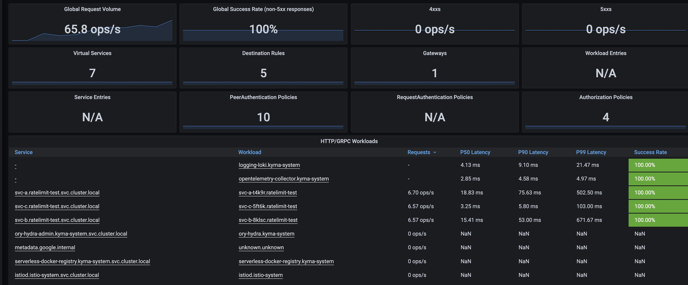 |
| :--: |
| Fig. 2 Istio Mesh Overview |

| 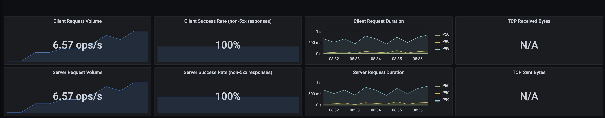 |
| :--: |
| Fig. 3 Istio Service Overview |

| 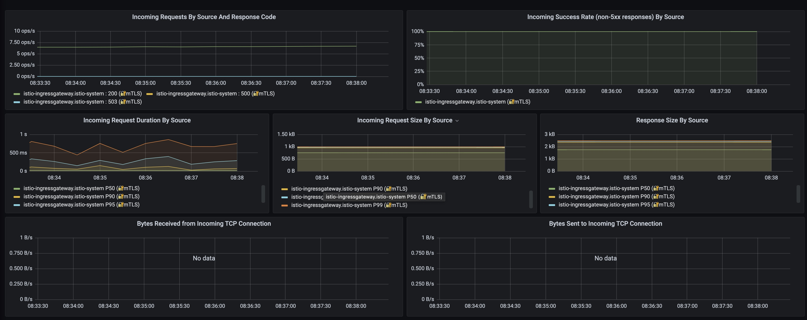 |
| :--: |
| Fig. 4 Service Network Details |

| 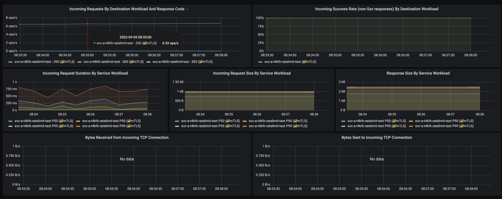 |
| :--: |
| Fig. 5 Service Network Details |

Fig. 6 below, show istio proxy resource consumption, bytes transferred during the test execution time increased from around 10KB/s to 300KB/s in the peak time.

Memory consumption of istio proxy increased from 61MB to 68.7 MB in the peak time, on CPU consumption side, before test started was 0.100 in the peak time the value increased to around 0.170.

Although resource consumption during test execution increased, there are no considerable resource consumption observed.

|  |
| :--: |
| Fig. 6 Istio Proxy Resource Consumption |

On Kubernetes CoreDNS service side, nothing suspicion observed, Fig. 7 below, shown an overview on CoreDNS service.
DNS request per second increased during the test execution time from 2 packet/sec. to 3.3 packet/sec. and DNS lookups increased as well.

Fig. 8 DNS Cache overview, show cache hits are increased parallel to DNS lookup request, which indicate DNS records request results are mostly coming from the cache.

| 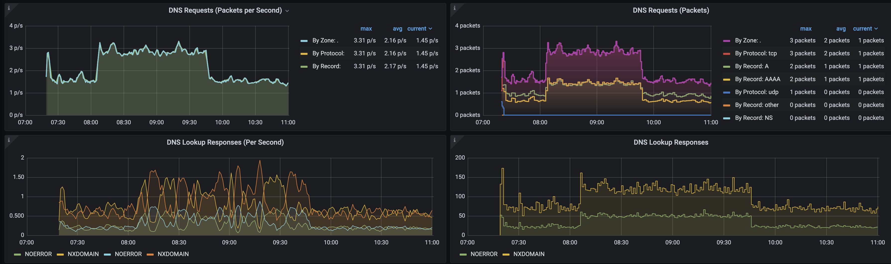 |
| :--: |
| Fig. 7 Kubernetes CoreDNS Overview |

| 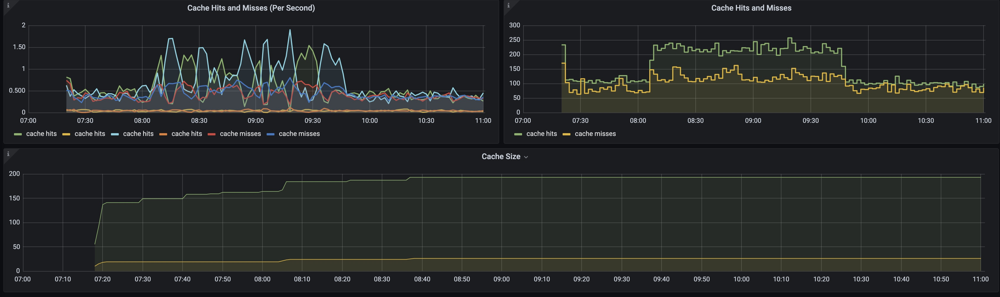 |
| :--: |
| Fig. 8 Kubernetes CoreDNS Cache |

#### Summary
Scenario 2 result shown there is a small impact on istio proxy.

Kubernetes CoreDNS service metrics are showing no suspicion behavior. DNS record request and DNS lookups mostly read from the DNS cache.

Test shown 100% sampling rate, increase overall network traffic, in certain circumstances can cause increased network latency and some networking issues.

### Scenario 3

Fig. 1 shown call execution summary (from client perspective) of test cluster, with istio sampling rate 100% setup.

Different to **Scenario 2**, Jaeger tracing collector service has no working endpoint here.

Success rate of call execution is 33% and average response time is around **9 seconds.**

Unsuccessfully calls mostly result HTTP 503 because of upstream services can't access Jaeger tracing collector.

| 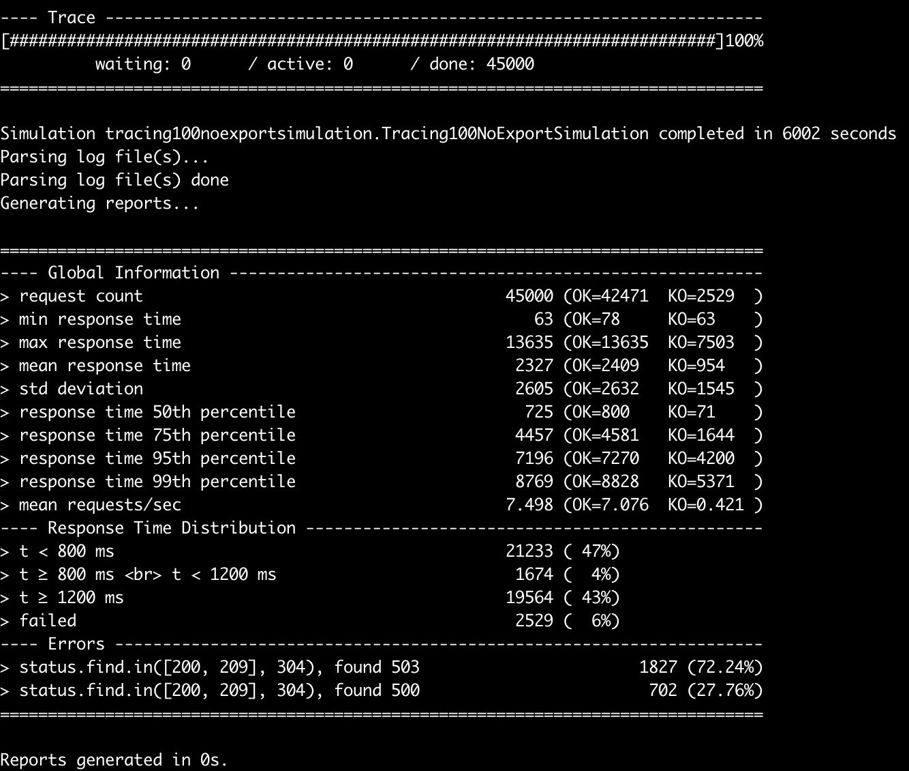 |
| :--: |
| Fig. 1 Call execution summary |

Fig. 2 below show overview istio mesh network, as call execution summary cluster metrics, mesh overview show also 33% of success rate (inclusive local call chain).

Latency on average stay over 951ms with a 7 operation per second per service.

Global Request Volume increased from 10 to 72.8 operation per second which indicate high traffic on mesh.

|  |
| :--: |
| Fig. 2 Istio Mesh Overview |

| 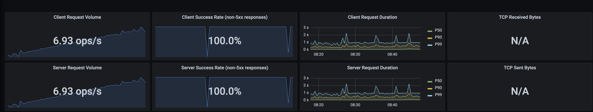 |
| :--: |
| Fig. 3 Istio Service Overview |

|  |
| :--: |
| Fig. 4 Service Network Details |

| 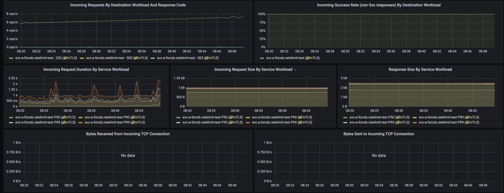 |
| :--: |
| Fig. 5 Service Network Details |

Fig. 6 below show istio proxy resource consumption, during the test execution time, transferred data amount increased from around 10KB/s to 180KB/s in the peak time.

In the peak time, memory consumption increased from 61MB to 67 MB, CPU consumption increased from 0.100 to around 0.140.

Compare to the test **Scenario 2** amount of data transferred is almost 50% decreased, which belong to no tracing data could be transferred to the tracing collectors.

|  |
| :--: |
| Fig. 6 Istio Proxy Resource Consumption |

Fig. 7 clearly show increased DNS requests and DNS lookup response time, to compared with **Scenario 2**
DNS request and DNS lookup response times are more than doubled.

Same behavior observable on the DNS cache metrics side, cache misses almost doubled to compared with **Scenario 2**.

|  |
| :--: |
| Fig. 7 Kubernetes CoreDNS Overview |

| 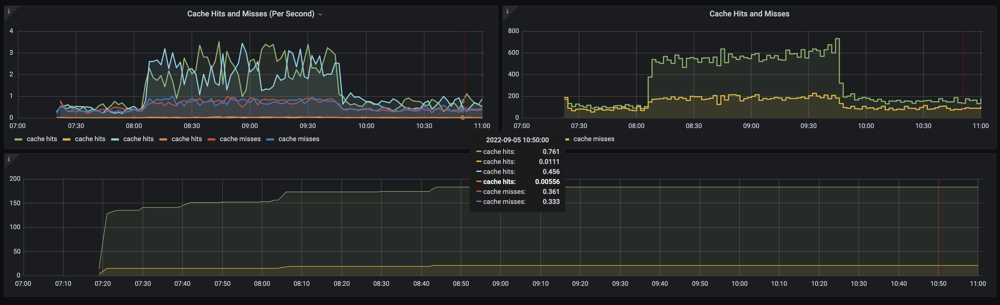 |
| :--: |
| Fig. 8 Kubernetes CoreDNS Cache |

#### Summary

To compare with **Scenario 2**, overall network latency is bad, response times increased from below 1 second up to 9 second.

Same behavior observable by the CoreDNS service, DNS requests and DNS lookups times increased up to 100% compared with **Scenario 2**

### Scenario 4

Fig.1 shown call execution summary (from client perspective) of test cluster with istio sampling rate 100% setup.
Success rate of call execution is 99% and average response time is around **1 seconds.**

Unsuccessfully calls mostly result HTTP 503, main cause was high network latency and high load to the upstream service. 

|  |
| :--: |
| Fig. 1 Call execution summary |

Fig. 2 below show overview istio mesh network, as call execution summary cluster metrics also show 100% of success rate inclusive local call chain.
Latency on average stay over 727ms with a 7.30 operation per second per service.

Global Request Volume increased from 10 to 21.1 operation per second, compared to the **Scenario 2** and **Scenario 3** with Global operation per second value over 65, here missing calls to the tracing collector service calls.

| 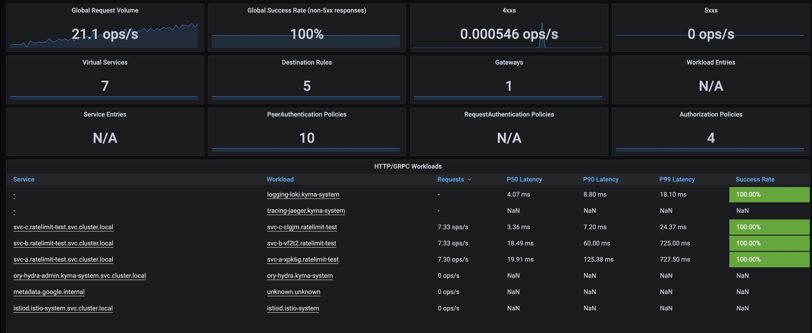 |
| :--: |
| Fig. 2 Istio Mesh Overview |

|  |
| :--: |
| Fig. 3 Istio Service Overview |

|  |
| :--: |
| Fig. 4 Service Network Details |

|  |
| :--: |
| Fig. 5 Service Network Details |

Fig. 6 below show istio proxy resource consumption during the test execution time, bytes transferred during entire test increased from around 10KB/s to 77KB/s in the peak time.

Memory consumption of istio proxy increased from 66MB to 67 MB in peak time, CPU consumption, before test started was 0.050 in the peak time the value increased to around 0.100.

By test start, memory consumption as well as CPU consumption increased rapidly but decreased in 5 minutes to the normal values.

Data amount transferred with in the mesh compared to previous scenarios **Scenario 2** and **Scenario 3** significantly decreased,
which to lead back missing tracing collector service calls.

| 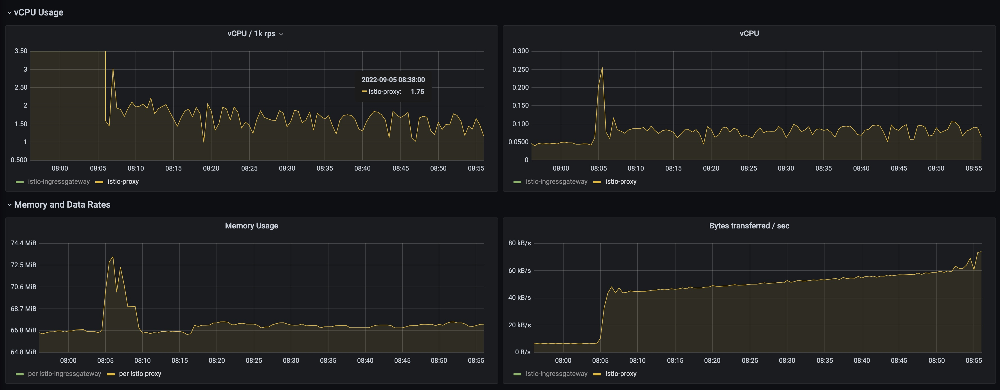 |
| :--: |
| Fig. 6 Istio Proxy Resource Consumption |

Like **Scenario 3** Kubernetes CoreDNS service side DNS request per second increased significantly, from 2 packet per second to 8 packet per second.
DNS cache misses also doubled in the test execution time, which also explain increased DSN lookup response time, this value increased from 1 second to 4 seconds and response times up to 500ms during test execution time.

|  |
| :--: |
| Fig. 7 Kubernetes CoreDNS Overview |

| 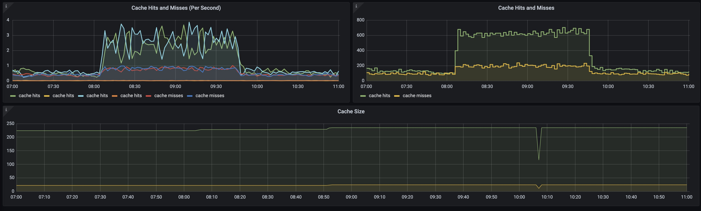 |
| :--: |
| Fig. 8 Kubernetes CoreDNS Cache |

#### Summary

CoreDNS service lookup times and DNS requests are increased significantly, overall network latency increased. 

### Conclusion

Table below compare all scenarios with relevant metrics for the test.

- **Scenrario 1** with 1% sampling rate
- **Scenrario 2** with 100% sampling rate
- **Scenrario 3** with 100% sampling rate, collector service without end point
- **Scenrario 4** with 100% sampling rate, no collector deployed

||Scenario 1|Scenario 2|Scenario 3|Scenario 4|
|:--|:--:|:--:|:--:|:--:|
|Success Rate|100%|99%|33%|99%|
|Global Request (Mesh)|20.2 ops/s|65.8 ops/s|72.8 ops/s|21.1 ops/s|
|Request per Service|6.20 ops/s|6.70 ops/s|7.20 ops/s|7.33 ops/s|
|Latency|400ms|950ms|9 sec|1 sec|
|Bytes Transferred|60KB/s|300KB/s|170KB/s|70KB/s|
|DNS Requests|3 p/s|3 p/s|8 p/s|8 p/s|
|DNS Lookups|150ms|150ms|500ms|700ms|

A 100% sampling rate will put more presure on overall network communication, which will result to high latency and hihg load on collector services

Deployment without or broken collectors will result CoreDNS service presure, DNS request and DNS lookups will increase up to 400% compare to with collectors.