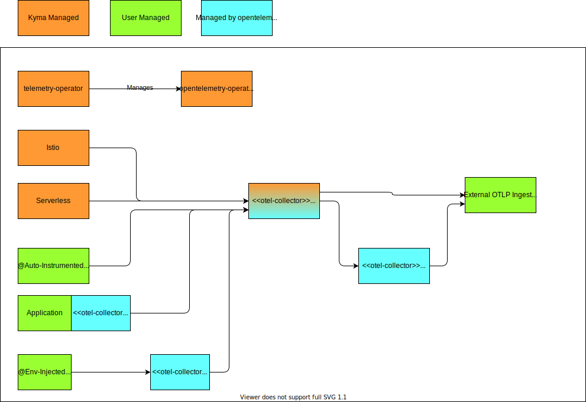

# OpenTelemetry Operator PoC

## About
A crucial aspect that was neglected too much in the previous concept design is the feature of activating instrumentation and exporter configuration of a workload in a seamless fashion. That feature is already available in the [opentelemetry-operator](https://github.com/open-telemetry/opentelemetry-operator#opentelemetry-auto-instrumentation-injection). Using central configuration, you can inject relevant configuration by putting a simple annotation. Relevant programming languages are supported by auto-instrumentation already.

Re-inventing the wheel should be avoided, so the PoC discusses the impact on introducing the operator in order to provide the mentioned features to the users.

## Scope
Experience showed that there is no way to run an operator in an isolated/restricted way, so that a user operating on other namespaces would not be affected. Potential conflicts are:
- The CRDs are managed cluster wide. Operators running in different namespaces will bring it's CRDs in own versions and potentially will race-update the cluster wide CRD resources
- The operator managed by Kyma could be limited to act on a single namespace, however a second operator instance deployed by the user will by default act on all namespaces and will race-reconcile the kyma managed resources. Also, the default instance of the user might intercept webhooks for kyma managed resources.
In conclusion, we must choose between the following options:
- Either the operator is used as underlying technology for the Kyma abstractions and instrumentation support AND is accessible for custom scenarios for users.
- Alternatively, the operator is not used. No other option, as using it in a restricted way as underlying technology without access for the user and blocking the user from running an own instance, will prevent the user of leveraging that technology overall.

## Proposal

- The existing Telemetry operator manages an OpenTelemetry operator additionally.
- The current abstraction `TracePipeline` does not reveal into an actual deployment but an `OpenTelemetryCollector` resource configuration. The configuration is reconciled and with that, it cannot be influenced by the user. The `opentelemetry-collector` will resolve the configuration into an actual deployment. That part is still optional and the indirection using the OpenTelemetry operator is not mandatory. It will be mainly beneficial for the user to copy-over such configuration in order to realize a custom trace collector
- The Telemetry operator reconciles `Instrumentation` resources, which can be used by the user instantly for auto-instrumentation and injection of the `trace-collector` reference
- The user can specify a custom `OpenTelemetryCollector` resource for custom exporter handling or any other activities, likes running a sidecar.
- The user can specify a custom `Instrumentation` for env injection of custom collectors.



## POC

### Prerequisites
- Have a Kyma cluster in version 2.10 or higher
- Have a TracePipeline configured with a valid output


### Installation
1. Install the Otel Operator using Helm:

   ```bash
   helm upgrade otel-operator open-telemetry/opentelemetry-operator --version 0.21.1 --install --namespace kyma-system -f otel-operator-values.yaml
   ```

1. Create an Instrumentation configuration with the endpoints to use:
   ```bash
   kubectl apply -n kyma-system -f instrumentation.yaml
   ```

### Instrumentation
1. Annotate your app with either of the following options:
   ```yaml
   annotations:
     instrumentation.opentelemetry.io/inject-sdk: "kyma-system/kyma" #to inject env variables only
     instrumentation.opentelemetry.io/inject-nodejs: "kyma-system/kyma" #to inject env variables and nodejs instrumentation library
     instrumentation.opentelemetry.io/container-names: "myapp,myapp2" #to inject env variables and javaagent
   ```

### Findings

The injection of environment variables does not only inject the destination for the exporters but also injects the typical OTEL resource attributes. Also, it supports injecting trace propagation and sampling strategies. That is a very convenient feature to configure your workload declarative if it is already instrumented with the OTEL SDK.

The auto-instrumentation was tested for Java and Node.js. While the java tests were successful, we failed to get the Node.js instrumentation working at all, one application was coming up operational but without instrumentation active. Another one was not even starting up anymore.

## Considerations, Risks, Potentials

The following section discusses several very relevant aspects in order to derive a architectural decision.

### Simplification of own abstraction logic

The OpenTelemetry Operator is a well maintained project with an active community. The operator maps an `otel-collector` configuration in an actual deployment and manages its lifecycle. With that, Kyma's Telemetry operator no longer needs to manage concrete deployments or DaemonSets and alike, but could rely on the intermediate abstraction, and with that could get a simplified implementation. New features in the underlying operator can be leveraged immediately in the layer above.

However, the current functionality of the OpenTelemetry Operator in regards to deployments is very limited. It mainly maps the collector definition 1:1 to the underlying Kubernetes resource. Actual logic, which will simplify more complex scenarios, is not covered. Also simple scenarios are not covered, like adding a batch processor in combination with a memory-ballast extension with settings fitting to the actual resource settings. So there is simplification in pure resource handling mainly.

### Guarantees for custom instances

Because the OpenTelemetry Operator will be a feature for users of the cluster, also the lifecycle of the users' collectors will be managed in regards to image updates (otherwise, the feature is pretty meaningless). Here, the question on the supported image arises: 
Is it just a plain base image with basic receivers/exporters, or the full contrib image?
- If it ships the full contrib image, there cannot be given any guarantees on updates; it will be best-effort only, relying on the upstream project fully. It might break your collector. Also, providing a hardened image from security perspective will be very challenging as there will be many third-party dependencies included having no knowledge about actual usage.
- With a stripped-down image version, basic tests could be performed to assure that standard scenarios are working. Also, a security triaging is realistic. However, there still won't be the full guarantee that an update of your collector instance will be working reliably.
Providing the base image only brings no value as you rarely can use it without any additional processors, so users would always need to opt out (which is possible without problems). But again, the value of the whole feature is under question.

### The power of auto-instrumentation

Auto-instrumentation sounds like a great idea at a first glance. It provides so much insight of your application without any investment. However, that approach has a high chance of also breaking your application. Especially for Node.js, the auto feature just adds a node package to an application, which can cause version conflicts and block startups.
Instead, users should add instrumentation (even automatic ones) _before_ the app is deployed, so that this happens in a controlled and tested way. Again, think of updates to the auto-instrumentation library. If that happens at runtimes, suddenly an application might not start up anymore.

### Injection of settings

The injection of the typical and recommended setting for a workload instrumented by the OTEL SDK is very useful and lowers the burden for managing an application. Instead of injecting a hardcoded URL (which might change over time), the operator will take care by annotation to inject the proper URL.

## Conclusion

The proposed solution has many advantages. The standard way of auto-injection will be working instantly without any Kyma-specific invention. The Kyma-specific operator can be simplified and users can run custom collector instances more easily.
On the negative side, the feature will introduce mainly a technology, not a feature. It will promise to take care of the full lifecycle of custom collectors but cannot deliver that promise. Updates of custom instances cannot be guaranteed to be reliable. Also, the included auto-instrumentation feature can break your application on updates of the instrumentation logic.

As the upgrade topic is too serious, the proposed solution cannot be followed in that way. Instead, a compromise seems to be a better solution by adopting the very good concept of env variable injection:
1. Assure at any time that users can install an own OTEL operator at any time to manage custom collectors more easily, and also to have instrumentation if desired. The benefit of having the operator and collector update automatically is not provided with that.
1. Adopt the principle of injecting the OTEL SDK env variables into workload in a declarative way by the Kyma-specific operator and Kyma-specific annotations. The user could still achieve the same by using the standard annotations and a custom OTEL operator.
1. The Kyma operator continues to manage own deployments otel-collectors
