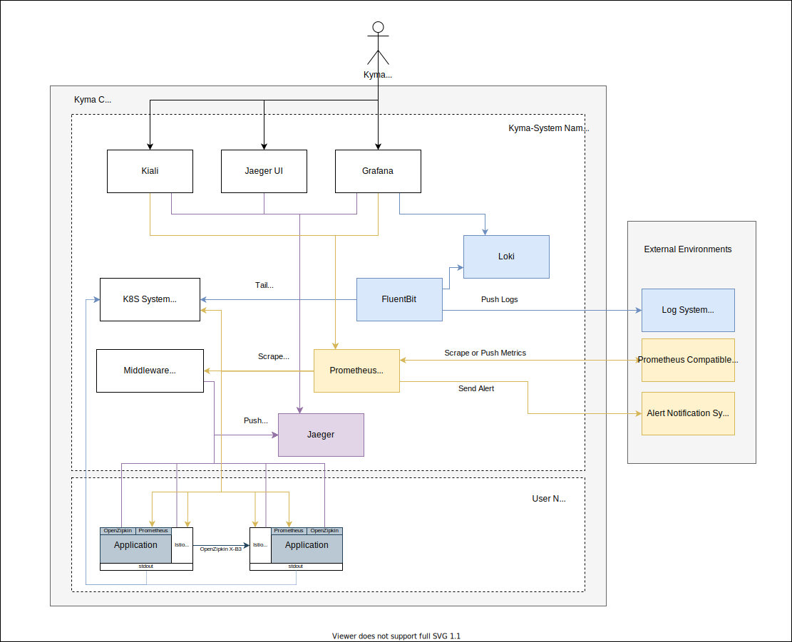
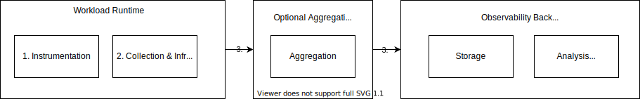
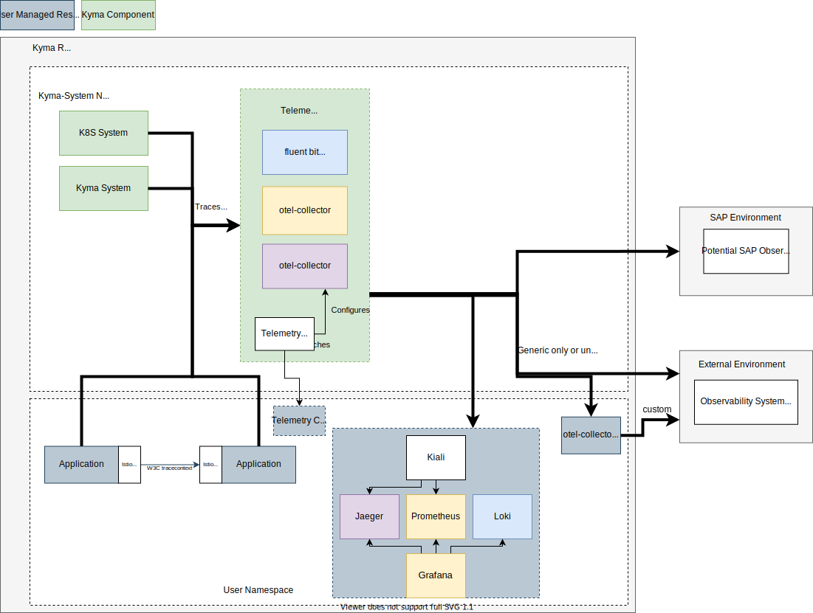

# General Strategy

## Current Situation and Motivation

In the current shape of Kyma in 2022, the observability stack is focussing on providing an opinionated and lightweight solution, working out of the box, to solve basic requirements for application operators. It is not focussing on integration aspects in order to enable for example cross-runtime observations, integration of advanced analytic tools or simple re-usage of existing infrastructure. Also it does not provide a guide on how to extend the setup to become HA with historical storage of the data. Having very limited integration possibilities and providing a limited in-cluster solution only, it is missing a lot of usage scenarios and the opportunity to focus on enabling users for modern observability. Overall, the potential audience is very limited.

The diagram shows that all three observability aspects (log, trace, metric) provide a preconfigured backend with visualisations. However, they don't provide a neutral and unified way to integrate backends outside of the cluster.
- The tracing stack provides no way to centrally push trace data to the outside.
- Logging can be configured much more flexibly and neutrally. However, users must apply the configuration during installation; otherwise it's lost at the next Kyma upgrade process. Furthermore, it is hard to mix and match different integrations, because you must deal with one centralized configuration (the Fluent Bit config).
- Monitoring is based on Prometheus, which is widely adopted but limited to the Prometheus protocols. Users can configure the monitoring stack only during the Kyma upgrade process.

Integration (and with that, changing the focus away from in-cluster backends) is the key to open up the stack for a broad range of use cases. Users can bring their own backends if they already use a commercial offering or run their own infrastructure. The data can be stored outside the cluster in a managed offering, shared with the data of multiple clusters, away from any tampering or deletion attempt of a hacker, to name just a few.

Providing ready-to-use in-cluster backends is necessarily opinionated, does not cover all usage scenarios, and does not fit into Kyma's goal of providing the Kubernetes building blocks to integrate into the the SAP ecosystem. Also, the licensing issues (particularly with Grafana and Loki, or ElasticSearch as an alternative backend technology) show that an opinionated stack is problematic. It's better to handle opinionation by integrating with actual managed services. 

The following strategy proposes a new approach for the Kyma observability stack by opening up to new scenarios by supporting convenient integration at runtime. At the same time, it reduces the focus on ready-to-use solutions running inside the cluster.

## Goals

### Stages of observability

Observability can be split up into:
1. Instrumentation of the users application
2. The collection and preprocessing of the signals from the user application and the surrounding infrastructure, including metadata enrichment
3. The delivery of the signal to an backend for storage
4. An optional aggregation of the signals
5. Storage of the signals
6. The analysis, querying, and dashboarding of the signals

Kyma is a runtime to operate actual workloads. To fulfill typical operational requirements, users must be able to observe the workload deployed to the runtime .

### Mandatory feature set

The mandatory parts for a Kyma runtime are the stages that must be happen inside the runtime. With that, the following points are the major goal of the Kyma feature set:
1. Instrumentation support: Instrumentation of workload in order to expose typical signals like logs/traces/metrics usually require custom coding. Still there are common aspects to support these tasks by providing guidelines/best practices but also by providing ways of auto-instrumentation (like istio tracing).
2. Signal collection: The runtime needs to provide the basic infrastructure to collect the emitted signals (like a unified log collector). That infrastructure should collect the signals instantly in case the user has followed the provided guides. Special cases (like specific protocols not backed by guides and infra) should be supported by simple customizations (plug-in a custom trace converter). Furthermore, the infrastructure should already enrich the signals of the workloads with metadata of the infrastructure as this cannot happen at a later stage anymore.
3. Signal Delivery: The signals need to be consumed by some party, either running inside or outside the cluster. It can be an aggregating layer or the backend directly. In any way, the shipment of the data needs to be configurable and should be based on a neutral protocol so that any aggregation layer or backend can be integrated.

The optional parts where Kyma can provide features are for the stages to the right (aggregation/storage/analysis). Here, usually a oppinionated solution must be picked as there is no common technology available. Such oppinionated solution can be pre-configured to provide either a starting point or a full-blown solution. However, these aspects will usually not cover all usage and operations/scalability scenarios. Furthermore, it will require a huge investment in order to provide just another backend solution.

With that, the goal of the kyma observability should be the seemless enablement of the stages on the left, allowing the ingestion of the signals into any backend system, opening up plenty usage scenarios. Kyma should provide blueprints for the stages on the right, especially focussed on the SAP ecosystem enablement, in order to have at least some guidance for these aspects.
To sum it up, the goals of Kyma observability should be:
1. Provide guides on instrumentation (with potential helpers and auto-instrumentation options).
2. Collect resulting signals instantly when guides are followed, provide customization options for special cases.
3. Ship the signals reliably to a configurable vendor-neutral destination.
4. Provide blueprints for integration with specific vendors.

## Architecture

The idea of the proposal is to introduce a new preconfigured agent layer that's responsible for collecting all telemetry data. Hereby, the collection is very dependent on the signal type itself. These agents can be configured at runtime with different signal pipelines with basic filtering (inclusion and exclusion of signals) and outputs, so that the agents start shipping the signals via the pipelines to the configured backends. The dynamic configuration and management of the agent is handled by a new operator, which is configured using Kubernetes resources. The agents and the new operator are bundled in a new core component called `telemetry`. The existing Kyma backends and UIs will be just one possible solution to integrate with. They continue to be installable manually by the user (via a blueprint), but will not be part of the actual Kyma offering anymore.

As mentioned before, the technology and protocols for the signal collection are different for the signal types. Logs are getting tailed from container log files, metrics are getting pulled via the prometheus format usually and traces are getting pushed via OTLP. With that, also the pre-integration so that typical signals are getting collected instantly are different per type.
That's why the concrete concepts for the different types are different and will be discussed in more detail in the individual sections:
* [Concept - Configurable Logging](./configurable-logging/README.md) 
* [Concept - Configurable Monitoring](./configurable-monitoring/README.md)
* [Concept - Configurable Tracing](./configurable-tracing/README.md)

All concepts will follow general rules and will provide harmonized user APIs:
- **By default signals of user workload will be collected**: When a workload gets instrumented as outlined in the best practice, the telemetry data will be instantly available in a pipeline without further configuration, just define a pipeline with an output and it works
- **One input protocol per type**: Only one common input protocol (like OTLP) will be supported per signal type having best practices on how to integrate with.
- **Custom input protocols can be integrated**: When a workload is not using the supported protocol for signal exposure, there is a way to have custom transformation to the supported protocol in place, usually related with additional operational effort (like running a dedicated otel-collector sidecar/deployment in the users namespace)
- **Harmonized API**: Signal pipelines are defined via well-defined Kubernetes CRDs only belonging to one group and following similar semantics.
- **One output protocol per type**: Only one common output protocol (like OTLP) will be supported per signal type.
- **Custom output protocols can be integrated**: there is a way to have custom transformation from the supported protocol in place, usually related with additional operational effort (like running a dedicated otel-collector sidecar/deployment in the users namespace). Furthermore, typical output plugins of the used collector technology will be offered as part of a pipeline definition, however the plugins will be offered with limited support only.
- **Blueprints are fully integrated**: Blueprints for local backend deployments will be integrated with the used pipeline mechanism so that they work instantly

# Execution

The outlined strategy is shifting the Kyma observability stack heavily and the transformation process needs to be executed step-wise by priorities:

1. **Transform kiali component into a blueprint**: Kiali is a very valuable tool for visualizing the Istio service mesh. It is based and dependent fully on Istio metrics via prometheus and the Kubernetes APIServer, it also brings integrations into Jaeger and Grafana. It is very specific to that toolset and needs to run in-cluster. The effort of providing a scalable HA setup fitting all usage scenarios is to high and will distract to much from the new focus of the observability stack. With that, the kiali component should get transformed into a blueprint based on the upstream kiali-operator helm chart, providing a values.yaml with instant integration. As there is no further dependency, has low investment and will save maintenance efforts, that has a high priority.
2. **Transform tracing component into a blueprint**: The tracing component bundles a Jaeger-all-in-one installation pre-integrated with Kyma's istio, serverless and eventing. The bundle is providing such lightweight setup, that it is mainly for demo purposes and should be consequently turned into a blueprint to save maintenance efforts. While turning it into a blueprint, kyma should be adjusted to leverage Istio's telemetry API to have the telemetry activatable at runtime.
2. [**Configurable Logging**](https://github.com/kyma-project/kyma/issues/11236): Introduce a configurable log collector and support log pipeline configurations at runtime with focus on the SAP eco-system as MVP. Accessing application logs is the first and most common way of troubleshooting applications and is the minimal feature users will expect.
3. **Transform logging component into a blueprint**: As soon as the application logs can be out-streamed into external systems, there is an alternative available for the in-cluster logging solution. The Loki stack (Loki + Grafana) can be turned into a blueprint having the advantage of using latest Loki versions (license problem). Again, the upstream loki helm chart can be used with a provided values.yaml with instant integration.
4. [**Configurable Monitoring**](https://github.com/kyma-project/kyma/issues/13079): Introduce a configurable metrics collector which instantly scrape all annotated workloads and make the shipment of the metrics possible via a pipeline configuration. The focus will be integrations based on OTLP to cover a lot of providers instantly. Metrics are the next most important feature to gain insights into distributed applications.
5. **Transform the monitoring component into a blueprint**: By having the configurable monitoring story realized, there will be a good way to instrument and collect metrics of workloads independent of the prometheus-operator stack. Now it is time to turn the actual prometheus storage and grafana visualization into a self-hosted component by introducing an easy to install blueprint. Kyma specific Grafana Dashboards might be still bundled and maintained. All other dashboards are anyway already based on the upstream kube-prometheus-stack on which the blueprint will be based.
6. [**Configurable Tracing**](https://github.com/kyma-project/kyma/issues/11231): Switch the official trace propagation protocol to W3C-tracecontext and introduce a configurable trace collector based on OTLP. 
