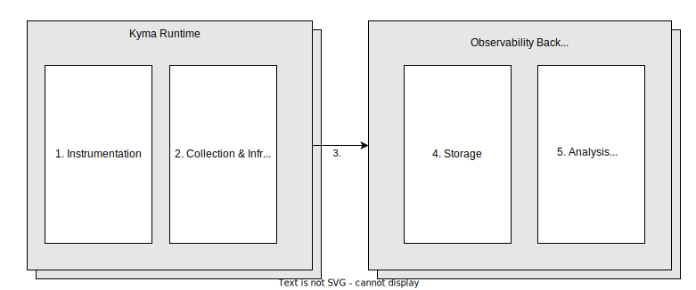
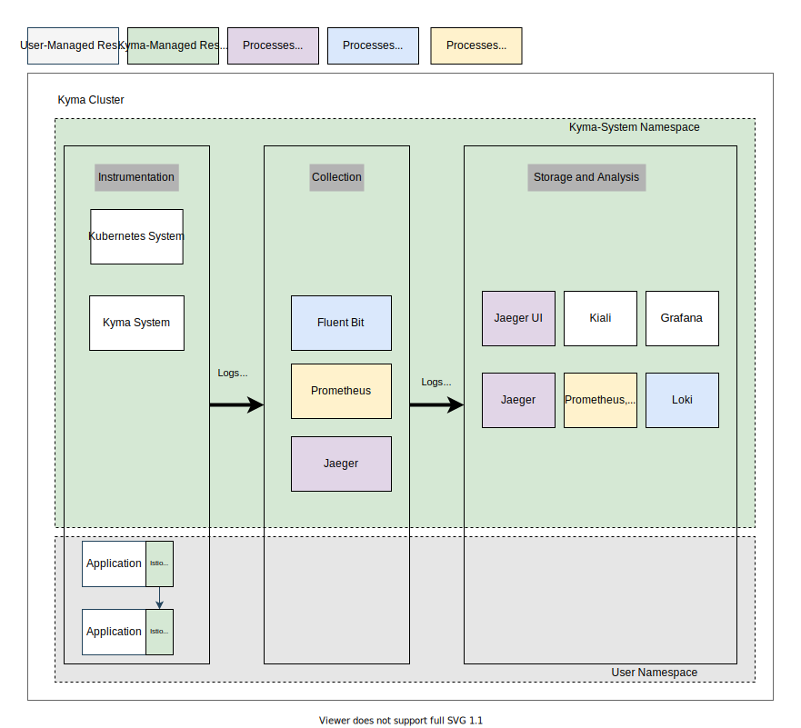
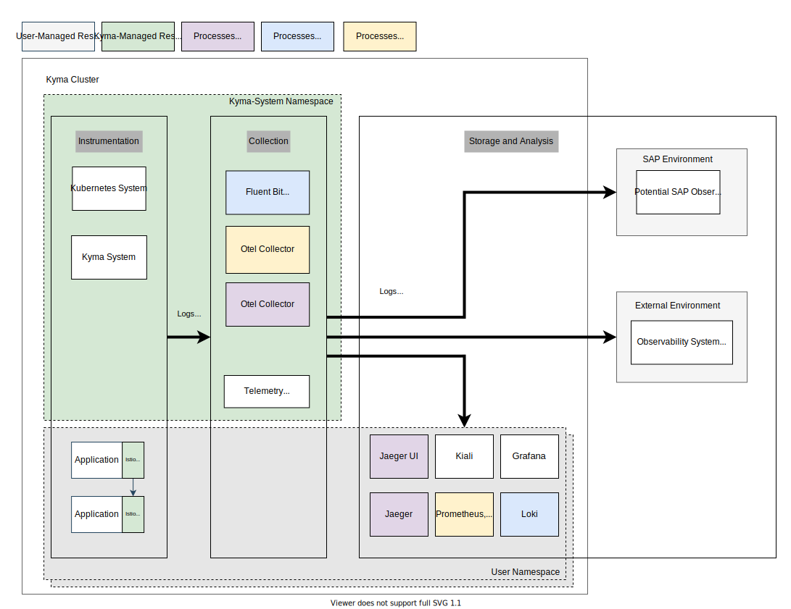
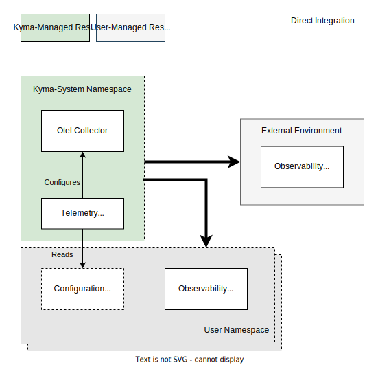
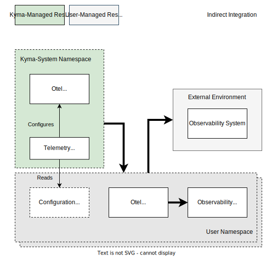
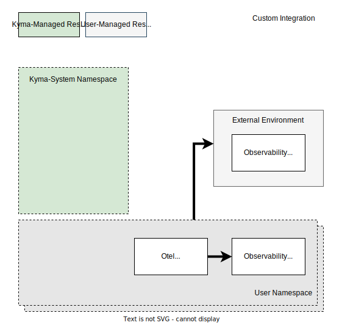

# From Observability to Telemetry - a strategy shift in Kymas Observability feature

## Motivation

The Kyma project evolved over time, from an extensibility framework with "batteries included", to a runtime that focuses on providing Kubernetes building blocks with enterprise-grade quality. Up until now, the Kyma Observability feature has been providing an out-of-the box in-cluster stack that gets you started immediately, but which does not qualify for enterprise-grade qualities. Various observability backends are already available as managed services from different vendors fulfilling these criteria. The possibility for integration with these offerings will not only bring the missing value, but also openness - it is up to the users' scenarios which observability system fits best to their requirements.
When Kyma supports a simple way of instrumenting, collecting and integration of the workloads telemetry data into available observability systems, leveraging the [OpenTelemetry](https://opentelemetry.io/) standards to provide integration options in a vendor-neutral approach, the Kyma Observability feature is ready for its evolution, too.

With that, Kyma will shift the focus away from providing a full Observability solution; instead it will simplify the instrumentation and integration of telemetry data into external systems.

## Current Situation

The Observability domain can be split up in the following stages:

1. **Instrumentation** of the user application
2. **Collection** and preprocessing of the signals from the user application and the surrounding infrastructure, including metadata enrichment
3. **Delivery** of the signal to an backend for storage
4. **Storage** of the signals
5. **Analysis**, querying, and dashboarding of the signals

The current Kyma observability stack covers all mentioned stages, providing a lightweight and opinionated end-to-end setup inside the cluster, which solves basic requirements for application operators. It can mainly be configured at installation. It does not focus on integration aspects that would support, for example, cross-runtime observations, advanced analytic tools, or reuse of users' existing observability infrastructure. Also, the current observability stack does not provide a guide how to extend the setup to become highly available (HA) with historical storage of the data.

### Application Logs

- Instrumentation is done by printing logs to stdout/stderr as recommended by Kubernetes best practices. System components are following that guide, and logs are available already; no other way to collect logs.
- Fluent Bit as log collector defines a hardcoded pipeline for collecting, enriching, and pushing the logs to a backend. No further configuration of pipelines at runtime, especially additional outputs for external systems cannot be configured.
- Storage is realized by a lightweight (non-scalable) Loki installation. No configuration at runtime.
- Reporting is implemented by the log explorer of Grafana.
  
### Metrics

- For instrumentation, a workload must expose metrics in the Prometheus-compatible format. System components are already doing that. No other way of exporting metrics, like using the OTLP push-based protocol,  is supported.
- Collection of metrics from system and custom workloads is done by a lightweight Prometheus installation. Configuration of collection can be defined at runtime, but the storage might not scale accordingly, requiring adjustments at deploy time. Configuration of outputs is not possible at runtime and only Prometheus-specific protocols are supported (forward or federation).
- Prometheus collects and stores the metrics. The setup is non-scalable, and resource settings cannot be configured at runtime.
- Reporting is done by a Grafana installation, which loads pre-bundled dashboards. Dashboards can be added at runtime.
  
### Traces

- Trace context must be propagated with the Zipkin B3 protocol, which is supported by the Istio infrastructure. From a workload perspective, it must propagate trace context with requests, and then can send additional span data to the Jaeger collector in the Jaeger or Zipkin protocol. The Istio, Serverless, and Eventing components support that already.
- The Tracing component is based on the Jaeger all-in-one deployment, which acts as collector and is not scalable independently from the backend part. There are well-defined services in the cluster to which an application can push the span data. However, it is tightly coupled to the related backend and does not provide any customization, especially no integration into other systems.
- Storage is based on a restricted in-memory store. Thus, it is non-scalable and data is lost on restarts.
- Visualization is available in the "Explore" tab in Grafana or the bundled Jaeger UI. Again, no further customization is possible.

### Drawbacks

At a first glance, the current solution provides a feature-rich end-to-end setup. However, at a second glance, users notice major drawbacks that aren't a good fit for enterprise-grade software and usually require to bring an own backend.

- Very limited integration possibilities to external systems. Integration is usually needed for different reasons, such as cross-cluster correlation, forensic analysis, or long-term storage. Kyma's integration points are not vendor-neutral.
- Very limited configuration options for data enrichment and filtering. Users want to enrich the data with data relevant for their environments, like cluster names. Furthermore, they want to filter out irrelevant log lines or log attributes within a line to save resources and money in the backend.
- Storage backends are non-scalable, so they can be used only in limited scenarios. Users cannot upgrade the backend into a scalable setup, nor integrate with other solutions.

## Requirements

Integration (and with that, moving the focus away from providing backends) is the key to open up the stack for a broad range of use cases. Users can bring their own backends if they already use a commercial offering or run their own infrastructure. To name just a few advantages, the data can be stored outside the cluster in a managed offering, shared with the data of multiple clusters, and kept away from any tampering or deletion attempts by hackers.

Providing ready-to-use in-cluster backends is necessarily opinionated, does not cover all usage scenarios, and does not fit into Kyma's goal of providing the Kubernetes building blocks to integrate into the the SAP ecosystem. Also, the licensing issues (particularly with Grafana and Loki, or Elasticsearch as an alternative backend technology) show that an opinionated stack is problematic. It's better to handle opinionation by integrating with actual managed services.

Instrumentation and integration of telemetry data into external systems can be complex and is heterogenous. To simplify those tasks, Kyma will provide instrumentation conventions so that provided collectors can automatically pick up the data and make the integration problem a central aspect.

### Mandatory features

To support integration as a key element, a Kyma runtime must support the stages that happen within the runtime itself (instrumentation, collection, delivery). Thus, the following points are mandatory for the future Kyma observability stack:

1. Instrumentation support: Users usually need custom code for the instrumentation of a workload to expose typical signals like logs, traces, and metrics. Kyma can support common aspects of these tasks with guidelines, best practice guides, and ways of auto-instrumentation (like Istio tracing).
2. Signal collection: The runtime must provide the basic infrastructure to collect the emitted signals (like a unified log collector). If the user has followed the provided guides, that infrastructure should collect the signals instantly. Special cases (like specific protocols not backed by guides and infrastructure) should be supported by simple customizations (plug in a custom trace converter). Furthermore, the infrastructure must already enrich the signals of the workloads with metadata of the infrastructure, because this cannot happen at a later stage.
3. Signal delivery: The signals must be consumed by some party, either running inside or outside the cluster. It can be an aggregating layer or the backend directly. In either case, the shipment of the data must be configurable and should be based on a neutral protocol, so that any aggregation layer or backend can be integrated.

### Optional features

Optionally, Kyma can provide features for the later stages (aggregation, storage, and analysis). Here, users typically must pick an opinionated solution because there is no common technology available. Kyma can support such opinionated solutions by preconfiguring either a starting point or a full-blown solution. However, these aspects will usually not cover all usage, operations, and scalability scenarios. Furthermore, huge investments are necessary to provide any additional backend solution.

The goal of the Kyma observability stack should be seamless enablement of the first three stages, supporting the ingestion of the signals into any backend system, opening up plenty usage scenarios. Kyma should provide at least blueprints as guidance for the latter stages, especially for enabling the SAP ecosystem.
To sum it up, the goals of Kyma observability should be:

- Provide guides on instrumentation (with potential helpers and auto-instrumentation options).
- Collect resulting signals instantly when guides are followed, provide customization options for special cases.
- Ship the signals reliably to a configurable vendor-neutral destination.
- Provide blueprints for integration with specific vendors.

## Architecture

The strategy shift will be backed by a new layer of collectors that are no longer bound to any backend. This layer is responsible for collecting and enriching all telemetry data, depending on the signal type i.e. logs, traces, metrics. As long as the best practices for instrumentation are followed, the data is collected automatically.

Users can configure the collectors at runtime with different signal pipelines using basic filtering (inclusion and exclusion of signals) and outputs, so that the collectors start shipping the signals through the pipelines to the configured backends. The dynamic configuration and management of the collector is handled by a new operator, which is configured using Kubernetes API. The collectors and the new operator are bundled in a new core component called `Telemetry`.

To guarantee enterprise-grade qualities, the configuration options for the collectors using the Kubernetes API will be limited. However, users can run their own collector setup for advanced customization options at any time.

The existing Kyma backends and UIs will be just one possible solution to integrate with. Users will still be able to install them manually with a blueprint.

The technology stack for instrumentation and collection will be based on the [OpenTelemetry](https://opentelemetry.io/) project. The central data protocol will be [OTLP](https://opentelemetry.io/docs/reference/specification/protocol/); for trace propagation it will be [w3c-tracecontext](https://www.w3.org/TR/trace-context/). As exception to that, the technology stack for log collection will be based on the [Fluent Bit](https://fluentbit.io/) and [Fluentd](https://www.fluentd.org/) ecosystem and the specific protocols, with the goal to adopt to OpenTelemetry at a later time.

As mentioned before, the collector setup and used protocols for the signal collection are specific to the signal types: Logs are tailed from container log files, metrics usually are pulled using the Prometheus format, and traces are pushed with OTLP. With that, the pre-integration (so that typical signals are collected instantly) is different per type.
That's why the concrete concepts for the different types are different, and are discussed in more detail in the following documents:

- [Concept - Configurable Logging](./configurable-logging/README.md)
- [Concept - Configurable Monitoring](./configurable-monitoring/README.md)
- [Concept - Configurable Tracing](./configurable-tracing/README.md)

All concepts follow general rules and will provide harmonized user APIs:

- **By default, signals of user workloads are collected**: If a workload is instrumented as outlined in the best practice guide, the telemetry data is instantly available in a pipeline without further configuration. Just define a pipeline with an output and it works.
- **One input protocol per type**: Only one common input protocol (like OTLP) is supported per signal type. Kyma provides best practice guides on how to integrate with it.
- **Custom input protocols can be integrated**: When a workload doesn't use the supported protocol for signal exposure, users can have custom transformation to the supported protocol, usually with additional operational effort (like running a dedicated Otel Collector sidecar or deployment in the user's Namespace).
- **Harmonized API**: Signal pipelines are defined by well-defined Kubernetes CRDs that belong to only one group and follow similar semantics.
- **One output protocol per type**: Only one common output protocol (like OTLP) is supported per signal type.
- **Custom output protocols can be integrated**: Users can have custom transformation from the supported protocol, usually with additional operational effort (like running a dedicated Otel Collector sidecar or deployment in the users' Namespace). Furthermore, Kyma offers typical output plugins of the used collector technology as part of a pipeline definition; however, only with limited support.
- **Blueprints are fully integrated**: Blueprints for local backend deployments are integrated with the used pipeline mechanism, so that they work instantly.

## Integration Options

With the new Observability architecture in place, the in-cluster backends won't be integrated by default out-of-the box. Instead, users will have the following three options to start their journey: Direct integration, indirect integration, and custom integration:

### Direct Integration

There will be a vendor-neutral integration point provided for integration of traces, metrics, and logs, mainly using the OpenTelemetry Protocol (OTLP). To configure a new destination and select the data to be sent (for example, from specific Namespaces only), users can provide a custom configuration - a Kubernetes resource for a Kyma CRD. The system to integrate must support the protocol natively and can be either an external managed offering of a different vendor, or a custom system operated externally or even in-cluster. To get started quickly, Kyma will provide a blueprint to get the classic in-cluster setup deployed.

### Indirect Integration

If the system to integrate with does not provide the vendor-neutral protocol natively, a converter is needed. Typically, this requires running a collector that supports OTLP and is configured as target for the direct integration. That collector then takes care of the conversion into the custom protocol and integration with the target system. Usually, that task will be realized by a custom Otel Collector instance.

### Custom Integration

If users find the configuration options of the collector layer still too limiting, they can bring their own collector setup and disable the respective Kyma component for a signal type (logs, traces, metrics) so that it won't consume resources. With such custom setup, users get full  flexibility but also full responsibility. Users can also bring their own APM tooling at any time.

## Conclusion

Kyma's new focus in the observability area supports the users in getting their telemetry data into an external system in a reliable, effortless, and vendor-neutral way. Hereby, integration of the classic in-cluster solution is just one option. With the new approach, Kyma users get the flexibility to pick the solution fitting to their needs.

## Execution

The outlined strategy shifts the Kyma observability stack heavily, and the transformation process must be executed stepwise by priorities:

1. [**Configurable Logging**](https://github.com/kyma-project/kyma/issues/11236): Introduce a configurable log collector and support log pipeline configurations at runtime with focus on the SAP ecosystem as MVP. Accessing application logs is the first and most common way of troubleshooting applications and is the minimal feature that users expect.
2. [**Transform Kiali component into a blueprint**](https://github.com/kyma-project/kyma/issues/15412): Kiali is a very valuable tool for visualizing the Istio service mesh. It is based and fully dependent on Istio metrics from Prometheus and the Kubernetes APIServer, and brings integrations into Jaeger and Grafana. It is very specific to that toolset and must run within the cluster. The effort of providing a scalable HA setup fitting all usage scenarios is too high and distracts from the new focus of the Kyma observability stack. Thus, the Kiali component must be transformed into a blueprint based on the upstream kiali-operator Helm chart, providing a `values.yaml` file with instant integration. This step has high priority because it has no further dependency, low investment, and reduces maintenance efforts.
3. [**Configurable Tracing**](https://github.com/kyma-project/kyma/issues/11231): Switch the official trace propagation protocol to [W3C-tracecontext](https://www.w3.org/TR/trace-context/), and introduce a configurable trace collector based on OTLP.
4. **Transform Tracing component into a blueprint**: The tracing component bundles a Jaeger-all-in-one installation pre-integrated with Kyma's Istio, Serverless, and Eventing components. The bundle has a very lightweight setup that is mainly for demo purposes. It should be turned into a blueprint to save maintenance efforts. In the same step, Kyma must be adjusted to leverage Istio's telemetry API so that the telemetry can be activated at runtime.
5. [**Configurable Monitoring**](https://github.com/kyma-project/kyma/issues/13079): Introduce a configurable metrics collector that instantly scrapes all annotated workloads and supports the shipment of the metrics with a pipeline configuration. To cover a lot of providers instantly, the focus is on integrations based on OTLP. After logs, metrics are the next important feature to gain insights into distributed applications.
6. **Transform Logging component into a blueprint**: As soon as the application logs can be out-streamed to external systems, Kyma can choose alternatives for the in-cluster logging solution. The Loki stack (Loki and Grafana) can be turned into a blueprint with the advantage of using the latest Loki versions (solving the license problem). Again, users get instant integration with the upstream Loki Helm chart and a provided `values.yaml` file.
7. **Transform the Monitoring component into a blueprint**: After finishing the configurable monitoring story, there is a good way to instrument and collect metrics of workloads independently of the Prometheus Operator stack. Now Kyma can introduce a blueprint to turn the actual Prometheus storage and Grafana visualization into a self-hosted component. Kyma-specific Grafana dashboards might be still bundled and maintained. All other dashboards are anyway based on the upstream kube-prometheus-stack, on which the monitoring blueprint will be based.
