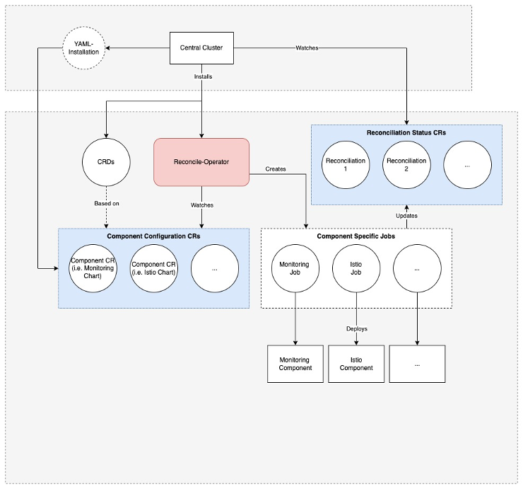
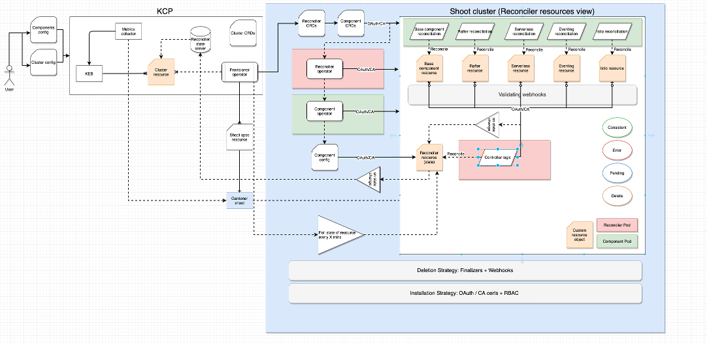
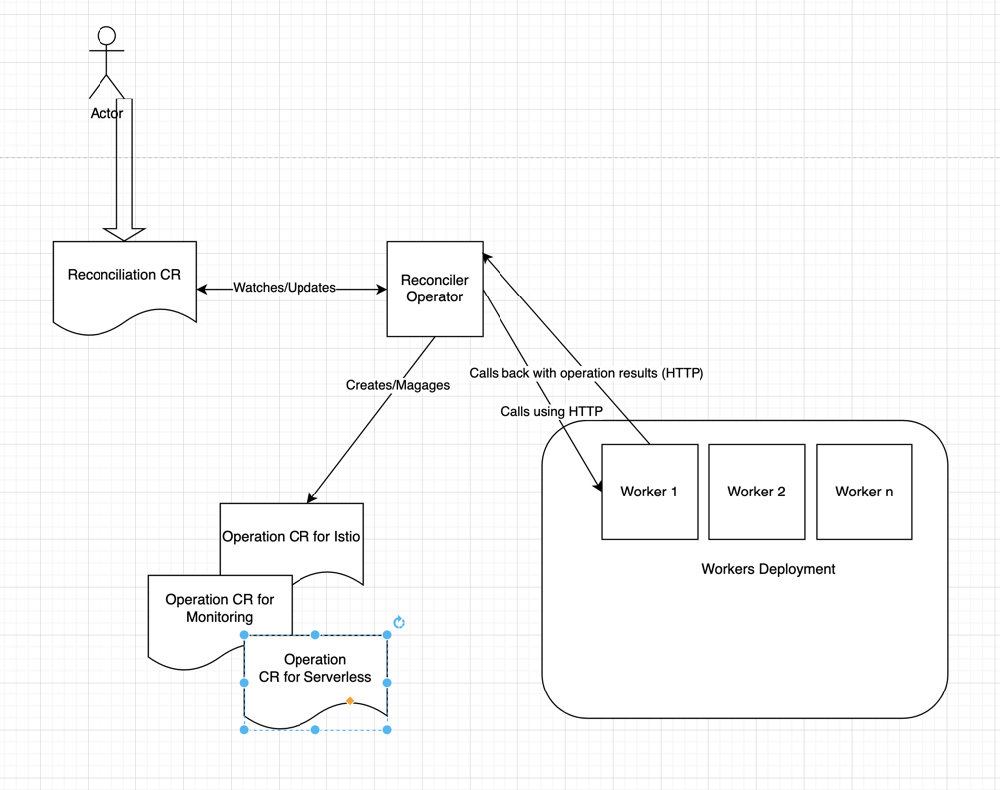

# Operator-based Reconciler

## Motivation
Reconciler is a framework to install, update, and repair Kyma components in managed Kyma Runtimes. The reconciliation runs in the loop to ensure that all components are up and running and properly configured.
While we currently have a custom reconciliation logic in place, we could make use of the Kubernetes Control Loop and reconciliation and an Operator-based approach to maintain our reconciliation through Kubernetes natively.

We are currently having these issues in our current reconciliation:
- Scheduling / Job-based
  - We have inbuilt limits on how fast a reconciliation can work by having bad worst case scheduling scenarios (e.g. reconciliation updates only get picked up every 45 seconds through our bookkeeper)
  - Reconciliation must be externally managed from outside the Cluster as there is no internal state management inside a shoot, this requires either the CLI or a control plane cluster with a mothership
  - Callback / Health Pings limit the minimal time spent on reconciliation due to overhead and usually lead to problems if communication bottlenecks or instability occurs
- Performance Issues while scheduling/managing Reconciliations for >10k Clusters
  - API-Server Interactions with lots of overhead for many clusters must be managed by reconciler instances
  - Scheduling and Worker-Pools are necessary to reduce load in the individual reconcilers
  - Heavy Load on both Mothership and Component Reconciler with >20G RAM consumed from KCP alone on Reconciliation components
- Issues with relational data model and PostgreSQL for managing configuration and status as well as problems in quick read interactions for regularly checking active status of a reconciliation
- Reconciler maintenance bottleneck for Kyma teams
  - one codebase without ability for modular CI/CD and Releases independent of Jellyfish
  - Reconciliation of managed clusters currently is mostly stuck only because of technical errors outside of Reconciler Influence and needs input from SRE / Support anyhow

## Proposed changes

### Operator-based Reconciliation

- Should encompass one or many Operator(s) which can reconcile a Shoot Cluster from empty to working Kyma on their own without external influence
- Uses CRDs to manage Kyma Components and their necessary Reconciliation
- Uses CRs to report State of the Reconciliation of a Cluster that can be externally viewed via Kubernetes API (e.g. through kubectl or a central provisioning component in the control plane)
- Can be simply installed through provisioning of CRDs and/or Operators
- Does not need explicit State Management outside of CRs managed by the Operator
- Can be deployed inside the Cluster to be reconciled and manage itself
- Can be integrated through a reported Cluster State into an external Provisioning / Reconciliation for consolidation in KCP
- Uses one single source of truth for configuring which Kyma Components are enabled
- Only consumes load when actively reconciling by smartly managing deployments and instances used for reconciliation, scaling down and passively watching the compliant cluster
- Able to gracefully manage failing reconciliations through smart resilience patterns (retry backoff), resulting in external support ticket or external reconciliation when not resolved on its own

## High level architecture (WIP)

### Idea 1 - One Operator, Many CRDs, One Status

Central Cluster Installs CRDs and Operator
Installs CRs
Watches Reconciliation Status CRs (Pull or Push undecided)
One Operator does everything (Reconcile-Operator)

One CRD is one Component (e.g. one for Monitoring)

Workflow:
1.	YAML-Installation
1.	CRDs
2.	Component CRs
3.	Reconcile Operator triggered based on Component CRs
2.	On Trigger
1.	Deploy Job (for Component)
2.	Takes care of installing one component
3.	Updates / Creates Status CR
4.	Status Updates get summarized
3.	Reconcile Operator reestablishes Jobs on-demand
4.	Watching/Creating Status are managed by Jobs

### Idea 2 - 2 Operators, Many CRDs, One Status

- One CRD for Reconciler, Many Component CRDs
- Many Component CRDs because there are different specs possible for different components
- Steps:
  - CRD installation
  - Operator Installation for Reconciler
  - Operator Installation of Components
  - Summary is a State CR of the Reconciler plus current Configuration
- The State CR is watched by the Controller and will trigger the resources based on the different CRs from individual component CRDs
- The Component CR is watched by the reconciliation of the individual components
- We also have only one single Operator for all reconciliations
- We could restrict deletion of CRs based on OAuth /CA BUT this only works on managed (not BYOC)
- We could use validating webhooks and dependencies to avoid messing our configs by the user (different layers of protection)
- Whenever reconciliation is done, it will trigger on state updates
- The Reconciler Resource can then also update its final cluster state
- Reconciler is watched by HTTP in a Poll

### Proposal 3

- One Single Reconciler Operator
- One CR for the Reconciliation CRs
- Problem of multiple CRs -> Doesn't fit into Operator model
- Many CRs for the different Component Operations, watched / created by Operator
- If there is specific configuration then they will be on the CRs
- Operation CRs are used as Bookkeeping Device (Progress tracking), stateful
- Not many operators for all components
- For bigger clusters we want to increase the workers/deployments for the components
- One worker will be a reconciler binary
- One worker will not touch the Operation CRs
- Focus on FAST iteration and POCs so a single operator is beneficial for iterating, together with the current binary as well as Reuse

Flow:
1.	Actor creates reconciliation CR -> Create Reconciler Deployment is prerequisite (e.g. sources for kyma)
2.	Reconciler Operator watches and creates worker deployment based on the CR -> making HTTP Calls for Workers
3.	Each Worker is the same and can take of everything
4.	Once worker is finished it does a callback to the reconciler operator for the specific reconciliation
5.	Worker is done
6.	Operator can scale workers down on demand, updates state on-demand

### Final Proposal

### Questions Asked During Investigation

#### One vs Many Operators for reconciliation?

- PRO
  - X

- CON
  - X

Suggestion:

Decision:

#### How do we reflect the Cluster State?

- Approach A
  - X

- Approach B
  - X

Suggestion:

Decision:

#### How do we protect the changes in the cluster from a user?

- Approach A
  - X

- Approach B
  - X

Suggestion:

Decision:

#### One CRD vs Multiple CRDs for maintaining Reconciliation Configuration?

- PRO
  - X

- CON
  - X

Suggestion:

Decision:

#### How much do we want to rely on Operator Native Communication vs HTTP based Service in a Deployment?

- Approach A
  - X

- Approach B
  - X

Suggestion:

Decision:

