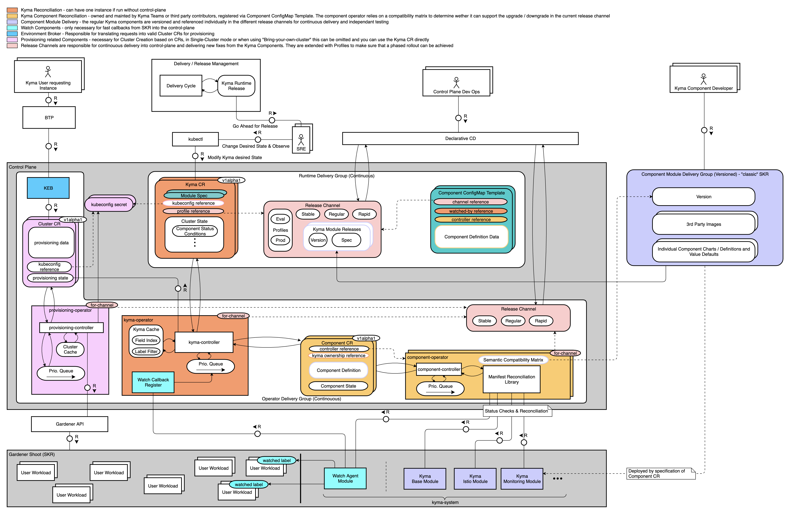
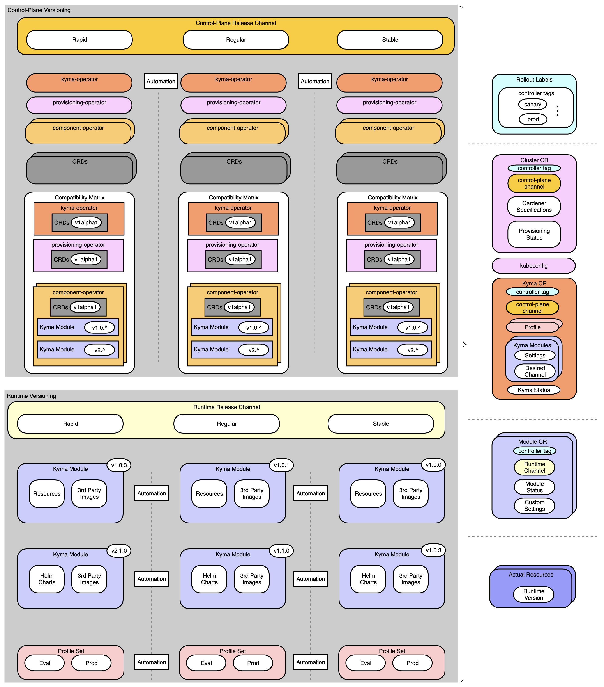

# Operator-based Reconciler

## Motivation

Reconciler is a framework to install, update, and repair Kyma components in managed Kyma Runtimes. 
The reconciliation runs in the loop to ensure that all components are up and running and properly configured.
While we currently have a custom reconciliation logic in place, we could make use of one or more Kubernetes Operators to manage Control Loops and Desired States natively.

We are currently having these issues in our current reconciliation:

- Scheduling / Job-based
  - Static limits on how fast a reconciliation can achieve its desires state, by having worst case scheduling scenarios (e.g. reconciliation updates only get picked up every 45 seconds through our bookkeeper)
  - Reconciliation must be externally managed from outside the Cluster as there is no internal state management inside a shoot, this requires either the CLI or a control plane cluster with a Mothership
  - Callback / Health Pings limit the minimal time spent on reconciliation due to overhead and usually lead to problems if communication bottlenecks or instability occurs
- Performance Issues while scheduling/managing Reconciliations for >10k Clusters
  - API-Server Interactions with lots of overhead for many clusters must be managed by reconciler instances
  - Scheduling and Worker-Pools are necessary to reduce load in the individual Reconcilers
  - Heavy Load on both Mothership and Component Reconciler with >20G RAM consumed from KCP alone on Reconciliation components
- Issues with relational data model and PostgreSQL for managing configuration and status as well as problems in quick read interactions for regularly checking active status of a reconciliation
- Reconciler maintenance bottleneck for Kyma teams
  - one codebase without ability for modular CI/CD and Releases independent of the team responsible for the Reconciler
  - Reconciliation of managed clusters currently is mostly stuck only because of technical errors outside of Reconciler Influence and needs input from SRE / Support anyhow

## Proposed changes

### Operator-based Reconciliation

To combat our issues we want to favor a more native, decentralized and scalable approach built on top of best-practices and proven development tactics in Kubernetes. One of these tactics for in-cluster automation is the Operator Pattern.

From the [Kubernetes Documentation](https://kubernetes.io/docs/concepts/extend-kubernetes/operator/):

> Kubernetes is designed for automation. Out of the box, you get lots of built-in automation from the core of Kubernetes. You can use Kubernetes to automate deploying and running workloads, and you can automate how Kubernetes does that.
> Kubernetes' operator pattern concept lets you extend the cluster's behaviour without modifying the code of Kubernetes itself by linking controllers to one or more custom resources. Operators are clients of the Kubernetes API that act as controllers for a Custom Resource.

We want to make use of this design pattern to optimize and enhance our current Reconciliation control loop. The core characterics are:

- The new architecture should encompass one or many Operator(s) which can reconcile a Gardener Shoot Cluster from empty to working Kyma on their own without external influence
- The architecture uses versioned configurations (ConfigMaps) to manage component custom resources, which should trigger component reconciliations in the cluster
- The architecture uses CRs to report State of the Reconciliation of a Cluster that can be externally viewed via Kubernetes API (e.g. through kubectl or a central provisioning component in the control plane)
- The reconciliation infrastructure can be simply installed through provisioning of CRDs, component configurations and operators, maybe through its own Helm Chart
- The reconciliation does not need explicit State Management outside of CRs managed by the Operator like we have currently with the Mothership
- The components for reconciliation can be deployed inside the Cluster to reconcile and manage itself
- The reconciliation components can be integrated through a reported Cluster State into an external Provisioning / Reconciliation for consolidation in a Control Plane Cluster (Kubeception)
- The reconciliation uses one single source of truth for configuring which Kyma Components are enabled and what Settings are used in the Cluster
- The reconciliation only consumes measurable load when actively reconciling by smartly managing deployments and instances used for reconciliation, scaling down and passively watching the compliant cluster
- The reconciliations of registered components are de-coupled, thereby providing a better root cause analysis

### POC for verifying Reconciliation based on Operators

To verify that our changes have the desired effect and can solve the issues that we face, we should introduce a method of Verification, we propose a POC.

The POCs main focus points should be

1. Clarify which Operator Framework we can use and what Advantages / Disadvantages they have. We can leverage the knowledge of the team for this but should come up with a recommendation
2. Decide a common approach to make sure that we are able to abstract the Operator communication not only for interaction with a local cluster (the cluster where the operator is running on) but also a remote cluster
3. Make sure that we can safely watch all necessary Kyma Resources without much CPU or Memory Overhead for a Reconciler
4. Make sure that our Developer Experience does not suffer from the new approach. Ideally, we want to be able to take over Component Reconciler Logic and keep the interfaces as stable as possible

A derived action plan should tackle the following topics (from first to last):

1. Create a decision document on which Operator Framework to use / not to use (e.g. kubebuilder, operator-sdk, native) and why (can be running document and updated regularly on changes)
2. Spin-Up a Bootstrap Operator Repository for a Component Reconciler in which we can work further, communicate existance of POC goals in Kyma teams to raise awareness and prompt for collaborators
3. Create an interface similar to our current K8s client in the reconciler that can deal with in-cluster and remote cluster API-Server Access
4. Create an implementation that is able to deal with deploying and updating Helm Chart data (templated charts as native resources)
5. Create a suggestion for a separate Provisioning Operator that can deploy CRDs and the Component Operator
6. Derive a final Low-Level Architecture that suggests a scaled implementation while making sure to keep team responsibility separate

## High level architecture

For Operator-based reconciliations, we want to enable maximum flexibility of the architecture depending on the needs of the Kyma user. This means that we want to allow

1. Fully Independent Small-Scale Clusters able to reconcile themselves, relying on external node setup (e.g. running for a local evaluation in k3d or for smaller scale deployments)
2. Fully centralized Control Plane Configurations, in which the Control Plane is not only provisioning the cluster, but also hosting the reconciliation, ensuring minimal overhead in the workload cluster
3. Lightweight Control Plane Configurations (Hybrid Mode), in which the Control Plane is able to provision the cluster and create/update an inventory of all managed cluster, but not taking care of reconciliation

The main focus of the POC will be to prove the functionality of the Reconciliation Operator to work with all 3 modes independant of the final implementation. The POC needs to prove that we are able to reconcile a cluster remotely or in-cluster without a significant difference in reconciliation logic.

### Single-Cluster (Small-Scale)

In this setup, the only things necessary for reconciliation are deployed in a single cluster that is provisioned externally (for example through k3d). 
The Kyma CLI is able to quickly bootstrap a cluster into existence through interacting with the k3d cli, and then deploying the kyma-perator directly into the Cluster.
In SIngle-Cluster mode there is no necessity to load in a third-party kubeconfig for remote interaction. This means that the Kyma CR can be provisioned as is without having to have any other information for provisioning.

The Kyma Operator will then use the supplied Release Channel and Components to deploy a Reconciliation Operator and its corresponding CRDs. The Reconciliation Operator can spin up multiple informer queues based on the operator pattern to watch and reconcile the different enabled Kyma components.

The Reconciliation Operator will update the state custom resource which is regularly checked by the Provisioning Operator. In case the State is pending for too long or is in an error state (e.g. because the cluster was not configured with enough memory), the provisioning is able to gracefully fail or retry the reconciliation depending on the input configuration.

In addition, the Busola UI will be deployable in the cluster and can make the Kyma Operator and the owned CRs visualizable in the cluster making the setup fully encapsulated aside from the initial cluster provisioning, making it perfect for small-scale deployments.

### Centralized Control Plane Configurations
In this scenario, The SKR Cluster will rely purely on the Control Plane to have its reconciliation triggered and executed, in a similar offloading paradigm as the previous mothership reconciler. 
This has the major advantage of us being able to offload the work into the control plane, but comes with the issue that the component-operator reconciling the cluster has to remotely access the cluster, making Watch API interactions costly and potentially error-prone and also requiring the introduction of another part, the provisioning operator responsible for spinup of the infrastructure. 
The kubeconfig will be provided through progressing the Cluster CR by the provisioning-operator. 

To reconcile a module, the component-operator can use the Component CR reference to the Kyma CR by looking up the kubeconfig to regularly reschedule a reconciliation in a given interval and triggering the reconciliation whenever the status is still pending or failing.

In comparison to the current reconciliation model, the component-operator will not update the state of the reconciliation itself through a callback, but will rely purely on the Component/Module CR State managed in the Control Plane. This can potentially lead to scalability issues when dealing with a big amount of clusters and their state and we will have to test the performance of reconciling a lot of remote clusters at the same time from a component-operator. To make development of a component operator easier, we will supply a reference library for reconciling charts and updating the CR state as well as develop best practices to develop your own component CR.

### Lightweight Control Plane Configurations

This configuration is a slight alteration and mixture of the previous approaches. Its general idea is that the control-plane will offload the component-reconciliation work into the runtime cluster, only reconciling the component-operators themselves and checking on the state of the modules regularly. This allows a much easier scaling of the control-plane, which the disadvantage of less control over the component reconcilers.

Whenever there is a new entry found in the cluster CRs a new cluster has to be created through the provisioning operator.
For this, the Provisioning Operator can communicate with an external Provider (e.g. Gardener) and create the cluster as a prerequisite for the reconciliation. After the Cluster has been provisioned, it will now (in comparison to the centralized version) deploy the Reconciliation Operator into the provisioned cluster.

This can happen for many clusters at the same time, in which case the Provisioning Operator will make sure to only keep the currently updating clusters of the inventory in its informer queue based on the inventory.

Note that the inventory has to be highly available and will need to make sure that transactional guarantees are eventually consistent and atomic.
Also note that the Provisioning Operator can still fetch the status of its managed clusters and regularly reschedule failed or pending reconciliations of components.

## Inventory Design - Versioned Kyma CRs and Release Channels

When designing our inventory, we want to stay as close to kubernetes-native directives as possible, especially compared to the previous reconciler approach. We want to manage the entire inventory of a Kyma Cluster through a set of smartly entangled CRs that enable interaction in a declarative and easy structure. 
As such, we will enforce a central `Kyma` CR that will be the Centerpoint of our reconciliation, based on a detailed versioning scheme supporting backups / rollouts similar to the kubernetes-native `rollout` functionality. 

Component CRs will reflect the state of a component reconciliation for a given cluster by updating their reconciliation status in the CR, which the Kyma CR will aggregate into a final `Health Indicator`. 
This Health Indiciator together with its lifecycle management through versioned Kyma Releases will be used to determine an `Active Channel`. 
This will be the single source of truth for the actually enabled Kyma Channel in a Cluster after the last successful reconciliation. 
In case of failure, the Kyma CR will be changed to the Status `Progressing` (similar to the kubernetes native deployment) until the failure was resolved, or a backoff was exhausted, in which case an up/downgrade will be considered failed. 
In this case, we will ensure there are alert rules available to detect these CRs and ping SREs through the Control Plane monitoring capabilities to manually intervene. 

Ideally the SRE is able to remediate the Cluster Reconciliation by backing up the state through our revision management. 
If not, we are able to deduce the exact error state and time through issuing of timed Kubernetes Events, our Control-Plane monitoring stack, as well as the individual Component Status in the CRs for that Kyma Release, allowing for much more fine-grained debugging control.

### Determining Module Versions for a Kyma Installation
Since a Kyma Installation will only be referenced through a Release Channel, e.g. stable, the actual Module Versions can change or get upgraded regularly. 
This means that the individual modules for installing Kyma (e.g. Monitoring) would have their own versioning scheme which would be mapped to a release-channel through a compatibility matrix. 

When developing a component module, we will then need

- A Component CR responsible for State Management and Status Observability
- A component-operator implementing the reconciliation on an external kubeconfig or an incluster configuration
- A helm chart in the kyma releases that is versioned
- A compatibility matrix that maps all known helm chart versions towards a component-operator build

Whenever implementing a new feature requiring a breaking change on the operator, one will also have to increase or change the compatibility matrix. As long as only the resource changes, but stays compatible with the operator, only the helm chart version has to be incremented. Whenever the CR Version has to be adopted (e.g. because of an API breaking change), the component-operator has to be updated and potentially a conversion-webhook needs to be setup.

For testing, we define mainly 3 different pipelines:
- Test and Delivery of the Module Charts (isolated) => chart-tests
- Test and Delivery of the Module Operator (for all compatible chart versions, isolated) => module-operator-tests
- Test and Delivery of the Module in Kyma through a Kyma Installation (E2E) => kyma-operator-tests

In the end the component-operator will implicitly deploy and upgrade the components deployed in the cluster by checking the channel and using the compatibility matrix to resolve which chart version to deploy.

One of the most important features will also be the inclusion of rollout labels. This will allow SREs and DevOps to deploy and maintain multiple operator versions at the same time in one cluster. A Component CR can then be tagged (similar to istio installations) for a canary or production rollout, allowing a smooth phased rollout in one cluster for operator and chart versions.

### Questions Asked During Investigation

#### One vs Many Operators for reconciliation?

While there certainly can be advantages for coupling certain controller logic together, the consensus for Domain-Driven Design stands that Components should be managed independently from the Main Reconciliation Process. 
Thus the recommendation is to provide a single Operator for Reconciliation (the previous `mothership`) and a Component Reconciler for every coherent Domain of Kyma (e.g. a Monitoring Operator that can itself contain multiple control loops / controllers)

#### How do we reflect the Cluster State?

While there are many ways to reflect cluster state, we want to make sure that the cluster is able to be viewed via kubectl or API Interaction as easy as possible. 
The easiest way for us to allow this is by leveraging the kubernetes built-in `status` field besides the spec to also track reconciliations. 
This allows us to have eventually consistent clusters that do not rely on any worker queue to get processed but instead can be processed on demand by any free operator taking care of the Cluster reconciliation.

#### How do we protect the changes in the cluster from a user?

While there are generally multiple approaches for this in a production cluster (e.g. limiting dangerous access to`kyma-system` to SREs or running a dedicated control plane), we also will make use of admission hooks, validation hooks as well as finalizers to enable a resilient interaction with the cluster CRs. 
We will avoid and stop any interactions that could endanger the cluster integrity. 
However, there can still be manual interventions into the CR status, which also means that resources should never be exposed to an untrusted source in order to ensure safe reconciliation.

#### One CRD vs Multiple CRDs for maintaining Reconciliation Configuration?

While we will maintain one CRD for the Kyma Installation managed by the `kyma-operator`, we will also make use of a generic approach to integrate components dynamically based on a template. This template is a base for any component that needs to be reconciled by our control loop. 
We will explicitly NOT have hard-coded component API references for components and want to dynamically enhance a Kyma Control Plane with components without having to deliver a new operator binary to the Control Plane.