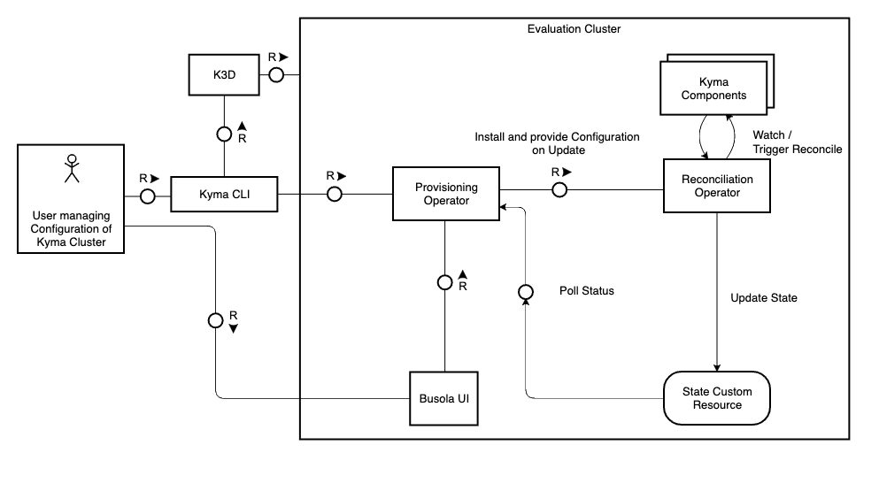
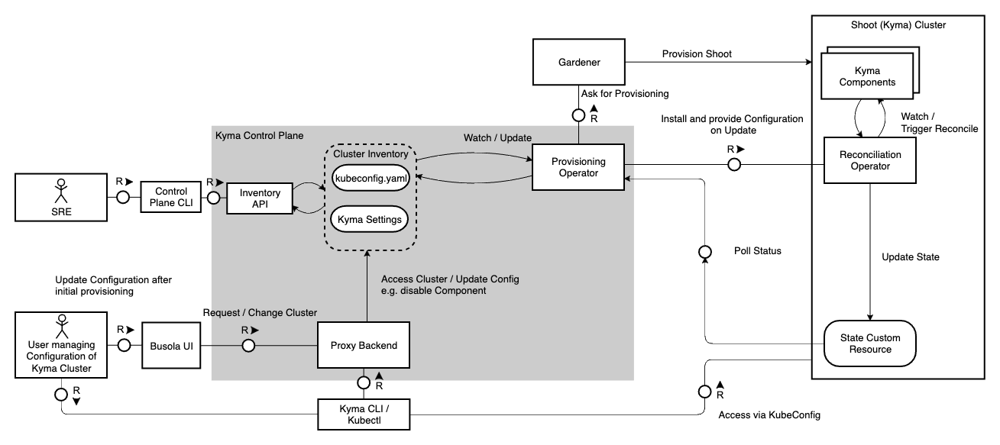
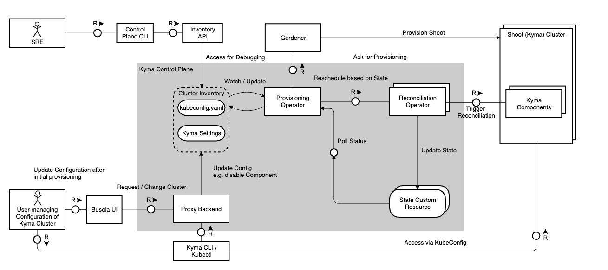

# Operator-based Reconciler

## Motivation
Reconciler is a framework to install, update, and repair Kyma components in managed Kyma Runtimes. The reconciliation runs in the loop to ensure that all components are up and running and properly configured.
While we currently have a custom reconciliation logic in place, we could make use of the Kubernetes Control Loop and reconciliation and an Operator-based approach to maintain our reconciliation through Kubernetes natively.

We are currently having these issues in our current reconciliation:
- Scheduling / Job-based
  - We have inbuilt limits on how fast a reconciliation can work by having bad worst case scheduling scenarios (e.g. reconciliation updates only get picked up every 45 seconds through our bookkeeper)
  - Reconciliation must be externally managed from outside the Cluster as there is no internal state management inside a shoot, this requires either the CLI or a control plane cluster with a Mothership
  - Callback / Health Pings limit the minimal time spent on reconciliation due to overhead and usually lead to problems if communication bottlenecks or instability occurs
- Performance Issues while scheduling/managing Reconciliations for >10k Clusters
  - API-Server Interactions with lots of overhead for many clusters must be managed by reconciler instances
  - Scheduling and Worker-Pools are necessary to reduce load in the individual Reconcilers
  - Heavy Load on both Mothership and Component Reconciler with >20G RAM consumed from KCP alone on Reconciliation components
- Issues with relational data model and PostgreSQL for managing configuration and status as well as problems in quick read interactions for regularly checking active status of a reconciliation
- Reconciler maintenance bottleneck for Kyma teams
  - one codebase without ability for modular CI/CD and Releases independent of the team responsible for the Reconciler
  - Reconciliation of managed clusters currently is mostly stuck only because of technical errors outside of Reconciler Influence and needs input from SRE / Support anyhow

## Proposed changes

### Operator-based Reconciliation

To combat our issues we want to favor a more native, decentralized and scalable approach built on top of best-practices and proven development tactics in Kubernetes. One of these tactics for in-cluster automation is the Operator Pattern.

From the [Kubernetes Documentation](https://kubernetes.io/docs/concepts/extend-kubernetes/operator/):

> Kubernetes is designed for automation. Out of the box, you get lots of built-in automation from the core of Kubernetes. You can use Kubernetes to automate deploying and running workloads, and you can automate how Kubernetes does that.
> Kubernetes' operator pattern concept lets you extend the cluster's behaviour without modifying the code of Kubernetes itself by linking controllers to one or more custom resources. Operators are clients of the Kubernetes API that act as controllers for a Custom Resource.

We want to make use of this design pattern to optimize and enhance our current Reconciliation control loop. The core characterics are:

- Should encompass one or many Operator(s) which can reconcile a Gardener Shoot Cluster from empty to working Kyma on their own without external influence
- Uses CRDs to manage Kyma Components and their necessary Reconciliation
- Uses CRs to report State of the Reconciliation of a Cluster that can be externally viewed via Kubernetes API (e.g. through kubectl or a central provisioning component in the control plane)
- Can be simply installed through provisioning of CRDs and/or Operators
- Does not need explicit State Management outside of CRs managed by the Operator like we have currently with the Mothership
- Can be deployed inside the Cluster to reconcile and manage itself
- Can be integrated through a reported Cluster State into an external Provisioning / Reconciliation for consolidation in a Control Plane Cluster (Kubeception)
- Uses one single source of truth for configuring which Kyma Components are enabled and what Settings are used in the Cluster
- Only consumes load when actively reconciling by smartly managing deployments and instances used for reconciliation, scaling down and passively watching the compliant cluster
- Able to gracefully manage failing reconciliations through smart resilience patterns (retry backoff), resulting in external support ticket or external reconciliation when not resolved on its own
- Able to be debugged and developed by multiple teams for multiple components without strong coupling effects

### POC for verifying Reconciliation based on Operators

To verify that our changes have the desired effect and can solve the issues that we face, we should introduce a method of Verification, we propose a POC.

The POCs main focus points should be

1. Clarify which Operator Framework we can use and what Advantages / Disadvantages they have. We can leverage the knowledge of the team for this but should come up with a recommendation
2. Decide a common approach to make sure that we are able to abstract the Operator communication not only for interaction with a local cluster (the cluster where the operator is running on) but also a remote cluster
3. Make sure that we can safely watch all necessary Kyma Resources without much CPU or Memory Overhead for a Reconciler
4. Make sure that our Developer Experience does not suffer from the new approach. Ideally, we want to be able to take over Component Reconciler Logic and keep the interfaces as stable as possible

A derived action plan should tackle the following topics (from first to last):

1. Create a decision document on which Operator Framework to use / not to use (e.g. kubebuilder, operator-sdk, native) and why (can be running document and updated regularly on changes)
2. Spin-Up a Bootstrap Operator Repository for a Component Reconciler in which we can work further, communicate existance of POC goals in Kyma teams to raise awareness and prompt for collaborators
3. Create an interface similar to our current K8s client in the reconciler that can deal with in-cluster and remote cluster API-Server Access
4. Create an implementation that is able to deal with deploying and updating Helm Chart data (templated charts as native resources)
5. Create a suggestion for a separate Provisioning Operator that can deploy CRDs and the Component Operator
6. Derive a final Low-Level Architecture that suggests a scaled implementation while making sure to keep team responsibility separate

## High level architecture

For Operator-based reconciliations, we want to enable maximum flexibility of the architecture depending on the needs of the Kyma user. This means that we want to allow

1. Fully Independent Small-Scale Clusters able to reconcile themselves, relying on external setup nodes (e.g. running for a local evaluation in k3d or for smaller scale deployments)
2. Lightweight Control Plane Configurations, in which the Control Plane is able to provision the cluster and create/update an inventory of all managed cluster, but not taking care of reconciliation
3. Fully centralized Control Plane Configurations, in which the Control Plane is not only provisioning the cluster, but also hosting the reconciliation, ensuring minimal overhead in the workload cluster

### Single-Cluster (Small-Scale)

In this setup, the only things necessary for reconciliation are deployed in a single cluster that is provisioned externally (in the example above through k3d). The Kyma CLI is able to quickly bootstrap a cluster into existence through interacting with the k3d, and then deploying the Provisioning Operator directly into the Cluster. 

The Provisioning Operator will then use the supplied Kyma Version and Components to deploy a Reconciliation Operator and its corresponding CRDs. The Reconciliation Operator can spin up multiple informer queues based on the operator pattern to watch and reconcile the different enabled Kyma components. 

The Reconciliation Operator will update the state custom resource which is regularly checked by the Provisioning Operator. In case the State is pending for too long or is in an error state (e.g. because the cluster was not configured with enough memory), the provisioning is able to gracefully fail or retry the reconciliation depending on the input configuration. 

In addition, the Busola UI will be deployable in the cluster and can make the Provisioning Operator visualizable in the cluster making the setup fully encapsulated aside from the initial cluster provisioning, making it perfect for small-scale deployments.

### Lightweight Control Plane Configurations

For initializing a cluster, we will need to use a connection between the reconciliation of a cluster and the inventory of all managed clusters. Whenever there is a new entry found in the cluster inventory a new cluster has to be created through the provisioning operator.
For this, the Provisioning Operator can communicate with an external Provider (e.g. Gardener) and create the cluster as a prerequisite for the reconciliation. After the Cluster has been provisioned, it will deploy the Reconciliation Operator into the provisioned cluster.

This can happen for many clusters at the same time, in which case the Provisioning Operator will make sure to only keep the currently updating clusters of the inventory in its informer queue based on the inventory.

Note that the inventory has to be highly available and will need to make sure that transactional guarantees are eventually consistent and atomic.
Also note that the Provisioning Operator can still fetch the status of its managed clusters and regularly reschedule failed or pending reconciliations of components.

### Centralized Control Plane Configurations

In this scenario, The Shoot Cluster will rely purely on the Control Plane to have its reconciliation triggered and executed, in a similar offloading paradigm as the previous mothership reconciler. This has the major advantage of us being able to offload the work into the control plane, but comes with the issue that the operator
reconciling the cluster has to remotely access the cluster, making Watch API interactions costly and potentially error-prone. To combat this the Provisioning Operator can use the State CR to regularly react in a given interval and reschedule and trigger the Reconciliation Operator whenever the reconciliation is still pending or failing. In comparison
to the current reconciliation model, it will not update the state of the reconciliation itself, but will rely purely on the state CR managed in the Control Plane. This can potentially lead to scalability issues when dealing with a big amount of clusters and their state.

## Inventory Design - TODO

## Low Level Implementation of In-Cluster Reconciliation - TODO

#### Idea 1 - One Operator, Many CRDs, One Status

Central Cluster Installs CRDs and Operator
Installs CRs
Watches Reconciliation Status CRs (Pull or Push undecided)
One Operator does everything (Reconcile-Operator)

One CRD is one Component (e.g. one for Monitoring)

Workflow:
1.	YAML-Installation
1.	CRDs
2.	Component CRs
3.	Reconcile Operator triggered based on Component CRs
2.	On Trigger
1.	Deploy Job (for Component)
2.	Takes care of installing one component
3.	Updates / Creates Status CR
4.	Status Updates get summarized
3.	Reconcile Operator reestablishes Jobs on-demand
4.	Watching/Creating Status are managed by Jobs

### 2 Operators, Many CRDs, One Status

- One CRD for Reconciler, Many Component CRDs
- Many Component CRDs because there are different specs possible for different components
- Steps:
  - CRD installation
  - Operator Installation for Reconciler
  - Operator Installation of Components
  - Summary is a State CR of the Reconciler plus current Configuration
- The State CR is watched by the Controller and will trigger the resources based on the different CRs from individual component CRDs
- The Component CR is watched by the reconciliation of the individual components
- We also have only one single Operator for all reconciliations
- We could restrict deletion of CRs based on OAuth /CA BUT this only works on managed (not BYOC)
- We could use validating webhooks and dependencies to avoid messing our configs by the user (different layers of protection)
- Whenever reconciliation is done, it will trigger on state updates
- The Reconciler Resource can then also update its final cluster state
- Reconciler is watched by HTTP in a Poll

### Proposal 3

- One Single Reconciler Operator
- One CR for the Reconciliation CRs
- Problem of multiple CRs -> Doesn't fit into Operator model
- Many CRs for the different Component Operations, watched / created by Operator
- If there is specific configuration then they will be on the CRs
- Operation CRs are used as Bookkeeping Device (Progress tracking), stateful
- Not many operators for all components
- For bigger clusters we want to increase the workers/deployments for the components
- One worker will be a reconciler binary
- One worker will not touch the Operation CRs
- Focus on FAST iteration and POCs so a single operator is beneficial for iterating, together with the current binary as well as Reuse

Flow:
1.	Actor creates reconciliation CR -> Create Reconciler Deployment is prerequisite (e.g. sources for kyma)
2.	Reconciler Operator watches and creates worker deployment based on the CR -> making HTTP Calls for Workers
3.	Each Worker is the same and can take of everything
4.	Once worker is finished it does a callback to the reconciler operator for the specific reconciliation
5.	Worker is done
6.	Operator can scale workers down on demand, updates state on-demand

### Final Proposal

### Questions Asked During Investigation

#### One vs Many Operators for reconciliation?

- PRO
  - X

- CON
  - X

Suggestion:

Decision:

#### How do we reflect the Cluster State?

- Approach A
  - X

- Approach B
  - X

Suggestion:

Decision:

#### How do we protect the changes in the cluster from a user?

- Approach A
  - X

- Approach B
  - X

Suggestion:

Decision:

#### One CRD vs Multiple CRDs for maintaining Reconciliation Configuration?

- PRO
  - X

- CON
  - X

Suggestion:

Decision:

#### How much do we want to rely on Operator Native Communication vs HTTP based Service in a Deployment?

- Approach A
  - X

- Approach B
  - X

Suggestion:

Decision:

