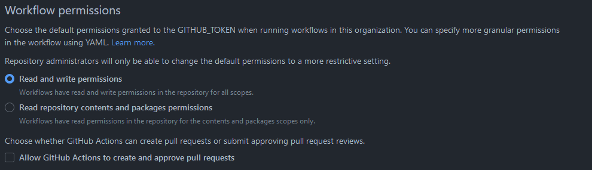
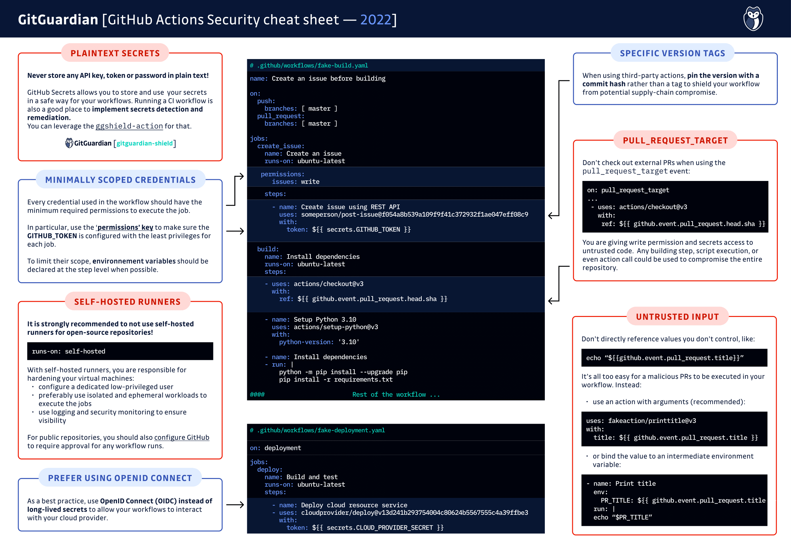

# GitHub Actions

- [GitHub Actions](#github-actions)
  - [Introduction](#introduction)
  - [Restrictions of use](#restrictions-of-use)
  - [GitHub Actions Security Best Practices](#github-actions-security-best-practices)
  - [Appendix A: Approved GitHub Actions](#appendix-a-approved-github-actions)
    - [golangci/golangci-lint-action](#golangcigolangci-lint-action)
    - [AbsaOSS/k3d-action](#absaossk3d-action)
    - [zgosalvez/github-actions-ensure-sha-pinned-actions](#zgosalvezgithub-actions-ensure-sha-pinned-actions)
    - [ahmadnassri/action-workflow-queue](#ahmadnassriaction-workflow-queue)
    - [autotelic/action-wait-for-status-check](#autotelicaction-wait-for-status-check)
    - [gaurav-nelson/github-action-markdown-link-check](#gaurav-nelsongithub-action-markdown-link-check)
    - [slackapi/slack-github-action](#slackapislack-github-action)
  - [Not allowed GitHub Actions](#not-allowed-gh-actions)
    - [shmokmt/actions-setup-github-comment](#shmokmtactions-setup-github-comment)
    - [shmokmt/actions-setup-tfcmt](#shmokmtactions-setup-tfcmt)
    - [CondeNast/conventional-pull-request-action](#condenastconventional-pull-request-action)

## Introduction

GitHub Actions are a powerful tool to automate almost every task of the development cycle. The ecosystem of GitHub Actions is growing very fast and one can find a prepared Action for a lot of activities. But like all other usages of Open Source Software, GitHub Actions must be handled carefully because an action is running external code on our code in our GitHub repositories.

## Restrictions of use

The usage of external GitHub Actions is restricted centrally on the `github.com` organization level. Only Actions in the kyma-project org or approved external Actions are allowed. Actions created by GitHub or [verified creators](https://github.com/marketplace?type=actions&verification=verified_creator) are also allowed. You can find the list of approved GitHub Actions in [Appendix A: Approved Github Actions](#appendix-a-approved-github-actions). Approved Actions are added by using the hash sign of the version commit to ensure that the really approved version of the Action is used.

GitHub Actions have `read` and `write` permissions on repositories but they are not allowed to create and merge pull requests.

## GitHub Actions Security Best Practices

Even though the usage of GitHub Actions is restricted, some threats remain. The responsibility to target these threats is on the developer using GitHub Actions. GitGuardian ([a blog article on how to secure GitHub Actions](https://blog.gitguardian.com/github-actions-security-cheat-sheet/)), as well as GitHub itself ([Security hardening for GitHub Actions](https://docs.github.com/en/actions/security-guides/security-hardening-for-github-actions#using-third-party-actions)), provide information on how to use GitHub Actions securely. Developers using GitHub Actions should make themselves aware of the security best practices to keep our code secure.

**GitHub Actions Security Best Practices - Cheat Sheet from GitGuardian**

## Appendix A: Approved GitHub Actions

### golangci/golangci-lint-action

This action runs the [golangci-lint](https://golangci-lint.run/) tool from GolangCI.

- Repository: <https://github.com/golangci/golangci-lint-action>
- Marketplace: <https://github.com/marketplace/actions/run-golangci-lint>
- `golangci-lint` repository: <https://github.com/golangci/golangci-lint>

#### Rating

- openSSF Scorecard rating (15.08.2023)
  - [golangci-lint-action](./scorecard-ratings/golangci_golangci-lint-action.json): 7.2/10
  - [golangci-lint](./scorecard-ratings/golangci_golangci-lint.json): 6.3/10

The tools (the action and the tool itself) are very popular, and a large community maintains both.

#### Versions

- golangci/golangci-lint-action@639cd343e1d3b897ff35927a75193d57cfcba299
- golangci/golangci-lint-action@v3

### AbsaOSS/k3d-action

- Repository: <https://github.com/AbsaOSS/k3d-action>
- Marketplace: <https://github.com/marketplace/actions/absaoss-k3d-action>

The action contains a shell script which installs a K3D cluster on the runner. The [URL of the installation script of K3D](https://github.com/AbsaOSS/k3d-action/blob/4e8b3239042be1dc0aed6c5eb80c13b18200fc79/run.sh#L27) is hardcoded in the script.

#### Rating

- openSSF Scorecard rating (16.08.2023)
  - [AbsaOSS/k3d-action](./scorecard-ratings/AbsaOSS_k3d-action.json): 4.8/10

#### Versions

- AbsaOSS/k3d-action@4e8b3239042be1dc0aed6c5eb80c13b18200fc79

### zgosalvez/github-actions-ensure-sha-pinned-actions

- Repository: <https://github.com/zgosalvez/github-actions-ensure-sha-pinned-actions>
- Marketplace: <https://github.com/marketplace/actions/ensure-sha-pinned-actions>

#### Rating

- openSSF Scorecard rating (16.08.2023)
  - [zgosalvez/github-actions-ensure-sha-pinned-actions](./scorecard-ratings/zgosalvez_github-actions-ensure-sha-pinned-actions.json): 5.1/10

Einschätzung von Johannes Vogt:
> Hi Torsten, hab's mir angeschaut und der Code sieht vernünftig aus.
>
> Es werden alle ya?ml Dateien durchgegangen und geschaut, ob in irgendeinem unter dem Pfad jobs[...].uses oder jobs[...].steps[x].uses die sha Values die richtige Länge haben (40 für sha1 und 64 für sha256)... Mit einer allowlist kann man den Check für bestimmte Actions ignorieren.
>
> Der Code wird mittels <https://github.com/vercel/ncc> in eine einzelne Datei kompiliert. Den Output hab ich mir nicht genauer angeschaut

#### Versions

- zgosalvez/github-actions-ensure-sha-pinned-actions@f32435541e24cd6a4700a7f52bb2ec59e80603b1

### ahmadnassri/action-workflow-queue

- Repository: <https://github.com/ahmadnassri/action-workflow-queue>
- Marketplace: <https://github.com/marketplace/actions/workflow-queue>

#### Rating

- openSSF Scorecard rating (16.08.2023)
  - [ahmadnassri/action-workflow-queue](./scorecard-ratings/ahmadnassri_action-workflow-queue.json): 6.5/10

#### Versions

- ahmadnassri/action-workflow-queue@v1.1.5
- ahmadnassri/action-workflow-queue@0144da6a252d1986d817826d963ad3a9af1e7fdf

### autotelic/action-wait-for-status-check

- Repository: <https://github.com/autotelic/action-wait-for-status-check>
- Marketplace: <https://github.com/marketplace/actions/wait-for-github-status-check>

#### Rating

- openSSF Scorecard rating (16.08.2023)
  - [autotelic/action-wait-for-status-check](./scorecard-ratings/autotelic_action-wait-for-status-check.json): 4.8/10

#### Versions

- autotelic/action-wait-for-status-check@6556cf50c8fb6608412945382eae73581f56cbb4
- autotelic/action-wait-for-status-check@v1

### gaurav-nelson/github-action-markdown-link-check

- Repository: <https://github.com/gaurav-nelson/github-action-markdown-link-check>
- Marketplace: <https://github.com/marketplace/actions/markdown-link-check>
- `markdown-link-check` repository: <https://github.com/tcort/markdown-link-check>

The action runs a shell script which installs and runs a Node.js module called markdown-link-check. The [version of the Node.js module is tagged](https://github.com/gaurav-nelson/github-action-markdown-link-check/blob/46e442156b8161bfd0913357c7a411e0e610d2ad/entrypoint.sh#L11).

#### Rating

- openSSF Scorecard rating (16.08.2023)
  - [gaurav-nelson/github-action-markdown-link-check](./scorecard-ratings/gaurav-nelson_github-action-markdown-link-check.json): 4.4/10
  - [tcort/markdown-link-check](./scorecard-ratings/tcort_markdown-link-check.json): 4.6/10

#### Versions

- gaurav-nelson/github-action-markdown-link-check@v1
- gaurav-nelson/github-action-markdown-link-check@d53a906aa6b22b8979d33bc86170567e619495ec

### slackapi/slack-github-action

- Repository: <https://github.com/slackapi/slack-github-action>
- Marketplace: <https://github.com/marketplace/actions/slack-send>

#### Ratings

- openSSF Scorecard rating (16.08.2023)
  - [slackapi/slack-github-action](./scorecard-ratings/slackapi_slack-github-action.json): 6.1 / 10

#### Versions

- slackapi/slack-github-action@e28cf165c92ffef168d23c5c9000cffc8a25e117 # v1.24.0,

## Not allowed GitHub Actions

### shmokmt/actions-setup-github-comment

The GitHub Action is only a wrapper to run a go tool called [github-comment](https://github.com/suzuki-shunsuke/github-comment). It is downloaded during runtime by the Action.

- Repository: <https://github.com/shmokmt/actions-setup-github-comment>
- Marketplace: <https://github.com/marketplace/actions/setup-github-comment>
- `github-comment` repository: <https://github.com/suzuki-shunsuke/github-comment>

#### Rating

- openSSF Scorecard rating (16.08.2023)
  - [actions-setup-github-comment](./scorecard-ratings/shmokmt_actions-setup-github-comment.json): 3.5/10
  - [github-comment](./scorecard-ratings/suzuki-shunsuke_github-comment.json): 7.0/10

#### Versions

- shmokmt/actions-setup-github-comment@f415209aa2ee3eb9b3a864c7d5f8f712f1fb3cdf

### shmokmt/actions-setup-tfcmt

This is a wrapper to run the go tool [tfcmt](https://github.com/suzuki-shunsuke/tfcmt), which is downloaded during the runtime of the action.

- Repository: <https://github.com/shmokmt/actions-setup-tfcmt>
- Marketplace: <https://github.com/marketplace/actions/setup-tfcmt>
- `tfcmt` repository: <https://github.com/suzuki-shunsuke/tfcmt>

#### Rating

- openSSF Scorecard rating (16.08.2023)
  - [actions-setup-tfcmt](./scorecard-ratings/shmokmt_actions-setup-tfcmt.json): 3.4/10
  - [suzuki-shunsuke/tfcmt](./scorecard-ratings/suzuki-shunsuke_tfcmt.json): 6.8/10

### CondeNast/conventional-pull-request-action

- Repository: <https://github.com/CondeNast/conventional-pull-request-action>
- Marketplace: <https://github.com/marketplace/actions/conventional-pull-request>

#### Rating

- openSSF Corecard rating (25.08.2023)
  - [CondeNast/conventional-pull-request-action](./scorecard-ratings/CondeNast_conventional-pull-request-action.json): 3.4/10
