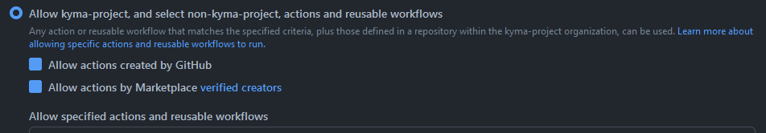
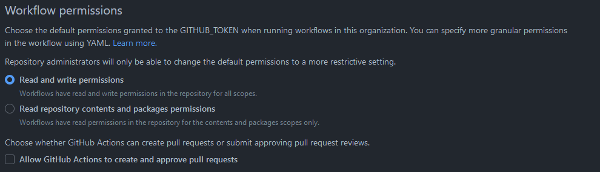

# GitHub Actions

- [GitHub Actions](#github-actions)
  - [Introduction](#introduction)
  - [Restrictions](#restrictions)
  - [Allowed GitHub Actions](#allowed-github-actions)
  - [GitHub Actions Security Best Practices](#github-actions-security-best-practices)
    - [Perform security review](#perform-security-review)
    - [Set the minimal scope for credentials](#set-the-minimal-scope-for-credentials)
    - [Do NOT use `pull_request_target` event](#do-not-use-pull_request_target-event)
    - [Treat event context data as untrusted input](#treat-event-context-data-as-untrusted-input)
    - [Use Dependabot](#use-dependabot)
    - [Review changes on workflows](#review-changes-on-workflows)
  - [Additional information](#additional-information)

## Introduction

GitHub Actions is a powerful tool for automating almost every task of the development cycle. The ecosystem of GitHub Actions is growing very fast, and one can find a prepared Action for many activities. But like all other usages of open source software, GitHub Actions must be handled carefully because an action runs external code on our code in our GitHub repositories.

## Restrictions
<!-- markdown-link-check-disable-next-line -->
The usage of external GitHub Actions is restricted centrally on the `github.com` organization level. Only Actions in the `kyma-project` organization or approved external Actions are allowed. Actions created by GitHub or [verified creators](https://github.com/marketplace?type=actions&verification=verified_creator) are also allowed.



GitHub Actions, in particular the GITHUB_TOKEN, has `read` and `write` permissions on repositories but is not allowed to create and merge pull requests.



## Allowed GitHub Actions

To learn which GitHub Actions are allowed, check this [list](./assets/allowed_actions.json).

To add a GitHub Action to the list of allowed Actions, you must [perform a security review](#perform-security-review) of the GitHub Action. After the review, you must create a pull request on the list of allowed GitHub Actions. Use the template of the JSON object below to add the relevant information to the `github_actions` array in the [allowed_actions.json](./assets/allowed_actions.json) file. The comment entry can be used to add information, which can be useful for others who want to use the same Action.

```json
{
    "name": "full name including GitHub organization",
    "versions": ["hash digest of the release"],
    "repository": "full link to the repository",
    "marketplace": "full link to the GitHub Marketplace entry",
    "security_review_performed": true or false,
    "3rd_party_tool": {
        "tool" : "name",
        "pinned_version" : "version tag / hash",
        "repository" : "full link to the repository"},
    "comment" : ""
}
```

By adding the GitHub Action to the list and using the added Action, you give an implicit commitment to the best practices listed below.

## GitHub Actions Security Best Practices

Even though the usage of GitHub Actions is restricted, some threats remain. The responsibility to target these threats is on the developer using GitHub Actions.

### Perform Security Review

The code of the action must be reviewed to identify suspicious parts of the code. Pay special attention to whether the Action is processing secrets besides the expected usage and what kind of modification the Action does on GitHub resources.

### Set the Minimal Scope for Credentials

By default `read` and `write` permissions are granted to the `GITHUB_TOKEN`. The `GITHUB_TOKEN` is an automatically generated secret that lets you make authenticated calls to the GitHub API in your workflow runs. You must [limit the permissions of the `GITHUB_TOKEN`](https://docs.github.com/en/actions/security-guides/automatic-token-authentication#modifying-the-permissions-for-the-github_token) to the least minimum the `GITHUB_TOKEN` needs in your workflow.

You must also ensure, that all secrets used during the workflow follow the so-called least minimum principle. This means that these credentials may only have the permissions they need to carry out their task.

### Do NOT Use `pull_request_target` Event

- Avoid using `pull_request_target` if the workflow doesn't need `write` repository permissions and doesn't use any repository secrets. Just use the `pull_request` trigger instead.
- Assign repository privileges only where needed explicitly through `pull_request` and `workflow_run`.
  - Handle untrusted code via the `pull_request` trigger so that it is isolated in an unprivileged environment. This workflow started with the `pull_request` trigger should then store any results like code coverage or failed/passed tests in artifacts and exit.
  - The following workflow then starts on `workflow_run` where it is granted `write` permission to the target repository and access to repository secrets.
  - Find an example in this [blog post](https://securitylab.github.com/research/github-actions-preventing-pwn-requests/).
- If you really need to use the `pull_request_target` trigger, add a condition to the `pull_request_target` to run only if a certain label is assigned the PR, such as `safe-to-test` that indicates the PR has been vetted by someone with `write` privileges to the target repository.

### Treat Event Context Data as Untrusted Input

- Every workflow trigger is provided with a [GitHub context](https://docs.github.com/en/actions/learn-github-actions/contexts#github-context) that contains information about the triggering event. You must treat this context data as untrusted data.
- If your Action needs some input data, set the untrusted input value of the expression to an intermediate environment variable.

```yaml
- name: print title
  env:
    TITLE: ${{ github.event.issue.title }}
  run: echo "$TITLE"
```

### Use Dependabot

Use Dependabot to regularly update the GitHub Action as described on the help page [Keeping your actions up to date with Dependabot](https://docs.github.com/en/code-security/dependabot/working-with-dependabot/keeping-your-actions-up-to-date-with-dependabot).

### Review Changes on Workflows

Only a small group of people, usually the repository administrators, should be able to review and approve GitHub Actions. Add the list of users/teams allowed to review and approve PRs regarding GitHub Actions to the CODEOWNERS file of your repository.

```text
.github/workflows    @user-1 @user-2 @user-x
```

or

```text
.github/workflows    @org/team
```

This entry can be omitted as long as the CODEOWNERS file contains a default owner entry that fits the needs described above.

## Additional Information

The information on this page was collected from other resources to give comprehensive guidelines to work with GitHub Actions. Further information on GitHub Actions Security can be found on the following pages:

- [GitGuardian: A blog article on how to secure GitHub Actions](https://blog.gitguardian.com/github-actions-security-cheat-sheet/)
- [Security hardening for GitHub Actions](https://docs.github.com/en/actions/security-guides/security-hardening-for-github-actions#using-third-party-actions)
- [Keeping your GitHub Actions and workflows secure Part 1: Preventing pwn requests](https://securitylab.github.com/research/github-actions-preventing-pwn-requests/)
- [Keeping your GitHub Actions and workflows secure Part 2: Untrusted input](https://securitylab.github.com/research/github-actions-untrusted-input/)
- [Keeping your GitHub Actions and workflows secure Part 3: How to trust your building blocks](https://securitylab.github.com/research/github-actions-building-blocks/)
