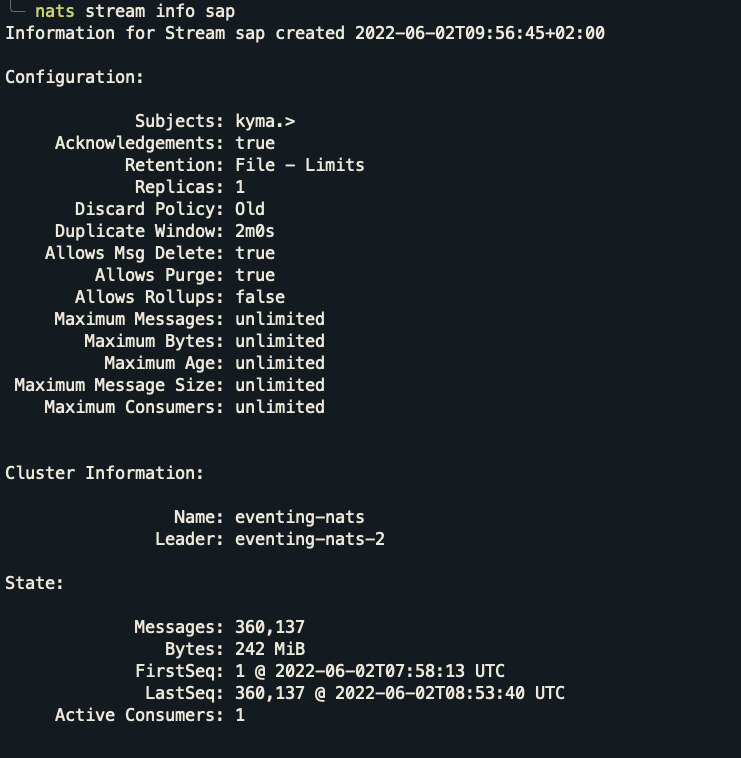
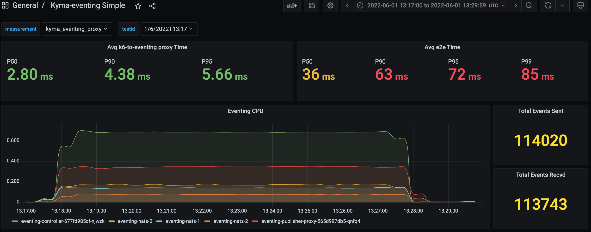
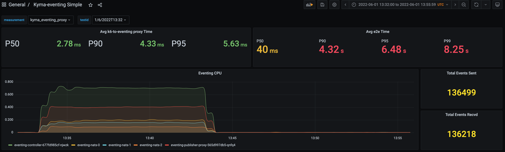

# Why was Events Sent != Events Received in some test runs?

**Kyma: Production Profile**

There were some test runs where the Events Sent != Events Received. Following is the investigation of one of such supicious test run. 

> **Conclusion:** Once the minReplicas for the receiver (i.e. sink) was changed to 6 (so that it won't be scaling up during the tests), We haven't seen any job whose Events Sent != Events Received. Therefore, maybe the scaling up of the receiver was causing the issue.

## Before test run:
- Stream: 
  - LastSeq# 238,410
- Consumer: 
  - Ack Floor: Stream sequence# 238,410

## After test run:
- Stream: 
  - LastSeq# 360,137
- Consumer: 
  - Ack Floor: Stream sequence# 360,137
  - Redelivered Messages: 0
  - Unprocessed Messages: 0

```
* Total Events Received   by **Stream**   : 360,137 - 238,410 = 121,727
* Total Events Processed  by **Consumer** : 360,137 - 238,410 = 121,727
```
---

### Test Run Dashboard:





# Some test runs that showed discrepancy in number of events sent and received:
## Run ID: 1/6/2022T13:17 (Duration: 10m, Event Rate: 200rps)


## Run ID: 1/6/2022T13:32 (Duration: 10m, Event Rate: 250rps)

