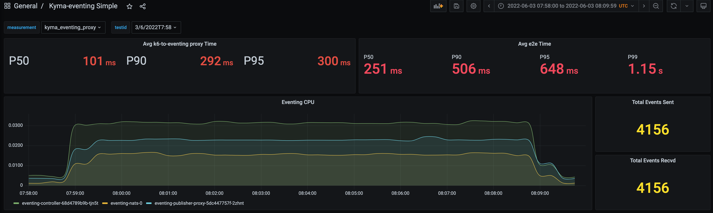

# Performance Evalation of JetStream (Kyma: Evaluation Profile)

## Table of Contents
- Test Setup
- Test Scenario 1: Without any server restarts/crash
- Test Scenario 2: NATS Servers deleted during test
- Test Scenario 3: NATS Servers scaled down to 0 and back to 1 during test
- Test Scenario 4: Eventing-controller Pod deleted during test

## Test Setup
* Testing tool: [K6](https://k6.io/)
* Kyma CLI version: `2.2.0`
* Kyma: 
  * Version: main [[commit](https://github.com/kyma-project/kyma/commit/f2e29f34ed5e71b1f083b4f973934b35b34ec832) and [commit (includes bug fix)](https://github.com/kyma-project/kyma/commit/f8a0c28a43e9eebf192514acc61614300f9909a1)] 
  * Evaluation Profile
  * JetStream with File Storage
* K8s cluster:
  * Kubernetes v1.21.10
  * Gardener cluster [Nodes: 3(min) to 5(max)]
  * GCP Machine Type: `n1-standard-4`

* Kyma deploy command:
    ```
    kyma deploy --source=main -p evaluation --value global.jetstream.enabled=true --value global.jetstream.storage=file
    ```

## Test Scenario 1: Without any server restarts/crash

### Run ID: 3/6/2022T7:45 (10m, 50rps)


### Run ID: 3/6/2022T7:58 (10m, 50rps)


### Run ID: 3/6/2022T8:11 (10m, 100rps)


### Run ID: 3/6/2022T8:35 (10m, 100rps)


## Test Scenario 2: NATS Servers deleted during test
> **Note:** Deleted (using kubectl delete) all 3 pods of NATS after 4 minutes.

```
kubectl delete po -n kyma-system eventing-nats-0
```

### Run ID: 3/6/2022T11:5 (10m, 100rps)
**State before test run:**
- Stream: 
    - LastSeq# 20,199
- Consumer: 
    - Ack Floor: Stream sequence# 20,199

**State after test run:**
- Stream:
    - LastSeq# 23,995
- Consumer: 
    - Ack Floor: Stream sequence# 23,995
    - Redelivered Messages: 0
    - Unprocessed Messages: 0

```
* Total Events Sent by      **Test Sender**  : 3,796 (+ 1,364 Failed = 5,160)
* Total Events Received by  **Stream**       : 3,796 (23,995 - 20,199)
* Total Events Processed by **Consumer**     : 3,796 (23,995 - 20,199)
* Total Events Received by  **Sink**         : 3,800 (Means that 4 events were duplicates)
```


## Test Scenario 3: NATS Servers scaled down to 0 and back to 1 during test
> **Note:** Scaled down NATS statfulset to 0 after 4 minutes.
```
kubectl scale statefulset eventing-nats -n kyma-system --replicas 0
kubectl scale statefulset eventing-nats -n kyma-system --replicas 1
```

### Run ID: 7/6/2022T11:34 (10m, 100rps)
**State before test run:**
- Stream: 
    - LastSeq# 23,995
- Consumer: 
    - Ack Floor: Stream sequence# 23,995

**State after test run:**
- Stream:
    - LastSeq# 27,378
- Consumer: 
    - Ack Floor: Stream sequence# 27,378
    - Redelivered Messages: 0
    - Unprocessed Messages: 0

```
* Total Events Sent by      **Test Sender**  : 3,383 (+ 5,302 Failed = 8,685)
* Total Events Received by  **Stream**       : 3,383 (27,378 - 23,995)
* Total Events Processed by **Consumer**     : 3,383 (27,378 - 23,995)
* Total Events Received by  **Sink**         : 3,384 (Means that 1 event was duplicate)
```


## Test Scenario 4: Eventing-controller Pod deleted during test
> **Note:** Deleted (using kubectl delete) the pod of eventing-controller after 4 minutes.

### Run ID: 7/6/2022T12:21 (10m, 100rps)
**State before test run:**
- Stream: 
    - LastSeq# 31,166
- Consumer: 
    - Ack Floor: Stream sequence# 31,166

**State after test run:**
- Stream:
    - LastSeq# 34,983
- Consumer: 
    - Ack Floor: Stream sequence# 34,983
    - Redelivered Messages: 0
    - Unprocessed Messages: 0

```
* Total Events Sent      by **Test Sender**  : 3,817
* Total Events Received  by **Stream**       : 3,817 (34,983 - 31,166)
* Total Events Processed by **Consumer**     : 3,817 (34,983 - 31,166)
* Total Events Received  by **Sink**         : 3,817
```


