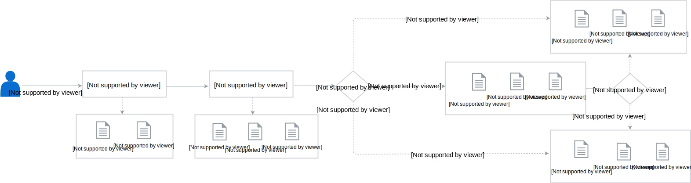

# Kyma Working Model

## Scope

All repositories in the Kyma organization must follow the official guidelines, contributing rules, and the governance process to ensure quality and consistency.

The Kyma project also includes the [Kyma Incubator](https://github.com/kyma-incubator) organization. It is a place where all new projects start in a more relaxed environment that facilitates their rapid growth. At that stage, they do not have to comply with all rules that govern the Kyma organization. Once the incubating project is ready to become a part of the main Kyma organization, adjust it to all standards.

### Add a New Repository to Kyma's Organizations

Create a GitHub issue in the [community](https://github.com/kyma-project/community) repository and describe the purpose of the new repository, proposed name, and explanation which organization it should go to, **kyma-project** or **kyma-incubator**.

## Ownership Policy

Kyma repositories are owned by code owners who are a group of people with special privileges in the repositories of the [Kyma](https://github.com/kyma-project) organization. Each repository has a separate `CODEOWNERS` file located at its root. The file specifies persons who have the ability to approve contribution to the part of the repository they own, after a detailed review of the related pull requests (PRs). Although the name suggests only the code ownership, the `CODEOWNERS` file is not only about the code but the content in general. Apart from the developers, you can define any relevant parties as code owners. For example, technical writers are set up as the owners of all `.md` documents in the Kyma repositories and SIG/WG members are the owners of their SIG/WG's folders' content.

>**NOTE:** Within this document, the terms "code owner" and "maintainer" are used interchangeably.

### Code Owners' Responsibilities

With great power comes great responsibility. Maintainers do not only review and approve PRs but also truly care about their projects.

Every code owner is expected to:

* Contribute high-quality code and content
* Communicate and collaborate with other code owners to improve the ownership process
* Perform thorough pull request reviews for other maintainers and the community
* Make sure to follow the [contributing rules](../contributing/02-contributing.md)
* Approve only the PRs in which the contributor made the requested improvements
* Check if the related CI tests have completed successfully before approving the PR
* Make sure that the PR approval flow runs smoothly - the goal is to have every PR addressed within one working day, counting from the day following the PR creation
* Triage stale GitHub issues and pull requests
* Follow [GitHub flow](https://docs.github.com/en/get-started/quickstart/github-flow) and [enable GitHub notifications](https://docs.github.com/en/account-and-profile/managing-subscriptions-and-notifications-on-github/setting-up-notifications/configuring-notifications#about-custom-notifications) of incoming pull requests and issues
* Proactively fix bugs
* Perform maintenance tasks for their projects
* As an assignee, treat issues assigned to a current release with priority
* In general, continue to be willing to spend at least 50% of their time working on Kyma (~2.5 business days per week)
* Monitor and maintain the periodic jobs; ensure these jobs are up and running.

### Become a Code Owner

* Inform the existing maintainers that you or your organization are interested in becoming a
  maintainer. Depending on whether you are an individual or a corporate contributor/maintainer, a different contributor license agreement applies.
* Determine what areas of Kyma you want to engage with. Kyma, because of its goal, is complex, and it is impossible to become a maintainer in every area. Make sure you get support from a proper group of maintainers.
* Becoming a maintainer generally means that you are going to be spending a substantial part of your time (>50%) on Kyma for the foreseeable future. Among other responsibilities, this means:
  * creating and merging pull requests
  * reviewing pull requests
  * creating or commenting on issues
  * helping on Slack and other community communication channels.
* You are expected to start contributing increasingly complicated PRs, under the guidance
  of the existing maintainers.
* We may ask you to work on some PRs from our backlog.
* As you gain experience with the code base and our standards, we will ask you to do code reviews for incoming PRs. All maintainers are expected to shoulder a proportional share of community reviews.
* After working together and making sure you have a deep understanding of the code base, and are comfortable with submitting reviews, the existing code owners can make a decision to add you to the maintainers list. To request approval, the candidate creates an issue in the [community](https://github.com/kyma-project/community) repository with a list of their current contributions. The existing maintainers confer and decide whether to grant the maintainer status or not.

>**NOTE:** To be accepted as a maintainer and be added to Kyma GitHub organizations, you need to have [two-factor authentication](https://help.github.com/en/articles/about-two-factor-authentication) enabled on your GitHub account.

### When Does a Maintainer Lose the Maintainer Status?

* If a maintainer is no longer interested or cannot perform the maintainer duties listed above, they
should request a change of their status to emeritus.
* If a maintainer is unresponsive, the existing code owners can decide to remove them from the maintainers list in absentia.
* In extreme cases, a maintainer can be removed by [voting of the maintainers](#conflict-resolution-and-voting-of-the-maintainers).

### How to Suggest a Change in a Maintainers List?

To suggest a change in the ownership of a given repository part, create a PR with the required changes in the `CODEOWNERS` file in the project's repository. The required number of codeowners needs to approve the PR for the changes to take place. Read the [CODEOWNERS  file template](https://github.com/kyma-project/template-repository/blob/main/CODEOWNERS) to learn how to set up and modify owners of the given repository folders and files.

The name of the removed maintainer is added to the [emeritus](https://github.com/kyma-project/community/blob/main/emeritus.md) file with a short message about what areas the person worked on.

### Conflict Resolution and Voting of the Maintainers

In general, we prefer technical issues and the maintainer membership to be amicably worked out
between the persons involved. If a dispute cannot be resolved independently, the maintainers can be
called in to decide an issue. If the maintainers themselves cannot decide an issue, the issue is resolved by voting. In the voting process each maintainer receives one vote and the decision is reached by simple majority.

For complex cases when there is a situation that we need a decision that affects more than just one group of maintainers, the decision making process applies.

## Decision Making

In general, the Special Interest Groups (SIGs) and Working Groups (WGs) make decisions that affect the project, including its structure, functionalities, components, or work of the project teams. However, the organizational decisions and those that relate to the product strategy are made by the [Kyma Steering Committee](02-steering-committee.md).

SIGs and WGs follow the **lazy consensus** approach to decision-making which assumes that:

* All SIG/WG members have an equal voice in the decision-making process.
* Silence is consent. By default, lack of objections to a proposed decision means a silent approval.
* Any objections are good opportunities for healthy and constructive discussions.

> **NOTE:** The described approach only concerns the decisions made by SIGs and WGs. It does not affect any Kyma decisions made during daily team activities.

The SIG/WG decison-making process is as follows:

### Create a Decision Record

[Create an issue](https://github.com/kyma-project/community/issues/new/choose) and choose the **Decision record** template. Provide the information as requested in the template and set the issue label to `decision`. The issue can contain all necessary information, reference a document, or an open pull request with a more detailed proposal. Additionally, set the corresponding WG or SIG label such as `sig/core`.

> **NOTE:** In some cases, the `decision` label is set for an existing issue during the [triage](./03-issues-workflow.md#issues-triage), which indicates the need for a decision. In this case, use the [**Decision record** template](https://github.com/kyma-project/community/blob/main/.github/ISSUE_TEMPLATE/decision-record.md) and copy it to the issue description accordingly.

### Reach a Consensus

Take all necessary actions to reach a consensus no later than the decision due date:

* Send a link to the **Decision record** issue to the related SIG or WG mailing list and post it in the relevant Slack channels. If people relevant for the decision are not part of the mailing list, add them explicitly to the email communication. Communicate the decision to be made clearly to the groups affected by it and invite them to check the proposal.

* Clarify and discuss the decision content and the proposal as needed. Use the mailing list, relevant Slack channels, the related pull request, or comment directly on the **Decision record** issue.

* Feel free to communicate the decision proposal during the upcoming SIG or WG meeting and ask its members for feedback. Encourage the discussion and bring up any objections early in the process.

* Those who created the proposal work with those who had objections to either prepare an improved solution or decline the proposal.

> **NOTE:** Discussions  lead to changes in the decision record or the proposal, or end up with no changes required. If someone suggests a substantially different approach, ask its supporters to write a counter proposal and to submit it in a separate pull request.

### Close the Decision

Once you reach the consensus:

* Add the status change in the **Decision record** issue with either `Accepted` or `Declined`.
* Close and merge the pull request with the accepted proposal. Make sure that the merge comment contains one of the [keywords](https://help.github.com/articles/closing-issues-using-keywords/) to automatically close the **Decision record** issue. Otherwise, close the **Decision record** issue manually.

> **NOTE:** If there are any pull requests with counter proposals to the decision record, close the related pull requests with rejected proposals without merging. State the reasons for the rejection in the closing comments.

### Lack of Consensus

Engage the Kyma Steering Committee if necessary to reach the final decision as soon as possible and close the issue.

### Revisit a Decision

Raise an explicit request to revisit a decision or to review it. To request a revision:

* Create a new decision record in the respective repository and populate the `Affected decisions` parameter.
* Specify the `Due date` parameter and set a revision date that is not earlier than the revision date of the original decision.
* Explain in the **Context** and **Consequences** sections why you propose another approach and a new decision.

The SIG or WG addresses the request for revision after the original decision record reaches its revision date. Exceptionally, you can suggest to revisit a decision earlier if the ultimate decision makers support and request it. They can trigger the process if they identify a major positive impact on the project, substantial improvement, or the community interest.
