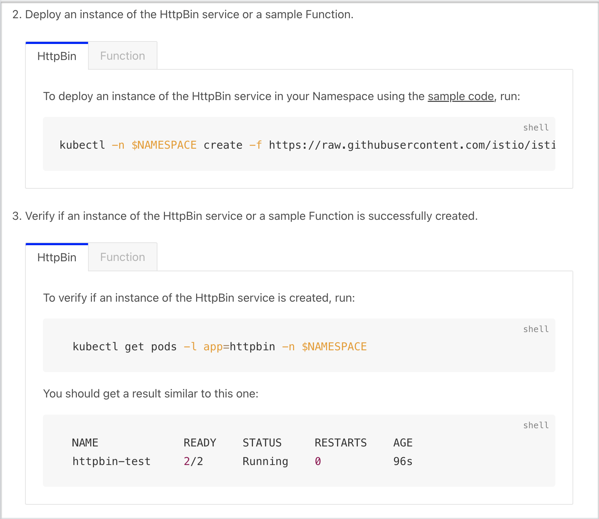

# Tabs and Toggles

Tabs and toggles allow you to render several versions of a given section in one document or have several versions of one document on `http://kyma-project.io`.

For example, you can use tabs and/or documentation toggle to include instructions for different operating systems (OS) in one guide, or to describe installation guides that differ only in a few steps.

As described in the document, tabs are a docsify-specific form of presenting content versions in Markdown. Toggles use HTML within a Markdown document.

## Docsify Tabs

To display tabbed content from Markdown, `kyma-project.io` uses the [docsify-tabs plugin](https://jhildenbiddle.github.io/docsify-tabs/#/) from [docsify.js](https://docsify.js.org/#/).

You define a tab set using the `tabs:start` and `tabs:end` HTML comments. For detailed guidelines, see [docsify-tabs: Usage](https://jhildenbiddle.github.io/docsify-tabs/#/?id=usage).

> **CAUTION:** The use of HTML comments prevents tab-related markup from being displayed when Markdown is rendered as HTML outside of `http://kyma-project.io`, for example, in GitHub. As a result, in GitHub, the content displays in sections under headers defined in the tab set.

## Documentation Toggle

In GitHub documents, the toggle renders the text in the form of expandable sections.
On the `http://kyma-project.io` website, it's displayed as tabs using a dedicated script.

### Writing Rules

Follow these rules when inserting toggles in documents:

* Toggles belonging to one set must start with the `<div tabs name="{toggle-name}">` tag and end with the `</div>` tag, where **name** is a distinctive ID of a specific toggle used for linking. It can be any name describing the content of the documentation toggle.

  See the example:

  ```html
  <div tabs name="installation">
  {toggle content}
  </div>
  ```

* A single toggle must start with the `<details>` tag and end with the `</details>` tag.
* Insert the title of the toggle between the `<summary>` and `</summary>` tags. Every part of the title must start from a new line.

  See the example:

  ```html
  <summary>
  From release
  </summary>
  ```

* Leave a blank line after the `</summary>` tag. Only this way, the content can render.
* Add content using Markdown syntax.
* Use the following indentation when you add the toggle as a regular document section:

  * No spaces for the div element
  * Two spaces for other elements

* Use the following indentation when you add a toggle under a list:

  * Four spaces for the div element
  * Six spaces for other elements

* When you add two or more toggle sets that belong to the same group, you must classify them properly. This way, each time you switch to one of the toggles in the set, it opens automatically in all other sets from the same group within one document and across all documents that use the group. To create a toggle group:

  * All sets of toggles from the given group must contain the `group` attribute with a distinctive ID of this group. For example, add the `cluster-installation` group to categorize all toggle sets that refer to Kyma installation in a cluster.
  * Every `<summary>` tag in the set must also contain the `label` attribute. For example, add the `GKE` label to all toggles that describe steps for Kyma installation on a GKE cluster in the `cluster-installation` group.

    > **NOTE:** The label does not have to be the same as the summary. If the label is a combination of two or more words, separate them with the dash (`-`). For example, write `<summary label="install-on-gke">`.

  See the example:

  ```html
    <div tabs name="prerequisites" group="cluster-installation">
      <details>
      <summary label="gke">
      GKE
      </summary>
      ...
      </details>
      <details>
      <summary label="aks">
      AKS
      </summary>
      ...
      </details>
      <details>
      <summary label="gardener">
      Gardener
      </summary>
      ...
      </details>
    </div>
    ```

### Examples

This section contains exemplary uses of the toggle in Markdown documents.

* See the example of the toggle added as a regular document section:

  ```html
  <div tabs name="Create a Subscription" group="create-subscription">
    <details open>
    <summary label="Kyma Dashboard">
    Kyma Dashboard
    </summary>

  1. Go to **Namespaces** and select the default namespace.
  2. Go to **Configuration** > **Subscriptions** and click **Create Subscription+**.
  3. Switch to the **Advanced** tab, and provide the following parameters:
     - **Subscription name**: `lastorder-sub`
     - **Config**: `maxInFlightMessages: 5`
     - **Types**: `order.received.v1`
     - **Service**: `lastorder` (The sink field will be populated automatically.)
     - **Type matching:**: `standard`
     - **Source**: `myapp`

  5. Click **Create**.
  6. Wait a few seconds for the Subscription to have status `READY`.

  </details>
  <details>
  <summary label="kubectl">
  kubectl
  </summary>

  Run:

  cat <<EOF | kubectl apply -f -
      apiVersion: eventing.kyma-project.io/v1alpha2
      kind: Subscription
      metadata:
        name: lastorder-sub
        namespace: default
      spec:
        sink: 'http://lastorder.default.svc.cluster.local'
        source: myapp
        types:
         - order.received.v1
         - order.changed.v1
  EOF

  To check that the Subscription was created and is ready, run: `kubectl get subscriptions lastorder-sub -o=jsonpath="{.status.ready}"

  The operation was successful if the returned status says `true`.

    </details>
  </div>
  ```

  The code renders on `kyma-project.io` as follows:

  

* See the example of the toggle added under a list:

  ```html
  2. Deploy an instance of the HttpBin service or a sample Function.

    <div tabs name="create">

      <details>
      <summary>
      HttpBin
      </summary>

      To deploy an instance of the HttpBin service in your namespace using the [sample code](https://raw.githubusercontent.com/istio/istio/master/samples/httpbin/httpbin.yaml), run:

      ```shell
      kubectl -n $NAMESPACE create -f https://raw.githubusercontent.com/istio/istio/master/samples/httpbin/httpbin.yaml
      ```

      </details>

      <details>
      <summary>
      Function
      </summary>

      To create a Function in your namespace using the [sample code](https://raw.githubusercontent.com/kyma-project/kyma/main/docs/03-tutorials/00-api-exposure/assets/function.yaml), run:

      ```shell
      kubectl -n $NAMESPACE apply -f https://raw.githubusercontent.com/kyma-project/kyma/main/docs/03-tutorials/00-api-exposure/assets/function.yaml
      ```

      </details>
    </div>

  3. Verify if an instance of the HttpBin service or a sample Function is successfully created.

    <div tabs name="verify">

      <details>
      <summary>
      HttpBin
      </summary>

      To verify if an instance of the HttpBin service is created, run:

        ```shell
          kubectl get pods -l app=httpbin -n $NAMESPACE
        ```

      You should get a result similar to this one:

        ```shell
          NAME             READY    STATUS     RESTARTS    AGE
          httpbin-test     2/2      Running    0           96s
        ```

      </details>

      <details>
      <summary>
      Function
      </summary>

      To verify if a Function is created, run:

        ```shell
          kubectl get functions $NAME -n $NAMESPACE
        ```

      You should get a result similar to this one:

        ```shell
          NAME            CONFIGURED   BUILT     RUNNING   RUNTIME    VERSION   AGE
          test-function   True         True      True      nodejs18   1         96s
        ```
      </details>
    </div>
  ```

  The code renders on `kyma-project.io` as follows:

  
