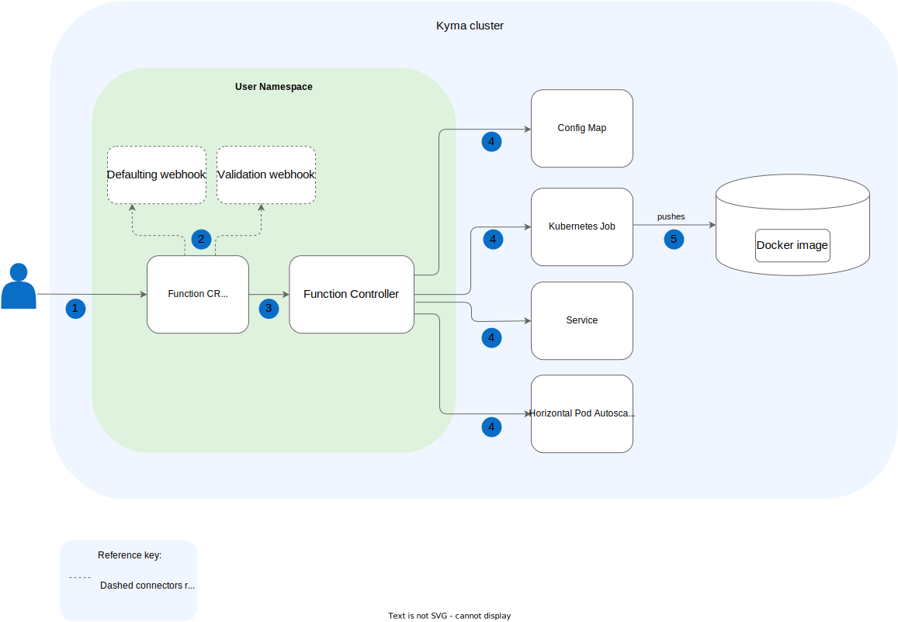

# Diagrams

Same as with the screenshots, diagrams are worth a thousand words. Therefore, rather than pile up a block of text to describe a given concept, use a diagram to visualize it instead.

To convey the intended message effectively in a diagram, follow these basic principles:
- Everything that means the same should look the same.
- Limit visual noise.
- Keep it simple but descriptive.
- Follow the left-to-right direction when depicting the workflow.

For details on how to format diagrams and their elements in Kyma documents, see the particular document sections.

## Alternative Text

Always add an alternative (alt) text that concisely describes the content or function of the diagram you are referring to. The alt text:

- Helps to maintain accessibility for every visitor, including people with vision impairments.
- Appears in place of a diagram if it fails to load.
- Improves the SEO of the website by enabling crawlers to index the diagram contents better.

    ⛔️ ``  
    ✅ ``  

## Tool

Use [diagrams.net](https://www.diagrams.net/index.html) as a recommended tool. Export the diagram as an SVG and save it under the corresponding `assets` directory.

## Size

Keep your diagram reasonable in size. Preview the image at full size to see how it fits into the whole document. The diagram should be large enough to be legible and convey the intended message, but should not dominate the whole document. To demonstrate large concepts, simplify the diagram or divide it into a few smaller ones.

>**NOTE:** The diagrams keep their original aspect ratio on the `kyma-project.io` website. However, the maximum width on the website is 860px. Any diagram that exceeds that limit is resized to the maximum width.

## Background

Keep the background of the diagram **white** as it renders well in both GitHub and the `kyma-project.io` website. Do not use transparent background as it doesn't display well in dark mode.

Always add **rounded** secondary backgrounds to indicate the environment in which the workflow takes place. Use **mild blue** (HEX: `#F0F6FF`) to indicate the main environment, such as a cluster, and **mint green** (HEX: `#DEF2DD`) to indicate subsidiary environments, such as namespaces.

## Shapes and Fills

Use **rounded rectangles** as default box shapes. 

Use **white** fill for main shapes, such as boxes. For actors, apply **blue** (HEX: `#0A6EC7`) fill.

> **NOTE:** Same as in the Unified Modeling Language (UML), the term **actor** refers to a role played by a human user, external hardware, or any other entity.

## Outlines

Use **grey** (HEX: `#666666`) for outlines. Set the outlines of the shapes to 1pt. Do not use any outlines for actors, steps, and secondary backgrounds.

## Text

Use **black** for both the primary and secondary texts.
Use the following **Helvetica** font sizes:
- 15pt **bold** for headings
- 13pt for primary texts, such as shape names
- 12pt for secondary texts, such as connector descriptions

Always position the text horizontally. When you add a title to a shape, put the text inside the shape. Whenever possible, place the text in the central place of the shape and in the upper-central part of the background.

## Steps

Mark multiple areas or steps on the diagram using **blue** (HEX: `#0A6EC7`) round stamps with white numbers. Explain the steps under the diagram with an ordered list.

## Connectors

Use 1pt, **rounded**, **grey** (HEX: `#666666`) lines to connect shapes.

## Reference Key

Whenever you introduce an element that is different from other objects located in the diagram, include a reference key below the diagram to briefly explain the difference between the objects.

## Examples

See the exemplary diagram for reference:

