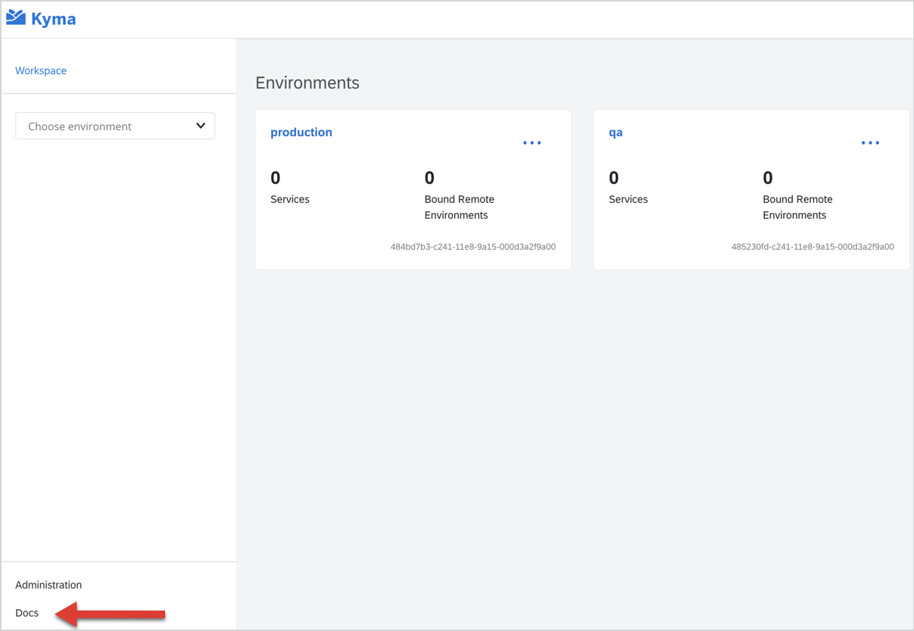
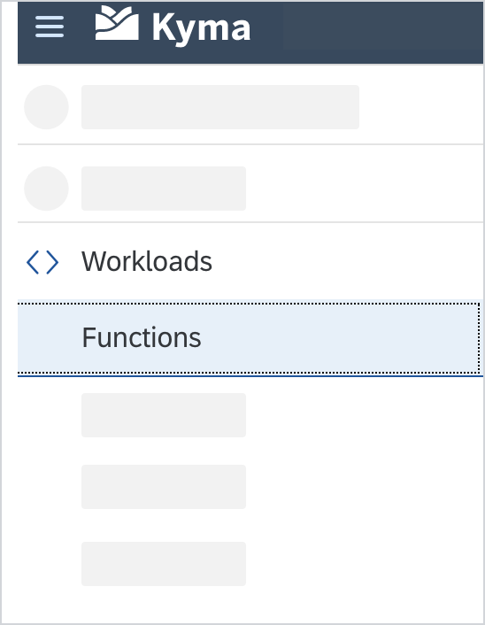

# Screenshots

Screenshots can effectively illustrate UI operations and convey information visually. However, they are costly to maintain. Use them only when they provide clear value that text alone cannot deliver.

Before adding a screenshot, consider the following aspects:
- Screenshots become outdated quickly when the UI changes, requiring frequent updates.
- Screenshots do not meet accessibility criteria and do not work with screen readers.
- Screenshots cannot be translated into other languages, which is problematic as Kyma documentation is also available on Help Portal that supports multiple languages.

## Best Practices

If you decide a screenshot adds value to your documentation, follow these principles:

- Use screenshots to complement the text, not to replace instructions.
- Avoid overusing screenshots to limit visual noise.
- Do not use directional indicators such as "above" and "below" to refer to screenshots. Instead, include a brief introduction before each screenshot that describes its purpose and any necessary details.
- Do not include the mouse pointer unless it shows a function related to the content.
- Include only relevant elements. Exclude unnecessary items such as the browser toolbar. See [Simplified User Interfaces (SUI)](#simplified-user-interfaces-sui).

For details on how to format screenshots and their elements in Kyma documents, see the particular document sections.

## Alternative Text

Always add an alternative (alt) text that concisely describes the content or function of the image you are referring to. The alt text:

- Helps to maintain accessibility for every visitor, including people with vision impairments.
- Appears in place of an image if it fails to load.
- Improves the SEO of the website by enabling crawlers to index the image contents better.

    ⛔️ ``  
    ✅ ``  

## Tool

Adjust or capture your screenshots using any tool that outputs high quality images, such as [draw.io](https://www.drawio.com/), [Snagit](https://www.techsmith.com/screen-capture.html), [Lightshot](https://app.prntscr.com), or [Monosnap](https://monosnap.com/). The desired image format is SVG, but PNG and JPG formats are also acceptable.
Use an online tool such as [TinyPNG](https://tinypng.com/) to compress images and limit the size of each image to 1MB, or smaller.
If you want to control the size of the image relative to the screen size, use one of these standard percentages: 100%, 75%, 50%, or 25%.

>**NOTE:** The images keep their original aspect ratio on both the Console UI and the `kyma-project.io` website. However, the maximum width on the website is 860px. Any image that exceeds that limit is resized to the maximum width.

Name the file as `{screenshot-name}` and save it under the corresponding `assets` directory.

## Borders

Use **grey** (HEX: #D2D5D9) 1pt border for the screenshot.

## Steps

If necessary, mark multiple areas or steps on the screenshot using **blue** (HEX: #0A6ED1) round stamps with white numbers.
Explain the steps under the screenshot with the ordered list.

## Indicators

To highlight a certain area of your screenshot, use **red** (HEX: #EF2727) 10pt for arrows or boxes.

> **NOTE:** Use arrows and boxes sparingly, only to point to an exceptionally important area of the screenshot. Do not use more than one indicator in one screenshot to avoid visual noise.

## Simplified User Interfaces (SUI)

Wherever possible, present screenshots as simplified user interfaces ([SUI](https://www.techsmith.com/blog/simplified-user-interface/)). Basically, this means blurring or covering all UI elements that aren't essential for the task at hand. Most image editors provide basic shapes that you can use to create these simplified interfaces.

Use circles to cover icons, and rectangles with pointed corners to cover texts.

- Light gray (#F2F2F2)​ for texts on a white background​
- Dark gray (#D9D9D9)​ for headlines on a white background​

Don't cover: The logo, the sandwich icon, the search icon, expand buttons, close buttons.

For more information, see [tcworld: Simplified graphics and screenshots in software documentation](https://www.tcworld.info/e-magazine/technical-writing/simplified-graphics-and-screenshots-in-software-documentation-1102/)

## Examples

See the exemplary screenshots for reference:

- Example

- Example SUI

