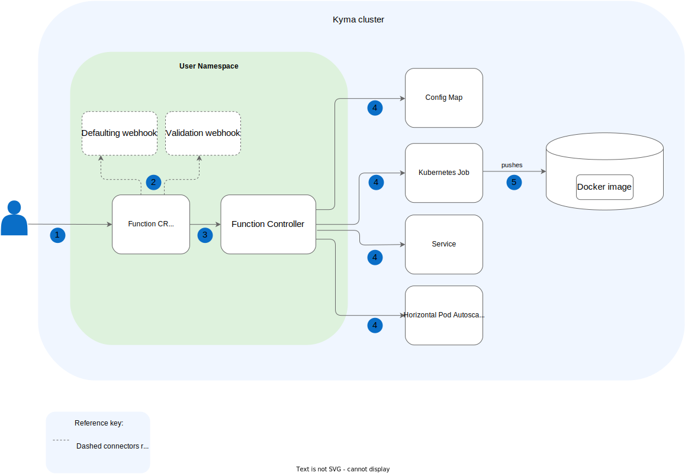

# Diagrams

Diagrams can effectively visualize complex concepts, workflows, and system architectures that are difficult to explain through text alone. However, use them purposefully, not as decorative elements.

## Best Practices

To convey the intended message effectively in a diagram, follow these basic principles:
- Don't simply drop a diagram into the text without context. The purpose of the diagram and what it depicts must be clear from the surrounding content.
- Everything that means the same should look the same.
- Limit visual noise.
- Keep it simple but descriptive.
- Follow the left-to-right direction when depicting the workflow.

For details on how to format diagrams and their elements in Kyma documents, see the particular document sections.

## Alternative Text

Always add alternative (alt) text that helps users understand the diagram's purpose and content. The alt text:

- Helps maintain accessibility for all visitors, including people with vision impairments who use screen readers
- Indicates that the element is a diagram, not broken text or a loading error
- Appears in place of a diagram if it fails to load
- Improves SEO by enabling crawlers to index the diagram contents better

**How to write effective alt text:**

If you've explained the diagram thoroughly in the body text, keep the alt text brief. You can write something like:
- ``
- ``

If specific details are important but would be awkward to include in body text, add them to the alt text for screen reader users.

    ⛔️ `` (no alt text)  
    ✅ `` (descriptive alt text)  

## Tool

Use [drawio](https://www.drawio.com/) as a recommended tool. Export the diagram as an SVG and save it under the corresponding `assets` directory.

## Size

Keep your diagram reasonable in size. Preview the image at full size to see how it fits into the whole document. The diagram should be large enough to be legible and convey the intended message, but should not dominate the whole document. To demonstrate large concepts, simplify the diagram or divide it into a few smaller ones.

>**NOTE:** The diagrams keep their original aspect ratio on the `kyma-project.io` website. However, the maximum width on the website is 860px. Any diagram that exceeds that limit is resized to the maximum width.

## Background

Keep the background of the diagram **white** as it renders well in both GitHub and the `kyma-project.io` website. Do not use transparent background as it doesn't display well in dark mode.

Always add **rounded** secondary backgrounds to indicate the environment in which the workflow takes place. Use **mild blue** (HEX: `#F0F6FF`) to indicate the main environment, such as a cluster, and **mint green** (HEX: `#DEF2DD`) to indicate subsidiary environments, such as namespaces.

## Shapes and Fills

Use **rounded rectangles** as default box shapes.

Use **white** fill for main shapes, such as boxes. For actors, apply **blue** (HEX: `#0A6EC7`) fill.

> **NOTE:** Same as in the Unified Modeling Language (UML), the term **actor** refers to a role played by a human user, external hardware, or any other entity.

## Outlines

Use **grey** (HEX: `#666666`) for outlines. Set the outlines of the shapes to 1pt. Do not use any outlines for actors, steps, and secondary backgrounds.

## Text

Use **black** for both the primary and secondary texts.
Use the following **Helvetica** font sizes:

- 15pt **bold** for headings
- 13pt for primary texts, such as shape names
- 12pt for secondary texts, such as connector descriptions

Always position the text horizontally. When you add a title to a shape, put the text inside the shape. Whenever possible, place the text in the central place of the shape and in the upper-central part of the background.

## Steps

Mark multiple areas or steps on the diagram using **blue** (HEX: `#0A6EC7`) round stamps with white numbers. Explain the steps under the diagram with an ordered list.

## Connectors

Use 1pt, **rounded**, **grey** (HEX: `#666666`) lines to connect shapes.

## Reference Key

Whenever you introduce an element that is different from other objects located in the diagram, include a reference key below the diagram to briefly explain the difference between the objects.

## Examples

See the exemplary diagram for reference:

