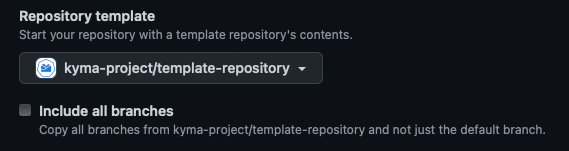
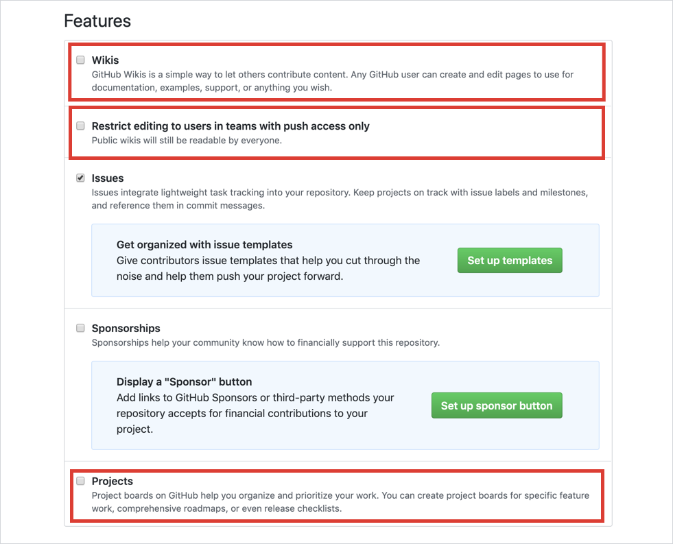
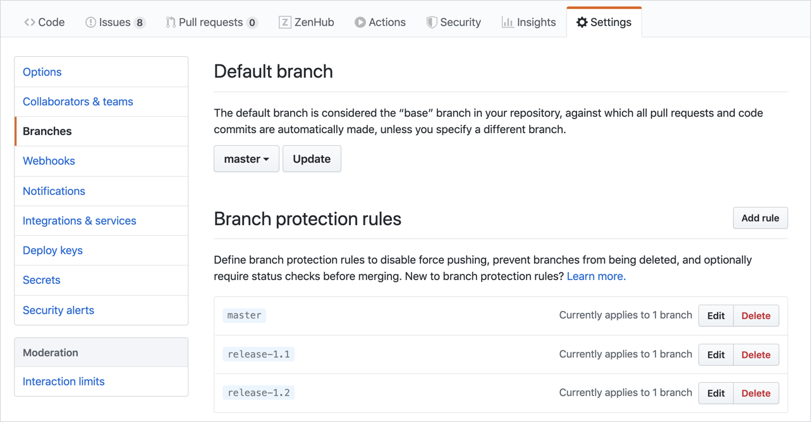

All repositories in `kyma-project` and `kyma-incubator` organizations should be similar in structure, settings, and restrictions. Follow these guidelines to adjust settings of a new repository created in one of these organizations.

> **NOTE:** You have to be an owner of the given organization to create a new repository in it.

## Use the Repository Template

Whenever you create a new repository, use the template from the [`template-repository`](https://github.com/kyma-project/template-repository). This template contains all necessary configuration files for CODEOWNERS, Kyma stale bot, issue and pull request templates, license, and Code of Conduct.

> **NOTE:** Do not mark the **Include all branches** checkbox as it will clone all branches from the `template-repository` to your new repo.



## Adjust Repository Options

Under the repository name, choose the **Settings** tab. The **Options** view opens as the default one in the left menu.

1. Scroll down to the **Features** section and clear these options:

- Wikis
- Restrict editing to users in teams with push access only
- Projects



## Set Branch Protection Rules

Define branch protection rules that include enforcing obligatory review and approval of pull requests (PRs), and define which Prow jobs need to pass successfully before merging PR changes into the `main` branch.

To see these settings, go to **Branches** in the left menu, under repository **Settings**:



In Kyma, the protection rules are defined in the Prow [`config.yaml`](https://github.com/kyma-project/test-infra/blob/main/prow/config.yaml) file handled by a Prow component called [Branch Protector](https://github.com/kyma-project/test-infra/blob/main/docs/prow/prow-architecture.md#branch-protector).

If you add a new repository in:

- `kyma-project`, you do not need to add a new entry to the Prow `config.yaml` file as the branch protection is already defined for [all repositories](https://github.com/kyma-project/test-infra/blob/main/prow/config.yaml#L380) within this organization. The only exception is if you want to specify additional rules that are not handled by Prow.
- `kyma-incubator`, add a new repository entry to the Prow `config.yaml` file, under **branch-protection.orgs.kyma-incubator.repos**.

## Update CLA Assistant Configuration

Ask a [kyma-project owner](https://github.com/orgs/kyma-project/people) to:

- Add the newly created repository to the [Contributor License Agreement](https://cla-assistant.io/) (CLA).
- Add the `kyma-bot` username to be exempt from signing the CLA.

## Enable Markdown Link Check

The `/kyma-project` repositories in GitHub use [md-check-link](https://github.com/kyma-project/md-check-link) to check their Markdown files for broken links. Configuration and maintenance of the Markdown link check tool in particular repositories is the responsibility of a repository owner.

### Configuration

To configure the md-check-link in your repository, choose your CI/CD pipeline for the check and set up its workflow. For example, choose GitHub Action and add a configuration YAML file to the `/.github/workflows` directory. Paste the following content:

```yaml
name: Verify markdown links

on:
  pull_request:
    branches:
      - "main"
      - "release-*"
  workflow_dispatch:

jobs:
  verify-links:
    runs-on: ubuntu-latest
    steps:
      - name: Checkout repo
        uses: actions/checkout@v4
      - name: Install node.js
        uses: actions/setup-node@v4
        with:
          node-version: '20.x'
      - name: Install md-check-link
        run: npm install -g md-check-link
      - name: Verify links
        run: |
          md-check-link -q -n 8 -c https://raw.githubusercontent.com/kyma-project/md-check-link/main/.mlc.config.json ./
```

With that configuration, the md-check-link verifies all `.md` files in your repository on every PR.

## Custom Settings

Track all repository changes that deviate from configuration standard described in the guidelines with an [issue](https://github.tools.sap/kyma/test-infra/issues/new?assignees=&labels=config-change&template=bug_report.md&title=).
