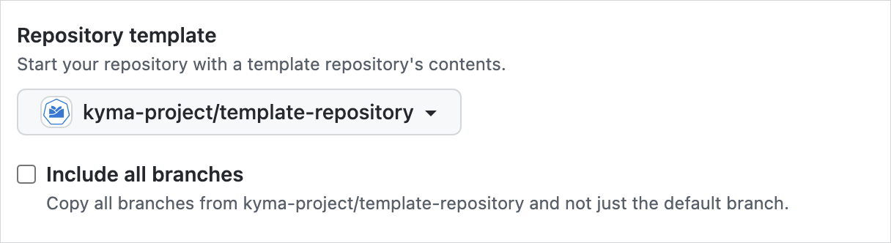

All repositories in `kyma-project` and `kyma-incubator` organizations should be similar in structure, settings, and restrictions. Follow these guidelines to adjust settings of a new repository created in one of these organizations.

> **NOTE:** You have to be an owner of the given organization to create a new repository in it.

## Use the repository template

Whenever you create a new repository, use the template from the [`template-repository`](https://github.com/kyma-project/template-repository). This template contains all necessary configuration files for [OWNERS](../../contributing/04-prow-workflow.md#owners-file), Kyma stale bot, issue and pull request templates, license, and Code of Conduct.

> **NOTE:** Do not mark the **Include all branches** checkbox! 




## Adjust repository options

Under the repository name, choose the **Settings** tab. The **Options** view opens as the default one in the left menu.

1. Scroll down to the **Features** section and clear these options:
- Wikis
- Restrict editing to users in teams with push access only
- Projects


## Set branch protection rules

Define branch protection rules that include enforcing obligatory review and approval of pull requests (PRs), and define which Prow jobs need to pass successfully before merging PR changes into the `main` branch.

To see these settings, go to **Branches** in the left menu, under repository **Settings**:


In Kyma, the protection rules are defined in the Prow [`config.yaml`](https://github.com/kyma-project/test-infra/blob/main/prow/config.yaml) file generated from rules defined in the [`prow-config.yaml`](https://github.com/kyma-project/test-infra/blob/main/templates/templates/prow-config.yaml) file and handled by a Prow component called [Branch Protector](https://github.com/kyma-project/test-infra/blob/main/docs/prow/prow-architecture.md#branch-protector).

If you add a new repository in:
- `kyma-project`, you do not need to add a new entry to the Prow `config.yaml` file as the branch protection is already defined for [all repositories](https://github.com/kyma-project/test-infra/blob/main/prow/config.yaml#L380) within this organization. The only exception is if you want to specify additional rules that are not handled by Prow.
- `kyma-incubator`, add a new repository entry to the Prow `config.yaml` file, under **branch-protection.orgs.kyma-incubator.repos**. See [an example](https://github.com/kyma-project/test-infra/blob/main/templates/templates/prow-config.yaml)  of such an entry for the `marketplaces` repository.

## Update CLA assistant configuration

Ask a [kyma-project owner](https://github.com/orgs/kyma-project/people) to add the newly created repository to the [Contributor License Agreement](https://cla-assistant.io/) (CLA).

## Add a milv file

If you define any governance-related [Prow job](https://github.com/kyma-project/test-infra/blob/main/prow/jobs/) for the new repository to validate documentation links, you must add a `milv.config.yaml` file at the root of the repository. [See](https://github.com/kyma-project/test-infra/blob/main/milv.config.yaml) an example of the milv file.

## Create labels

Labels are managed by Prow in the [`labels.yaml`](https://github.com/kyma-project/test-infra/blob/main/prow/labels.yaml) configuration file.
To add a new label, create a pull request to the [`test-infra`](https://github.com/kyma-project/test-infra) repository with a new label definition.

This file is split into two sections:
* `default` - contains information about labels that are available across all repositories in the organisation.
* `repos` - a map of repositories with labels configuration only for the given repository.

If your labels needs to be available for all repositories, add it under `default` section.

```yaml
default:
  labels:
    - color: 00ff00
      name: lgtm
      description: Looks good to me!
      target: prs
...
```

If your label has to be available only for given repository, add a label to the repository configuration under `repos` section.

```yaml
repos:
  kyma-project/community:
    labels:
      - color: 0052cc
        description: Issues or PRs related to the example
        name: area/example
        target: both
        addedBy: label
...
```
