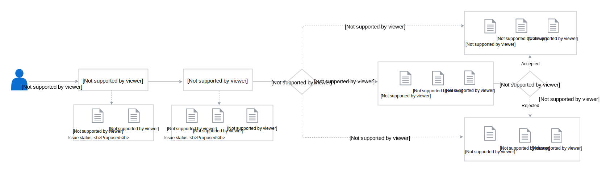

## Overview

This document defines the ownership policy and the decision-making process within the [Kyma](../../../) organization.

## Scope

All repositories in the Kyma organization must follow the official guidelines, contributing rules, and the governance process to assure quality and consistency.

The Kyma project also includes the [Kyma Incubator](https://github.com/kyma-incubator) organization. It is a place where all new projects start in a more relaxed environment that facilitates their rapid growth. At that stage, they do not have to comply with all rules that govern the Kyma organization. Once the incubating project is ready to become a part of the main Kyma organization, adjust it to all standards.

### Add new repository to Kyma's organizations

Create a GitHub issue in [community](https://github.com/kyma-project/community) repository and describe what is the purpose of new repository, proposed name and explanation which organization it should go to, **kyma-project** or **kyma-incubator**

## Ownership policy

Kyma repositories are owned by code owners who are a group of people with special privileges in the repositories of the [GitHub](../../../) organization. Each repository has a separate `CODEOWNERS` file located at its root. The file specifies persons who have the ability to approve contribution to the part of the repository they own, after a detailed review of the related pull requests (PRs). Although the name suggests only the code ownership, the `CODEOWNERS` file is not only about the code but the content in general. Apart from the developers, you can define any relevant parties as code owners. For example, technical writers are set up as the owners of all `.md` documents in the Kyma repositories and SIG/WG members are the owners of their SIG/WG's folders' content.

### Code owners' aka Maintainers responsibilities

With great power comes great responsibility. Code owners not only review and approve PRs but also truly care about their projects.

Every code owner is expected to:

* Contribute high-quality code and content
* Communicate and collaborate with other code owners to improve the ownership process
* Perform a thorough review of incoming PRs and make sure they follow the [contributing rules](CONTRIBUTING.md)
* Approve only those PRs in which the contributor made the requested improvements
* Check if the related CI tests have completed successfully before approving the PR
* Make sure that the PR approval flow runs smoothly
* Proactively fix bugs
* Perform maintenance tasks for their projects
* Issue that is assigned to current release is treated with priority by maintainer that is an assignee
* Monitor [Slack](http://slack.kyma-project.io)
* Triage GitHub issues and perform pull request reviews for other maintainers and the community. Follow [labels workflow](/governance/#issues-workflow-issues-workflow) document
* In general continue to be willing to spend at least 50% of one's time working on Kyma (~2.5 business days per week).

### Process for becoming a maintainer aka codeowner

* Express interest to the existing maintainers that you or your organization are interested in becoming a
  maintainer. The difference is that in case you are individual or corporate contributor/maintainer then different contributor license agreement applies.
* Express what are the areas of Kyma that you want to engage with. Kyma, because of its goal, is complex and it is impossible to become a maintainer in every area. Make sure you get support from proper group of maintainers.
* Becoming a maintainer generally means that you are going to be spending substantial time (>50%) on Kyma for the foreseeable future. Among other responsibilities this is:
  * creating and merging pull-request
  * reviewing pull-request
  * creating or commenting on issues
  * helping on Slack and other community communication channels
* We will expect you to start contributing increasingly complicated PRs, under the guidance
  of the existing maintainers.
* We may ask you to do some PRs from our backlog.
* As you gain experience with the code base and our standards, we will ask you to do code reviews for incoming PRs (i.e., all maintainers are expected to shoulder a proportional share of community reviews).
* After a period of approximately 3 months of working together and making sure we see eye to eye, candidate for maintainer should create an issue in [community](https://github.com/kyma-project/community) repository with list of his current contributions. The existing maintainers will confer and decide whether to grant maintainer status or not. We make no guarantees on the length of time this will take, but no longer than 3 months.
* Enabled [two-factor authentication](https://help.github.com/en/articles/about-two-factor-authentication) on GitHub account.

### When does a maintainer lose maintainer status?

- If a maintainer is no longer interested or cannot perform the maintainer duties listed above, they
should volunteer to be moved to emeritus status. 
- If a maintainer is unresponsive for at least 3 months he can be removed from maintainers list immediately
- In extreme cases this can also occur by a vote of
the maintainers per the voting process below.

### How to suggest a change in maintainers list?

To suggest a change in the ownership of a given repository part, create a PR with the required changes in the `CODEOWNERS` file in the project's repository. The required number of code owners needs to approve the PR for the changes to take place. Read [here](https://github.com/kyma-project/community/blob/master/guidelines/internal-guidelines/repository-template/template/CODEOWNERS) how to set up and modify owners of the given repository folders and files.

Name of removed maintainer should be added to [emeritus](https://github.com/kyma-project/community/blob/master/emeritus.md) file with short info what areas were covered by this person.

### Conflict resolution and voting among maintainers

In general, we prefer that technical issues and maintainer membership are amicably worked out
between the persons involved. If a dispute cannot be decided independently, the maintainers can be
called in to decide an issue. If the maintainers themselves cannot decide an issue, the issue will
be resolved by voting. The voting process is a simple majority in which each maintainer
receives one vote.

For complex cases when there is a situation that we need a decision that affects more than just one group of maintainers the [Decision Making](/governance/#kyma-working-model-kyma-working-model-decision-making) process applies

## Decision-making

In general, the Special Interest Groups (SIGs) and Working Groups (WGs) make decisions that affect the project, including its structure, functionalities, components, or work of the project teams. However, the organizational decisions and those that relate to the product strategy are made by the Kyma's Steering Committee.

SIGs and WGs follow the **lazy consensus** approach to decision-making which assumes that:

* All SIG/WG members have an equal voice in the decision-making process.
* Silence is consent. By default, lack of objections to a proposed decision means a silent approval.
* Any objections are good opportunities for healthy and constructive discussions.

> **NOTE:** The described approach only concerns the decisions made by SIGs and WGs. It does not affect any Kyma decisions made during daily team activities.

To see the current state of processed decisions in the Kyma project, go to the project's [decision board](https://app.zenhub.com/workspaces/kyma---all-repositories-5b6d5985084045741e744dea/boards?labels=decision&repos=139590666).

The SIG/WG decison-making process is as follows:

### Create a decision record

[Create an issue](https://github.com/kyma-project/community/issues/new/choose) and choose the **Decision record** template. Provide the information as requested in the template and set the issue label to `decision`. The issue can contain all necessary information, reference a document, or an open pull request with a more detailed proposal. Additionally, set the corresponding WG or SIG label such as `sig/core`.

> **NOTE:** In some cases, the `decision` label is set for an existing issue during the [triage](./issues-workflow.md), which indicates the need for a decision. In this case, use the [**Decision record** template](./.github/ISSUE_TEMPLATE/decision-record.md) and copy it to the issue description accordingly.

### Reach a consensus

Take all necessary actions to reach a consensus no later than the decision due date:

- Send a link to the **Decision record** issue to the related SIG or WG mailing list (For Core SIG the easiest way to do it is to add new Topic in [google group](https://groups.google.com/forum/#!forum/kyma-sig-core) as then it is automatically emailed to the mailing list) and post it in the relevant Slack channels. If people relevant for the decision are not part of the mailing list, add them explicitly to the email communication. Communicate the decision to be made clearly to the groups affected by it and invite them to check the proposal.

- Clarify and discuss the decision content and the proposal as needed. Use the mailing list, relevant Slack channels, the related pull request, or comment directly on the **Decision record** issue.

- Feel free to communicate the decision proposal during the upcoming SIG or WG meeting and ask its members for feedback. Encourage the discussion and bring up any objections early in the process.

- Those who created the proposal work with those who had objections to either prepare an improved solution or decline the proposal.

> **NOTE:** Discussions  lead to changes in the decision record or the proposal, or end up with no changes required. If someone suggests a substantially different approach, ask its supporters to write a counter proposal and to submit it in a separate pull request.

### Close the decision

Once you reach the consensus:

- Add the status change in the **Decision record** issue with either `Accepted` or `Declined`.
- Close and merge the pull request with the accepted proposal. Make sure that the merge comment contains one of the [keywords](https://help.github.com/articles/closing-issues-using-keywords/) to automatically close the **Decision record** issue. Otherwise, close the **Decision record** issue manually.

> **NOTE:** If there are any pull requests with counter proposals to the decision record, close the related pull requests with rejected proposals without merging. State the reasons for the rejection in the closing comments.

### Lack of consensus

Engage the ultimate decision makers if there are still unresolved objections by the decision due date. The ultimate decision makers are stated in the decision log of the **Decision record** issue. Work with them to reach the final decision as soon as possible and close the issue.

### Revisit a decision

Raise an explicit request to revisit a decision or to review it. To request revision:

- Create a new  decision record in the respective repository and populate the `Affected decisions` parameter.
- Specify the `Due date` parameter and set a revision date that cannot be earlier than the revision date of the original decision
- Explain in the **Context** and **Consequences** sections why you propose another approach and a new decision.

The SIG or WG addresses the request for revision after the original decision record reaches its revision date. Exceptionally, you can suggest to revisit a decision earlier if the ultimate decision makers support and request it. They can trigger the process if they identify a major positive impact on the project, substantial improvement, or the community interest.
