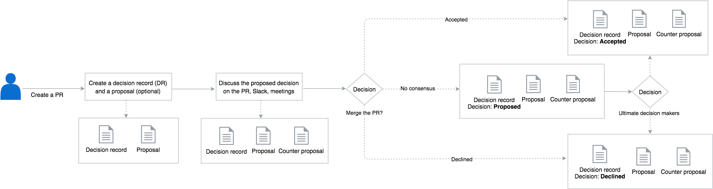

## Overview

This document defines the ownership policy and the decision-making process within the [Kyma](../../../) organization.

## Scope

All repositories in the Kyma organization must follow the official guidelines, contributing rules, and the governance process to assure quality and consistency.

The Kyma project also includes the [Kyma Incubator](https://github.com/kyma-incubator) organization. It is a place where all new projects start in a more relaxed environment that facilitates their rapid growth. At that stage, they do not have to comply with all rules that govern the Kyma organization. Once the incubating project is ready to become a part of the main Kyma organization, adjust it to all standards.

## Ownership policy

Kyma repositories are owned by code owners who are a group of people with special privileges in the repositories of the [GitHub](../../../) organization. Each repository has a separate `CODEOWNERS` file located at its root. The file specifies persons who have the ability to approve contribution to the part of the repository they own, after a detailed review of the related pull requests (PRs). Although the name suggests only the code ownership, the `CODEOWNERS` file is not only about the code but the content in general. Apart from the developers, you can define any relevant parties as code owners. For example, technical writers are set up as the owners of all `.md` documents in the Kyma repositories and SIG/WG members are the owners of their SIG/WG's folders' content.

### Code owners' responsibilities

With great power comes great responsibility. Code owners not only review and approve PRs but also truly care about their projects.

Every code owner is expected to:

* Contribute high-quality code and content
* Communicate and collaborate with other code owners to improve the ownership process
* Perform a thorough review of incoming PRs and make sure they follow the [contributing rules](CONTRIBUTING.md)
* Approve only those PRs in which the contributor made the requested improvements
* Check if the related CI job has completed successfully before approving the PR
* Make sure that the PR approval flow runs smoothly
* Prioritize issues and manage their processing
* Proactively fix bugs
* Perform maintenance tasks for their projects

### Add or remove a code owner

To suggest a change in the ownership of a given repository part, create a PR with the required changes in the `CODEOWNERS` file in the project's repository. The required number of code owners needs to approve the PR for the changes to take place. Read [here](https://github.com/kyma-project/community/blob/master/guidelines/internal-guidelines/repository-template/template/CODEOWNERS) how to set up and modify owners of the given repository folders and files.

## Decision making

In general, the Special Interest Groups (SIGs) and Working Groups (WGs) make decisions that affect the project, including its structure, functionalities, components, or work of the project teams. However, the organizational decisions and those that relate to the product strategy are made by the Kyma Council.

SIGs and WGs follow the **lazy consensus** approach to decision making which assumes that:

* All SIG/WG members have an equal voice in the decision-making process.
* Silence is consent. By default, lack of objections to a proposed decision means a silent approval.
* Any objections are good opportunities for healthy and constructive discussions.

> **NOTE:** The described approach only concerns the decisions made by SIGs and WGs. It does not affect any Kyma decisions made during daily team activities.

At the [Kyma project decisions board](https://github.com/kyma-project/community/issues/106#boards?labels=decision&activeFilters=labels&repos=139590666,151691065,139590577,139590641,139590616,139590701,147495537,139847219) you may see the current state of processed decisions in the Kyma project.

The SIG/WG decison-making process is depicted as follows:

### Create a decision record

[Create an issue](https://github.com/kyma-project/community/issues/new/choose) and choose the `Decision record` type. Provide the information as requested in the template and set the issue label to  `decision`. The issue may contain all necessary information or, reference a document or an opened pull request with more detailed proposal. Set the corresponding WG or SIG label in addition too (e.g.  `sig/core`). 

#### Mark existing issue as decision
In some cases, during the [triage](./issues-workflow.md), a decision  label is set for an existing issue, indicating that a decision is needed. In this case, use the [decision record template](./.github/ISSUE_TEMPLATE/decision-record.md) and copy it in the issue description accordingly. 

### Discuss and get to consensus

Take all necessary actions to reach a consensus *latest by the decision due date*:

- Post a link of the `Decision record` issue to the related SIG/WG mailing list and to the relevant Slack channels. If people relevant for the decision are not part of the mailing list, add them explicitly to the email communication. Communicate the decision to be made clearly to the groups affected by it and invite them to check the proposal. 

- Clarify and discuss the decision content and the proposal as needed. Use the mailing list, relevant Slack channels, the related pull request or, comment directly on the `Decision record` issue. 

- Feel free to communicate the decision proposal during the upcoming SIG/WG meeting and ask its members for feedback. Encourage the discussion and bring up any objections early in the process. 

- Those who created the proposal work with those who had objections to either prepare an improved solution or decline the proposal. 

> **NOTE:** In most cases, discussions may lead to changes in the `Decision record` or the proposal, or end up with no changes required. If a substantially different approach is suggested, invite it's supporters to write a counter proposal and to submit it in a separate pull request. 

### Close the decision

Once you reach the consensus:

- add the status change in the `Decision record` ticket with either `Accepted` or `Declined`. 
- The pull request with the accepted proposal should be closed and merged. Make sure that the merge comment contains one of the [keywords](https://help.github.com/articles/closing-issues-using-keywords/) to automatically close the `Decision record` ticket. Otherwise, close the `Decision record` ticket manually.

> **NOTE:** If the `Decision record` had related one or more counter proposals in separate pull requests, close the related pull requests with rejected proposals without merging and state the reasons for the rejection in the closing comments.

### If consensus is not reached

If there are still unresolved objections by the decision due date, engage the ultimate decision makers. The ultimate decision makers are stated in the decision log of the `Decision record` issue. Depending on the urgency, work with them on reaching final decision as soon as possible. After that, close the decision.

### Revisit a decision (lazy)

A decision will not be automatically revisited or actively reviewed unless there is an explicit request for it. To request revision:

- create a new `Decision record` in the respective repository and populate  the `Affected decisions` parameter. The  `Due date` parameter needs to be populated accordingly to the earliest revisit date of the affected decision. Populate the context and consequences section with information about why another approach is proposed and a new decision should be made. 

- the new `Decision record` will regularly be addressed within the SIG/WG after the original `Decision record` earliest revisit date has been reached. The due date value of the revisit decision should reflect this.

Exceptionally, earlier revisit is possible if supported and requested by the ultimate decision makers. This may be triggered if they identify major positive impact to the project, substantial improvement or community interest. 
