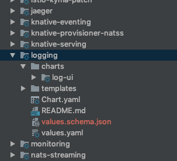

# Helm Charts Best Practices

This guide covers the best practices for creating Helm charts every Kyma team should employ. 

## Do not use the crd-install hook

Helm doesn't trigger the `crd-install` hook in the upgrade process. Because of that, new Custom Resource Definitions (CRDs) aren't installed. See the alternatives to using the `crd-install` hook:

1. Make the CRD part of a separate chart which must be installed before the chart that requires the CRD.

  - Implementation effort: **low**

  - Pros:
    * No additional implementation effort required.
    * The CRD is a separate file which can be used on its own, for example for tests.
  
  - Cons:
    * Requires creating more charts.
    * The CRD is managed by Helm and comes with all of the associated limitations.

2. Register the CRD through its controller.

  - Implementation effort: **medium**

  - Pros:
    * The CRD is managed by a component that is logically responsible for it.
    * The CRD is not subject to the Helm limitations.

  - Cons:
    * Requires a controller for the CRD.
    * The CRD is not listed as a part of Helm release.
    * The CRD is not available as a file.

3. Create a job that registers the new CRD and removes its old version. The job must be triggered on `pre-install` and `pre-upgrade` Helm hooks.

  - Implementation effort: **high**

  - Pros:
    * The CRD can be a separate entity.
    * Migration can be easily implemented in the job. 
    * The CRD is not subject to the Helm limitations.

  - Cons:
    * Jobs are troublesome to debug.
    * The CRD is not listed as a part of Helm release.

## Moving resources between charts

Moving resources, such as ConfigMaps, Deployments, CRDs, and others from one chart to another is problematic as it causes Kyma to lose backward compatibility. The deployment in which the CRD is moved cannot be upgraded to a newer version.  

The `ABC` CRD is part of the `YYYY` chart in the 0.6 release. That CRD is moved to the `ZZZZ` chart in the 0.7 release. Kyma cannot apply changes to the `ZZZZ` chart because its CRD, `ABC`, exists in the 0.6 version as a part of the `YYYY` chart.  
 
To avoid these problems, rename your resources when you move them from one chart to another. 
>**NOTE:** Using this approach removes the old resource and creates a new one. 

When a CRD is deleted, all of the associated implementations are removed, which may cause the user to lose data. Because of this risk, migrate the CRDs instead of simply moving them between charts. Follow this procedure:

1. Backup all existing implementations. 
2. Remove the old CRD.
3. Run the upgrade.
4. Restore all CRD implementations. 

## Defining metadata schema for Kyma charts

This section cover minimal requirements and conventions of metadata schema definition for Kyma charts. 

1. Each chart should have a metadata file with name `values.schema.json` placed where charts `values.yaml` file placed. E.g. see screenshot below.

   

2. Each schema should define `desription` for detailed information about schema and helm chart. 

3. Schema definition does not support dot `(.)` notation which mean if you have nested value properties schema definition should define object structure.
E.g.  helm chart value `.Values.loki.port` should be modeled in schema example below.

4. Each schema `object` definition should define at least a `description` to explain configuration section

5. Each configuration property should declare:
  - A `description` to explain purpose of configuration property
  - A `default` to provide default value of configuration property
  - A `type` to declare data type of configuration property value
  - A `examples` if required, a list of possible example values, e.g. for cases when no default value provided 

Example chart values.yaml file
```yaml
loki:
  port: 3100
  nameOverride: loki
  
  config:
    auth_enabled: false

promtail:
  port: 3101
  nameOverride: promtail
```

Example schema definition for values.yaml
```json
{
  "$schema": "http://json-schema.org/draft-07/schema#",
  "description": "Schema definition for logging helm chart values",
  "type": "object",
  "properties": {
    "loki": {
      "description": "Configuration properties for component loki",
      "type": "object",
      "properties": {
        "port": {
          "description": "TCP port loki expose",
          "default": 3100,
          "type": "number"
        },
        "nameOverride": {
          "description": "Property to override service name of loki",
          "default": "loki",
          "type": "string"
        },
        "config": {
          "type": "object",
          "description": "Loki service configuration",
          "contentEncoding": "base64",
          "examples": ["MD5", "base64"],
          "properties": {
            "auth_enabled": {
              "description": "Setting to enable or disable loki basic http authentication",
              "default": false,
              "type": "boolean"
            }
          }
        }
      }
    },
    "promtail": {
      "description": "Configuration properties for component promtail",
      "type": "object",
      "properties": {
        "port": {
          "description": "TCP port promtail expose",
          "default": 3101,
          "type": "number"
        },
        "nameOverride": {
          "description": "Property to override service name of promtail",
          "default": "promtail",
          "type": "string"
        }
      }
    }
  }
}
```