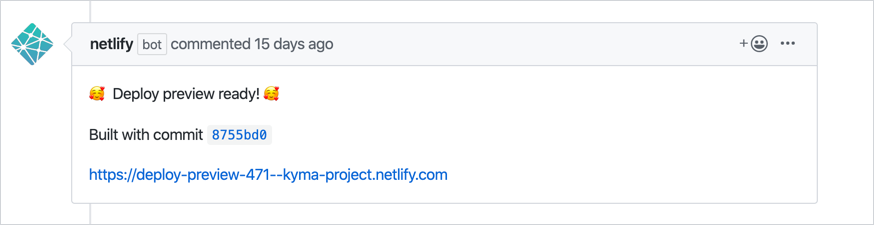
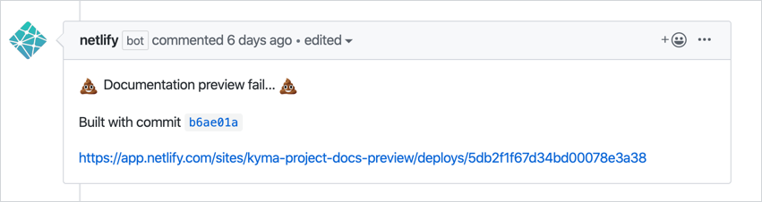
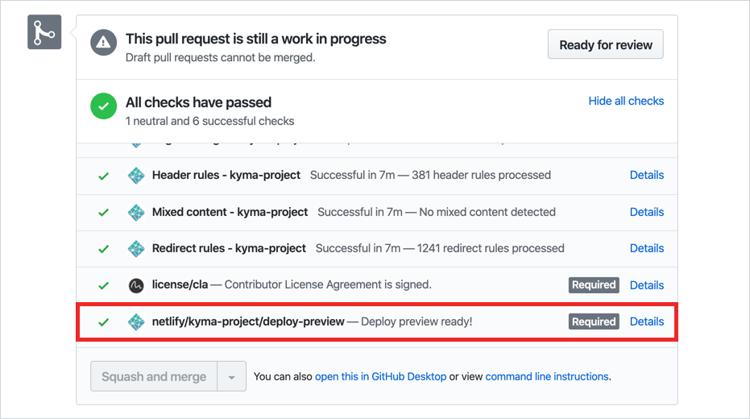

Before you publish new documentation on the Kyma website, you can preview your changes to see if the formatting of the text is correct, images fit well, and links work as expected.

That is possible thanks to the **preview feature** supported by [Netlify](https://www.netlify.com/). It attaches links to autogenerated previews of all website views to your pull requests (PRs).

This feature is enabled on these Kyma repositories:

- [`kyma`](https://github.com/kyma-project/kyma/tree/master/docs) for changes in the `/docs` folder that contains sources of the official Kyma documentation rendered in the [**Docs**](https://kyma-project.io/docs/) view.

- [`community`](https://github.com/kyma-project/community) for changes rendered in the [**Community**](https://kyma-project.io/community/) views.

- [`website`](https://github.com/kyma-project/website) for changes rendered on the [landing page](https://kyma-project.io/) and in the [**Blog**](https://kyma-project.io/blog/) view.

Previews are built for PRs containing changes made to any file within these repositories, for both successful and failed builds. The only exception is the `kyma` repository where Netlify only builds previews for changes in the `/docs` folder and only publishes notifications of successful builds on such PRs. 

## Access previews

After you create a PR, Netlify attaches a notification to your PR on the build status and a link to:

- A website preview for successful builds

    

    >**NOTE:** The preview rebuilds automatically under the same link after every commit.

- A direct link to log details for failed builds

    

The website preview deployment is also visible on the list of jobs that need to pass for the PR before it can be merged. Click on **Details** to go to the build logs.

>**NOTE:** For the `kyma` repository, Netlify only attaches notifications for successful preview builds. Thus, if you make any changes in the `/docs` folder and there is no website preview attached to your PR, access failed build information through the link under **Details** available next to the preview job.  
