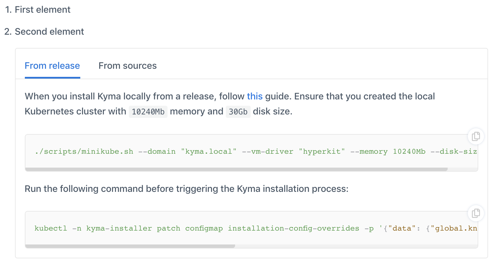

# Toggle

The documentation toggle is a feature that allows you to render several versions of a given section in one document or have several versions of one document.
The toggle renders the text in Github documents in the form of expandable sections and shows it as tabs on the `http://kyma-project.io` website.

You can use the toggle to include instructions for different operating systems (OS) in one guide or to describe installation guides that differ only in a few steps.  

## Writing rules

Follow these rules when inserting toggles in documents:

* Toggles belonging to one group must start with `<div tabs>` and end with `</div>` HTML tags.
* A single toggle must start with the `<details>` tag and end with the `</details>` tag.
* Insert the title of the toggle between `<summary>` and `</summary>` tags. Every part of the title must start from a new line.

See an example:

  ``` markdown
  <summary>
  From release
  </summary>
  ```

* Leave a blank line after the `</summary>` tag. Only this way the content can render.
* Add content using Markdown syntax.
* Use this indentation when you add the toggle as a regular document section:
  - No spaces for the div element
  - Two spaces for other elements
* Use this indentation when you add a toggle under a list:
  - Four spaces for the div element
  - Six spaces for other elements

## Examples

This section contains exemplary uses of the toggle in Markdown documents.

* See an example of the toggle added as a regular document section:  

<div tabs>
  <details>
  <summary>
  From release
  </summary>

  When you install Kyma locally from a release, follow [this](https://kyma-project.io/docs/master/root/kyma/#installation-install-kyma-locally) guide.
  Ensure that you created the local Kubernetes cluster with `10240Mb` memory and `30Gb` disk size.
  ```
  ./scripts/minikube.sh --domain "kyma.local" --vm-driver "hyperkit" --memory 10240Mb --disk-size 30g
  ```

  Run the following command before triggering the Kyma installation process:
  ```
  kubectl -n kyma-installer patch configmap installation-config-overrides -p '{"data": {"global.knative": "true", "global.kymaEventBus": "false", "global.natsStreaming.clusterID": "knative-nats-streaming"}}'
  ```
  </details>
  <details>
  <summary>
  From sources
  </summary>

  When you install Kyma locally from sources, add the `--knative` argument to the `run.sh` script. Run this command:

  ```
  ./run.sh --knative
  ```
  </details>
</div>


The code renders on `kyma-project.io` as follows:


* See an example of the toggle added under a list:  

1. First element
2. Second element
    <div tabs>
      <details>
      <summary>
      From release
      </summary>

      When you install Kyma locally from a release, follow [this](https://kyma-project.io/docs/master/root/kyma/#installation-install-kyma-locally) guide.
      Ensure that you created the local Kubernetes cluster with `10240Mb` memory and `30Gb` disk size.
      ```
      ./scripts/minikube.sh --domain "kyma.local" --vm-driver "hyperkit" --memory 10240Mb --disk-size 30g
      ```

      Run the following command before triggering the Kyma installation process:
      ```
      kubectl -n kyma-installer patch configmap installation-config-overrides -p '{"data": {"global.knative": "true", "global.kymaEventBus": "false", "global.natsStreaming.clusterID": "knative-nats-streaming"}}'
      ```
      </details>
      <details>
      <summary>
      From sources
      </summary>

      When you install Kyma locally from sources, add the `--knative` argument to the `run.sh` script. Run this command:

      ```
      ./run.sh --knative
      ```
      </details>
    </div>


The code renders on `kyma-project.io` as follows:


